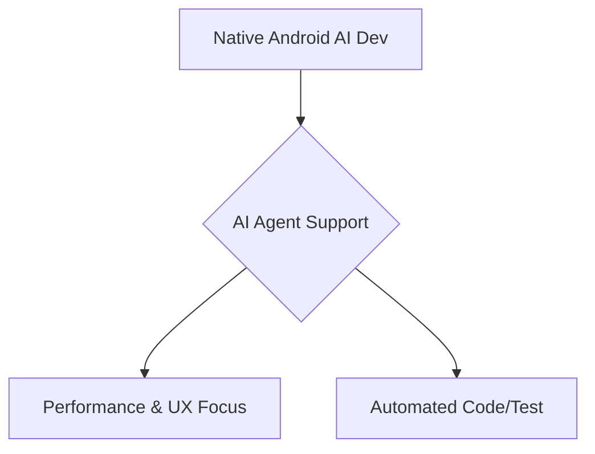

AI 에이전트의 발전은 모바일 앱 개발 패러다임을 변화시키며, Shopify의 네이티브 회귀 사례는 이러한 변화를 명확히 보여줍니다. 에이전트가 코드 구현, 테스트, 리뷰를 자동화하면서 크로스 플랫폼의 "코드 공유" 이점이 감소했습니다. 이에 따라 성능과 플랫폼 기능의 깊은 활용이 중요한 영역에서 네이티브 개발의 가치가 재조명됩니다. Android AI 개발에서는 Kotlin과 Jetpack Compose를 활용한 네이티브 우선 접근 방식이 최적의 성능과 사용자 경험을 제공하는 핵심 전략으로 부상하고 있습니다.

## Native-First Android AI의 이점
Kotlin과 Jetpack Compose를 활용한 네이티브 Android 개발은 AI 기능 통합에 독보적인 이점을 제공합니다.
### 성능, 리소스, UX 최적화
네이티브 접근은 Android 하드웨어(NPU 포함) 및 시스템 API에 직접 접근하여 AI 워크로드의 정밀한 리소스 제어를 가능하게 합니다. 낮은 지연 시간과 높은 처리량을 달성하며, Jetpack Compose는 유려하고 반응적인 UI로 AI 결과물을 직관적으로 전달, 최상의 사용자 경험을 구현합니다.

### AI 에이전트의 개발 효율성 증대
AI 에이전트는 네이티브 개발의 초기 비용과 복잡성을 줄여 효율성을 높이는 중요한 촉매제입니다.
*   **개발 가속화**: 에이전트는 보일러플레이트 코드 생성, UI 컴포넌트 변환, 아키텍처 패턴 제안을 자동화하여 개발자의 수동 작업을 줄입니다.
*   **품질 및 안정성 향상**: 유닛/통합/UI 테스트를 자동화하고, 플랫폼별 버그/성능 병목 현상을 신속하게 식별하며, 크래시 보고서 분석을 통해 수정 사항을 제안합니다.

**Kotlin 및 Jetpack Compose를 활용한 Android AI 통합**
Kotlin의 간결성과 Jetpack Compose의 선언형 UI는 현대 Android AI 개발을 위한 강력한 스택을 구성합니다. 실시간 AI 추론 결과에 동적으로 반응하는 UI를 쉽게 구축할 수 있으며, TensorFlow Lite, ML Kit 등 ML 라이브러리와 원활하게 연동됩니다.

**예제: 온디바이스 이미지 분류 모델 핵심 로직**
다음은 Kotlin에서 TensorFlow Lite를 사용한 온디바이스 이미지 분류 모델의 핵심 로직입니다. (TensorFlow Lite task vision 의존성 필요)

```kotlin
// build.gradle (Module: app)
// implementation 'org.tensorflow:tensorflow-lite-task-vision:0.4.0'
import android.graphics.Bitmap
import org.tensorflow.lite.support.image.ImageProcessor
import org.tensorflow.lite.support.image.TensorImage
import org.tensorflow.lite.support.image.ops.ResizeOp
import org.tensorflow.lite.task.vision.classifier.ImageClassifier

fun classifyImageSimplified(bitmap: Bitmap, context: android.content.Context): String {
    val modelFile = "mobilenet_v1_1.0_224_quant.tflite" // Your TFLite model in assets

    return runCatching {
        val imageClassifier = ImageClassifier.createFromFileAndOptions(
            context, modelFile, ImageClassifier.ImageClassifierOptions.builder().setMaxResults(1).build())

        val imageProcessor = ImageProcessor.Builder()
            .add(ResizeOp(224, 224, ResizeOp.ResizeMethod.NEAREST_NEIGHBOR))
            .build()

        val tensorImage = imageProcessor.process(TensorImage.fromBitmap(bitmap))
        val results = imageClassifier.classify(tensorImage)
        results.firstOrNull()?.categories?.firstOrNull()?.let { category ->
            "Label: ${category.label}, Score: ${"%.2f".format(category.score)}"
        } ?: "No classification result"
    }.getOrElse { e ->
        "Classification error: ${e.localizedMessage}"
    }
}
```

**Mermaid Diagram: Native Android AI 개발 핵심 흐름**


## 트레이드오프
*   **초기 투자 vs. 장기 효율성**: 고성능, 최적화된 UX가 필수적인 장기 프로젝트에 적합합니다. AI 에이전트 자동화로 장기적 비용을 절감할 수 있으나, 빠른 MVP 출시가 우선이거나 에이전트 도입 역량이 부족할 때는 불리합니다.
*   **플랫폼 종속성 vs. 심층 통합**: Android 최신 기능(Jetpack Compose, NPU)을 활용한 독점적 경험 제공에 유리합니다. AI 에이전트가 플랫폼 업데이트 적응을 돕지만, iOS 앱과의 코드 공유가 중요하면 불리합니다.
*   **개발자 생산성 변화**: AI 에이전트가 반복 코딩, 테스트, 리팩토링을 자동화하여 개발자가 AI 로직 및 고유 기능 구현에 집중할 수 있습니다. 반면, 에이전트 결과물 검증, 오작동 처리 등에 추가 노력이 필요해 초기 학습 곡선이 길 수 있습니다.

## 실전 체크리스트
*   [ ] **AI 에이전트 워크플로우 정의**: AI 에이전트의 역할(코드 생성, 테스트, 배포 등) 및 예상 성과 지표를 명확히 정의했는가?
*   [ ] **네이티브 성능 목표 설정**: 온디바이스 AI 추론의 지연 시간, 배터리 소모 등 측정 가능한 성능 목표를 수립하고 벤치마킹할 계획이 있는가?
*   [ ] **Jetpack Compose AI UX 패턴 구현**: AI 결과를 직관적이고 반응적으로 전달하는 Jetpack Compose UI/UX 패턴을 설계하고 적용했는가?
*   [ ] **온디바이스 모델 최적화**: 사용될 온디바이스 AI 모델에 대해 양자화, 하드웨어 가속(NPU/GPU) 활용 등 최적화 방안을 검토하고 적용했는가?
*   [ ] **보안 및 개인 정보 보호 전략 수립**: 온디바이스 데이터 처리 및 AI 모델 활용 시 Android 보안 기능 및 개인 정보 보호 규정을 준수하고 정책을 수립했는가?
*   [ ] **CI/CD 파이프라인 자동화**: AI 에이전트가 생성/수정한 코드, AI 모델 업데이트가 포함된 자동화된 빌드, 테스트, 배포 CI/CD 파이프라인을 구축했는가?
*   [ ] **지속적인 AI 에이전트 학습 및 튜닝**: AI 에이전트 효율성 향상을 위해 실제 개발 과정 피드백을 수집하고 에이전트 성능을 지속적으로 튜닝할 계획이 있는가?