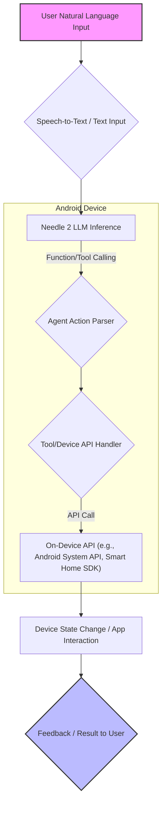

Needle 2는 스마트폰, 웨어러블, 스마트홈 기기 및 로봇과 같은 엣지 디바이스를 위한 14MB 크기의 에이전틱 LLM입니다. 이 모델은 범용적인 대화 생성보다는 '거실 불 켜줘'와 같은 자연어 명령을 정확한 함수 호출과 인자로 변환하는 데 특화되어 있습니다. 45M 파라미터로 구성되어 있으며, 세션 RAM 사용량이 최대 28MB에 불과하여 극도로 제한된 리소스 환경에 최적화된 온디바이스 AI 솔루션으로서 주목받고 있습니다. 이 엔트리는 Needle 2의 기술적 특징을 심층 분석하고, Android AI 생태계 내에서의 적용 가능성 및 실제 활용 방안을 검토합니다.

## Needle 2의 핵심 기술 스택 및 성능

Needle 2는 다음과 같은 핵심적인 기술적 강점을 가집니다:

### 경량 아키텍처 (Lightweight Architecture)
Needle 2는 45M 파라미터 모델로, 전체 모델 파일 크기가 14MB에 불과합니다. 이는 기존의 대규모 LLM들이 수 GB에 달하는 것과 비교할 때 혁신적인 수준입니다. 이러한 경량성은 스마트폰이나 웨어러블 장치처럼 저장 공간과 연산 능력이 제한적인 온디바이스 환경에서 LLM을 구동할 수 있게 하는 핵심 요소입니다. 낮은 메모리 사용량은 배터리 소모를 줄이고, 빠른 추론 속도를 보장하여 사용자 경험을 향상시킵니다.

### 에이전틱 기능 (Agentic Capabilities)
이 모델은 도구 호출 (Tool Calling), 기기 제어 (Device Control), 구조화된 정보 추출 (Structured Extraction)에 특화되어 설계되었습니다. 예를 들어, 사용자의 자연어 명령을 받아 미리 정의된 API 함수를 호출하고 필요한 매개변수를 정확히 추출하여 전달하는 능력이 뛰어납니다. 이는 단순한 텍스트 생성 모델을 넘어, 실제 환경에서 작업을 수행하는 에이전트로서의 역할을 가능하게 합니다.

### 최적화된 추론 (Optimized Inference)
Needle 2는 범용 대화 모델과 달리, 특정 작업에 집중함으로써 모델 복잡도를 낮추고 추론 효율성을 극대화했습니다. 이를 통해 세션 RAM이 최대 28MB로 유지되며, 실시간에 가까운 반응 속도를 제공합니다. 이는 특히 사용자 인터랙션이 중요한 모바일 환경에서 필수적인 요소입니다.

## Android AI 생태계 내 Needle 2의 적용 가능성

Android 환경에서 온디바이스 AI는 Gemini Nano, AICore, MediaPipe 등 다양한 기술 스택을 통해 발전하고 있습니다. Needle 2는 이 중 특히 `android-ai/gemini-nano`와 같은 온디바이스 LLM 솔루션과 시너지를 낼 수 있습니다. Gemini Nano가 더 범용적인 온디바이스 언어 처리 능력을 제공한다면, Needle 2는 기기 제어 및 특정 에이전틱 태스크에 대한 전문성을 보완하여 하이브리드 온디바이스 AI 전략을 구축하는 데 기여할 수 있습니다.

### 온디바이스 에이전트 개발
Needle 2는 스마트폰 내 앱 제어, 스마트홈 기기 연동, 웨어러블 장치 상태 모니터링 및 제어 등 다양한 온디바이스 에이전트 시나리오에 직접 적용될 수 있습니다. 예를 들어, 사용자가 "내 폰에서 오늘 찍은 사진 보여줘"라고 말하면, Needle 2가 이를 사진 갤러리 앱의 검색 함수 호출로 변환하여 실행하는 방식입니다.

### 예시: Android 앱에서 Needle 2를 활용한 스마트홈 기기 제어

다음은 Android (Kotlin) 환경에서 Needle 2가 자연어 명령을 파싱하여 스마트홈 기기를 제어하는 함수 호출로 변환하는 시나리오를 가정한 코드입니다. 실제 Needle 2 모델 통합은 TensorFlow Lite 또는 ONNX Runtime과 같은 프레임워크를 사용할 수 있으며, 여기서는 개념적 파싱 로직을 보여줍니다.

```kotlin
// 스마트홈 기기 제어를 위한 API 인터페이스
interface SmartHomeAPI {
    fun turnLightOn(roomId: String)
    fun turnLightOff(roomId: String)
    fun setThermostat(temperature: Int, unit: String)
    fun lockDoor(doorId: String)
}

// Needle 2가 파싱한 결과를 표현하는 데이터 클래스
data class AgentAction(
    val functionName: String,
    val parameters: Map<String, Any>
)

class OnDeviceAgent(private val smartHomeAPI: SmartHomeAPI) {

    // Needle 2 모델을 통한 자연어 파싱 (가상 함수)
    private fun parseNaturalLanguage(command: String): AgentAction {
        // 실제로는 Needle 2 모델 추론을 통해 AgentAction 객체 생성
        // 여기서는 예시를 위해 간단한 로직으로 대체
        return when {
            command.contains("거실 불 켜줘") -> AgentAction("turnLightOn", mapOf("roomId" to "livingRoom"))
            command.contains("안방 불 꺼줘") -> AgentAction("turnLightOff", mapOf("roomId" to "bedroom"))
            command.contains("온도 24도로 설정") -> AgentAction("setThermostat", mapOf("temperature" to 24, "unit" to "celsius"))
            else -> throw IllegalArgumentException("Unsupported command")
        }
    }

    // 파싱된 AgentAction을 실행하는 함수
    fun executeCommand(command: String) {
        try {
            val action = parseNaturalLanguage(command)
            when (action.functionName) {
                "turnLightOn" -> {
                    val roomId = action.parameters["roomId"] as String
                    smartHomeAPI.turnLightOn(roomId)
                    println("${roomId}의 불을 켰습니다.")
                }
                "turnLightOff" -> {
                    val roomId = action.parameters["roomId"] as String
                    smartHomeAPI.turnLightOff(roomId)
                    println("${roomId}의 불을 껐습니다.")
                }
                "setThermostat" -> {
                    val temperature = action.parameters["temperature"] as Int
                    val unit = action.parameters["unit"] as String
                    smartHomeAPI.setThermostat(temperature, unit)
                    println("온도를 ${temperature}${if (unit == "celsius") "°C" else "F"}로 설정했습니다.")
                }
                "lockDoor" -> {
                    val doorId = action.parameters["doorId"] as String
                    smartHomeAPI.lockDoor(doorId)
                    println("${doorId} 문을 잠궜습니다.")
                }
                else -> println("알 수 없는 기능입니다: ${action.functionName}")
            }
        } catch (e: Exception) {
            System.err.println("명령 실행 중 오류 발생: ${e.message}")
        }
    }
}

// 사용 예시
fun main() {
    val mockSmartHomeAPI = object : SmartHomeAPI {
        override fun turnLightOn(roomId: String) { /* API 호출 로직 */ }
        override fun turnLightOff(roomId: String) { /* API 호출 로직 */ }
        override fun setThermostat(temperature: Int, unit: String) { /* API 호출 로직 */ }
        override fun lockDoor(doorId: String) { /* API 호출 로직 */ }
    }
    val agent = OnDeviceAgent(mockSmartHomeAPI)

    agent.executeCommand("거실 불 켜줘")
    agent.executeCommand("안방 불 꺼줘")
    agent.executeCommand("온도 24도로 설정해줘")
}
```

### 온디바이스 에이전트 아키텍처

아래 Mermaid 다이어그램은 Android 기기에서 Needle 2를 활용한 온디바이스 에이전트의 일반적인 흐름을 보여줍니다.



## 트레이드오프

Needle 2와 같은 온디바이스 에이전틱 LLM을 Android AI 프로젝트에 적용할 때 고려해야 할 트레이드오프는 다음과 같습니다.

*   **정확도 vs. 범용성**: Needle 2는 특정 작업 (도구 호출, 기기 제어)에 최적화되어 높은 정확도를 보이지만, 범용적인 대화나 복잡한 추론 능력은 제한적입니다. 
    *   **언제 좋고**: 기기 제어, 특정 앱 자동화 등 명확한 함수 호출이 필요한 시나리오에서 효율적입니다.
    *   **언제 나쁜지**: 복잡한 질의 응답, 창의적 글쓰기, 비정형 정보 검색 등 광범위한 언어 이해가 필요한 경우 적합하지 않습니다.

*   **리소스 효율성 vs. 모델 업데이트 유연성**: 14MB라는 작은 모델 크기와 낮은 RAM 사용량은 온디바이스 환경에서 큰 이점입니다. 그러나 모델 업데이트나 기능 확장을 위해서는 전체 모델을 재배포해야 할 수 있으며, 이는 클라우드 기반 모델에 비해 유연성이 떨어질 수 있습니다.
    *   **언제 좋고**: 배터리 수명, 디바이스 성능, 오프라인 작동이 중요한 환경에서 최적의 성능을 제공합니다.
    *   **언제 나쁜지**: 빈번한 모델 업데이트가 필요하거나, 지속적으로 새로운 기능과 지식을 통합해야 하는 서비스에서는 운영 복잡도가 증가할 수 있습니다.

*   **개인 정보 보호 vs. 데이터 활용**: 온디바이스에서 추론이 이루어지므로 사용자 데이터가 외부 서버로 전송될 필요가 없어 개인 정보 보호 측면에서 유리합니다. 반면, 이로 인해 클라우드 기반 모델처럼 광범위한 사용자 데이터로 학습을 지속하거나 개인화된 모델을 빠르게 개선하는 데 제약이 있습니다.
    *   **언제 좋고**: 민감한 개인 정보를 다루는 헬스케어, 금융 앱 또는 개인 비서 기능 등에서 강력한 개인 정보 보호를 보장합니다.
    *   **언제 나쁜지**: 대규모 사용자 데이터를 활용한 A/B 테스트나 빠르게 변화하는 트렌드에 맞춰 모델을 진화시켜야 하는 서비스에는 불리합니다.

*   **개발 복잡성 vs. 독립성**: 온디바이스 모델을 직접 통합하고 관리하는 것은 클라우드 API를 사용하는 것보다 초기 개발 및 유지보수 복잡도가 높을 수 있습니다. 하지만 외부 API 의존성을 줄여 서비스 안정성과 독립성을 확보할 수 있습니다.
    *   **언제 좋고**: 네트워크 연결 없이도 안정적인 서비스를 제공해야 하거나, 외부 서비스 장애에 영향을 받지 않아야 하는 핵심 기능에 적합합니다.
    *   **언제 나쁜지**: 개발 리소스가 제한적이거나, 빠른 프로토타이핑 및 시장 출시가 우선시되는 경우 클라우드 솔루션이 더 효율적일 수 있습니다.

## 실전 체크리스트

Needle 2 또는 이와 유사한 온디바이스 에이전틱 LLM을 Android AI 프로젝트에 적용하기 위한 실전 체크리스트입니다.

*   [ ] **기기 호환성 및 성능 검증**: 대상 Android 기기 (스마트폰, 웨어러블 등)의 최소 RAM, CPU, NPU (Neural Processing Unit) 사양이 Needle 2의 추론 요구 사항을 충족하는지 확인합니다. 다양한 기기에서 실제 추론 속도와 배터리 소모량을 벤치마킹합니다.
*   [ ] **함수/도구 API 정의 명확화**: Needle 2가 호출할 기기 제어 또는 앱 연동 API (함수)를 명확하게 정의하고, 각 함수의 목적, 매개변수, 반환 값을 문서화합니다. 모델 학습 또는 프롬프트 엔지니어링에 활용될 수 있도록 일관된 스키마를 마련합니다.
*   [ ] **모델 통합 및 최적화**: TensorFlow Lite 또는 ONNX Runtime과 같은 온디바이스 추론 프레임워크를 사용하여 Needle 2 모델을 Android 앱에 통합합니다. 필요시 모델 양자화 (Quantization) 또는 특정 하드웨어 가속기를 활용하여 추가적인 성능 최적화를 고려합니다.
*   [ ] **오류 처리 및 복구 메커니즘 구축**: 에이전트가 자연어 명령을 잘못 해석하거나, 호출하려는 API가 실패했을 경우에 대비하여 강력한 오류 처리 및 복구 메커니즘을 설계합니다. 사용자에게 명확한 피드백을 제공하고 대체 액션을 제안할 수 있도록 합니다.
*   [ ] **보안 및 개인 정보 보호 감사**: 온디바이스 데이터 처리 흐름에서 민감한 사용자 정보가 외부로 유출되지 않도록 데이터 처리 로직을 검토하고, Android OS의 보안 가이드라인을 준수하는지 확인합니다.
*   [ ] **사용자 경험 (UX) 설계**: 온디바이스 에이전트와의 상호작용이 자연스럽고 직관적인 사용자 경험을 제공하도록 UX를 설계합니다. 음성 입력 (Speech-to-Text), 텍스트 입력, 그리고 에이전트의 응답 (Text-to-Speech 또는 시각적 피드백) 간의 전환을 매끄럽게 만듭니다.
*   [ ] **지속적인 모니터링 및 개선**: 배포 후, 실제 사용자 환경에서 Needle 2 기반 에이전트의 성능, 정확도, 안정성을 지속적으로 모니터링합니다. 사용자 피드백과 로그 데이터를 기반으로 모델의 도구 호출 정확도 및 전체 에이전트 로직을 개선하는 반복 프로세스를 수립합니다.