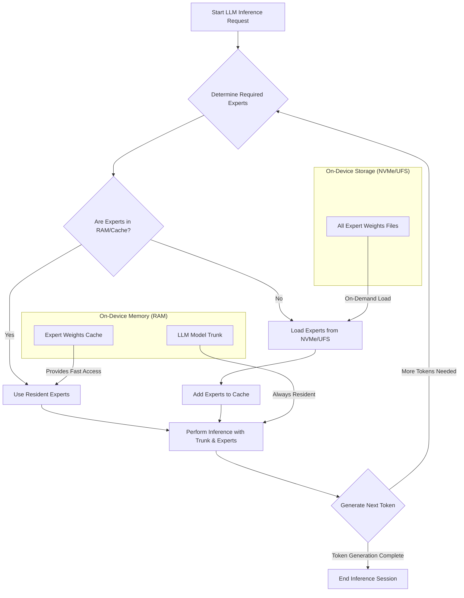

## On-Device LLM Inference: Efficient Memory Management for Edge Devices

Resource-constrained edge devices, such as Android smartphones, present significant challenges for deploying large language models (LLMs). Traditional LLM inference often requires loading the entire model into RAM, a prohibitive demand for models with billions of parameters. This entry explores advanced memory management strategies, focusing on a technique where only a core "trunk" of the model resides in memory, with specialized "expert weights" loaded on demand from faster secondary storage like NVMe. This approach drastically reduces the in-memory footprint, enabling larger models to run on devices previously deemed incapable.

### The Challenge of On-Device LLM Memory Footprint

Modern LLMs, particularly those leveraging Mixture-of-Experts (MoE) architectures, can exceed hundreds of billions or even trillions of parameters. Storing these parameters in device RAM for inference is impractical, leading to out-of-memory errors or extremely slow performance due to extensive paging. The key is to manage memory such that only the immediately necessary parts of the model are resident, while others are swiftly accessible.

### Expert-on-Demand Loading Strategy

Inspired by systems like WASTE (Weight-Aligned Sparse-Transitioned Engine), the core idea is to partition the LLM into a frequently accessed "trunk" and dynamically loaded "expert weights."

1.  **Model Trunk (Base Model)**: This comprises the foundational layers and shared parameters that are always active. It's relatively smaller but crucial for overall model operation. This portion remains resident in RAM.
2.  **Expert Weights (Sparse Activations)**: In MoE models, specific "experts" (sub-networks) are activated based on the input token. Instead of loading all expert weights, only the expert(s) activated for the current token or sequence are loaded into memory from high-speed storage (e.g., NVMe, UFS on mobile devices) just before their computation. Once processed, these weights can be discarded or cached temporarily.

This strategy capitalizes on the sparsity of activation in many large models – only a small fraction of the total parameters are actually used for any given inference step. By offloading the inactive majority to fast secondary storage, the effective RAM requirement is dramatically reduced.

### Architectural Implications and Implementation Details

Implementing expert-on-demand loading requires careful orchestration between the inference engine, memory manager, and storage I/O.

*   **Model Partitioning**: The LLM must be structured or partitioned such that the trunk and expert weights are identifiable and loadable independently. MoE models inherently support this.
*   **Dynamic Loader**: A mechanism to identify which expert is needed for the current token and asynchronously load its weights from storage. This loader should be optimized for low-latency, high-throughput I/O.
*   **Caching**: A small, fast cache for recently used expert weights can further reduce I/O, especially if activation patterns exhibit temporal locality.
*   **Quantization**: Combining this strategy with advanced quantization techniques (e.g., 4-bit, 2-bit quantization) can further shrink both the trunk and expert weight sizes, improving I/O performance and reducing the overall memory footprint.

Consider a simplified Android implementation where a local LLM (e.g., a quantized Gemma model via Xenova.js or similar native wrapper) uses this strategy.

```kotlin
// Android PoC: Simplified Expert Weights Loading
class OnDeviceLLMMemoryManager(private val modelStoragePath: String) {

    private val residentTrunk: ByteBuffer // Model trunk always in RAM
    private val expertCache: LruCache<String, ByteBuffer> // Cache for recently used experts
    private val dispatcher: ExecutorService = Executors.newFixedThreadPool(2)

    init {
        // Load model trunk during initialization
        residentTrunk = loadModelTrunk(modelStoragePath)
        expertCache = LruCache(MAX_EXPERT_CACHE_SIZE_MB * 1024 * 1024)
    }

    private fun loadModelTrunk(path: String): ByteBuffer {
        // 실제 구현에서는 파일에서 trunk를 로드
        Log.d("LLMMemory", "Loading model trunk from $path")
        // ... (File I/O logic for trunk)
        return ByteBuffer.allocate(TRUNK_SIZE_MB * 1024 * 1024) // Placeholder
    }

    private fun loadExpertWeightsFromFile(expertId: String): ByteBuffer {
        // Simulate loading from NVMe/UFS
        val expertFilePath = "$modelStoragePath/experts/$expertId.bin"
        Log.d("LLMMemory", "Loading expert $expertId from $expertFilePath")
        // In a real scenario, this involves direct file I/O or memory mapping
        Thread.sleep(50) // Simulate I/O latency
        return ByteBuffer.allocate(EXPERT_SIZE_MB * 1024 * 1024) // Placeholder
    }

    suspend fun getExpertWeights(expertId: String): ByteBuffer {
        return expertCache.get(expertId) ?: run {
            val expertBuffer = withContext(Dispatchers.IO) {
                loadExpertWeightsFromFile(expertId)
            }
            expertCache.put(expertId, expertBuffer)
            expertBuffer
        }
    }

    fun releaseMemory() {
        expertCache.evictAll()
        // Release residentTrunk if applicable (e.g., onTrimMemory)
        Log.d("LLMMemory", "Memory released for LLM experts.")
    }

    companion object {
        private const val TRUNK_SIZE_MB = 1000 // Example: 1GB
        private const val EXPERT_SIZE_MB = 50 // Example: 50MB per expert
        private const val MAX_EXPERT_CACHE_SIZE_MB = 200 // Example: 200MB cache
    }
}

// Example usage within an Android application context (simplified)
suspend fun performInferenceStep(
    memoryManager: OnDeviceLLMMemoryManager,
    inputToken: Int,
    predictedExpertId: String
) {
    // Get resident trunk for base computations
    val trunkData = memoryManager.residentTrunk

    // Asynchronously load needed expert weights
    val expertData = memoryManager.getExpertWeights(predictedExpertId)

    // Perform inference using trunkData and expertData
    Log.d("LLMInference", "Inference step with expert: $predictedExpertId")
    // ... (TensorFlow Lite or other inference engine execution)
}
```

This Kotlin snippet illustrates the core idea: `residentTrunk` is always available, and `getExpertWeights` fetches the required expert from storage, caching it for potential reuse. `Dispatchers.IO` ensures that heavy file operations don't block the main thread, crucial for responsive UIs.

### Memory Management Flow for On-Device LLM


This diagram visualizes the flow: the model trunk is always in RAM. When specific experts are needed, the system first checks the RAM cache. If not found, they are loaded from faster storage (NVMe/UFS) and then used for inference, potentially being added to the cache.

### 2026년 최신 트렌드 반영 (2026 Trends)

The emphasis on efficient on-device LLM inference continues to grow. Key trends for 2026 include:
*   **Hardware-Software Co-design**: Tighter integration of LLM architectures with mobile NPUs (Neural Processing Units) and specialized memory controllers.
*   **Advanced Quantization**: Beyond 4-bit, research into mixed-precision quantization and custom data types for further memory and performance gains.
*   **Sparse Activation Models (MoE)**: MoE architectures are becoming more prevalent, naturally aligning with expert-on-demand loading strategies.
*   **Framework Evolution**: Mobile AI frameworks (e.g., TensorFlow Lite, ML Kit, PyTorch Mobile, WebGPU-backed engines like Xenova) are improving support for dynamic model loading and fine-grained memory control.
*   **Flash Attention / PagedAttention**: These techniques optimize attention mechanisms, complementing memory management by reducing KV cache pressure.

## 트레이드오프

### 1. 메모리 사용량 (Memory Footprint)
*   **장점**: LLM의 전체 크기보다 훨씬 작은 RAM footprint로 모델 실행이 가능하다. 이는 제한된 메모리를 가진 저사양 디바이스에서도 대규모 모델을 구동할 수 있게 하며, 더 많은 애플리케이션이 동시에 실행될 수 있도록 한다.
*   **단점**: 모델의 코어 "트렁크"는 항상 메모리에 상주해야 하므로, 여전히 최소한의 RAM 요구사항이 존재한다. 또한, 전문가 가중치 로딩을 위한 캐싱 전략에 따라 추가적인 RAM이 필요할 수 있다.

### 2. 추론 Latency (Inference Latency)
*   **장점**: 필요한 전문가 가중치만 로드하므로, 전체 모델을 스왑하는 것보다 효율적이다. 고속 NVMe 또는 UFS 스토리지의 발전으로 I/O 병목 현상이 완화될 수 있다.
*   **단점**: 전문가 가중치를 스토리지에서 읽어오는 I/O 오버헤드 때문에 순수한 RAM 기반 추론에 비해 토큰 생성 Latency가 증가할 수 있다. 이는 실시간 대화형 애플리케이션에서 사용자 경험에 영향을 미칠 수 있다.

### 3. 개발 및 배포 복잡성 (Development & Deployment Complexity)
*   **장점**: 개발자는 메모리 제약 없이 더 큰 모델을 활용할 수 있는 유연성을 얻는다.
*   **단점**: 모델을 트렁크와 전문가 가중치로 분할하고, 동적 로딩 로직, 캐싱 전략, 비동기 I/O를 구현하는 복잡성이 추가된다. 이는 기존의 정적 모델 로딩 방식보다 높은 개발 비용과 유지보수 노력을 요구한다.

### 4. 전력 소비 (Power Consumption)
*   **장점**: 전체 모델을 RAM에 유지하는 것보다 평균 전력 소비가 줄어들 수 있다. 필요한 부분만 활성화되고, 불필요한 메모리 대역폭 사용을 줄이기 때문이다.
*   **단점**: 빈번한 스토리지 I/O 작업은 순간적으로 높은 전력을 소비할 수 있다. 특히 NVMe/UFS 모듈의 활성화 및 데이터 전송 과정에서 전력 스파이크가 발생할 수 있으며, 이는 배터리 수명에 영향을 줄 수 있다.

## 실전 체크리스트

프로젝트에 온디바이스 LLM을 위한 효율적인 메모리 관리 전략을 적용할 때 다음 항목들을 검증한다.

- [ ] **PoC (Proof of Concept) 구현**: 핵심 "트렁크" 모델과 동적 로딩 "전문가 가중치"를 활용한 LLM 추론 PoC를 Android 환경에서 성공적으로 구현했는가?
- [ ] **메모리 사용량 측정 및 비교**: 전략 적용 전후의 평균 및 최대 RAM 사용량을 측정하고, 목표 디바이스의 메모리 제약 내에 수렴하는지 확인했는가? (예: `ActivityManager.getMemoryInfo()` 활용)
- [ ] **추론 Latency 분석**: 토큰당 추론 Latency를 측정하고, 스토리지 I/O 오버헤드를 포함하여 사용자 경험에 허용 가능한 수준인지 검토했는가? (예: 평균 500ms/token 이하)
- [ ] **스토리지 I/O 성능 및 전력 소비 모니터링**: NVMe/UFS I/O 대역폭 사용량과 전력 소비를 모니터링하여, 성능 병목이나 배터리 수명에 미치는 부정적인 영향을 최소화했는가?
- [ ] **캐싱 전략 최적화**: 전문가 가중치 캐시의 크기와 교체 정책(예: LRU)을 튜닝하여 I/O 부하와 RAM 사용량 사이의 최적점을 찾았는가?
- [ ] **모델 양자화(Quantization) 통합**: 4-bit, 2-bit 등 양자화 기술을 적용하여 모델 크기를 더욱 줄이고, 메모리 효율성과 추론 속도를 추가적으로 개선했는가?
- [ ] **Android 플랫폼 특성 활용**: `onTrimMemory()` 콜백 등을 활용하여 시스템 메모리 부족 시 LLM 리소스를 동적으로 해제하는 로직을 통합했는가?