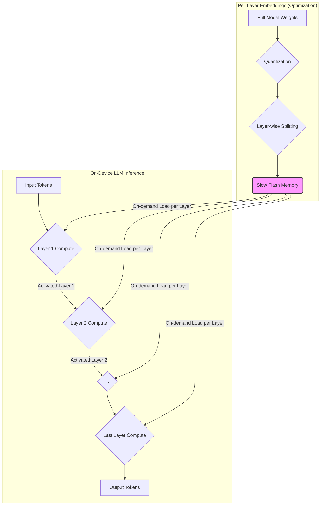

온디바이스 LLM (On-Device LLM)은 클라우드 서버와의 통신 없이 기기 자체에서 대규모 언어 모델을 구동하여 낮은 지연 시간, 향상된 개인 정보 보호, 그리고 오프라인 기능 제공이 가능하다는 점에서 Android AI 개발의 핵심 기술로 부상하고 있습니다. 특히 네트워크 연결이 불안정하거나 민감한 데이터 처리가 필요한 시나리오에서 온디바이스 LLM의 가치는 더욱 증대됩니다. 그러나 모바일 기기의 제한된 컴퓨팅 자원(CPU, 메모리, 배터리)과 저장 공간 내에서 대규모 모델을 효율적으로 실행하기 위해서는 정교한 최적화 기술이 필수적입니다.

## 핵심 최적화 기술

온디바이스 LLM의 성능을 극대화하기 위한 주요 최적화 기술은 다음과 같습니다.

### 1. 모델 경량화 (Quantization)

양자화는 모델의 가중치와 활성화 함수를 더 낮은 비트 정밀도로 변환하여 모델 크기를 줄이고 추론 속도를 높이는 기법입니다. 주로 32-bit float를 16-bit float, 8-bit integer, 심지어 4-bit integer 등으로 변환합니다. 이는 모델의 메모리 사용량을 대폭 줄이고 NPU (Neural Processing Unit)와 같은 모바일 하드웨어 가속기에서 더 효율적으로 처리될 수 있도록 합니다. TFLite (TensorFlow Lite)와 ONNX Runtime Mobile과 같은 프레임워크는 다양한 양자화 기법을 지원합니다.

### 2. Per-Layer Embeddings

긱뉴스에서 언급된 ESP32-S3 사례는 Per-Layer Embeddings (레이어별 임베딩) 접근 방식을 통해 2,890만 매개변수 LLM을 제한적인 플래시 메모리 환경에서 구동하는 가능성을 보여주었습니다. 이 기법은 전체 모델 매개변수 중 대부분을 느린 플래시 메모리(Slow Flash Memory)에 저장하고, 각 토큰(token) 처리 단계에서 현재 계층(layer)에 필요한 가중치와 임베딩만을 온디맨드(on-demand)로 불러와 사용하는 방식입니다. 이는 기기의 제한된 RAM을 효율적으로 사용하여 대규모 모델의 전체 매개변수를 동시에 로드하지 않고도 추론을 가능하게 합니다. Android 환경에서는 이와 유사하게 디스크(Disk)나 외부 저장소에 모델의 큰 부분을 저장하고 필요할 때마다 메모리로 로드하는 전략을 적용할 수 있습니다.

### 3. 모델 프루닝 (Pruning) 및 증류 (Distillation)

*   **프루닝**: 모델의 중요하지 않은 가중치나 연결을 제거하여 모델의 희소성(sparsity)을 높이고 크기를 줄이는 기법입니다. 제거 후에도 모델의 성능 저하가 최소화되도록 합니다.
*   **증류**: 더 크고 복잡한 교사(teacher) 모델의 지식을 작고 효율적인 학생(student) 모델로 전이시키는 기법입니다. 학생 모델은 교사 모델과 유사한 성능을 유지하면서도 훨씬 작고 빠르게 작동합니다.

### 4. 효율적인 모델 아키텍처 (Efficient Architectures)

모바일 환경에 특화된 경량 LLM 아키텍처가 개발되고 있습니다. TinyLlama, MobileLLM, Phi 시리즈와 같이 매개변수 수를 줄이면서도 상당한 성능을 발휘하는 모델들이 대표적입니다. 이러한 모델들은 온디바이스 배포를 염두에 두고 설계되어, 기본적인 LLM 최적화 기법과 결합될 때 더욱 효과적입니다.

### 5. 하드웨어 가속 (Hardware Acceleration)

대부분의 최신 Android 기기는 AI 워크로드 처리를 위한 전용 NPU, GPU 또는 DSP(Digital Signal Processor)를 탑재하고 있습니다. TensorFlow Lite, MediaPipe, AI Core 등의 프레임워크를 활용하여 이러한 하드웨어 가속기를 사용하여 LLM 추론 성능을 극대화할 수 있습니다. `Interpreter.Options`에 델리게이트(Delegate)를 추가하는 방식으로 간단히 적용 가능합니다.

## Per-Layer Embeddings 아키텍처 다이어그램



위 다이어그램은 Per-Layer Embeddings의 개념을 시각화합니다. 전체 모델 가중치가 양자화되어 레이어별로 분할된 후 느린 플래시 메모리(Slow Flash Memory)에 저장됩니다. LLM 추론이 진행됨에 따라 각 레이어의 계산에 필요한 가중치만 온디맨드(on-demand) 방식으로 메모리에 로드되어 활용됩니다. 이는 메모리 제약이 심한 환경에서 대규모 모델을 운영하는 데 효과적인 전략입니다.

## Android TFLite 모델 로딩 및 초기화 예제

아래 코드는 Android 환경에서 TensorFlow Lite 모델을 로드하고 Interpreter를 초기화하는 기본적인 방법을 보여줍니다. 실제 LLM 추론은 모델에 따라 복잡한 전처리 및 후처리 로직이 필요하지만, 온디바이스 배포의 핵심은 효율적인 로딩과 하드웨어 가속 설정에 있습니다.

```kotlin
import org.tensorflow.lite.Interpreter
import java.io.FileInputStream
import java.nio.MappedByteBuffer
import java.nio.channels.FileChannel
import android.content.Context
// import org.tensorflow.lite.gpu.GpuDelegate // Add dependency for GPU delegate

object OnDeviceLLMInitializer {
    private var tfliteInterpreter: Interpreter? = null

    fun initialize(context: Context, modelFileName: String) {
        try {
            val assetFileDescriptor = context.assets.openFd(modelFileName)
            val inputStream = FileInputStream(assetFileDescriptor.fileDescriptor)
            val fileChannel = inputStream.channel
            val startOffset = assetFileDescriptor.startOffset
            val declaredLength = assetFileDescriptor.declaredLength
            val modelBuffer: MappedByteBuffer = fileChannel.map(FileChannel.MapMode.READ_ONLY, startOffset, declaredLength)
            
            val options = Interpreter.Options()
            options.setNumThreads(4) // Optimize for typical mobile core count
            // options.addDelegate(GpuDelegate()) // Optional: Enable GPU acceleration if available
            
            tfliteInterpreter = Interpreter(modelBuffer, options)
            assetFileDescriptor.close()
            println("On-device LLM model loaded successfully: $modelFileName")
        } catch (e: Exception) {
            e.printStackTrace()
            println("Error loading on-device LLM model: ${e.message}")
        }
    }

    fun performInference(inputBuffer: ByteBuffer, outputBuffer: ByteBuffer) {
        tfliteInterpreter?.run(inputBuffer, outputBuffer)
    }

    fun release() {
        tfliteInterpreter?.close()
        tfliteInterpreter = null
        println("On-device LLM interpreter released.")
    }
}
```

이 예제에서는 `initialize` 함수를 통해 `assets` 폴더 내의 `.tflite` 모델 파일을 `MappedByteBuffer`로 로드하고, `Interpreter.Options`를 사용하여 스레드 수 설정 및 GPU 델리게이트와 같은 하드웨어 가속을 활성화할 수 있습니다.

## 2026년 최신 트렌드

2026년에는 온디바이스 LLM 최적화 기술이 더욱 발전할 것으로 예상됩니다. 주요 트렌드는 다음과 같습니다.

*   **고급 양자화 기법**: FP8 (8-bit floating point) 또는 비균등 양자화(non-uniform quantization)와 같은 더욱 정교한 양자화 기법이 널리 적용되어 정확도 손실을 최소화하면서도 압축률을 높일 것입니다.
*   **하드웨어-소프트웨어 공동 최적화**: 특정 NPU 아키텍처에 최적화된 모델 형식 및 추론 엔진이 개발되어, 하드웨어의 잠재력을 최대한 활용할 수 있을 것입니다. Android 기기 제조사들은 자체 NPU와 이에 최적화된 프레임워크를 제공하여 성능 격차를 심화시킬 수 있습니다.
*   **MLC LLM 및 Web LLM과 같은 크로스 플랫폼 프레임워크 발전**: 다양한 하드웨어와 OS에서 LLM을 구동할 수 있는 범용 프레임워크의 성숙도가 높아져 개발 복잡도가 감소할 것입니다.
*   **소형 MoE (Mixture of Experts) 모델 도입**: 온디바이스 환경에서도 필요에 따라 특정 '전문가' 네트워크만 활성화하여 효율성을 높이는 소형 MoE 아키텍처가 시도될 수 있습니다.

## 트레이드오프

온디바이스 LLM 최적화 기술 적용 시 고려해야 할 주요 트레이드오프는 다음과 같습니다.

*   **정확도(Accuracy) vs. 성능(Performance) 및 모델 크기(Size)**
    *   **좋을 때**: 제한된 자원 내에서 LLM을 구동해야 할 때, 양자화나 프루닝은 필수적입니다. 추론 속도와 메모리 사용량을 크게 개선합니다.
    *   **나쁠 때**: 과도한 압축은 모델의 정확도를 저하시켜 사용자 경험에 부정적인 영향을 줄 수 있습니다. 특히 민감한 애플리케이션에서는 정확도 손실 허용 범위에 대한 신중한 평가가 필요합니다.

*   **개발 복잡도(Development Complexity) vs. 사용자 경험(User Experience)**
    *   **좋을 때**: 온디바이스 배포는 네트워크 지연 없이 즉각적인 응답을 제공하여 사용자 경험을 크게 향상시킵니다.
    *   **나쁠 때**: 다양한 기기 및 하드웨어 환경(NPU 종류, OS 버전 등)에 대한 최적화는 개발 및 테스트 복잡도를 증가시킵니다. Per-Layer Embeddings와 같은 동적 로딩 전략은 구현이 더 복잡할 수 있습니다.

*   **하드웨어 의존성(Hardware Dependency) vs. 휴대성(Portability)**
    *   **좋을 때**: 특정 하드웨어 가속기(GPU, NPU)에 최적화된 솔루션은 최고의 성능과 전력 효율을 제공합니다.
    *   **나쁠 때**: 하드웨어 가속에 강하게 의존하는 경우, 특정 제조사나 모델에 종속될 수 있으며, 다양한 Android 기기 전반에 걸친 범용적인 배포가 어려워질 수 있습니다.

## 실전 체크리스트

Android 환경에서 온디바이스 LLM 최적화 기술을 프로젝트에 적용할 때 검증할 항목은 다음과 같습니다.

*   [ ] **양자화 수준 결정**: 8-bit, 4-bit 등 다양한 양자화 수준에서 모델의 추론 정확도와 성능(latency)을 벤치마킹하여 최적의 지점을 선택했는가?
*   [ ] **하드웨어 가속기 활용**: TensorFlow Lite 델리게이트(GPU, NNAPI 등) 또는 MediaPipe, AI Core를 통해 기기별 하드웨어 가속을 효과적으로 활용하고 있는가?
*   [ ] **메모리 및 저장 공간 사용량 모니터링**: 모델 로딩 및 추론 중 앱의 RAM 및 저장 공간 사용량이 기기의 제한된 자원 내에서 허용 가능한 수준인지 지속적으로 모니터링하고 있는가?
*   [ ] **배터리 소모량 측정**: 장시간 LLM 추론 시 기기의 배터리 소모량이 사용자에게 불편함을 주지 않는지 측정하고 최적화했는가?
*   [ ] **온디맨드 로딩 전략 구현**: Per-Layer Embeddings 또는 유사한 동적 로딩 전략을 통해 모델의 대규모 가중치 파일을 효율적으로 관리하고 필요한 부분만 메모리에 로드하도록 구현했는가?
*   [ ] **오프라인 기능 검증**: 네트워크 연결 없이 LLM 추론이 원활하게 동작하며, 필요한 모델 파일이 기기에 성공적으로 배포되었는지 검증했는가?
*   [ ] **모델 업데이트 및 배포 전략**: 모델 업데이트 시, 앱 업데이트 없이 OTA (Over-The-Air) 방식으로 모델을 효율적으로 배포하고 버전 관리를 할 수 있는 전략을 수립했는가?