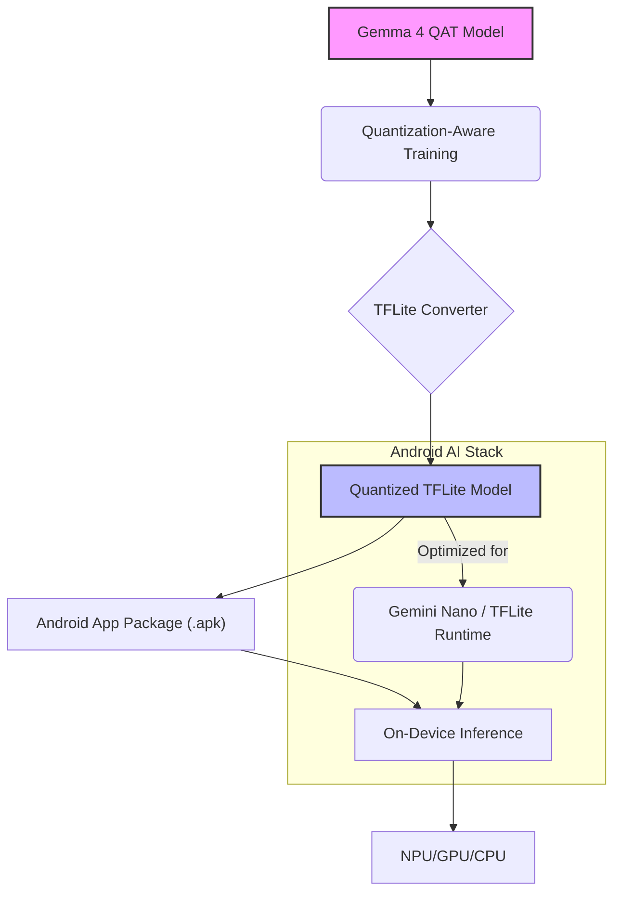

## 온디바이스 LLM의 성능 최적화 필요성

모바일 및 에지(Edge) 디바이스에서 대규모 언어 모델(LLM)을 효율적으로 실행하는 것은 사용자 경험 향상과 프라이버시 보호에 필수적이다. 클라우드 기반 LLM은 높은 컴퓨팅 자원을 요구하며 네트워크 지연 및 데이터 전송 비용 문제를 야기한다. 반면 온디바이스(On-Device) LLM은 이러한 한계를 극복하지만, 제한된 메모리와 처리 능력 내에서 모델의 크기와 연산량을 최적화해야 하는 과제가 있다. 양자화(Quantization)는 이러한 최적화의 핵심 기법 중 하나이다.

## Gemma 4 QAT 모델과 양자화 인식 학습(QAT)

Gemma 4 QAT 모델은 모바일 및 노트북 환경을 위해 특별히 압축 최적화된 LLM 체크포인트이다. 기존 LLM은 주로 float32와 같은 높은 정밀도(precision)로 학습되지만, 양자화는 모델의 가중치와 활성화 값을 int8, int4와 같은 낮은 정밀도로 변환하여 모델 크기를 줄이고 추론 속도를 향상시킨다. 

여기서 중요한 것은 양자화 인식 학습(Quantization-Aware Training, QAT) 방식이다. QAT는 모델 학습 과정에서 양자화 효과를 시뮬레이션하여, 모델이 낮은 정밀도 환경에 적응하도록 돕는다. 이는 학습 완료 후 양자화하는 Post-Training Quantization (PTQ) 방식보다 품질 손실을 최소화하면서도 높은 압축률을 달성할 수 있는 장점이 있다. Gemma 4 QAT 모델은 이러한 방식으로 최적화되어, 전반적인 모델 품질을 유지하면서 온디바이스 실행에 필요한 메모리 요구량과 성능을 대폭 개선한다.

## Android AI 생태계에서의 적용

Android AI 생태계는 Gemini Nano와 같은 온디바이스 LLM과 TensorFlow Lite (TFLite), MediaPipe와 같은 프레임워크를 통해 에지 AI를 지원한다. Gemma 4 QAT 모델은 TFLite와 같은 경량화된 런타임 환경에 맞춰 변환되어 Android 애플리케이션에 통합될 수 있다. 이는 모바일 디바이스의 신경망 처리 장치(NPU)를 최대한 활용하여, 고성능의 LLM 추론을 로컬에서 실현하는 기반을 제공한다. 결과적으로 사용자 기기에서 실시간 번역, 요약, 콘텐츠 생성 등 복잡한 AI 기능을 낮은 지연 시간과 높은 에너지 효율로 제공할 수 있다.

### 양자화 모델 배포 파이프라인

Gemma 4 QAT 모델을 Android에 적용하는 일반적인 파이프라인은 다음과 같다.



### Kotlin 코드 예시: 양자화 TFLite 모델 로드 및 실행 (개념)

아래 코드는 Android에서 TFLite 모델을 로드하고 추론하는 간략화된 Kotlin 예시이다. 실제 양자화 모델은 입력/출력 텐서의 자료형이 `Float` 대신 `Byte` 또는 `Int`가 될 수 있으며, 이에 맞춰 전처리/후처리 로직이 필요하다. NPU 가속을 위해 Delegate를 추가할 수 있다.

```kotlin
import android.content.Context
import org.tensorflow.lite.Interpreter
import java.io.FileInputStream
import java.nio.ByteBuffer
import java.nio.ByteOrder
import java.nio.channels.FileChannel

class QuantizedLlmRunner(private val context: Context) {

    fun runInference(modelPath: String, inputFeature: ByteBuffer): ByteBuffer {
        val tfliteModel = loadModelFile(context, modelPath)
        val tfliteOptions = Interpreter.Options()
        // NPU 가속기 활성화 (예: NNAPI Delegate)
        // tfliteOptions.addDelegate(NnApiDelegate())

        val tflite = Interpreter(tfliteModel, tfliteOptions)

        // 모델의 실제 입력/출력 텐서 크기와 타입에 맞게 버퍼 할당
        // 이 예시에서는 양자화된 int8 출력을 가정합니다.
        val outputBuffer = ByteBuffer.allocateDirect(tflite.getOutputTensor(0).numBytes())
        outputBuffer.order(ByteOrder.nativeOrder())

        tflite.run(inputFeature, outputBuffer)

        tflite.close()
        return outputBuffer
    }

    private fun loadModelFile(context: Context, modelPath: String): ByteBuffer {
        val fileDescriptor = context.assets.openFd(modelPath)
        val inputStream = FileInputStream(fileDescriptor.fileDescriptor)
        val fileChannel = inputStream.channel
        val startOffset = fileDescriptor.startOffset
        val declaredLength = fileDescriptor.declaredLength
        return fileChannel.map(FileChannel.MapMode.READ_ONLY, startOffset, declaredLength)
    }
}

// 사용 예시 (예상 입력이 정수 토큰이라고 가정)
// val runner = QuantizedLlmRunner(applicationContext)
// val inputBytes = ByteBuffer.allocateDirect(1 * 128 * 4) // Example: batch 1, seq len 128, int32
// inputBytes.order(ByteOrder.nativeOrder())
// inputBytes.asIntBuffer().put(intArrayOf(1, 2, 3, ...))
// val outputBytes = runner.runInference("gemma_quantized.tflite", inputBytes)
```

## 2026년 트렌드: 통합 AI 스택과 하드웨어 가속

2026년에는 Android 디바이스의 NPU 성능이 더욱 강화되고, Gemini Nano와 같은 온디바이스 LLM이 더욱 고도화될 것으로 예상된다. 이와 함께 GenAI (Generative AI)를 위한 통합된 소프트웨어 스택 및 개발 프레임워크가 보편화되어, 개발자들이 양자화 모델을 보다 쉽게 통합하고 배포할 수 있게 될 것이다. 또한, 멀티모달(Multimodal) LLM의 온디바이스 적용이 확대되면서, 효율적인 양자화 기법의 중요성은 더욱 증대될 것이다.

## 트레이드오프

*   **성능 향상 및 메모리 감소 vs. 모델 정확도 손실**: 양자화는 추론 속도를 높이고 모델 크기를 줄이지만, 낮은 정밀도로 인해 원래 모델 대비 미세한 정확도 손실이 발생할 수 있다. QAT는 이 손실을 최소화하지만, 여전히 주의 깊은 평가가 필요하다. (언제 좋고: 자원 제약이 심한 모바일 환경에서 빠른 응답성과 낮은 메모리 사용량이 중요할 때. 언제 나쁜지: 극도로 높은 정확도가 비즈니스 핵심 요구사항이며, 미세한 품질 저하도 용납되지 않을 때.)
*   **개발 복잡성 증가 vs. 배포 및 운영 효율성**: QAT 모델을 학습시키고, TFLite 등으로 변환하며, Android 환경에서 NPU Delegate를 설정하는 과정은 일반 모델 배포보다 복잡할 수 있다. 그러나 한 번 최적화된 모델은 배포 후 낮은 리소스 사용으로 운영 효율성을 크게 향상시킨다. (언제 좋고: 대규모 사용자 대상 서비스에서 모델의 장기적인 운영 비용 및 사용자 경험이 중요할 때. 언제 나쁜지: 프로토타입 개발 등 빠른 실험이 중요하며, 최적화보다 기능 구현에 집중해야 할 때.)
*   **하드웨어 NPU 의존성 vs. 범용성**: NPU를 활용하면 양자화 모델의 성능이 극대화되지만, NPU가 없거나 호환되지 않는 디바이스에서는 CPU로 폴백(fallback)되어 성능 이점을 상실할 수 있다. (언제 좋고: 최신 플래그십 기기 사용자층을 주요 타겟으로 할 때. 언제 나쁜지: 구형 기기를 포함한 광범위한 Android 디바이스에서 일관된 성능을 보장해야 할 때.)
*   **QAT 학습 비용 vs. 모델 경량화 이점**: QAT는 추가적인 학습 과정이 필요하므로 일반적인 학습이나 PTQ보다 더 많은 시간과 컴퓨팅 자원을 요구할 수 있다. 그러나 최종적으로 얻는 모델 경량화 및 온디바이스 효율성 이점은 이러한 초기 투자를 상회할 수 있다. (언제 좋고: 모델의 장기적인 배포 및 유지보수 비용을 절감하고자 할 때. 언제 나쁜지: 모델 학습 예산 및 시간이 매우 제한적일 때.)

## 실전 체크리스트

프로젝트에 온디바이스 LLM 양자화를 적용할 때 다음 항목들을 검증한다.

- [ ] **모델 양자화 형식 선택 및 적용**: Gemma 4 QAT 모델의 권장 양자화(예: int8, int4) 형식을 확인하고, 애플리케이션 요구사항에 맞춰 적용했는가?
- [ ] **정확도 손실(Accuracy Drop) 검증**: 양자화된 모델이 원래의 float32 모델 대비 유의미한 정확도 저하 없이 핵심 태스크를 수행하는지 정량적으로 평가했는가?
- [ ] **온디바이스 벤치마킹**: 실제 Android 디바이스에서 추론 지연 시간(inference latency), 메모리 사용량(memory footprint), 전력 소비량(power consumption)을 측정하고 목표치를 달성했는가?
- [ ] **NPU (Neural Processing Unit) 활용 확인**: 디바이스의 NPU가 양자화 모델 추론에 제대로 활용되고 있는지 (예: NNAPI Delegate 활성화 및 성능 모니터링) 확인했는가?
- [ ] **앱 번들 크기 변화 모니터링**: 양자화 모델 적용 후 최종 APK/AAB 파일 크기 변화를 측정하고, 허용 가능한 범위 내에 있는지 확인했는가?
- [ ] **배포 파이프라인 통합**: 양자화 모델의 빌드 및 배포 과정이 CI/CD 파이프라인에 자동화되어 일관된 품질을 보장하는가?
- [ ] **에러 핸들링 및 폴백 전략**: 특정 디바이스에서 NPU 가속이 불가능할 경우, CPU 폴백 또는 클라우드 API 호출과 같은 적절한 에러 핸들링 및 폴백 전략을 구현했는가?
- [ ] **사용자 경험(UX) 테스트**: 실제 사용 시나리오에서 양자화 모델이 제공하는 AI 기능이 사용자에게 만족스러운 성능과 응답성을 제공하는지 검증했는가?
