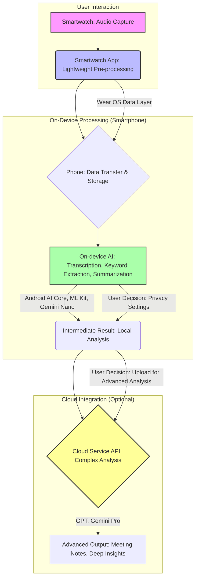

Recly는 Plaud와 유사하게 스마트워치를 활용해 녹음 및 전사 기능을 제공하는 온디바이스 AI 애플리케이션입니다. 이 앱은 이미 사용자가 착용하고 있는 웨어러블 기기를 활용하여 AI 녹음기의 편의성을 제공하며, 워치에서 폰, 그리고 필요시 클라우드까지 이어지는 하이브리드 데이터 처리 패턴을 보여줍니다. 이는 엣지 AI와 클라우드 AI의 장점을 결합한 현대적인 AI 애플리케이션 개발의 모범 사례로 분석될 수 있습니다.

## Recly의 하이브리드 데이터 흐름 패턴

Recly의 핵심은 데이터가 생성되는 웨어러블 기기(스마트워치)에서 일차 처리가 이루어지고, 더 복잡한 연산이 필요한 경우 스마트폰을 거쳐 클라우드로 확장되는 다단계 처리 방식에 있습니다. 이 패턴은 다음과 같은 주요 단계로 구성됩니다:

### 1. 워치 기반 녹음 및 일차 처리

애플 워치나 갤럭시 워치와 같은 스마트워치에서 음성을 녹음합니다. 워치 자체의 제한된 컴퓨팅 자원을 고려하여, 초기 녹음 데이터는 가벼운 전처리(노이즈 감소, 음성 활성화 감지 등) 후 스마트폰으로 효율적으로 전송됩니다. 이 단계에서는 지연 시간을 최소화하고 배터리 소모를 줄이는 것이 중요하며, Wear OS의 API를 통해 안정적인 데이터 전송 채널을 확보해야 합니다.

### 2. 스마트폰 기반 온디바이스 AI 처리

워치에서 전송된 녹음 파일은 스마트폰에서 본격적인 AI 처리를 거칩니다. 이 단계에서 Android 기기는 다음과 같은 온디바이스 AI 기술 스택을 활용할 수 있습니다:

*   **Android AI Core**: 시스템 레벨에서 AI 워크로드를 최적화하여 저전력으로 AI 추론을 수행할 수 있도록 돕습니다.
*   **ML Kit**: Google이 제공하는 SDK로, 음성-텍스트 변환(Speech-to-Text) 모델을 포함하여 다양한 ML 기능을 온디바이스에서 쉽게 통합할 수 있습니다.
*   **Gemini Nano**: Google의 최신 경량 LLM으로, 스마트폰과 같은 엣지 디바이스에서 직접 동작하여 빠르고 사적인 텍스트 생성 및 요약 기능을 제공할 수 있습니다. Recly의 전사 후 요약이나 키워드 추출에 활용될 수 있습니다.
*   **MediaPipe**: 다양한 플랫폼에서 ML 파이프라인을 구축할 수 있는 프레임워크로, 오디오 스트림 처리 및 텍스트 변환 워크플로우를 효율적으로 구성할 수 있습니다.

이 온디바이스 처리 단계에서는 녹음된 음성을 텍스트로 전사하고, 기본적인 요약, 키워드 추출, 중요 부분 강조 등의 작업을 수행할 수 있습니다. 이는 사용자의 데이터가 디바이스 외부로 나가지 않고 처리되므로, 개인 정보 보호 측면에서 큰 이점을 가집니다.

### 3. 클라우드 연동을 통한 확장 분석

폰에서 일차적으로 처리된 데이터(전사 텍스트, 요약 등)는 사용자의 선택에 따라 클라우드 기반의 AI 서비스로 전송될 수 있습니다. 이 단계는 복잡한 회의록 작성, 심층 분석, 다국어 번역, 다른 AI 에이전트와의 연동 등 온디바이스 AI만으로는 어려운 고도화된 작업을 수행할 때 유용합니다. OpenAI의 GPT 모델이나 Google의 Gemini Pro와 같은 강력한 LLM이 이 단계에서 활용될 수 있습니다.

이러한 하이브리드 접근 방식은 웨어러블 디바이스의 휴대성과 즉시성, 스마트폰의 강력한 온디바이스 AI 처리 능력, 그리고 클라우드의 무한한 확장성을 결합하여 사용자에게 최적의 경험을 제공합니다.

## 온디바이스 AI 활용 사례 및 시드 확장

Recly와 같은 패턴은 `android-ai` 카테고리에서 온디바이스 AI의 중요성을 강조합니다. 다음은 Recly의 패턴을 기반으로 확장될 수 있는 10가지 시드 엔트리 아이디어입니다:

1.  **Wear OS 기반 오디오 스트리밍 최적화**: 저전력, 고효율 오디오 스트리밍 프로토콜 및 코덱 개발.
2.  **온디바이스 LLM을 활용한 웨어러블 알림 요약**: 스마트워치에서 받은 알림을 Gemini Nano 등으로 요약하여 핵심 정보만 표시.
3.  **하이브리드 AI 기반 사용자 건강 데이터 분석**: 웨어러블 센서 데이터(심박수, 활동량)를 온디바이스에서 1차 분석 후, 이상 징후만 클라우드로 전송하여 정밀 분석.
4.  **Android AI Core를 활용한 백그라운드 음성 이벤트 감지**: 주변 소리 감지(아기 울음, 비상 상황)를 백그라운드에서 AI Core로 처리.
5.  **ML Kit 기반 온디바이스 제스처 인식**: 스마트워치 센서 데이터를 이용한 사용자 제스처 인식 및 앱 제어.
6.  **Edge-to-Cloud AI 모델 동기화 전략**: 온디바이스 모델과 클라우드 모델 간의 버전 관리 및 학습 데이터 동기화.
7.  **온디바이스 LLM 추론을 위한 메모리 및 전력 최적화 기법**: Gemini Nano와 같은 모델의 경량화 및 효율적인 리소스 관리.
8.  **웨어러블-폰 간 보안 데이터 전송 프로토콜**: 민감한 음성 및 텍스트 데이터의 안전한 이동 보장.
9.  **온디바이스 AI를 위한 사용자 맞춤형 모델 파인튜닝**: 개인의 발음이나 특정 도메인 용어에 최적화된 모델 업데이트.
10. **하이브리드 AI 아키텍처를 위한 에러 핸들링 및 폴백 전략**: 네트워크 불안정 시 온디바이스 처리 강화 및 클라우드 서비스 장애 대응.

## 트레이드오프

*   **온디바이스 처리의 장점 (프라이버시, 저지연)**: 사용자 데이터가 기기 외부로 전송되지 않아 프라이버시 침해 위험이 적고, 네트워크 지연 없이 즉각적인 반응이 가능합니다. 
    *   **언제 좋음**: 개인정보 보호가 최우선이거나, 네트워크 연결이 불안정한 환경에서 빠른 응답이 필요할 때 (예: 의료 기록, 오프라인 환경의 실시간 통역).
    *   **언제 나쁨**: 복잡하고 대규모의 데이터 분석, 최신/고성능 모델이 요구될 때, 디바이스의 리소스(배터리, 메모리, CPU)가 제한적일 때.
*   **클라우드 연동의 장점 (확장성, 고성능)**: 강력한 컴퓨팅 자원을 활용하여 복잡하고 정교한 AI 모델을 사용할 수 있으며, 대규모 데이터 학습 및 분석에 용이합니다. 
    *   **언제 좋음**: 고도의 정확성이 요구되거나, 방대한 데이터 처리 및 장기적인 분석이 필요할 때 (예: 법률 문서 분석, 대규모 시장 동향 예측).
    *   **언제 나쁨**: 데이터 보안 및 프라이버시가 민감할 때, 네트워크 지연이 서비스 품질에 큰 영향을 미칠 때, 클라우드 비용이 부담될 때.
*   **하이브리드 접근 방식의 장점 (유연성, 균형)**: 온디바이스와 클라우드의 장점을 조합하여 최적의 성능과 비용 효율성을 달성할 수 있습니다. 중요한 데이터는 온디바이스에서, 고도화된 분석은 클라우드에서 처리하여 균형을 유지합니다. 
    *   **언제 좋음**: Recly와 같이 초기 처리는 빠르고 사적으로 진행하고, 필요에 따라 심층 분석으로 확장해야 하는 애플리케이션에 적합합니다.
    *   **언제 나쁨**: 아키텍처 설계 및 구현이 복잡해지며, 온디바이스와 클라우드 간의 데이터 동기화 및 일관성 유지가 어려울 수 있습니다. 각 부분의 에러 핸들링 전략이 더욱 중요해집니다.
*   **배터리 및 성능 제약**: 웨어러블 기기 및 스마트폰의 배터리 수명과 처리 성능은 온디바이스 AI 모델 선택 및 최적화에 결정적인 영향을 미칩니다.
    *   **언제 좋음**: 경량화된 모델이나 효율적인 AI 프레임워크(예: AI Core, TensorFlow Lite)를 사용하여 배터리 소모를 최소화하면서 핵심 기능을 제공할 때.
    *   **언제 나쁨**: 고성능 또는 대규모 AI 모델을 온디바이스에서 실행하려 할 때, 디바이스의 제한된 자원을 고려하지 않아 사용자 경험이 저해될 때.

## 실전 체크리스트

Recly와 같은 온디바이스 AI 앱을 기획 및 개발할 때 다음 항목들을 검토해야 합니다.

*   [ ] **온디바이스 AI 모델 경량화 및 최적화**: 목표 디바이스(워치, 폰)의 CPU/GPU, 메모리 제약을 고려하여 TensorFlow Lite quantization, 모델 프루닝, 지식 증류(knowledge distillation) 등의 기법을 적용했는지 확인합니다.
*   [ ] **웨어러블-폰 간 데이터 전송 안정성**: Wear OS Data Layer, Companion API 등 각 플랫폼이 제공하는 API를 활용하여 오디오 데이터 및 전사 텍스트가 손실 없이, 저지연으로 전송되는지 테스트합니다.
*   [ ] **배터리 소모량 프로파일링**: 실제 사용 시나리오에서 워치와 폰 양쪽의 AI 처리 과정이 배터리에 미치는 영향을 측정하고, 허용 가능한 수준 내로 관리되는지 검증합니다.
*   [ ] **개인정보 보호 및 보안 정책 수립**: 온디바이스 처리 데이터, 클라우드 전송 데이터 각각에 대한 암호화, 접근 제어, 데이터 보존 정책이 명확하게 정의되고 준수되는지 확인합니다.
*   [ ] **오프라인 동작 기능 검증**: 네트워크 연결이 없거나 불안정한 상황에서 핵심 기능(녹음, 온디바이스 전사)이 정상적으로 동작하며, 사용자에게 명확한 피드백을 제공하는지 테스트합니다.
*   [ ] **클라우드 폴백 및 에러 처리**: 클라우드 서비스 장애 또는 네트워크 연결 실패 시, 온디바이스 처리 결과를 활용하거나 재시도 로직이 견고하게 구현되어 사용자 경험이 저해되지 않도록 합니다.
*   [ ] **사용자 동의 및 설정 UX**: 데이터 처리(온디바이스 vs. 클라우드) 방식에 대해 사용자에게 명확히 고지하고, 사용자가 쉽게 설정을 변경할 수 있는 직관적인 인터페이스를 제공하는지 확인합니다.