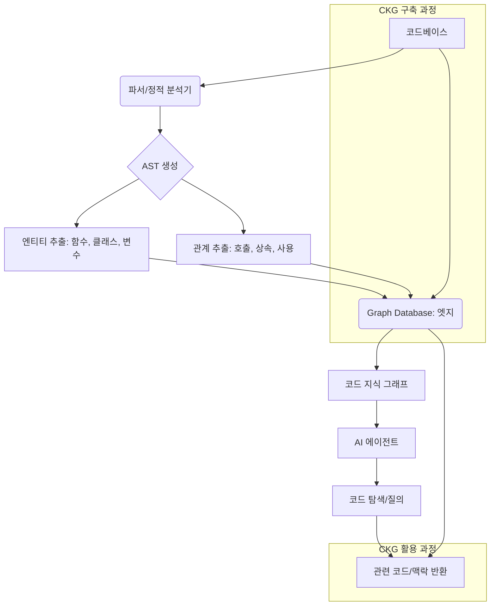

AI 에이전트의 코드 탐색 및 이해 능력은 생산성과 효율성의 핵심 요소입니다. 특히 Claude Code와 같은 LLM 기반 코딩 에이전트가 복잡한 대규모 코드베이스에서 효과적으로 작동하려면, 단순한 텍스트 검색을 넘어선 심층적인 코드 지식 접근 방식이 필수적입니다. 코드 지식 그래프(Code Knowledge Graph, CKG)는 이러한 요구사항을 충족시키기 위한 강력한 솔루션으로 부상하고 있습니다. CKG는 코드의 시맨틱한 관계를 구조화된 그래프 형태로 저장하여, 에이전트가 필요한 코드 조각과 그 맥락을 훨씬 빠르고 정확하게 파악하도록 돕습니다. 이를 통해 토큰 사용량을 최대 59% 절감하고, 처리 속도를 49% 향상하며, 불필요한 도구 호출을 70%까지 줄이는 등 상당한 성능 및 비용 효율 개선을 기대할 수 있습니다. 이는 2026년 기준, 점차 복잡해지고 방대해지는 코드베이스를 관리하고, AI 에이전트의 자율성을 높이는 데 필수적인 기반 기술로 자리매김하고 있습니다.

## 코드 지식 그래프의 핵심 개념 및 구조

코드 지식 그래프는 코드베이스 내의 다양한 엔티티(함수, 클래스, 변수, 파일, 모듈 등)를 노드(Node)로, 이들 간의 관계(호출, 상속, 구현, 정의, 사용 등)를 엣지(Edge)로 표현하는 그래프 데이터베이스입니다. 기존의 텍스트 기반 인덱싱이나 단순 심볼 테이블과는 달리, CKG는 코드 요소 간의 복잡한 연결성과 의존성을 명시적으로 모델링하여 심층적인 문맥 이해를 가능하게 합니다.

### 시맨틱 인덱싱과 관계형 정보

CKG는 정적 분석(Static Analysis)을 통해 코드의 구조적, 시맨틱적 정보를 추출합니다. 이는 추상 구문 트리(Abstract Syntax Tree, AST)를 파싱하고, 타입 정보, 제어 흐름, 데이터 흐름 등을 분석하여 이루어집니다. 예를 들어, 특정 함수가 어떤 클래스에 속하며, 어떤 다른 함수들을 호출하고, 어떤 전역 변수를 사용하는지 등의 정보를 그래프 형태로 저장합니다. 이 과정에서 단순한 키워드 매칭을 넘어, 코드의 의미론적인 맥락(semantic context)을 이해하고 표현하는 것이 중요합니다. 예를 들어, `user`라는 변수가 단순한 문자열이 아니라 `User` 클래스의 인스턴스라는 정보를 명확히 하고, 해당 인스턴스가 어떤 메소드를 가지는지, 어떤 데이터베이스 테이블에 매핑되는지까지 그래프로 표현할 수 있다면, 에이전트는 훨씬 더 정교한 추론을 할 수 있습니다.



### RAG(Retrieval Augmented Generation)와의 연동

AI 에이전트가 CKG를 활용하는 핵심 메커니즘은 RAG 패턴과 유사합니다. 에이전트는 특정 코드 관련 작업을 수행할 때, CKG에 질의를 보내 가장 관련성 높은 코드 스니펫, 함수 정의, 클래스 구조 또는 연관된 문서 등을 검색합니다. 이렇게 검색된 정보는 LLM의 컨텍스트 윈도우(Context Window)에 주입되어, LLM이 보다 정확하고 효율적으로 코드를 생성, 수정, 디버깅할 수 있도록 지원합니다. 이는 컨텍스트 윈도우의 제약사항을 극복하고, 대규모 코드베이스에 대한 깊이 있는 이해를 제공하는 데 결정적인 역할을 합니다. 특히, CodeGraph와 같은 솔루션은 이러한 RAG 패턴을 통해 에이전트의 코드 탐색을 가속화하며, 이는 복잡한 소프트웨어 시스템의 버그 수정, 기능 추가, 리팩토링 등 다양한 작업에서 LLM 에이전트의 역량을 크게 증대시킵니다.

## 실제 구현 전략

CKG 도입을 위한 개념 증명(PoC)은 다음과 같은 단계로 진행될 수 있습니다.

### 1. 코드 파싱 및 AST 생성

대상 코드베이스의 소스 코드를 파싱하여 AST를 생성합니다. Python의 `ast` 모듈, Java의 `JDT (Java Development Tools)`, TypeScript/JavaScript의 `TypeScript Compiler API` 등 각 언어별 도구를 활용합니다.

```python
import ast

def parse_python_code(code_string):
    """
    Python 코드를 파싱하여 AST를 반환합니다.
    """
    try:
        tree = ast.parse(code_string)
        return tree
    except SyntaxError as e:
        print(f"Syntax error: {e}")
        return None

# 예시 코드
sample_code = """
def calculate_sum(a, b):
    # This function calculates the sum of two numbers.
    return a + b

class MyCalculator:
    def __init__(self, initial_value=0):
        self.value = initial_value

    def add(self, x):
        self.value += x
        return self.value

def main():
    result = calculate_sum(10, 20)
    calc = MyCalculator(result)
    print(f"Initial value: {calc.value}")
    calc.add(5)
    print(f"New value: {calc.value}")

if __name__ == "__main__":
    main()
"""

ast_tree = parse_python_code(sample_code)
if ast_tree:
    # AST 노드 탐색 예시
    for node in ast.walk(ast_tree):
        if isinstance(node, (ast.FunctionDef, ast.ClassDef)):
            print(f"Detected: {node.__class__.__name__} - {node.name}")
        # 추가: docstring 또는 주석 추출 로직을 여기에 추가하여 노드의 속성으로 저장 가능
```

### 2. 엔티티 및 관계 추출

생성된 AST를 순회하며 함수, 클래스, 변수 등의 노드와 이들 간의 호출, 상속, 사용 등의 관계를 추출합니다. 이 과정에서 각 엔티티의 범위, 타입 정보, 주석 등 추가 메타데이터도 함께 수집합니다. 예를 들어, `MyCalculator` 클래스의 `add` 메소드가 `self.value` 인스턴스 변수를 수정한다는 데이터 흐름 관계를 추출할 수 있습니다. 이러한 세부 정보는 에이전트가 특정 코드 변경이 시스템에 미칠 영향을 예측하는 데 큰 도움이 됩니다.

### 3. 그래프 데이터베이스 저장

추출된 노드와 엣지 정보를 Neo4j, ArangoDB, Dgraph와 같은 그래프 데이터베이스에 저장합니다. 이들 데이터베이스는 그래프 질의 언어(예: Cypher for Neo4j)를 제공하여 복잡한 관계 질의를 효율적으로 수행할 수 있도록 합니다.

```python
from neo4j import GraphDatabase

# WARNING: This is a simplified conceptual example.
# Real-world integration requires robust error handling, schema definition, and connection management.

class CodeGraphDB:
    def __init__(self, uri, user, password):
        self.driver = GraphDatabase.driver(uri, auth=(user, password))

    def close(self):
        self.driver.close()

    def _execute_query(self, query, parameters=None):
        with self.driver.session() as session:
            return session.run(query, parameters)

    def add_function(self, function_name, file_path, docstring=None):
        query = (
            "MERGE (f:Function {name: $function_name, filePath: $file_path}) "
            "ON CREATE SET f.docstring = $docstring "
            "RETURN f"
        )
        self._execute_query(query, {"function_name": function_name, "file_path": file_path, "docstring": docstring})

    def add_calls_relationship(self, caller, callee):
        query = (
            "MATCH (caller:Function {name: $caller_name}), "
            "(callee:Function {name: $callee_name}) "
            "MERGE (caller)-[:CALLS]->(callee)"
        )
        self._execute_query(query, {"caller_name": caller, "callee_name": callee})

    def get_functions_called_by(self, function_name):
        query = (
            "MATCH (f:Function {name: $function_name})-[:CALLS]->(called:Function) "
            "RETURN called.name AS name"
        )
        result = self._execute_query(query, {"function_name": function_name})
        return [record["name"] for record in result]

# db = CodeGraphDB("bolt://localhost:7687", "neo4j", "password")
# db.add_function("main", "app.py", "Entry point of the application")
# db.add_function("calculate_sum", "app.py", "Calculates the sum of two numbers")
# db.add_class("MyCalculator", "app.py", "A simple calculator class")
# db.add_method_to_class("MyCalculator", "add")
# db.add_calls_relationship("main", "calculate_sum")
# print(db.get_functions_called_by("main"))
# db.close()
```

### 4. AI 에이전트 연동 계층 개발

Claude Code 하네스 내에서 CKG에 질의를 보내는 도구(Tool)를 구현합니다. 에이전트는 특정 태스크를 수행할 때, 이 도구를 사용하여 코드베이스 관련 정보를 획득하고 이를 프롬프트에 포함시킵니다. 예를 들어, "이 `calculate_sum` 함수가 어디서 호출되는가?"와 같은 질문에 대해 CKG 질의를 통해 즉시 답을 얻을 수 있습니다. 이 연동 계층은 에이전트의 추론 과정에서 동적으로 활성화되며, 필요한 코드 정보만 선별적으로 가져오는 스마트한 RAG 전략을 가능하게 합니다. 궁극적으로 에이전트가 마치 인간 개발자와 같이 코드베이스를 "이해"하고 "탐색"하는 능력을 제공합니다.

## 트레이드오프

### 장점

*   **토큰 효율성 및 비용 절감**: LLM에 전체 코드베이스를 넘겨줄 필요 없이, 작업에 필요한 최소한의 코드 맥락만 정확하게 전달하여 토큰 사용량을 대폭 줄입니다. (언제 좋은가: 대규모 코드베이스, 복잡한 의존성 분석 시)
*   **성능 및 응답 속도 향상**: 사전 인덱싱된 그래프 질의는 실시간 텍스트 검색이나 LLM의 추론에 의존하는 방식보다 훨씬 빠릅니다. (언제 좋은가: 빠른 코드 탐색, 실시간 피드백이 중요한 개발 워크플로우)
*   **정확도 및 환각(Hallucination) 감소**: 코드의 시맨틱한 관계를 명시적으로 제공하여 LLM이 잘못된 가정을 하거나 존재하지 않는 코드를 생성할 위험을 줄입니다. (언제 좋은가: 높은 코드 품질과 정확성이 요구되는 미션 크리티컬한 작업)
*   **대규모 코드베이스 관리 용이성**: 수백만 라인 이상의 코드베이스에서도 효율적인 코드 탐색 및 분석이 가능합니다. (언제 좋은가: 엔터프라이즈 규모의 복잡한 소프트웨어 프로젝트)

### 단점

*   **초기 구축 및 유지보수 복잡성**: 코드 파서, 그래프 데이터베이스 선정 및 구축, AST 기반 엔티티/관계 추출 로직 개발 등 초기 설정에 상당한 노력과 전문 지식이 필요합니다. (언제 나쁜가: 소규모 프로젝트, 리소스 제약이 심한 환경)
*   **데이터 최신성 유지**: 코드베이스가 변경될 때마다 CKG도 업데이트되어야 합니다. 지속적인 통합(CI) 파이프라인과의 연동을 통해 자동화해야 하며, 이는 추가적인 오버헤드를 발생시킵니다. (언제 나쁜가: 코드 변경이 매우 빈번하거나, 업데이트 주기가 짧은 환경에서 자동화가 미흡할 경우)
*   **통합 및 호환성 문제**: 기존 AI 에이전트 하네스 및 도구 체인과의 매끄러운 통합이 필요하며, 특정 LLM 모델이나 프레임워크와의 호환성을 검증해야 합니다. (언제 나쁜가: 레거시 시스템과의 연동, 유연하지 않은 에이전트 아키텍처)
*   **그래프 데이터베이스 운영 비용**: 그래프 데이터베이스 자체의 라이선스 비용, 운영 및 스케일링 비용이 발생할 수 있습니다. (언제 나쁜가: 비용에 민감한 프로젝트)

## 실전 체크리스트

CKG 도입 PoC를 진행하며 다음 항목들을 검증합니다.

*   [ ] **코드 파싱 및 AST 생성 정확도**: 대상 언어 및 코드 스타일에 대한 AST 파싱이 정확하게 이루어지는지 검증합니다. 특히 엣지 케이스와 복잡한 문법에 대한 처리를 확인합니다.
*   [ ] **핵심 엔티티 및 관계 추출 커버리지**: 함수, 클래스, 변수 정의뿐만 아니라 호출 관계, 상속 관계, 타입 정의 등 핵심적인 시맨틱 정보가 충분히 추출되는지 확인합니다.
*   [ ] **그래프 데이터베이스 질의 성능**: 복잡한 질의(예: 특정 함수를 호출하는 모든 함수 찾기, 특정 클래스를 상속받는 모든 클래스 찾기)에 대한 응답 속도를 측정하고 최적화합니다.
*   [ ] **에이전트-CKG 연동 도구(Tool) 안정성**: Claude Code 하네스 내에서 CKG 질의 도구가 예상대로 작동하며, 오류 처리 로직이 견고한지 테스트합니다.
*   [ ] **토큰 사용량 및 비용 절감 효과 측정**: CKG 도입 전후의 실제 토큰 사용량과 LLM 호출 비용을 비교하여 정량적인 절감 효과를 측정합니다.
*   [ ] **코드 탐색 및 이해 능력 향상 검증**: 에이전트가 CKG를 사용하여 코드 관련 질문에 더 정확하고 신속하게 답변하는지, 또는 코드 생성 작업에서 더 나은 품질을 보이는지 평가합니다.
*   [ ] **CKG 업데이트 파이프라인 설계 및 자동화 가능성**: 코드 변경 시 CKG를 효율적으로 업데이트할 수 있는 자동화된 CI/CD 연동 방안을 검토하고, 초기 설계를 수립합니다.