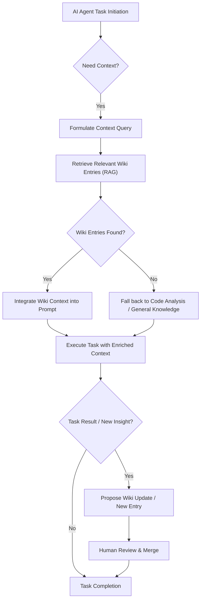

현대 소프트웨어 개발 환경에서 AI 에이전트의 역할이 점차 중요해지고 있습니다. 이러한 에이전트들이 복잡한 코드베이스를 효과적으로 이해하고 기여하려면 단순히 코드 파일 그 이상의 맥락적 지식이 필수적입니다. 코드만으로는 프로젝트의 아키텍처 결정, 설계 철학, 특정 구현의 이유, 시스템 간의 미묘한 상호작용, 그리고 과거의 함정(gotchas)과 같은 암묵적인 지식을 온전히 전달하기 어렵습니다. CodeAlmanac의 개념처럼, 개발 결정, 흐름, 불변 조건, 그리고 잠재적 함정을 기록하는 '살아있는 위키 시스템'을 구축함으로써 AI 에이전트와 개발자 모두에게 풍부한 맥락을 제공하고 개발 효율성을 극대화할 수 있습니다. 이는 AI 에이전트의 '지식 허브'를 강화하는 핵심 전략입니다.

## AI 에이전트를 위한 코드베이스 위키의 중요성

AI 에이전트에게 코드베이스 위키는 단순한 문서 집합을 넘어, 프로젝트의 '집단 지성' 저장소 역할을 합니다. 이는 다음과 같은 이유로 중요합니다.

### 맥락적 깊이 확보
코드는 '무엇'을 하는지 보여주지만, 위키는 '왜' 그렇게 하는지 설명합니다. 복잡한 리팩토링, 버그 진단, 신규 기능 개발 시 에이전트가 설계 의도와 비즈니스 맥락을 이해하는 데 결정적인 정보를 제공합니다. 이는 코드 주석이나 Git 커밋 메시지로만은 한계가 있습니다.

### 의사결정 근거 제공
과거의 아키텍처 결정, 기술 스택 선택, 특정 트레이드오프에 대한 기록은 AI 에이전트가 유사한 문제에 직면했을 때 더 합리적이고 일관된 결정을 내리는 데 도움을 줍니다. 이는 에이전트의 '경험'을 보강하는 효과를 줍니다.

### 암묵적 지식의 명시화
코드만으로는 파악하기 어려운 팀 내의 불문율, 시스템 간의 미묘한 의존성, 특정 모듈 사용 시 주의사항 등 '암묵적 지식'을 문서화하여 에이전트의 학습 데이터로 활용할 수 있습니다. 이는 특히 새로운 에이전트 온보딩(fine-tuning 또는 RAG 기반 학습) 시간을 단축하는 데 기여합니다.

### 할루시네이션(Hallucination) 감소
에이전트가 코드와 함께 검증된 위키 지식을 RAG(Retrieval Augmented Generation) 방식으로 활용하면, 사실에 기반한 답변과 코드 생성을 유도하여 할루시네이션 위험을 크게 줄일 수 있습니다.

## 강화된 코드베이스 위키의 핵심 요소

AI 에이전트가 활용하기 좋은 코드베이스 위키는 다음 요소들을 포함해야 합니다.

### 버전 관리되는 마크다운 엔트리
각 위키 엔트리는 `.md` 또는 `.mdx` 형식의 마크다운 파일로 작성되며, 코드와 함께 버전 관리 시스템(Git)에 저장됩니다. 이는 코드 변경과 문서 변경을 동기화하여 지식의 신선도를 유지하는 데 필수적입니다. 예를 들어, `src/services/user-auth/.wiki/decision_oauth_flow.md`와 같이 코드 근처에 위치시킬 수 있습니다.

```markdown
<!-- path: src/services/user-auth/.wiki/decision_oauth_flow.md -->
---
title: OAuth 2.0 Flow Decision Rationale
tags: [authentication, security, oauth, decision-log]
status: active
author: Team Zeus
date: 2026-03-15
---

## OAuth 2.0 Flow Decision Rationale

### Context
Initial user authentication for `Service X` required a robust, industry-standard solution. We considered direct email/password, JWT, and OAuth 2.0.

### Decision
OAuth 2.0 (Authorization Code Flow with PKCE) was selected for the following reasons:
1.  **Security**: Enhanced protection against CSRF and injection attacks.
2.  **Scalability**: Supports multiple identity providers.
3.  **User Experience**: Enables Single Sign-On (SSO) and avoids password management overhead.

### Alternatives Considered
*   **Direct Email/Password**: Rejected due to high security management burden and lack of SSO.
*   **JWT (Client Credentials)**: Rejected for user-facing flows due to lack of refresh token mechanism and broader authorization scope challenges.

### Gotchas
*   **Refresh Token Rotation**: Ensure proper handling and rotation of refresh tokens to mitigate token theft risks.
*   **CORS Configuration**: Strict CORS policies are crucial for authorization server endpoints.

### Relevant Code Paths
*   `src/services/user-auth/auth.controller.ts`
*   `src/config/security.ts` (OAuth client secrets, redirect URIs)
```

### 구조화된 메타데이터
각 위키 엔트리는 YAML Frontmatter 등을 통해 `tags`, `status`, `author`, `date` 같은 구조화된 메타데이터를 포함합니다. 이는 에이전트가 문서를 필터링하고 검색하거나, 문서의 신뢰도를 평가하는 데 활용됩니다.

### 심층적인 상호 연결성
위키 엔트리 간, 위키와 코드 파일 간, 그리고 외부 문서로의 하이퍼링크를 적극적으로 활용하여 지식 그래프를 형성합니다. 이는 에이전트가 관련 정보를 탐색하고 전체 시스템을 이해하는 데 핵심적인 역할을 합니다.

### 시각적 다이어그램 (Mermaid)
복잡한 시스템 아키텍처, 데이터 흐름, 비즈니스 로직을 Mermaid 다이어그램으로 시각화하여 텍스트만으로는 파악하기 어려운 정보를 에이전트에게 제공합니다. 이는 특히 코드 탐색 단계에서 유용합니다.



## AI 에이전트와의 통합 및 활용 예시

AI 에이전트는 지식 허브 역할을 하는 코드베이스 위키와 다음과 같이 통합될 수 있습니다.

```python
# Pseudo-code for AI Agent Wiki Retrieval
from typing import List, Dict

class KnowledgeHub:
    def __init__(self, vector_db_client, wiki_repo_path):
        self.vector_db = vector_db_client
        self.wiki_repo = wiki_repo_path # Path to local wiki files

    def retrieve_context_for_query(self, query: str, top_k: int = 5) -> List[Dict]:
        """
        Queries the vector database for relevant wiki entries based on semantic similarity.
        """
        embeddings = self.vector_db.embed_query(query)
        # Assume vector_db.search returns a list of { 'filepath': 'path/to/wiki.md', 'score': 0.9, 'content': '...' }
        results = self.vector_db.search(embeddings, top_k=top_k)
        return results

    def get_wiki_entry_content(self, filepath: str) -> str:
        """
        Reads the full content of a wiki entry from the local repository.
        """
        full_path = f"{self.wiki_repo}/{filepath}"
        try:
            with open(full_path, 'r', encoding='utf-8') as f:
                return f.read()
        except FileNotFoundError:
            return f"Error: Wiki entry not found at {filepath}"

# Example Usage by an AI Agent
if __name__ == "__main__":
    # Initialize with a hypothetical vector DB client and wiki path
    # In a real scenario, this would interact with a persistent vector DB and a version-controlled repo
    mock_vector_db = type('MockVectorDB', (), {
        'embed_query': lambda self, q: [0.1, 0.2, 0.3], # Simplified
        'search': lambda self, emb, k: [
            {'filepath': 'src/services/user-auth/.wiki/decision_oauth_flow.md', 'score': 0.95, 'content': 'OAuth 2.0 Flow Decision Rationale...'}, 
            {'filepath': 'src/config/.wiki/security_best_practices.md', 'score': 0.88, 'content': 'Security Best Practices...'}
        ]
    })()
    
    knowledge_hub = KnowledgeHub(mock_vector_db, "./my-codebase/.wiki")

    agent_query = "How is user authentication implemented in Service X and what are its potential pitfalls?"
    relevant_entries = knowledge_hub.retrieve_context_for_query(agent_query)

    print("--- Relevant Wiki Entries for Agent Query ---")
    for entry in relevant_entries:
        print(f"File: {entry['filepath']}, Score: {entry['score']:.2f}")
        # Agent would then parse and use the content for its task
        # For demonstration, we'll just print a snippet
        print(entry['content'][:200] + "...\n")
```

## 트레이드오프

### 1. 초기 설정 및 유지보수 비용 vs. 장기적 개발 효율성
*   **좋을 때**: 복잡하고 규모가 큰 코드베이스, 높은 개발자 이직률, 장기 프로젝트. 맥락 손실을 방지하고 새로운 팀원의 온보딩 시간을 단축하여 장기적인 개발 효율성을 크게 높일 수 있습니다.
*   **나쁠 때**: 소규모의 단기 프로젝트 또는 문서화 문화가 정착되지 않은 팀. 초기 문서화 및 지속적인 유지보수 비용이 프로젝트의 즉각적인 가치 창출보다 과도하게 느껴질 수 있습니다.

### 2. 문서화 오버헤드 vs. AI 에이전트의 자율성 및 정확성 증대
*   **좋을 때**: AI 에이전트가 복잡한 아키텍처 변경이나 중요한 비즈니스 로직을 다룰 때. 상세한 맥락이 에이전트의 '이해'를 심화하여 더 정확하고 자율적인 의사결정 및 코드 생성 능력을 제공합니다.
*   **나쁠 때**: AI 에이전트가 단순 반복 작업이나 정형화된 코드 생성에 주로 사용될 때. 불필요한 문서화 오버헤드가 팀 생산성을 저해하며, 에이전트의 단순 작업에는 과도한 맥락이 필요하지 않을 수 있습니다.

### 3. 지식의 신선도 유지 vs. 오래된 정보로 인한 혼란
*   **좋을 때**: 문서 업데이트 프로세스가 코드 변경 워크플로에 통합되어 지속적으로 관리될 때. AI 에이전트가 항상 최신 정보를 바탕으로 작업하여, '정보의 신선도'를 신뢰할 수 있습니다.
*   **나쁠 때**: 문서가 코드 변경과 동기화되지 않고 방치될 때. 오래된 또는 잘못된 정보가 AI 에이전트에게 전달되어 오히려 잘못된 판단을 유도하고, 할루시네이션이나 버그 발생의 원인이 될 수 있습니다.

### 4. 표준화된 문서 포맷 vs. 유연성 부족
*   **좋을 때**: 문서 구조와 메타데이터가 표준화되어 있어 AI 에이전트가 파싱하고 이해하기 용이하며, 자동화된 문서 검증 및 생성 파이프라인 구축에 유리할 때.
*   **나쁠 때**: 팀이나 프로젝트의 특성에 따라 비정형적이거나 유연한 문서화 방식이 필요한 경우. 엄격한 포맷이 오히려 문서화 장벽으로 작용하여, 중요한 지식의 기록을 저해할 수 있습니다.

## 실전 체크리스트

AI 에이전트 코드베이스 위키를 구축하고 강화할 때 다음 항목들을 검증합니다.

*   - [ ] 현재 코드베이스 내의 핵심 비즈니스 로직 및 아키텍처 결정 사항 중 문서화되지 않은 항목을 5개 이상 식별했는가?
*   - [ ] 각 위키 엔트리가 코드 레벨의 구체적인 구현과 더불어 '왜 그렇게 되었는지'에 대한 의사결정 과정을 포함하고 있는가?
*   - [ ] 위키 시스템이 기존 버전 관리 시스템(Git 등)과 통합되어 문서 변경 이력을 추적하고 코드 변경과 연동될 수 있는가?
*   - [ ] AI 에이전트가 위키 콘텐츠를 검색하고 맥락으로 활용하는 RAG(Retrieval Augmented Generation) 파이프라인이 구현되어 있으며, 최소 3가지 이상의 태스크에서 에이전트의 성능 향상을 정량적으로 측정했는가?
*   - [ ] 새로운 위키 엔트리 생성 및 기존 엔트리 업데이트에 대한 자동화된 제안(AI 에이전트 또는 CI/CD 훅)과 인간 검토 워크플로가 정의되어 있는가?
*   - [ ] 위키 엔트리 간의 연결성(링크) 및 관련 코드 파일로의 참조가 충분히 포함되어 지식 그래프를 형성하고 있는가?
*   - [ ] 문서의 신선도(staleness)를 측정하고, 오래된 문서에 대한 주기적인 검토 및 아카이빙 정책을 수립했는가?
*   - [ ] Mermaid 다이어그램 등 시각화 요소가 포함된 위키 엔트리를 AI 에이전트가 성공적으로 파싱하고 이해하는지 확인했는가?