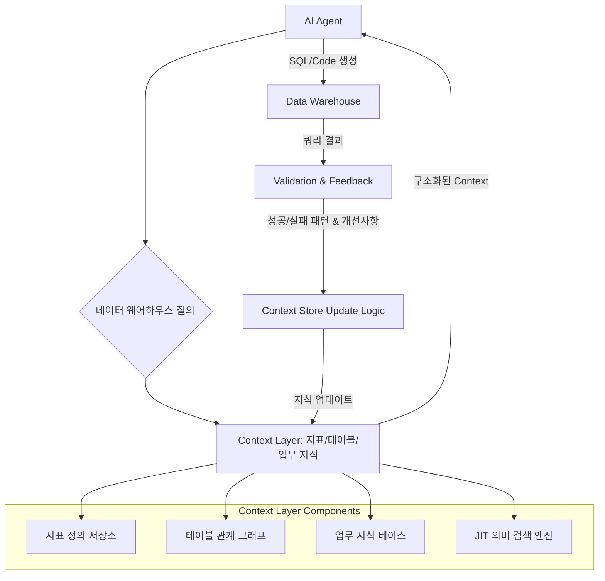

AI 에이전트가 복잡한 데이터 웨어하우스(Data Warehouse)와 상호작용할 때 겪는 가장 큰 어려움 중 하나는 정확하고 최신 비즈니스 맥락(Business Context)의 부족입니다. 이는 에이전트의 환각(Hallucination) 현상을 유발하거나, 부정확한 질의 생성으로 이어져 데이터 분석의 신뢰성을 저해합니다. 이러한 문제를 해결하기 위해 '자가 개선형 컨텍스트 레이어(Self-improving Context Layer)' 도입이 필수적입니다. 이 컨텍스트 레이어는 승인된 지표 정의(Approved Metric Definitions), 테이블 관계(Table Relationships), 업무 지식(Business Knowledge) 등을 구조화하여 AI 에이전트에게 공급하며, 에이전트의 실행 피드백을 통해 스스로 진화하는 시스템입니다.

## 구조화된 지식 통합 (Structured Knowledge Integration)
Karpathy LLM Wiki 패턴에서 영감을 받아, 회사 내부의 핵심 지식을 LLM이 소비하기 용이한 형태로 구조화합니다. 이는 단순히 문서를 임베딩하는 것을 넘어, YAML, JSON, 혹은 Pydantic 모델과 같은 명확한 스키마(Schema)를 통해 지식을 정의하고 관리하는 것을 의미합니다.

### 지표 정의 예시 (Metric Definition Example)
다음은 Pydantic을 활용한 지표 정의 스키마와 실제 지표 예시입니다.

```python
from pydantic import BaseModel, Field
from typing import List, Optional

class Column(BaseModel):
    name: str = Field(..., description="컬럼명")
    data_type: str = Field(..., description="데이터 타입 (예: INT, VARCHAR)")
    description: str = Field(..., description="컬럼 설명")

class TableSchema(BaseModel):
    name: str = Field(..., description="테이블명")
    description: str = Field(..., description="테이블 설명")
    columns: List[Column] = Field(..., description="테이블 컬럼 리스트")

class MetricDefinition(BaseModel):
    metric_name: str = Field(..., description="지표명")
    description: str = Field(..., description="지표에 대한 상세 설명")
    calculation_logic: str = Field(..., description="지표 계산 로직 (SQL 스니펫 등)")
    source_tables: List[str] = Field(..., description="지표 계산에 사용되는 테이블")
    business_context: str = Field(..., description="지표의 비즈니스 맥락 및 사용 목적")
    responsible_team: Optional[str] = Field(None, description="지표 담당 팀")

# 예시: 활성 사용자 수 지표 정의
active_user_metric = MetricDefinition(
    metric_name="DAU",
    description="일일 활성 사용자 수. 특정 날짜에 한 번 이상 서비스를 이용한 고유 사용자 수.",
    calculation_logic="COUNT(DISTINCT user_id) FROM user_logs WHERE event_date = CURDATE()",
    source_tables=["user_logs"],
    business_context="서비스의 일간 활성도를 측정하는 핵심 지표입니다. 마케팅 캠페인 효과 분석 및 제품 개선 방향 설정에 활용됩니다.",
    responsible_team="Growth Team"
)

print(active_user_metric.model_dump_json(indent=2))
```

이러한 구조화된 지식은 AI 에이전트가 데이터 웨어하우스를 질의할 때, 단순히 스키마 정보뿐만 아니라 비즈니스 로직과 맥락까지 정확하게 파악하여 더 의미 있는 SQL 쿼리를 생성하도록 돕습니다.

## 자가 개선형 컨텍스트 레이어 아키텍처 (Self-Improving Context Layer Architecture)

컨텍스트 레이어는 AI 에이전트의 질의-응답 사이클에서 지속적으로 학습하고 개선됩니다. 에이전트가 생성한 쿼리가 실행되고 그 결과가 검증될 때마다, 성공적인 패턴이나 실패 원인을 분석하여 컨텍스트 레이어의 지식 저장소를 업데이트하는 메커니즘이 필요합니다.



## JIT 의미 검색 (Just-In-Time Semantic Search) 연동
에이전트의 모든 질의에 전체 컨텍스트를 제공하는 것은 비효율적이며, 컨텍스트 윈도우(Context Window) 제약과 비용 문제를 야기합니다. JIT 의미 검색은 에이전트의 현재 질의 의도(Intent)에 가장 관련성 높은 컨텍스트 조각(Snippet)만을 동적으로 검색하여 제공하는 방식입니다. 이는 벡터 데이터베이스(Vector Database)와 임베딩(Embedding) 기술을 활용하여 구현할 수 있습니다.

### JIT 의미 검색 워크플로우
1.  **질의 임베딩**: AI 에이전트의 질의를 벡터로 변환합니다.
2.  **유사성 검색**: 벡터 데이터베이스에서 지식 베이스의 임베딩된 스키마, 지표 정의, 업무 지식 등과 유사성 검색을 수행합니다.
3.  **컨텍스트 제공**: 가장 관련성 높은 상위 N개의 결과를 추출하여 에이전트의 프롬프트(Prompt)에 주입합니다.

## 스키마 및 저장소 설계 (Schema and Storage Design)

Karpathy LLM Wiki 패턴은 마크다운(Markdown) 기반의 위키 시스템에 구조화된 YAML 프론트매터(Frontmatter)를 활용하여 지식을 관리하는 방식입니다. 이를 확장하여, 다음과 같은 저장소 설계가 가능합니다.

*   **지식 마크다운 파일**: 각 지표, 테이블, 업무 지식 단위로 `.md` 파일에 설명과 메타데이터를 포함.
*   **스키마 정의**: Pydantic 모델과 같은 형식으로 각 지식 유형의 스키마를 정의.
*   **벡터 데이터베이스**: 마크다운 파일의 내용 및 구조화된 메타데이터를 임베딩하여 저장. JIT 검색에 활용.
*   **관계형 데이터베이스/그래프 데이터베이스**: 테이블 관계, 지표 간의 의존성 등 복잡한 관계형 지식 저장.

## Claude Code 하네스 통합 (Claude Code Harness Integration)

Claude Code와 같은 AI 에이전트 하네스(Harness)에 컨텍스트 레이어를 통합하는 것은 에이전트의 데이터 분석 능력을 극대화합니다. 하네스는 컨텍스트 레이어로부터 동적으로 검색된 지식을 Claude Code 모델의 프롬프트에 주입하는 역할을 담당합니다.

```python
# Pseudo-code for Claude Code Harness Context Injection
def get_context_for_query(user_query: str, context_layer_client) -> str:
    # JIT semantic search to retrieve relevant context snippets
    retrieved_metrics = context_layer_client.search_metrics(user_query)
    retrieved_tables = context_layer_client.search_tables(user_query)
    retrieved_business_rules = context_layer_client.search_business_rules(user_query)

    context_str = "## Available Metrics:\n"
    for metric in retrieved_metrics:
        context_str += f"- {metric.metric_name}: {metric.description} (Logic: {metric.calculation_logic})\n"

    context_str += "\n## Relevant Tables:\n"
    for table in retrieved_tables:
        context_str += f"- {table.name}: {table.description}\n"
        for col in table.columns:
            context_str += f"  - {col.name} ({col.data_type}): {col.description}\n"
    
    context_str += "\n## Business Rules:\n"
    for rule in retrieved_business_rules:
        context_str += f"- {rule.name}: {rule.description}\n" # Assuming rule has name and description

    return context_str

# In the Claude Code harness workflow
user_input = "Calculate the DAU for the last 7 days, excluding test users."
dynamic_context = get_context_for_query(user_input, context_layer_client)

prompt_template = f"""
You are an expert data analyst AI. Your task is to write accurate SQL queries for our data warehouse.
Here is the relevant business context and data definitions:

{dynamic_context}

User Request: {user_input}
Please provide the SQL query.
"""

# Claude Code call with the enriched prompt
# claude_response = claude_api.invoke(prompt_template)
```

## 트레이드오프

*   **초기 구축 비용 및 복잡성 (Initial Setup Cost & Complexity)**
    *   **언제 좋고**: 데이터 웨어하우스가 방대하고 복잡하며, 다양한 이해관계자가 각기 다른 지표 정의를 사용하는 경우. 에이전트의 정확성과 신뢰성이 최우선 과제일 때 장기적인 효율성을 제공합니다.
    *   **언제 나쁜지**: 데이터 스키마가 단순하고, 에이전트가 다룰 데이터의 범위가 제한적이며, 빠른 프로토타이핑이 중요한 초기 단계 프로젝트.

*   **유지보수 및 진화의 어려움 (Maintenance & Evolution Challenges)**
    *   **언제 좋고**: 지표 정의, 테이블 스키마, 업무 지식이 비교적 안정적이고, 변경 관리가 잘 되는 환경. 자가 개선 메커니즘이 효과적으로 작동하여 수동 업데이트 부담을 줄일 수 있을 때.
    *   **언제 나쁜지**: 데이터 스키마와 비즈니스 로직이 빠르게 변경되는 동적인 환경. 잘못된 학습으로 인해 컨텍스트 레이어에 오류가 누적될 위험이 있습니다.

*   **에이전트 환각 감소 및 정확성 향상 (Reduced Hallucination & Improved Accuracy)**
    *   **언제 좋고**: AI 에이전트가 비즈니스 의사결정에 중요한 역할을 하거나, 금융, 의료 등 높은 정확성과 규정 준수가 요구되는 도메인. 일관된 지식 기반으로 에이전트의 신뢰도를 크게 높일 수 있습니다.
    *   **언제 나쁜지**: 초기 탐색 단계에서 유연하고 창의적인 아이디어가 더 중요하며, 엄격한 정확성보다 다양한 시도가 우선시되는 경우.

*   **확장성 및 성능 (Scalability & Performance)**
    *   **언제 좋고**: 대규모 사용자 또는 에이전트가 동시에 다양한 데이터 질의를 수행해야 하는 엔터프라이즈 환경. JIT 의미 검색과 계층적 저장소 설계가 잘 되어 있으면 효율적인 컨텍스트 제공이 가능합니다.
    *   **언제 나쁜지**: 요청 빈도가 낮고, 컨텍스트 로딩 시간이 크게 중요하지 않은 소규모 시스템. 불필요한 복잡성과 오버헤드를 초래할 수 있습니다.

## 실전 체크리스트

*   [ ] **구조화된 지식 스키마 정의 완료 여부**: 핵심 지표 정의, 테이블 스키마, 업무 규칙에 대한 Pydantic 또는 이에 상응하는 명확한 스키마가 문서화되었는가?
*   [ ] **지식 저장소 구축 및 초기 데이터 로딩 완료 여부**: 정의된 스키마에 따라 지식 저장소(마크다운 파일, 관계형 DB, 벡터 DB 등)가 구축되었으며, 필수 초기 지식이 로드되었는가?
*   [ ] **JIT 의미 검색 엔진 연동 및 성능 검증 여부**: 에이전트 질의에 대한 관련 컨텍스트 검색 시간이 임계값(< 500ms) 이내이며, 검색 정확도가 90% 이상을 유지하는가?
*   [ ] **자가 개선 피드백 루프 구현 및 활성화 여부**: 에이전트 실행 결과(성공/실패, 생성 쿼리 품질)를 분석하여 컨텍스트 레이어를 자동으로 업데이트하는 메커니즘이 작동하는가?
*   [ ] **컨텍스트 레이어 업데이트 검증 프로세스 구축 여부**: 자가 개선에 의해 변경된 컨텍스트가 잘못된 정보를 포함하지 않도록, 수동/자동 검증 프로세스(예: Git 기반 코드 리뷰, CI/CD 파이프라인 연동)가 마련되었는가?
*   [ ] **보안 및 접근 제어 정책 적용 여부**: 민감한 데이터 및 업무 지식에 대한 접근 권한이 컨텍스트 레이어에 올바르게 설정되었으며, 에이전트가 인가된 범위 내에서만 정보를 활용하도록 통제되는가?
*   [ ] **컨텍스트 사용 및 에이전트 성능 모니터링 대시보드 구축 여부**: 컨텍스트 레이어가 에이전트의 환각률, 쿼리 정확도, 성공률 등에 미치는 영향을 실시간으로 확인할 수 있는 대시보드가 마련되었는가?