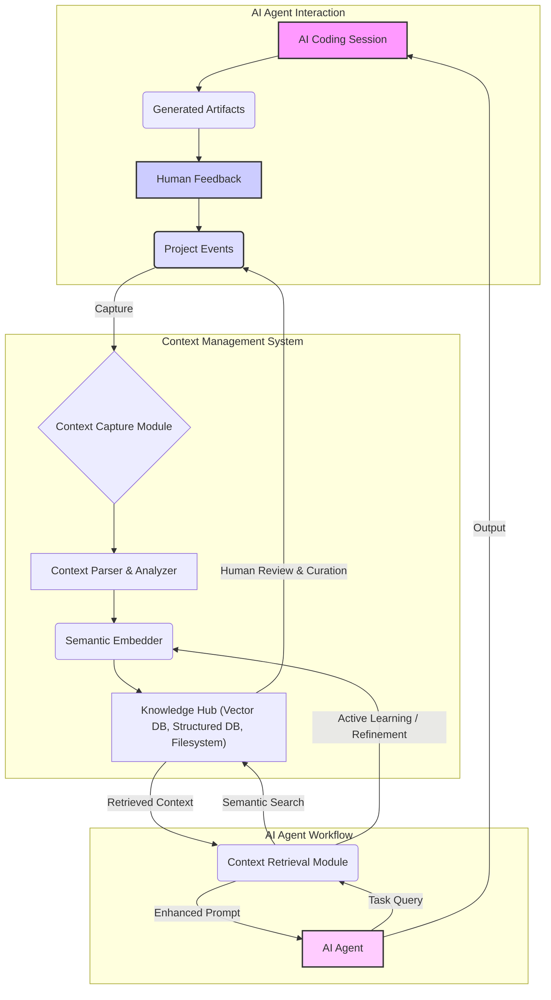

AI 에이전트 기반 개발 환경에서 '맥락 관리'는 프로젝트의 지속성과 효율성을 결정하는 핵심 요소입니다. 기존 AI 코딩 세션의 맥락은 대개 휘발성(ephemeral)으로, 한 세션이 종료되면 그 과정에서 쌓인 유용한 정보들이 사라지기 쉽습니다. 이는 AI가 새로운 작업을 시작할 때마다 관련 정보를 처음부터 다시 파악해야 하는 비효율성을 초래하며, 대규모 코드베이스나 복잡한 프로젝트에 AI 에이전트를 통합할 때 심각한 장애물로 작용합니다. '축적된 프로젝트 맥락의 부재'는 단순한 모델 성능 문제를 넘어, AI 협업의 본질적인 한계로 작용합니다.

## AI 에이전트 맥락 관리 시스템의 필요성

AI 에이전트가 성공적으로 프로젝트에 기여하기 위해서는 인간 개발자와 유사하게 프로젝트의 과거 결정, 코드 변경 사항, 디자인 철학, 그리고 이전 상호작용에서 얻은 피드백을 기억하고 활용할 수 있어야 합니다. 맥락 관리 시스템은 이러한 휘발성 정보를 체계적으로 캡처하고 저장하며, 필요할 때 에이전트가 이를 효과적으로 검색하여 의사결정 및 코드 생성에 활용할 수 있도록 지원합니다. 이는 에이전트의 '장기 기억(long-term memory)' 역할을 하며, 생산성과 코드 품질 향상에 직결됩니다.

## 핵심 개념 및 아키텍처

AI 에이전트 맥락 관리 시스템은 다음과 같은 주요 구성 요소로 이루어집니다.

1.  **맥락 캡처 (Context Capture)**: AI 에이전트의 코딩 세션, 생성된 결과물(코드, 문서), 인간 피드백(리뷰, 주석), 그리고 중요한 프로젝트 이벤트(커밋, 이슈 생성) 등 모든 주요 상호작용을 실시간으로 캡처합니다. Git 훅, IDE 확장, 또는 에이전트의 프록시 레이어를 통해 구현될 수 있습니다.
2.  **맥락 저장 (Context Storage)**: 캡처된 맥락 데이터를 구조화된 형태로 저장합니다. 기존 `Karpathy LLM Wiki` 패턴을 확장하여, 코드 스냅샷, diff, 작업 목표, 에이전트의 추론 과정, 인간의 개입 내역 등을 포함하는 스키마를 설계합니다. 이를 위해 벡터 데이터베이스(Semantic Search), 관계형 데이터베이스(Structured Metadata), 버전 관리되는 파일 시스템(Raw Content)을 조합하여 사용할 수 있습니다.
3.  **맥락 처리 및 임베딩 (Context Processing & Embedding)**: 저장된 맥락 데이터를 정제하고 임베딩(embedding)하여, 에이전트가 의미론적으로 유사한 맥락을 효율적으로 검색할 수 있도록 준비합니다. 이는 자연어 처리(NLP) 기술과 임베딩 모델을 활용합니다.
4.  **맥락 검색 및 주입 (Context Retrieval & Injection)**: 에이전트가 현재 수행하는 작업과 관련된 맥락을 지식 허브에서 검색하고, 이를 현재 프롬프트에 주입(RAG: Retrieval-Augmented Generation)하여 에이전트의 의사결정 및 응답 품질을 향상시킵니다.

다음 Mermaid 다이어그램은 이 시스템의 전반적인 흐름을 보여줍니다.



## 실제 동작하는 코드 예제: 컨텍스트 기록기

아래 Python 코드는 AI 에이전트의 간단한 코딩 세션 맥락을 JSON Lines 파일에 기록하는 예제입니다. 실제 시스템에서는 이를 확장하여 Git 커밋 훅, IDE 확장 또는 Agent Orchestrator에 통합될 수 있습니다.

```python
import json
import datetime
import os

def record_context(agent_name: str, session_id: str, event_type: str, payload: dict):
    """
    AI 에이전트의 맥락 이벤트를 JSON Lines 파일에 기록합니다.
    """
    context_data = {
        "timestamp": datetime.datetime.now().isoformat(),
        "agent_name": agent_name,
        "session_id": session_id,
        "event_type": event_type,
        "payload": payload
    }

    output_dir = "contexts"
    os.makedirs(output_dir, exist_ok=True)
    file_path = os.path.join(output_dir, f"{session_id}.jsonl")

    with open(file_path, 'a', encoding='utf-8') as f:
        json.dump(context_data, f, ensure_ascii=False)
        f.write('\n')
    print(f"Context recorded for session {session_id}, event: {event_type}")

# 예제 사용
if __name__ == "__main__":
    session_id_1 = "proj-alpha-s001"
    agent_name_1 = "CodeGenius_v2"

    record_context(
        agent_name_1,
        session_id_1,
        "code_generation",
        {
            "prompt": "Implement a Python function for Fibonacci sequence.",
            "generated_code": "def fibonacci(n):\n    a, b = 0, 1\n    for _ in range(n):\n        yield a\n        a, b = b, a + b\n",
            "diff": "new file: fib.py"
        }
    )

    record_context(
        agent_name_1,
        session_id_1,
        "human_feedback",
        {
            "comment": "Add type hints and a docstring.",
            "severity": "medium",
            "modified_code_segment": "..."
        }
    )

    session_id_2 = "proj-alpha-s002"
    agent_name_2 = "TestPilot_v1"

    record_context(
        agent_name_2,
        session_id_2,
        "test_run_result",
        {
            "test_file": "test_fib.py",
            "passed": 10,
            "failed": 0,
            "error_message": None
        }
    )
    print("Example context recording complete.")
```

이 코드 스니펫은 특정 세션 ID 아래에서 에이전트의 작업과 인간 피드백을 추적하는 기본 메커니즘을 제공합니다. 실제 프로덕션 환경에서는 이를 확장하여 메시지 큐, 분산 스토리지, 그리고 더 정교한 스키마 유효성 검사 및 인덱싱 로직이 필요합니다.

## 2026년 최신 트렌드 반영

2026년에는 AI 에이전트 맥락 관리 시스템이 다음 방향으로 진화할 것으로 예상됩니다.

*   **멀티모달 맥락 통합 (Multimodal Context Integration)**: 코드, 텍스트 뿐만 아니라 설계 다이어그램, UI/UX 스크린샷, 음성 회의록 등 다양한 형태의 맥락을 캡처하고 통합하여 에이전트에게 제공합니다. 이를 통해 에이전트는 더욱 풍부한 정보를 바탕으로 추론할 수 있습니다.
*   **세분화된 시맨틱 청킹 (Fine-grained Semantic Chunking)**: 단순히 파일 단위가 아닌, 함수, 클래스, 심지어 특정 코드 블록 단위로 맥락을 세분화하여 임베딩하고 검색합니다. 이는 에이전트가 필요한 정보만 정확하게 가져와 컨텍스트 윈도우 효율성을 극대화하는 데 도움을 줍니다.
*   **액티브 러닝 기반 맥락 정제 (Active Learning for Context Refinement)**: 에이전트가 검색한 맥락의 유용성, 또는 인간 피드백을 통해 맥락 데이터 자체의 품질을 지속적으로 개선하는 피드백 루프가 강화됩니다. 이를 통해 '노이즈'는 줄이고 '신호'는 증폭시키는 자율적인 시스템이 구축됩니다.
*   **페더레이티드 맥락 관리 (Federated Context Management)**: 여러 에이전트 또는 팀 간에 맥락을 안전하게 공유하고 동기화하는 메커니즘이 중요해집니다. 이는 중앙 집중식 지식 허브와 분산된 로컬 맥락 저장소의 하이브리드 형태로 발전할 수 있습니다.

## 트레이드오프

*   **데이터 양 vs. 관련성 (Data Volume vs. Relevance)**
    *   **언제 좋음**: 장기적이고 복잡한 프로젝트에서 광범위한 과거 기록이 에이전트의 깊이 있는 이해를 돕습니다. 초기 에이전트 학습 및 디버깅에 유용합니다.
    *   **언제 나쁨**: 과도한 데이터는 검색 노이즈를 증가시키고, 불필요한 스토리지 및 처리 비용을 발생시킵니다. 에이전트의 컨텍스트 윈도우를 빠르게 소모시켜 최신 정보의 활용을 방해할 수 있습니다.
*   **자동화된 캡처 vs. 수동 큐레이션 (Automated Capture vs. Manual Curation)**
    *   **언제 좋음**: 자동화된 캡처는 일관성 있고 광범위한 데이터 수집을 보장하며, 인간의 개입 없이 반복적인 코드 변경이나 단순 상호작용 기록에 적합합니다.
    *   **언제 나쁨**: 민감하거나 중요한 의사결정, 또는 미묘한 뉘앙스를 포함하는 피드백은 자동화된 시스템만으로는 정확하게 캡처하기 어렵습니다. 잘못된 맥락이 자동으로 저장되면 에이전트의 잘못된 학습으로 이어질 수 있습니다.
*   **저장 비용 vs. 검색 성능 (Storage Cost vs. Retrieval Performance)**
    *   **언제 좋음**: 최적화된 인덱싱과 효율적인 데이터 구조를 사용하면 대규모 코드베이스에서도 빠른 맥락 검색이 가능하여 에이전트 응답 시간을 단축합니다.
    *   **언제 나쁨**: 모든 것을 장기적으로 저장하면 스토리지 비용이 크게 증가할 수 있습니다. 검색 인프라가 비효율적이면 필요한 맥락을 찾기까지 오랜 시간이 걸려 에이전트 작업 흐름을 지연시킵니다.
*   **시스템 복잡성 vs. 유지보수 용이성 (System Complexity vs. Maintainability)**
    *   **언제 좋음**: 분산된 모듈형 아키텍처는 시스템의 확장성과 안정성을 높여 장기적인 대규모 팀 프로젝트에 적합합니다.
    *   **언제 나쁨**: 너무 복잡한 시스템은 구축 및 유지보수 비용이 높으며, 작은 규모의 개인 또는 단기 프로젝트에서는 오버헤드가 더 클 수 있습니다. 문제 발생 시 디버깅이 어렵고 새로운 기능을 추가하기 어렵습니다.

## 실전 체크리스트

프로젝트에 AI 에이전트 맥락 관리 시스템을 도입하기 위한 실전 체크리스트입니다.

-   [ ] 주요 AI 에이전트 상호작용(코드 생성, 수정, 피드백, 툴 사용 결과)이 최소한 `contexts/`session_id`.jsonl` 또는 이와 유사한 형태로 체계적으로 기록되는가?
-   [ ] 저장된 각 맥락 데이터 항목이 타임스탬프, 에이전트 ID, 세션 ID, 사용자 ID, 관련 Git 커밋 해시, 그리고 코드 스냅샷 또는 Diff 등 필수 메타데이터를 포함하는가?
-   [ ] 에이전트가 새로운 작업을 시작할 때, 기존 맥락 저장소에서 관련성이 높은 정보를 자동으로 검색하고 현재 프롬프트에 주입(RAG)할 수 있도록 시스템이 구축되었는가?
-   [ ] 맥락 저장 스키마가 `Karpathy LLM Wiki` 패턴을 확장하여 AI 에이전트의 특정 작업 유형(예: 동적 툴 호출, 장기 계획 수립)에 필요한 상세 정보를 반영하는가?
-   [ ] 저장된 맥락 데이터의 양이 과도하게 증가하는 것을 방지하기 위해, 오래된 데이터의 압축, 요약 또는 아카이빙 정책이 정의되고 자동화되어 있는가?
-   [ ] 인간 개발자가 에이전트가 참조할 맥락 데이터를 쉽게 검토하고, 필요시 중요도를 표시하거나 수정할 수 있는 관리 인터페이스를 제공하는가?
-   [ ] 맥락 관리 시스템 도입 전후로 AI 에이전트의 코드 품질 지표(예: 테스트 통과율), 작업 완료율, 또는 컨텍스트 윈도우 내 토큰 사용 효율성 등 구체적인 KPI 개선이 측정되고 있는가?