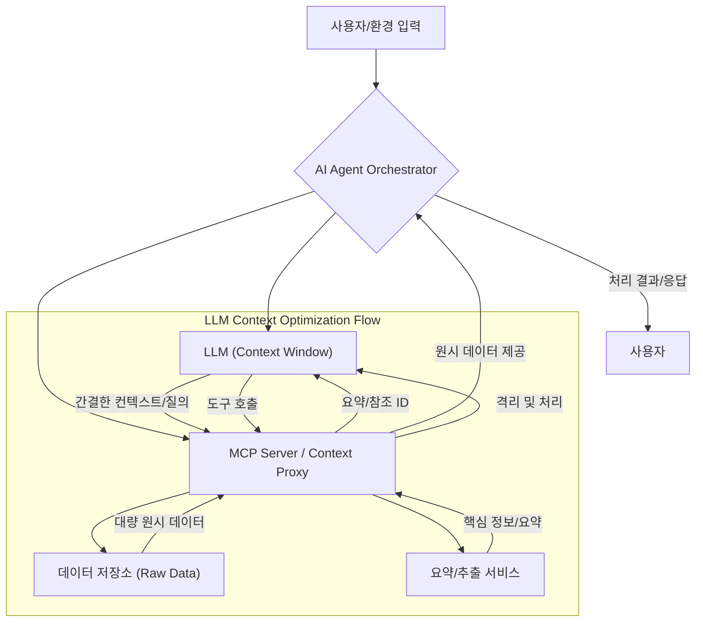

AI 에이전트의 효율성과 확장성은 컨텍스트 윈도우(Context Window) 관리에 의해 크게 좌우됩니다. 대규모 언어 모델(LLM) 기반 에이전트는 복잡한 작업을 수행하기 위해 상당한 양의 정보를 필요로 하지만, 컨텍스트 윈도우 크기 제한과 API 비용은 실제 애플리케이션에서 주요 제약으로 작용합니다. 특히 코드 하네스(Code Harness)와 같이 반복적인 도구 호출(tool calls)이 발생하는 환경에서는 컨텍스트 윈도우가 빠르게 소모되어 에이전트의 세션 지속 시간이 짧아지고 비용이 급증하는 문제가 발생합니다. MCP(Managed Context Proxy) 서버와 같은 접근 방식은 이러한 문제를 해결하기 위한 혁신적인 전략을 제시합니다. 원시 데이터를 샌드박스(sandbox)로 격리하고 필요한 핵심 정보만 LLM에 전달함으로써, 컨텍스트 윈도우 사용량을 획기적으로 줄이고 에이전트의 세션 지속 시간을 수십 분에서 수 시간으로 연장할 수 있습니다.

## Context Window Challenges and the MCP Solution
LLM의 컨텍스트 윈도우는 에이전트가 현재 대화의 맥락과 관련 정보를 유지하는 '작업 기억(working memory)' 역할을 합니다. 디버깅 세션이나 복잡한 소프트웨어 개발 작업을 수행하는 AI 코딩 에이전트의 경우, 파일 내용, API 응답, 실행 로그 등 방대한 원시 데이터가 컨텍스트에 포함됩니다. 이는 다음과 같은 문제점을 야기합니다:
*   **비용 증가**: LLM API 호출은 컨텍스트 윈도우의 토큰 길이에 비례하여 과금됩니다. 불필요한 원시 데이터는 비용을 기하급수적으로 증가시킵니다.
*   **성능 저하 및 지연**: 컨텍스트가 길어질수록 LLM의 추론 시간(inference time)이 길어져 응답 속도가 느려집니다.
*   **세션 지속 시간 제한**: 컨텍스트 윈도우가 빠르게 가득 차면, 에이전트는 과거 대화나 관련 정보를 잊어버리게 되어, 사용자는 새로운 세션을 시작하거나 수동으로 컨텍스트를 재주입해야 합니다. 30분 내외의 짧은 세션은 복잡한 작업 흐름에 심각한 제약이 됩니다.

MCP 서버는 이러한 문제를 해결하기 위해 **원시 데이터 격리(Raw Data Isolation)** 및 **간접 참조(Indirect Referencing)** 전략을 사용합니다. 예를 들어, 대량의 로그 파일이나 코드 베이스 전체를 LLM에 직접 전달하는 대신, MCP 서버는 이를 별도의 저장소에 보관하고 LLM에게는 해당 데이터의 요약, 핵심 추출, 또는 필요한 경우 해당 데이터에 접근할 수 있는 '도구(tool)'의 호출 결과만 전달합니다. 이를 통해 컨텍스트 윈도우 사용량을 315KB에서 5.4KB로 98% 절감하는 것이 가능합니다.

### 핵심 최적화 전략
AI 에이전트의 컨텍스트 윈도우를 최적화하고 세션 지속 시간을 연장하기 위한 주요 전략은 다음과 같습니다.

1.  **데이터 격리 및 요약 (Data Isolation & Summarization)**:
    *   **원시 데이터의 외부화**: 대량의 파일 내용, 데이터베이스 결과, API 응답 등은 LLM 컨텍스트 대신 외부 저장소(예: RAG 시스템, 임시 파일 시스템, 자체 캐시)에 저장합니다.
    *   **사전 처리 및 요약**: LLM에 전달하기 전, 필요한 정보만 추출하거나 요약(summarization)하여 컨텍스트 윈도우에 포함합니다. 이는 텍스트 요약 모델(summarization model)이나 정규 표현식, 키워드 추출 등의 기법을 활용할 수 있습니다.

2.  **참조 기반 통신 (Reference-based Communication)**:
    *   에이전트는 특정 정보가 필요할 때마다 외부 저장소나 도구를 호출하여 실시간으로 정보를 가져옵니다. 이때 LLM에게는 정보의 '원본' 대신 '참조(reference)'나 '접근 방식'을 알립니다.
    *   예를 들어, "User `A`는 `file.py`의 10-20 라인에 있는 `MyClass` 정의를 참조했다"와 같이 특정 데이터 조각에 대한 메타데이터나 포인터(pointer)를 전달합니다.

3.  **동적 컨텍스트 관리 (Dynamic Context Management)**:
    *   **컨텍스트 압축(Context Pruning)**: 에이전트의 현재 작업과 관련성이 낮은 과거 대화나 정보를 주기적으로 제거합니다. Importance-based pruning, recency-based pruning, or summarization-based pruning 등이 활용됩니다.
    *   **계층적 컨텍스트(Hierarchical Context)**: 고수준의 작업 계획이나 목표는 장기 컨텍스트로 유지하고, 저수준의 실행 세부사항은 단기 컨텍스트로 관리하여 필요에 따라 스왑(swap)합니다.

4.  **에이전트 세션 상태 관리 (Agent Session State Management)**:
    *   에이전트의 내부 상태, 변수, 작업 진행 상황 등을 컨텍스트 윈도우 외부의 지속성 저장소(persistent storage)에 저장하여 세션 종료 후에도 이어서 작업을 수행할 수 있도록 합니다. Redis, DynamoDB, 혹은 파일 시스템 등을 활용할 수 있습니다. 이는 특히 사용자 인터럽트나 에이전트 재시작 시 유용합니다.

### 코드 예시: 컨텍스트 프록시 및 요약

아래 Python 코드는 간단한 컨텍스트 프록시를 보여줍니다. 이 프록시는 대량의 원시 데이터를 받아 핵심 정보만 요약하여 LLM에 전달하는 역할을 시뮬레이션합니다.

```python
import hashlib

class ContextProxy:
    def __init__(self, storage_backend={}):
        self.storage = storage_backend
        self.max_llm_context_length = 500 # Simulate LLM context limit

    def store_and_summarize(self, raw_data: str) -> str:
        """
        원시 데이터를 저장하고, 그 내용을 요약 또는 참조 형태로 반환합니다.
        실제 환경에서는 더 정교한 요약 모델이나 키워드 추출 로직이 필요합니다.
        """
        data_hash = hashlib.sha256(raw_data.encode()).hexdigest()
        self.storage[data_hash] = raw_data # 원시 데이터 저장

        summary_template = f"Reference ID: {data_hash}. The following is a summary of the raw data (first 50 chars): '{raw_data[:50]}...'"
        
        # Simulate advanced summarization if raw_data is very long
        if len(raw_data) > self.max_llm_context_length * 2: # Heuristic for 'very long'
            summary = self._advanced_summarize(raw_data)
            return f"Reference ID: {data_hash}. Summary: '{summary}'"
        else:
            return summary_template

    def _advanced_summarize(self, text: str) -> str:
        """
        실제 요약 LLM 또는 정교한 요약 로직을 호출하는 함수.
        여기서는 간단히 첫 100자만 반환하는 것으로 대체합니다.
        """
        return text[:100] + "..."

    def retrieve_full_data(self, ref_id: str) -> str:
        """
        참조 ID를 사용하여 원시 데이터를 검색합니다.
        """
        return self.storage.get(ref_id, "Data not found.")

# 사용 예시
proxy = ContextProxy()

# 대량의 원시 데이터
large_code_file = """
import os
import sys
import requests
# ... (수백 라인의 코드) ...
def process_data(data):
    # This function processes a lot of incoming requests
    # It performs various complex calculations and database operations.
    # Error handling, logging, and performance metrics are also included.
    # The code base is designed for high concurrency and fault tolerance.
    # ... (더 많은 코드) ...
""" * 10 # Simulate a very large file

# 프록시를 통해 데이터를 저장하고 요약된 컨텍스트를 얻습니다.
llm_context_entry = proxy.store_and_summarize(large_code_file)
print(f"LLM Context Entry: {llm_context_entry}")
# 예상 출력: Reference ID: <hash>. The following is a summary of the raw data (first 50 chars): 'import os\nimport sys\nimport requests\n# ... (수...'

# LLM이 특정 참조 ID를 기반으로 추가 정보를 요청할 수 있습니다.
retrieved_data = proxy.retrieve_full_data(llm_context_entry.split(" ")[2].replace(".", ""))
print(f"\nRetrieved Data based on reference: {retrieved_data[:200]}...") # 처음 200자만 출력
```

이 예제에서 `ContextProxy`는 실제 코드 내용 대신 요약된 정보와 참조 ID를 LLM에 제공하여 컨텍스트 윈도우를 효율적으로 관리합니다. 에이전트가 특정 코드 스니펫이나 자세한 정보가 필요할 때, 해당 `Reference ID`를 사용하여 `retrieve_full_data` 함수를 호출하는 도구(tool)를 사용할 수 있습니다.

### Mermaid 다이어그램: AI 에이전트 컨텍스트 흐름



### 2026년 최신 트렌드: 컨텍스트 윈도우 최적화의 미래

2026년에는 AI 에이전트 컨텍스트 윈도우 최적화 기술이 더욱 고도화될 것입니다.
*   **지능형 컨텍스트 압축 및 확장**: LLM 자체가 입력 컨텍스트의 중요도를 판단하고, 중요도에 따라 압축하거나 필요한 경우 외부 저장소에서 관련 정보를 능동적으로 가져오는 기능이 내장될 것입니다. 이는 Attention 메커니즘의 발전과 Memory Augmentation 기술의 통합을 통해 이루어집니다.
*   **멀티모달 컨텍스트 관리**: 텍스트 외에 이미지, 비디오, 오디오와 같은 멀티모달 데이터에 대한 컨텍스트 관리 기술이 필수적으로 발전할 것입니다. 시각적 정보나 음성 신호에서 핵심 컨텍스트를 추출하고 LLM에 효율적으로 전달하는 프레임워크가 일반화될 것입니다.
*   **개인화된 컨텍스트 프로필**: 각 에이전트의 역할, 사용자 선호도, 과거 상호작용 기록 등을 기반으로 개인화된 컨텍스트 프로필을 유지하여, 더욱 관련성 높고 효율적인 정보만을 컨텍스트 윈도우에 포함시키는 방식이 도입될 것입니다.
*   **온디바이스(On-device) 또는 엣지(Edge) 컨텍스트 처리**: 민감한 데이터나 실시간 처리가 요구되는 시나리오를 위해, 클라우드 LLM으로 모든 컨텍스트를 보내는 대신 온디바이스에서 1차적으로 컨텍스트를 처리하고 요약하는 경량화된 모델들이 활용될 것입니다.
*   **자율 컨텍스트 재구성**: 에이전트가 작업의 진행 상황에 따라 스스로 컨텍스트 윈도우를 재구성하고, 불필요한 정보를 제거하거나 새로운 정보를 탐색하여 추가하는 자율적인 컨텍스트 관리 시스템이 보편화될 것입니다.

## 트레이드오프

컨텍스트 윈도우 최적화 및 세션 지속 시간 연장 전략은 많은 이점을 제공하지만, 동시에 몇 가지 트레이드오프를 고려해야 합니다.

*   **시스템 복잡도 증가 vs. 비용 절감**:
    *   **언제 좋은가?**: LLM API 호출 비용이 매우 높거나, 복잡하고 장기적인 AI 에이전트 작업이 필요한 경우, MCP 서버와 같은 추가 인프라 구축의 이점이 큽니다. 장기적인 운영 비용 절감에 기여합니다.
    *   **언제 나쁜가?**: 단순한 단일 턴(single-turn) 질의 응답 시스템이나, 컨텍스트 윈도우 사용량이 적은 경량 에이전트의 경우, 컨텍스트 관리 시스템 구축으로 인한 초기 개발 및 유지보수 비용이 이점보다 클 수 있습니다.

*   **추가 지연 시간(Latency) vs. 컨텍스트 효율성**:
    *   **언제 좋은가?**: 실시간 응답이 최우선이 아닌, 에이전트의 복잡한 추론 능력과 장기적인 작업 수행 능력이 중요한 경우, 컨텍스트 프록시를 통한 데이터 요약 및 검색에 필요한 추가 지연 시간은 감수할 만합니다. 전체 작업의 성공률과 효율성을 높입니다.
    *   **언제 나쁜가?**: 사용자에게 즉각적인 응답이 필수적인 대화형 AI나, 낮은 지연 시간이 핵심 KPI인 애플리케이션에서는 컨텍스트 처리 과정에서 발생하는 수 밀리초(ms)에서 수 초(s)의 추가 지연이 사용자 경험에 치명적일 수 있습니다.

*   **정보 손실 위험 vs. 컨텍스트 축소**:
    *   **언제 좋은가?**: 원시 데이터에 중복되거나 불필요한 정보가 많고, LLM이 핵심 정보를 파악하는 데 방해가 되는 '노이즈'가 많은 경우, 사전 요약 및 필터링은 LLM의 추론 정확도를 높일 수 있습니다.
    *   **언제 나쁜가?**: 중요한 세부 정보나 미묘한 뉘앙스가 요약 과정에서 손실될 위험이 있는 경우, 에이전트의 판단 오류로 이어질 수 있습니다. 특히 법률, 의료 또는 정교한 기술 문서 분석과 같이 '모든' 정보가 중요한 시나리오에서 위험합니다.

*   **개발/운영 오버헤드 vs. 세션 연속성**:
    *   **언제 좋은가?**: AI 에이전트가 사용자 인터랙션에 걸쳐 상태를 유지하고, 중단 없이 복잡한 멀티스텝(multi-step) 작업을 수행해야 하는 경우, 세션 지속 시간 연장 기술은 사용자 만족도를 크게 높이고 에이전트의 유용성을 극대화합니다.
    *   **언제 나쁜가?**: 각 상호작용이 독립적이고 세션 간의 상태 유지가 중요하지 않은 경우, 세션 지속성 메커니즘을 구현하고 관리하는 오버헤드는 불필요하게 느껴질 수 있습니다.

## 실전 체크리스트

AI 에이전트의 컨텍스트 윈도우 최적화 및 세션 지속 시간 연장 전략을 프로젝트에 적용할 때 다음 항목들을 검토하십시오.

- [ ] **현재 컨텍스트 윈도우 사용량 및 비용 측정**: LLM API 호출별 토큰 사용량과 관련 비용을 정량적으로 측정하고, 현재 세션 지속 시간의 평균을 파악하여 최적화 전후를 비교할 기준 지표를 설정합니다.
- [ ] **원시 데이터 유형 및 중요도 분석**: 에이전트가 처리하는 원시 데이터(로그, 코드, 문서, API 응답 등)의 유형을 식별하고, 각 데이터가 LLM 추론에 미치는 중요도를 평가하여 요약 또는 격리 대상을 선정합니다.
- [ ] **컨텍스트 요약/추출 전략 정의**: 어떤 정보를 요약하고 어떤 정보를 참조 형태로 전달할지 구체적인 정책을 수립합니다. 키워드 추출, 엔티티 인식, 요약 모델 활용 등 적절한 기술 스택을 결정합니다.
- [ ] **컨텍스트 프록시 또는 MCP 서버 통합 계획**: 기존 에이전트 아키텍처에 컨텍스트 관리 계층(Context Management Layer)을 어떻게 통합할지 설계합니다. API 게이트웨이, 미들웨어, 혹은 사이드카(Sidecar) 패턴 등을 고려합니다.
- [ ] **세션 상태 지속성 메커니즘 설계**: 에이전트의 작업 상태를 저장하고 복원할 수 있는 영구 저장소(Persistent Storage) 솔루션(예: Redis, NoSQL DB)을 선정하고, 상태 관리 전략(저장 시점, 저장 내용)을 명확히 합니다.
- [ ] **성능 및 지연 시간 영향 평가**: 컨텍스트 최적화 적용 후 에이전트의 응답 속도 및 전체 작업 완료 시간을 측정하여 사용자 경험에 미치는 영향을 평가하고, 허용 가능한 지연 시간 범위 내에 있는지 확인합니다.
- [ ] **정보 손실 및 정확도 검증**: 요약 또는 필터링된 컨텍스트가 에이전트의 추론 정확도나 결과 품질에 부정적인 영향을 미치지 않는지 A/B 테스트, 휴먼 인 더 루프(Human-in-the-Loop) 평가 등을 통해 검증합니다.
- [ ] **보안 및 규정 준수 검토**: 컨텍스트 데이터 격리 및 저장 방식이 데이터 보안 정책 및 개인정보 보호 규정(GDPR, CCPA 등)을 준수하는지 확인하고, 특히 민감 정보(PII) 처리 방안을 명확히 합니다.