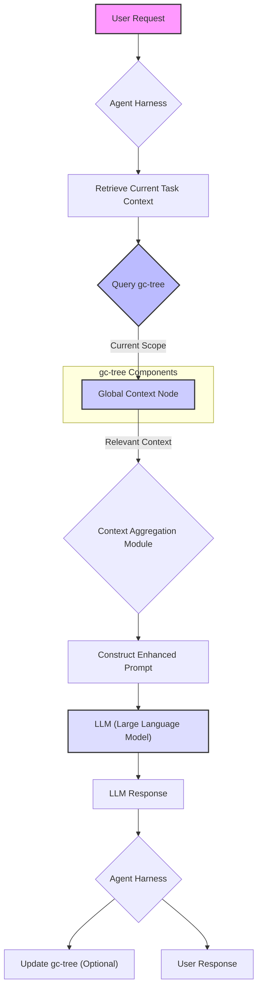

AI 에이전트 개발에서 반복적인 컨텍스트 제공은 비효율성을 초래하고 에이전트의 일관성 있는 행동을 저해하는 주요 과제입니다. 매 세션마다 에이전트에게 프로젝트 구조, 팀 문화, 특정 용어 또는 저장소 연결 방식 등을 설명해야 하는 상황은 에이전트의 유용성을 크게 떨어뜨립니다. 이러한 문제를 해결하기 위해 gc-tree와 같은 글로벌 컨텍스트 관리 도구의 도입은 에이전트의 '기억'을 지속적으로 유지하고, 일관된 작업을 수행하도록 지원하는 핵심 전략입니다. 이는 'Karpathy LLM Wiki 패턴'과 유사하게 지식 허브의 효율성을 극대화하며, 에이전트가 보다 자율적으로 복잡한 작업을 처리할 수 있는 기반을 마련합니다.

## gc-tree 기반 글로벌 컨텍스트 관리의 필요성

AI 에이전트가 복잡한 개발 환경이나 비즈니스 프로세스 내에서 효율적으로 작동하기 위해서는 광범위하고 지속적인 컨텍스트(context)에 대한 접근이 필수적입니다. 기존 방식은 주로 프롬프트에 모든 필요한 정보를 포함하거나, 짧은 세션 컨텍스트만을 유지했습니다. 이는 컨텍스트 윈도우 한계와 비용 문제뿐만 아니라, 동일한 정보를 반복적으로 제공해야 하는 비효율성을 야기합니다. gc-tree는 이러한 문제를 해결하기 위해 설계된 계층적 컨텍스트 관리 시스템으로, 에이전트가 필요한 시점에 적절한 범위의 글로벌 컨텍스트에 접근할 수 있도록 돕습니다.

### gc-tree의 핵심 개념

gc-tree는 이름에서 알 수 있듯이 컨텍스트를 트리(tree) 구조로 관리합니다. 각 노드는 특정 스코프(scope)의 컨텍스트를 나타내며, 부모-자식 관계를 통해 상위 컨텍스트를 상속하고 하위 컨텍스트를 포함합니다. 예를 들어, `GlobalProject/Team/Frontend/ComponentA`와 같은 경로를 통해 특정 컨텍스트에 접근할 수 있습니다. 이를 통해 에이전트는 현재 작업에 가장 관련성이 높은 컨텍스트를 효율적으로 추출하고 활용할 수 있습니다.

-   **계층적 구조 (Hierarchical Structure)**: 프로젝트, 팀, 모듈, 특정 파일 등 다양한 레벨의 컨텍스트를 체계적으로 조직화합니다.
-   **동적 업데이트 (Dynamic Updates)**: 컨텍스트는 프로젝트의 변화에 따라 지속적으로 업데이트될 수 있으며, 변경 사항은 즉시 에이전트에 반영됩니다.
-   **스코프 기반 접근 (Scope-based Access)**: 에이전트의 현재 작업 스코프에 따라 가장 관련성 높은 컨텍스트를 자동으로 제공합니다.
-   **지속성 (Persistence)**: 세션이 종료되어도 컨텍스트는 유지되어 에이전트가 '기억'을 잃지 않도록 합니다.

## AI 에이전트 하네스 통합 아키텍처

gc-tree를 AI 에이전트 하네스에 통합하는 것은 에이전트의 인지 능력을 향상시키는 데 중요합니다. 하네스는 에이전트의 요청을 LLM에 전달하기 전, gc-tree에서 필요한 컨텍스트를 조회하고 이를 프롬프트에 주입하는 역할을 수행합니다. 이 과정은 다음과 같이 이루어질 수 있습니다.



위 다이어그램은 에이전트가 요청을 처리하는 과정에서 gc-tree가 어떻게 통합되는지 보여줍니다. 에이전트 하네스는 현재 작업의 컨텍스트를 식별하고, gc-tree에 쿼리하여 해당 스코프에 필요한 글로벌 컨텍스트를 가져옵니다. 이 컨텍스트는 LLM에 전달될 프롬프트에 포함되어 에이전트가 더 정확하고 효율적인 응답을 생성할 수 있도록 돕습니다.

## 구현 예시: 파이썬 기반 gc-tree 스켈레톤

다음은 gc-tree의 기본적인 아이디어를 구현한 파이썬 코드 예시입니다. 실제 gc-tree는 더 복잡한 컨텍스트 병합, 버전 관리, 저장소 연동 등을 포함할 수 있습니다.

```python
class GCTreeNode:
    def __init__(self, name: str, content: str = "", parent=None):
        self.name = name
        self.content = content
        self.children = {}
        self.parent = parent

    def add_child(self, node):
        if node.name in self.children:
            raise ValueError(f"Child '{node.name}' already exists in {self.name}")
        self.children[node.name] = node
        node.parent = self

    def get_context_by_path(self, path: str):
        current = self
        parts = path.split('/')
        for part in parts:
            if part in current.children:
                current = current.children[part]
            else:
                return None # Path not found
        return current.content

    def get_ancestor_context(self):
        context_list = []
        node = self
        while node:
            if node.content:
                context_list.append(f"{node.name}: {node.content}")
            node = node.parent
        return "\n".join(reversed(context_list))

# gc-tree 초기화
root_node = GCTreeNode("GlobalProject", "Main project is AI agent platform development for enterprise.")

team_node = GCTreeNode("Team", "Our team prefers Python for backend and Typescript for frontend.")
root_node.add_child(team_node)

backend_node = GCTreeNode("BackendRepo", "Handles API, data processing, and LLM integrations.")
root_node.add_child(backend_node)

frontend_node = GCTreeNode("FrontendRepo", "Manages UI/UX and user interactions.")
root_node.add_child(frontend_node)

llm_integration_module = GCTreeNode("LLMIntegrationModule", "Supports OpenAI, Anthropic, and custom LLMs.")
backend_node.add_child(llm_integration_module)

# 에이전트가 특정 스코프에서 컨텍스트 조회
# Agent working on LLM Integration
agent_current_location = llm_integration_module

# 현재 위치에서 상위 컨텍스트까지 포함한 글로벌 컨텍스트 조회
enhanced_context = agent_current_location.get_ancestor_context()
print(f"--- Agent's Global Context ---\n{enhanced_context}\n")

# 특정 경로의 컨텍스트 조회
team_workflow_context = root_node.get_context_by_path("Team")
print(f"--- Team Workflow Context ---\n{team_workflow_context}\n")

# 2026년 트렌드 반영: gc-tree는 단순한 텍스트 관리에서 확장되어, 멀티모달 컨텍스트 (이미지, 비디오 메타데이터), 동적인 컨텍스트 윈도우 적응, 그리고 사용자별/에이전트별 맞춤형 컨텍스트 그래프를 제공하는 방향으로 진화할 것입니다. 이는 에이전트의 인지 및 추론 능력을 극대화하여 실제 비즈니스 환경에서의 적용 범위를 넓힙니다.
```

## 트레이드오프

gc-tree와 같은 글로벌 컨텍스트 관리 시스템 도입에는 명확한 장점과 함께 고려해야 할 트레이드오프가 존재합니다. 각 항목은 시스템 설계 시 중요한 판단 근거가 됩니다.

-   **복잡성 vs. 컨텍스트 일관성**: 계층적 컨텍스트 관리는 에이전트의 컨텍스트 일관성을 높이지만, gc-tree 자체의 설계 및 유지보수 복잡성을 증가시킵니다. 시스템이 많은 컨텍스트 노드를 포함하거나 자주 변경될 때 관리 오버헤드가 발생할 수 있습니다. 이는 정적이고 변화가 적은 컨텍스트에는 유리하지만, 매우 동적이고 빠른 변경이 필요한 환경에서는 추가적인 동기화 및 캐싱 전략이 요구됩니다.
-   **성능(쿼리 지연 시간) vs. LLM 비용 최적화**: gc-tree에서 필요한 컨텍스트를 검색하는 과정에서 약간의 지연 시간이 발생할 수 있습니다. 반면, 컨텍스트 윈도우에 불필요한 정보를 줄임으로써 LLM 토큰 사용량과 API 호출 비용을 크게 절감할 수 있습니다. 이는 비용이 민감한 대규모 에이전트 시스템에 적합하며, 실시간 상호작용이 매우 중요한 환경에서는 캐싱 전략이나 최적화된 검색 알고리즘이 필수적입니다.
-   **컨텍스트 스태프니스 vs. 최신성**: 글로벌 컨텍스트를 관리하면 정보의 재사용성이 높아지지만, 컨텍스트가 너무 오랫동안 업데이트되지 않으면 '스태프니스(stale)' 상태가 되어 에이전트의 응답 품질을 저하시킬 수 있습니다. 이는 빈번하게 변경되는 프로젝트 정보나 실시간 데이터가 중요한 시나리오에서 문제가 됩니다. 주기적인 컨텍스트 업데이트 메커니즘과 변경 감지 시스템을 통해 해결할 수 있습니다.
-   **저장 공간 및 데이터 관리 vs. 확장성**: 계층 구조가 깊어지거나 컨텍스트 정보의 양이 방대해지면 gc-tree의 저장 공간 요구사항과 데이터 관리 복잡성이 증가합니다. 이는 대규모 프로젝트 또는 다수의 에이전트를 지원하는 시스템에서 더욱 두드러집니다. 그러나 잘 정의된 스키마와 데이터 분할 전략을 통해 확장성을 확보할 수 있습니다. 컨텍스트의 양이 적고 변화가 느린 프로젝트에는 낮은 오버헤드로 효율적인 관리가 가능합니다.

## 실전 체크리스트

gc-tree 기반 글로벌 컨텍스트 관리 시스템을 프로젝트에 도입할 때 다음과 같은 항목들을 검토하여 성공적인 구현을 보장해야 합니다.

-   [ ] **컨텍스트 계층 구조 정의**: 프로젝트의 도메인 지식, 조직 구조, 코드 베이스를 반영하는 최적의 gc-tree 계층 구조가 설계되었는지 확인합니다.
-   [ ] **컨텍스트 업데이트 전략**: gc-tree 내 컨텍스트 정보가 최신 상태로 유지되도록 자동화된 업데이트 파이프라인(예: Git 변경 감지, CI/CD 연동)이 구축되었는지 검증합니다.
-   [ ] **접근 제어 및 보안**: 민감한 컨텍스트 정보에 대한 접근 권한이 적절히 관리되고, 에이전트별/사용자별 보안 정책이 적용되었는지 확인합니다.
-   [ ] **성능 벤치마킹**: gc-tree의 컨텍스트 쿼리 지연 시간과 LLM 토큰 비용 절감 효과가 정의된 성능 요구사항을 충족하는지 측정하고 최적화합니다.
-   [ ] **컨텍스트 버전 관리**: 컨텍스트 변경 이력을 추적하고 필요한 경우 롤백할 수 있는 버전 관리 시스템이 포함되어 있는지 확인합니다.
-   [ ] **확장성 아키텍처**: 수백/수천 개의 에이전트와 방대한 컨텍스트 노드가 추가될 경우를 대비한 gc-tree의 확장성 설계(분산 저장, 캐싱 등)가 고려되었는지 점검합니다.
-   [ ] **컨텍스트 충돌 해결**: 여러 에이전트 또는 소스가 동시에 컨텍스트를 업데이트하려 할 때 발생할 수 있는 충돌을 해결하기 위한 명확한 전략이 수립되었는지 확인합니다.