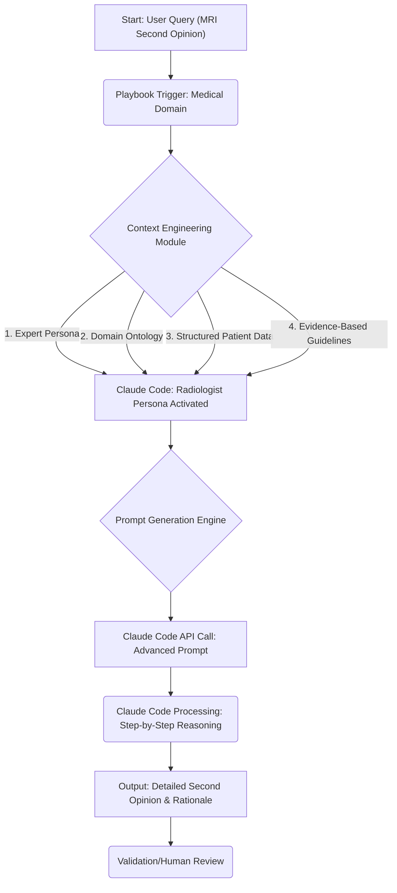

## Claude Code: 복잡한 도메인 지식을 위한 고급 맥락 엔지니어링 'Playbook' 전략

최근 Claude Code와 같은 대규모 언어 모델(LLM)이 복잡한 전문 도메인에서 놀라운 성능을 보여주고 있습니다. 특히 MRI 2차 소견 분석과 같이 고도의 전문 지식과 정밀한 추론이 요구되는 작업에서 그 잠재력이 드러나고 있습니다. 이러한 성과는 단순히 강력한 모델을 사용하는 것을 넘어, 모델에 주어진 '맥락(context)'을 어떻게 정교하게 설계하고 주입했는지에 크게 좌우됩니다. 본 엔트리에서는 Claude Code의 고난도 문제 해결 능력을 극대화하기 위한 'Playbook' 형태의 고급 맥락 엔지니어링 및 프롬프트 전략을 분석하고, 실제 적용 방안을 제시합니다.

### 맥락 엔지니어링 Playbook의 중요성

복잡한 도메인에서 LLM이 신뢰할 수 있는 결과를 도출하기 위해서는 단순한 지시를 넘어선 깊이 있는 맥락 부여가 필수적입니다. '맥락 엔지니어링 Playbook'은 특정 도메인의 특성과 문제 유형에 맞춰 LLM이 필요로 하는 정보를 체계적으로 구성하고 전달하는 일련의 전략과 패턴을 의미합니다. 이는 LLM이 도메인 전문가처럼 사고하고 추론할 수 있도록 돕는 일종의 '뇌 이식' 과정과 같습니다. MRI 분석 사례에서는 방대한 의학 지식, 영상 판독 경험, 특정 케이스에 대한 상세한 환자 정보를 Claude에게 효과적으로 전달하는 것이 핵심이었습니다.

### 프롬프트 전략: 전문가 페르소나와 구조화된 지식 통합

Claude Code에 복잡한 도메인 지식을 성공적으로 주입하기 위한 프롬프트 전략은 다음과 같은 요소를 포함합니다.

#### 1. 전문가 페르소나 정의 (Expert Persona Definition)
LLM이 특정 분야의 전문가처럼 행동하도록 명확한 역할을 부여합니다. 이는 단순히 "당신은 전문가입니다"라고 지시하는 것을 넘어, 해당 전문가의 특징, 책임, 지식 수준을 구체적으로 명시합니다.

```markdown
"You are a highly experienced, board-certified radiologist with subspecialty expertise in musculoskeletal imaging. Your task is to meticulously review the provided MRI findings and clinical history to provide an independent second opinion, adhering strictly to current medical guidelines and evidence-based practices. Focus on anatomical accuracy, subtle pathological findings, and differential diagnoses. Prioritize patient safety and diagnostic precision above all else."
```

#### 2. 도메인 온톨로지 및 핵심 개념 주입 (Domain Ontology & Key Concepts Injection)
해당 도메인의 핵심 용어, 개념, 관계를 명시적으로 제공하여 LLM의 이해도를 높입니다. 이는 일반적인 모델 학습 데이터에는 포함되어 있으나, 특정 논리 흐름이나 미묘한 뉘앙스를 강조하는 데 유용합니다.

```markdown
"Key anatomical structures of the shoulder to consider include:
- Rotator Cuff: Supraspinatus, Infraspinatus, Teres Minor, Subscapularis tendons.
- Labrum: Superior, anterior, posterior aspects.
- Bursa: Subacromial-subdeltoid bursa.
- Articular Cartilage.

Pathological terms to differentiate:
- Full-thickness tear vs. Partial-thickness tear (Grade I, II, III)
- Impingement (Subacromial, Internal)
- Tendinosis vs. Tendinitis
- Degenerative changes vs. Traumatic injury."
```

#### 3. 구조화된 데이터 및 증거 기반 지침 (Structured Data & Evidence-Based Guidelines)
환자의 MRI 보고서, 임상 기록 등 실제 데이터를 구조화된 형식으로 제공하여 LLM이 정확하게 참조하고 분석할 수 있도록 합니다. 가능하다면 관련 의학 저널, 가이드라인 등의 참조 링크나 핵심 내용을 요약하여 함께 제공합니다.

```json
{
  "patient_id": "MRN12345",
  "imaging_study": "Right Shoulder MRI without contrast",
  "date_of_study": "2026-05-20",
  "clinical_history": "45-year-old male with chronic right shoulder pain for 3 months, exacerbated by overhead activity. Initial diagnosis: Grade III partial-thickness tear of subscapularis tendon.",
  "mri_findings_original_report": "Subscapularis tendon: Apical insertion with >50% width partial-thickness tear. Evidence of tendinosis. No full-thickness tear identified. Intact supraspinatus, infraspinatus, teres minor. Minor acromial spurring. Small glenohumeral joint effusion.",
  "request_for_second_opinion": "Please provide an independent assessment, specifically focusing on the subscapularis tendon integrity and the extent of any tear. Compare with the initial diagnosis and highlight any discrepancies."
}
```

#### 4. 단계적 추론 및 자기 성찰 유도 (Step-by-Step Reasoning & Self-Correction)
CoT (Chain-of-Thought) 프롬프팅을 활용하여 LLM이 최종 결론에 도달하기까지의 사고 과정을 명확히 하도록 유도합니다. 이는 특히 복잡한 문제에서 오류를 줄이고 투명성을 높이는 데 기여합니다.

```markdown
"Think step-by-step:
1. First, re-read the original MRI findings for the subscapularis tendon.
2. Next, cross-reference these findings with the provided clinical history and standard anatomical knowledge.
3. Evaluate the term 'apical insertion' in the context of subscapularis tears.
4. Assess the described tear extent (>50% width partial-thickness) against the definition of Grade III tears.
5. Identify any ambiguities or inconsistencies in the original report.
6. Formulate your independent opinion, providing rationale for agreement or disagreement with the initial diagnosis.
7. Finally, consider potential implications for treatment recommendations."
```

### 맥락 흐름 시각화 (Context Flow Visualization)

이러한 맥락 엔지니어링 전략은 다음과 같은 흐름으로 시각화될 수 있습니다.



2026년에는 이와 같은 맥락 엔지니어링이 더욱 고도화되어, 동적으로 지식을 검색하고 통합하는 RAG(Retrieval Augmented Generation) 시스템과의 결합, 멀티모달 입력(실제 MRI 이미지 분석)과의 시너지, 그리고 LLM이 스스로 필요한 맥락을 요청하거나 구성하는 자율 에이전트 아키텍처로 발전할 것입니다.

## 트레이드오프

### 1. 정확도 및 신뢰성 향상 vs. 복잡성 및 비용 증가
*   **좋은 경우**: 고도의 전문성이 요구되는 진단, 법률 자문, 복잡한 코드 리뷰 등 미묘한 오류가 큰 결과를 초래할 수 있는 분야에서 맥락 엔지니어링은 LLM의 정확도와 신뢰성을 극적으로 향상시킵니다. 환자 안전과 같이 Critical 한 도메인에서 특히 유용합니다.
*   **나쁜 경우**: 단순 질의응답, 일반적인 정보 검색 등 높은 정확도가 요구되지 않는 작업에서는 과도한 맥락 주입이 프롬프트 길이를 늘려 불필요한 토큰 비용을 발생시키고, 프롬프트 관리의 복잡성을 증가시킵니다.

### 2. 환각 감소 vs. 맥락 편향 가능성
*   **좋은 경우**: 명확하고 상세한 맥락은 LLM이 사실과 다른 내용을 생성하는 '환각(hallucination)'을 효과적으로 줄여줍니다. 특정 데이터나 가이드라인에 기반한 답변을 유도함으로써 신뢰도를 높일 수 있습니다.
*   **나쁜 경우**: 주입된 맥락 자체가 편향되거나 불완전할 경우, LLM은 그 편향을 그대로 반영하여 잘못된 결론을 도출할 수 있습니다. 특히 의학이나 법률처럼 민감한 분야에서는 맥락 데이터의 품질과 중립성이 매우 중요합니다.

### 3. 심층적인 추론 능력 활용 vs. 높은 엔지니어링 오버헤드
*   **좋은 경우**: CoT(Chain-of-Thought)나 자기 성찰(Self-Correction)과 같은 기법과 결합하여, LLM이 문제 해결 과정을 단계적으로 보여주고 스스로 오류를 수정할 수 있도록 하여 복잡한 문제에 대한 깊이 있는 추론 능력을 최대한 활용합니다.
*   **나쁜 경우**: 이러한 고급 프롬프트 전략은 초기 설계 및 테스트에 상당한 시간과 노력이 필요합니다. 각 도메인 및 문제 유형에 맞춰 맥락을 최적화하는 과정이 반복되어 엔지니어링 오버헤드가 커질 수 있습니다.

### 4. 제어 가능성 증대 vs. 유연성 저하
*   **좋은 경우**: LLM의 답변을 특정 형식, 정보원, 추론 경로에 따라 강력하게 제어할 수 있어 예측 가능하고 안정적인 결과물을 얻을 수 있습니다. 이는 자동화된 워크플로우나 규제된 환경에서 특히 중요합니다.
*   **나쁜 경우**: 너무 엄격한 맥락과 제약은 LLM의 창의성이나 예상치 못한 통찰력을 발휘할 기회를 제한할 수 있습니다. 탐색적 분석이나 새로운 아이디어 생성이 필요한 경우에는 유연한 프롬프트가 더 적합할 수 있습니다.

## 실전 체크리스트

프로젝트에 Claude Code 고급 맥락 엔지니어링 전략을 적용하기 위한 체크리스트입니다.

- [ ] **도메인 지식 정합성 검토 완료**: 주입할 도메인 온톨로지, 핵심 용어, 가이드라인이 최신이며, 오류나 편향이 없는지 최소 3명의 전문가가 교차 검증했는가?
- [ ] **페르소나 정의의 구체성 측정**: 정의된 전문가 페르소나가 해당 분야의 실제 전문가가 수행하는 역할과 책임을 최소 5가지 이상 구체적인 행동 양식으로 명시하는가?
- [ ] **구조화된 데이터 입력 형식 표준화**: MRI 보고서, 임상 기록 등 입력 데이터가 JSON, XML 또는 특정 Markdown 형식으로 일관되게 구조화되어 LLM이 파싱하기 용이한가?
- [ ] **단계적 추론 프롬프트 적용 여부**: 최소한 하나의 CoT (Chain-of-Thought) 또는 자기 성찰(Self-Correction) 유도 프롬프트 패턴이 복잡한 문제 해결 단계에 포함되어 LLM의 사고 과정을 명확히 하는가?
- [ ] **맥락 토큰 사용량 모니터링 시스템 구축**: 각 프롬프트 호출 시 맥락 토큰 사용량을 실시간으로 모니터링하고, 특정 임계값을 초과할 경우 알림을 제공하는 시스템이 구축되어 있는가?
- [ ] **답변의 근거 제시 요구**: LLM이 모든 중요한 결론이나 진단에 대해 참조한 맥락(예: 보고서 특정 섹션, 가이드라인)을 명확히 제시하도록 프롬프트가 설계되어 있는가?
- [ ] **Human-in-the-Loop 검증 프로세스 마련**: LLM의 최종 출력물이 실제 전문가(예: 의사)에 의해 검토되고, 피드백 루프를 통해 맥락 엔지니어링 전략이 지속적으로 개선되는 워크플로우가 있는가?