## Claude Code 에이전트 영구 메모리 도입: CTX를 통한 세션 지속성 확보

AI 에이전트, 특히 Claude Code와 같은 대화형 에이전트의 효율성을 극대화하는 데 있어 세션 지속성(session persistence)은 핵심적인 요소입니다. 기존 Claude Code 환경에서는 세션이 종료될 때마다 이전 대화, 결정, 파일 참조 등 모든 맥락이 소실되어 새로운 세션마다 에이전트가 초기 상태에서 다시 학습해야 하는 비효율성이 존재했습니다. 이는 개발 및 문제 해결 과정에서 반복적인 맥락 재주입을 요구하며, 생산성을 저해하는 주된 원인이었습니다.

CTX는 이러한 문제를 해결하기 위해 설계된 강력한 도구입니다. Claude Code의 `UserPromptSubmit` 훅(hook)에 연결되어, 과거 대화 기록, 에이전트의 결정, 그리고 참조된 파일들을 다음 세션이 시작될 때 자동으로 주입함으로써 에이전트가 연속적인 맥락 속에서 작업을 수행할 수 있도록 지원합니다.

### CTX 작동 원리 및 통합

CTX는 Claude Code 세션 간의 맥락을 영구적으로 저장하고 복원하는 메커니즘을 제공합니다. 이는 에이전트가 장기적인 프로젝트나 복잡한 문제 해결 과정에서 일관된 상태를 유지하도록 돕습니다. CTX의 핵심은 과거의 상호작용 데이터를 체계적으로 관리하고, 필요할 때 이를 에이전트에게 다시 제시하는 능력에 있습니다. 이는 마치 인간이 어제의 기억을 가지고 오늘의 작업을 시작하는 것과 유사합니다.

**통합 예시: Playbook 하네스에 CTX 적용**

playbook의 Claude Code 하네스(harness)에 CTX를 통합하는 과정은 매우 직관적입니다. `pip install CTX` 명령어를 통해 CTX 라이브러리를 설치한 후, 에이전트 워크플로우 내에서 CTX가 활성화되도록 구성합니다. 일반적으로 이는 에이전트의 시작 또는 프롬프트 제출 전후에 CTX의 기능을 호출하도록 설정하는 것을 의미합니다.

```python
# playbook/claude_harness_integration.py

import os
import json
from ctx import CTXManager

class ClaudeCodeHarness:
    def __init__(self, project_id, context_dir=".ctx_memory"):
        self.project_id = project_id
        self.context_dir = context_dir
        os.makedirs(self.context_dir, exist_ok=True)
        self.ctx_manager = CTXManager(project_id=self.project_id, base_dir=self.context_dir)

    def load_initial_context(self):
        """세션 시작 시 저장된 컨텍스트를 로드합니다."""
        print(f"[CTX] Loading context for project {self.project_id}...")
        initial_prompt_injection = self.ctx_manager.get_full_context_for_prompt()
        if initial_prompt_injection:
            print(f"[CTX] Injected {len(initial_prompt_injection)} bytes of historical context.")
        return initial_prompt_injection

    def process_agent_interaction(self, user_input, agent_response, files_changed=None):
        """에이전트 상호작용 후 컨텍스트를 저장합니다."""
        print("[CTX] Storing interaction context...")
        self.ctx_manager.add_user_prompt(user_input)
        self.ctx_manager.add_agent_response(agent_response)
        if files_changed:
            for file_path, content in files_changed.items():
                self.ctx_manager.add_file_reference(file_path, content)
        self.ctx_manager.save_current_context()
        print("[CTX] Context saved.")

# 예시 사용법
if __name__ == "__main__":
    harness = ClaudeCodeHarness(project_id="my-coding-project")

    # 세션 시작 시 이전 컨텍스트 로드
    initial_context = harness.load_initial_context()
    print(f"Initial context: {initial_context}")

    # Claude Code 에이전트와 상호작용 시뮬레이션
    # 실제 Claude Code 에이전트의 UserPromptSubmit 훅에 연결될 로직
    user_prompt_1 = "Refactor the authentication module to use OAuth2."
    agent_reply_1 = "Understood. I'll propose changes to `auth.py` and `config.py`."
    files_modified_1 = {
        "auth.py": "import oauthlib; ...",
        "config.py": "OAUTH_CLIENT_ID = 'xyz'; ..."
    }
    harness.process_agent_interaction(user_prompt_1, agent_reply_1, files_modified_1)

    # 다음 세션 시작 시 (또는 동일 세션 내에서) 컨텍스트 재사용
    print("\n--- Starting a new (simulated) session ---")
    new_harness = ClaudeCodeHarness(project_id="my-coding-project") # 새 세션 가정
    next_session_context = new_harness.load_initial_context()
    print(f"Context for next session: {next_session_context}")

    user_prompt_2 = "Continue refactoring. Also, add unit tests for the new OAuth2 flow."
    agent_reply_2 = "Acknowledged. I will create `test_auth.py` and extend `auth.py`."
    files_modified_2 = {
        "test_auth.py": "import pytest; ...",
        "auth.py": "# further changes"
    }
    new_harness.process_agent_interaction(user_prompt_2, agent_reply_2, files_modified_2)
```

위 코드 예시에서 `CTXManager`는 `project_id`를 기반으로 특정 프로젝트의 컨텍스트를 관리합니다. `load_initial_context`는 이전 세션의 컨텍스트를 불러와 에이전트에 주입하고, `process_agent_interaction`은 현재 세션의 대화, 결정, 파일 변경 사항을 CTX에 저장합니다.

### CTX를 통한 컨텍스트 흐름 시각화

아래 Mermaid 다이어그램은 CTX를 사용하지 않는 경우와 사용하는 경우의 Claude Code 에이전트 컨텍스트 흐름 차이를 보여줍니다.

```mermaid
graph TD
    subgraph "Stateless Sessions"
        A[Claude Code Agent Session 1] --> B{Process Request};
        B --> C[Generate Output & Decisions];
        C -- Session Ends --> D(Context Discarded);
        D -- New Session --> E[Claude Code Agent Session 2];
        E -- No Historical Context --> F{Re-evaluate from Scratch};
    end

    subgraph "CTX Persistent Memory"
        G[Claude Code Agent Session 1] --> H{Process Request};
        H --> I[Generate Output & Decisions];
        I -- UserPromptSubmit Hook --> J[CTX Persistent Memory Store];
        J -- Session Ends --> K[Context Saved];
        K -- Session Starts --> L[Claude Code Agent Session 2];
        L -- Auto-Injects Context --> M{Leverage Historical Context};
        M --> N[Enhanced Decision-Making];
    end

    J -- Subsequent Sessions --> G;
    K -- Restores Context --> L;
```



이 다이어그램에서 볼 수 있듯이, CTX를 도입함으로써 에이전트는 세션 간의 연속성을 확보하고, 과거의 경험을 바탕으로 더욱 효율적이고 일관된 의사결정을 내릴 수 있게 됩니다. 이는 에이전트의 '기억'을 확장하여 복잡한 소프트웨어 개발 및 유지보수 작업에서 휴먼 엔지니어와의 협업 효율을 크게 향상시킬 수 있습니다.

2026년 에이전트 트렌드에서는 이러한 장기 메모리 및 지속적인 컨텍스트 관리가 AI 에이전트의 필수적인 역량으로 자리 잡고 있습니다. 특히 복잡한 코드베이스를 이해하고, 반복적인 리팩토링 및 버그 수정 작업을 수행하는 코드 에이전트에게는 과거의 작업 이력을 기억하는 것이 성능과 생산성에 직결됩니다.

## 트레이드오프

### 1. 생산성 및 효율성 증대
*   **언제 좋은가?**: 장기 프로젝트, 여러 세션에 걸친 복잡한 디버깅, 코드 리팩토링 등 에이전트가 이전 결정과 맥락을 지속적으로 참조해야 하는 작업에서 탁월한 생산성 향상을 제공합니다. 반복적인 정보 재주입 필요성이 줄어듭니다.
*   **언제 나쁜가?**: 단발성, 독립적인 질의나 간단한 코드 생성 작업에는 초기 설정 및 관리 오버헤드가 추가될 수 있어 큰 이점이 없습니다.

### 2. 일관된 에이전트 행동 및 의사결정
*   **언제 좋은가?**: 에이전트가 이전에 내린 결정이나 학습된 패턴을 일관되게 유지해야 하는 상황 (예: 코딩 스타일 가이드 준수, 특정 아키텍처 패턴 유지)에서 에이전트의 안정성과 예측 가능성을 높여줍니다.
*   **언제 나쁜가?**: 빠르게 변화하는 요구사항이나 실험적인 탐색이 중요한 경우, 과거 컨텍스트가 새로운 아이디어를 제한하거나 불필요한 제약으로 작용할 수 있습니다. 즉각적인 '잊기'가 필요한 상황에는 유연성이 떨어질 수 있습니다.

### 3. 토큰 비용 최적화
*   **언제 좋은가?**: 이전 세션의 모든 정보를 매번 프롬프트에 재주입하는 대신, CTX가 지능적으로 필요한 맥락만 관리하고 주입함으로써 장기적으로 불필요한 토큰 사용을 줄여 전체적인 LLM API 비용을 절감할 수 있습니다.
*   **언제 나쁜가?**: CTX 자체의 구현 및 유지보수 비용, 그리고 컨텍스트가 너무 비대해져서 관리 효율이 떨어질 경우, 오히려 추가적인 비용이나 성능 저하를 초래할 수 있습니다. 컨텍스트 크기 관리가 중요합니다.

### 4. 컨텍스트 오염 및 관리 복잡성
*   **언제 좋은가?**: 잘 정의된 작업 범위 내에서 컨텍스트가 유의미하게 축적될 때 에이전트의 심층적인 이해도를 높입니다.
*   **언제 나쁜가?**: 장기간 비선별적으로 컨텍스트를 축적할 경우, 불필요하거나 오래된 정보가 에이전트의 의사결정에 혼란을 주거나 '환각(hallucination)'을 유발할 수 있습니다. 컨텍스트의 유효성 검사 및 정기적인 정리가 필수적입니다.

### 5. 보안 및 데이터 민감성
*   **언제 좋은가?**: 민감하지 않은 개발 환경이나 내부 프로젝트에서 에이전트의 생산성을 높일 때 안전하게 활용될 수 있습니다.
*   **언제 나쁜가?**: 영업 비밀, 고객 개인 정보 등 고도로 민감한 데이터가 컨텍스트에 포함될 경우, 영구 메모리 저장 시 보안 취약점이 발생할 수 있습니다. CTX 스토리지에 대한 접근 제어, 암호화, 데이터 마스킹 전략이 반드시 수반되어야 합니다.

## 실전 체크리스트

CTX를 Claude Code 에이전트 워크플로우에 성공적으로 통합하고 최적화하기 위한 실전 체크리스트입니다.

- [ ] **CTX 통합 검증**: `pip install CTX` 후, Claude Code 하네스 내에서 CTX가 의도한 대로 이전 세션의 대화, 결정, 파일 참조를 정확하게 로드하고 저장하는지 테스트했습니다.
- [ ] **컨텍스트 크기 모니터링**: CTX가 저장하는 컨텍스트의 평균 및 최대 크기를 정기적으로 모니터링하여, LLM의 컨텍스트 윈도우 한계를 초과하거나 불필요하게 비대해지는 것을 방지하는 시스템을 구축했습니다.
- [ ] **컨텍스트 유효성 및 관련성 검증**: 저장된 컨텍스트가 현재 작업에 여전히 유효하고 관련성이 높은지 주기적으로 검증하는 로직 또는 수동 프로세스를 정의했습니다. (예: 특정 시간 경과 후 만료, 특정 이벤트 발생 시 초기화).
- [ ] **민감 데이터 처리 정책 수립**: CTX에 저장될 수 있는 민감 정보(예: API 키, 개인 식별 정보)에 대한 마스킹, 암호화 또는 저장 금지 정책을 수립하고 기술적으로 적용했습니다.
- [ ] **성능 벤치마킹**: CTX 도입 전후의 Claude Code 에이전트의 작업 완료 시간, 토큰 사용량, 결과 품질 등을 벤치마킹하여 실제 성능 개선 효과를 측정했습니다.
- [ ] **에러 처리 및 복구 전략**: CTX 메모리 저장 또는 로드 실패 시 에이전트가 어떻게 동작할지 (예: 폴백, 경고, 재시도)에 대한 견고한 에러 처리 및 복구 전략을 구현했습니다.
- [ ] **컨텍스트 버전 관리 및 롤백**: 중요한 개발 단계별로 CTX 컨텍스트의 스냅샷을 찍거나 버전 관리를 하여, 문제가 발생했을 때 특정 시점으로 컨텍스트를 롤백할 수 있는 기능을 고려했습니다.