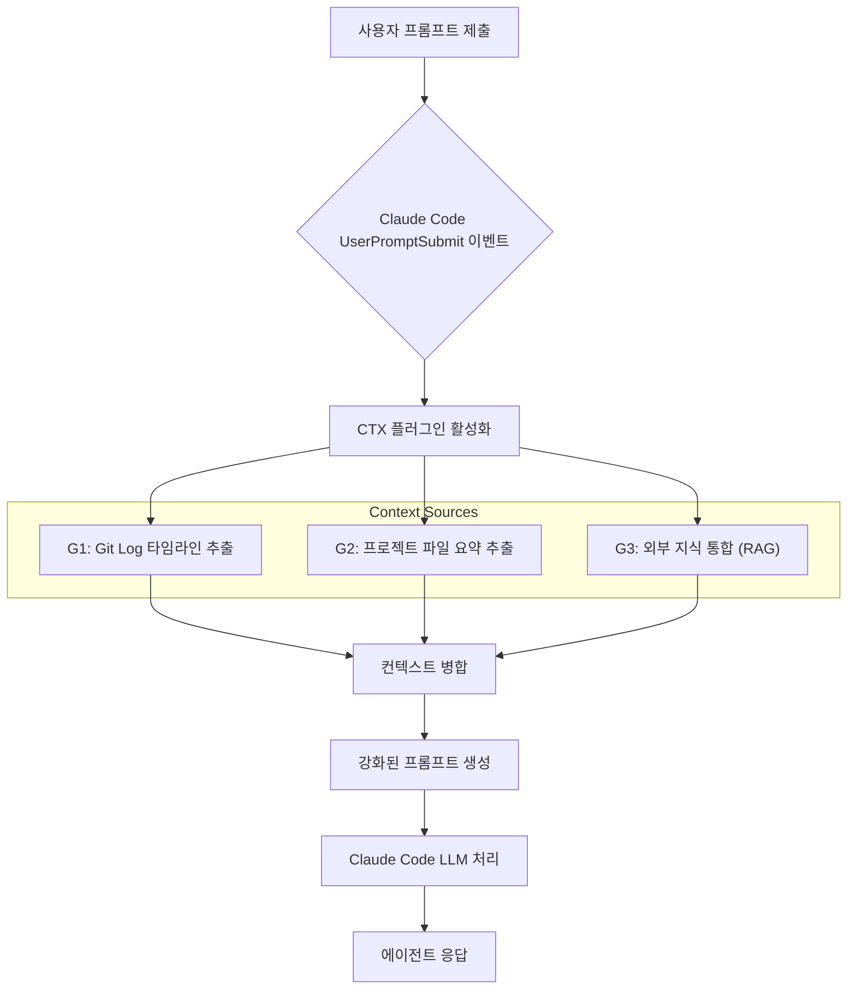

Claude Code 환경에서 LLM 에이전트의 작업 연속성은 세션 간 컨텍스트 유실 문제로 인해 제약을 받는다. 기존 LLM은 단기 기억에 의존하며, 세션이 종료되면 이전 대화 내용, 결정 과정, 학습된 지식 등을 잃어버려 비효율성을 초래한다. 이는 복잡하고 장기적인 개발 프로젝트에서 에이전트의 자율성과 생산성을 저해하는 핵심 요소이다.

## CTX 플러그인: 세션 컨텍스트 지속성 아키텍처
CTX 플러그인은 Claude Code의 `UserPromptSubmit` 훅을 활용, 세션 간 컨텍스트를 자동으로 주입하는 아키텍처를 제공한다. CTX는 1ms 이내로 다음과 같은 세 가지 주요 컨텍스트 유형을 사용자 프롬프트에 동적으로 추가한다.

1.  **G1: Git Log 기반 의사결정 타임라인**: 과거 코드 변경 이력 및 커밋 메시지를 분석하여 결정 배경을 재구성한다. 에이전트가 "왜 그 결정이 이루어졌는지"를 이해하고, 일관성 있는 의사결정을 내리는 데 필수적인 '기억' 역할을 한다.
2.  **G2: 프로젝트 특정 파일 요약**: 현재 작업 중인 프로젝트의 핵심 파일 (예: `package.json`, `README.md`, 설정 파일) 내용을 요약하여 주입한다. 에이전트가 프로젝트 구조, 의존성, 목표 등을 빠르게 파악하도록 돕는다.
3.  **G3: 외부 지식 소스 통합**: Stack Overflow, API 문서 등 외부 지식 허브에서 필요한 정보를 선별하여 주입한다. 에이전트의 지식 기반을 확장하고, 특정 문제 해결을 위한 최신 정보 접근성을 높인다.

이러한 컨텍스트 주입 메커니즘은 에이전트가 항상 최신의 관련성 높은 정보를 기반으로 작업을 수행하도록 지원하며, 특히 장기 프로젝트에서 컨텍스트 스위칭 비용을 최소화한다.

## 통합 및 동작 원리
CTX 플러그인은 `pip install ctx` 또는 `/plugin install ctx` 명령으로 Claude Code 환경에 쉽게 설치된다. 설치 후, `UserPromptSubmit` 이벤트 발생 시마다 CTX는 미리 정의된 컨텍스트 추출 로직을 실행한다. 추출된 정보는 현재 프롬프트에 병합되어 LLM으로 전송된다. 이 과정은 극히 짧은 시간 (< 1ms) 내에 완료되어 사용자 경험에 영향을 주지 않는다.

```python
# CTX 컨텍스트 주입 로직 개념 예시
import os
import subprocess

class CTXContextInjector:
    def __init__(self, project_root="."):
        self.project_root = project_root

    def _get_git_log_timeline(self, num_commits=3):
        try:
            log = subprocess.check_output(
                ["git", "log", f"-n {num_commits}", "--pretty=format:%h %s (%cd)", "--date=short"],
                cwd=self.project_root, text=True, encoding='utf-8'
            )
            return f"--- Git Log Timeline ---\n{log}\n"
        except Exception:
            return ""

    def _get_project_file_summary(self, file_paths):
        summary = ""
        for path in file_paths:
            full_path = os.path.join(self.project_root, path)
            if os.path.exists(full_path):
                try:
                    with open(full_path, 'r', encoding='utf-8') as f:
                        content = f.read(300) # Snippet
                        summary += f"File: {path}\nContent:\n```\n{content}...\n```\n"
                except Exception:
                    pass
        return f"--- Project File Summaries ---\n{summary}\n" if summary else ""

    def _get_external_knowledge(self, query="current project context"):
        # 실제는 RAG 또는 API 호출
        return f"--- External Knowledge ---\n(Relevant docs for '{query}')\n"

    def inject_context(self, user_prompt: str) -> str:
        injected = [
            self._get_git_log_timeline(),
            self._get_project_file_summary(["package.json", "README.md"]),
            self._get_external_knowledge("Python best practices")
        ]
        full_context = "".join([c for c in injected if c]) # Only add non-empty
        return f"{full_context}--- User Prompt ---\n{user_prompt}"

# Claude Code 훅에서 호출되는 방식 (가상)
# def on_user_prompt_submit_hook(user_prompt: str):
#     injector = CTXContextInjector()
#     return injector.inject_context(user_prompt)

# if __name__ == "__main__":
#     injector = CTXContextInjector()
#     test_prompt = "이 함수를 최적화해줘."
#     final_prompt = injector.inject_context(test_prompt)
#     print(final_prompt)
```

## Mermaid Diagram: CTX 컨텍스트 플로우



## 2026년 트렌드와 CTX의 중요성
2026년에는 LLM 에이전트의 자율성과 지속적인 학습 능력이 강화될 것이다. CTX 플러그인과 같은 컨텍스트 지속성 솔루션은 이 트렌드의 핵심이다. 에이전트는 과거의 작업 맥락을 기억하고, 동적으로 지식 그래프와 통합되어 실시간으로 변화하는 개발 환경에 적응한다. 이는 에이전트 간의 협업을 강화하고, 장기 프로젝트에서 일관성 있는 고품질 결과 도출에 기여한다.

## 트레이드오프

*   **컨텍스트 일관성 및 에이전트 효율성 증대**
    *   **장점**: 장기 프로젝트나 복잡한 코드 베이스에서 에이전트가 이전 작업 맥락을 잃지 않아 컨텍스트 스위칭 비용 및 반복적인 설명 요구를 줄여 생산성을 향상시킨다.
    *   **단점**: 단순 질의응답이나 단발성 작업에서는 이득이 미미하며, 불필요한 컨텍스트 주입으로 LLM 비용이 증가할 수 있다.

*   **자동화된 지식 주입 및 최신 정보 활용**
    *   **장점**: 빠르게 변화하는 기술 스택 또는 지속적인 문서 업데이트가 필요한 프로젝트에서 에이전트가 항상 최신 정보를 기반으로 작업을 수행하도록 보장한다.
    *   **단점**: 컨텍스트 주입 소스의 정보가 오래되거나 부정확할 경우 에이전트의 응답 품질을 저하시킬 수 있다. 신뢰할 수 있는 소스 관리 및 필터링 메커니즘이 필수적이다.

*   **개발 워크플로우 통합 및 간소화**
    *   **장점**: Claude Code를 주력 개발 환경으로 활용 시, 수동 컨텍스트 관리 오버헤드를 줄여 생산성 향상을 기대할 수 있다.
    *   **단점**: 기존의 복잡한 CI/CD 파이프라인이나 커스텀 에이전트 프레임워크와의 통합 시 추가적인 개발 및 테스트 노력이 필요할 수 있다.

*   **프롬프트 토큰 길이 증가 및 비용 상승**
    *   **장점**: 긴 컨텍스트가 반드시 필요한 고부가가치 작업에서, 컨텍스트 주입으로 인한 토큰 증가가 에이전트의 응답 품질 향상 및 작업 시간 단축으로 인한 총체적 이득을 상회할 때.
    *   **단점**: LLM API 호출 비용 관리가 엄격하거나, 주입 컨텍스트 양이 과도하게 많아 프롬프트 토큰 한도를 초과하거나 비용 효율성이 떨어질 때. 불필요한 정보는 LLM 추론 성능을 저하시킬 수 있다.

*   **보안 및 민감 정보 노출 위험**
    *   **장점**: 컨텍스트 주입 소스가 공개되거나 민감 정보가 포함되지 않도록 철저히 관리되는 환경에서 안전하게 활용될 수 있다.
    *   **단점**: 민감 정보나 사내 기밀이 포함된 Git Log나 프로젝트 파일이 무분별하게 LLM에 주입될 위험이 있다. 컨텍스트 필터링 및 보안 정책 적용에 대한 명확한 가이드라인과 구현이 필수적이다.

## 실전 체크리스트

CTX 플러그인 통합 및 활용 시 다음 항목들을 검토한다.

*   [ ] **컨텍스트 소스 정의**: 프로젝트의 핵심 컨텍스트 (Git Log 범위, 중요 파일 목록, 외부 지식 API 엔드포인트)를 명확하게 정의했는가?
*   [ ] **토큰 사용량 모니터링**: CTX 플러그인 활성화 전후로 LLM API 호출 당 토큰 사용량을 비교하고, 비용 효율성 측면에서 허용 가능한 범위 내에 있는지 확인했는가?
*   [ ] **성능 영향 평가**: 컨텍스트 주입으로 인해 `UserPromptSubmit` 이벤트 발생부터 LLM 응답까지의 지연 시간이 사용자 경험을 저해하지 않는 수준인지 측정했는가 (예: < 100ms)?
*   [ ] **민감 정보 필터링**: Git Log, 프로젝트 파일, 외부 지식 소스에서 민감하거나 기밀 정보가 LLM에 주입되지 않도록 적절한 필터링 및 마스킹 로직을 구현했는가?
*   [ ] **에이전트 응답 품질 검증**: CTX 통합 후 에이전트의 코드 생성, 디버깅, 질문 답변 등 핵심 작업에 대한 응답 품질이 향상되었는지 정량적/정성적으로 평가했는가?
*   [ ] **오류 처리 및 로깅**: 컨텍스트 추출 또는 주입 과정에서 발생하는 오류 (예: Git 레포지토리 접근 실패)를 적절히 처리하고 로깅하여 문제 발생 시 진단할 수 있는가?
*   [ ] **버전 관리 및 업데이트 전략**: CTX 플러그인의 업데이트 주기 및 프로젝트 환경과의 호환성을 고려한 버전 관리 및 업데이트 전략을 수립했는가?
