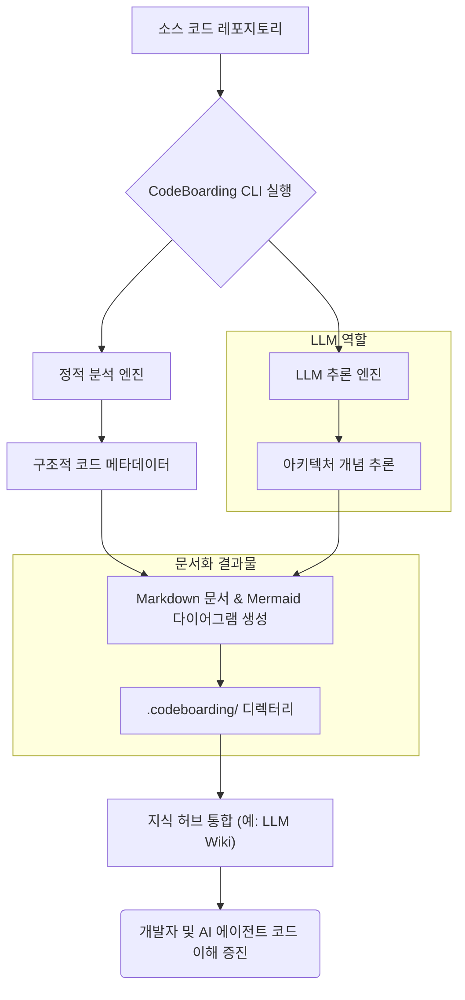

현대 소프트웨어 개발에서 코드베이스의 규모와 복잡성이 증가함에 따라, 시스템 아키텍처와 컴포넌트 간의 관계를 명확히 이해하고 문서화하는 것은 중요한 과제가 되었습니다. 특히 빠르게 변화하는 코드베이스에서는 수동 문서화가 비효율적이며, 문서와 코드 간의 불일치(Drift)가 빈번하게 발생하여 개발 생산성을 저해하는 요인이 됩니다. 이러한 문제를 해결하기 위해 CodeBoarding과 같은 자동 문서화 도구의 활용이 필수적입니다.

CodeBoarding은 정적 코드 분석(Static Code Analysis)과 대규모 언어 모델(LLM) 추론을 결합하여 코드베이스의 고수준 아키텍처 다이어그램과 주요 컴포넌트 문서를 자동으로 생성하는 오픈소스 도구입니다. 이 도구는 사람과 AI 에이전트 모두가 코드베이스를 이해하는 데 도움이 되는 인터랙티브한 '코드베이스 지도'를 제공하며, 그 결과물은 Markdown 형식으로 `.codeboarding/` 디렉터리에 저장됩니다. 이는 기존 지식 허브(예: Karpathy LLM Wiki 패턴)에 쉽게 통합될 수 있어, 팀 전체의 지식 공유 및 온보딩 효율성을 극대화합니다.

## CodeBoarding의 핵심 작동 원리

CodeBoarding의 작동 원리는 크게 두 단계로 나뉩니다.

### 1. 정적 코드 분석
CodeBoarding은 먼저 코드베이스를 심층적으로 스캔하여 파일 구조, 클래스, 함수, 모듈 간의 의존성 등을 파악합니다. 이 단계에서 얻어지는 메타데이터는 시스템의 물리적 구조를 이해하는 데 필수적인 기초 자료가 됩니다. 각 프로그래밍 언어의 AST(Abstract Syntax Tree)를 파싱하여 호출 관계, 데이터 흐름 등의 정보를 추출합니다. 이는 기존의 정적 분석 도구들이 수행하는 역할과 유사하지만, LLM 추론을 위한 구조화된 입력으로 사용된다는 점에서 차이가 있습니다.

### 2. LLM 기반 아키텍처 추론 및 문서 생성
정적 분석을 통해 수집된 정보를 바탕으로, CodeBoarding은 LLM을 활용하여 코드베이스의 추상적인 아키텍처 개념을 추론하고 이를 시각적인 다이어그램과 자연어 문서로 변환합니다. LLM은 코드 구조와 주석, 커밋 메시지 등 다양한 소스에서 얻은 문맥 정보(Context Information)를 종합하여 컴포넌트의 역할, 책임, 상호작용 방식 등을 해석합니다. 이 과정에서 CodeBoarding은 복잡한 시스템을 고수준의 개요(Overview)와 상세한 컴포넌트 수준의 설명으로 분리하여 문서화합니다. 특히, 2026년에는 LLM의 추론 능력이 더욱 고도화되어 코드의 의도(Intent)까지 정확하게 파악하고, 다이어그램 자동 생성의 품질이 더욱 향상될 것으로 기대됩니다.

## CodeBoarding 시스템 구축 예시

CodeBoarding을 활용하여 자동 문서화 시스템을 구축하는 과정은 다음과 같습니다. 먼저 CodeBoarding CLI를 설치하고, 프로젝트 루트에서 실행하면 됩니다. 결과물은 Markdown 파일과 Mermaid 다이어그램 이미지로 구성됩니다.

```bash
# CodeBoarding 설치 (예시)
pip install codeboarding # 또는 npm install -g codeboarding (가상)

# 프로젝트 루트에서 실행
codeboarding generate --repo-path ./my-project --output-dir ./.codeboarding
```

위 명령어를 실행하면 `my-project` 코드베이스를 분석하여 `.codeboarding/` 디렉터리에 아키텍처 다이어그램과 컴포넌트 설명 Markdown 파일이 생성됩니다. 이 파일들을 지식 허브(Knowledge Hub)에 연동하면, 개발자들이 항상 최신 코드베이스 문서를 확인할 수 있습니다.

### CodeBoarding 워크플로우 (Mermaid)

CodeBoarding의 전반적인 워크플로우는 다음과 같이 시각화할 수 있습니다.



## 트레이드오프

CodeBoarding과 같은 자동 문서화 시스템을 도입할 때는 다음과 같은 장단점을 고려해야 합니다.

*   **자동화된 최신성 유지**: 코드 변경 시 문서가 자동으로 업데이트되므로, 항상 최신 상태의 문서를 유지할 수 있습니다. 언제 좋고: 대규모, 빠르게 변화하는 코드베이스에서 수동 문서화의 부담을 줄일 때 좋습니다. 언제 나쁜지: 중요한 비즈니스 로직이나 디자인 결정에 대한 심도 깊은 주석이나 배경 설명이 필요한 경우, 자동 생성만으로는 충분하지 않을 수 있습니다.
*   **온보딩 및 지식 공유 효율성**: 신규 팀원의 코드베이스 이해를 돕고, 기존 팀원 간의 지식 공유를 촉진합니다. 언제 좋고: 온보딩 프로세스를 가속화하고, 팀 내 지식 격차를 줄일 때 효과적입니다. 언제 나쁜지: 복잡한 비즈니스 도메인 지식이나 특정 디자인 원칙에 대한 이해는 코드 기반 문서만으로는 한계가 있습니다.
*   **LLM Hallucination 위험**: LLM의 추론 과정에서 부정확하거나 오해의 소지가 있는 정보(Hallucination)가 생성될 가능성이 있습니다. 언제 좋고: 초기 탐색적 문서화나 내부적인 이해 증진 목적으로 사용할 때, 오류 발생 시 큰 문제가 되지 않는 경우에 유용합니다. 언제 나쁜지: 고객에게 공개되거나 법적 효력을 가지는 공식 문서에는 LLM 결과만으로는 신뢰하기 어렵습니다.
*   **초기 설정 및 커스터마이징 복잡성**: CodeBoarding 자체의 설정 및 기존 지식 허브와의 통합 과정에서 초기 노력이 필요합니다. 언제 좋고: 장기적으로 문서화 비용을 절감하고 일관된 문서 표준을 구축하려는 목표가 명확할 때 투자할 가치가 있습니다. 언제 나쁜지: 단기 프로젝트나 문서화 요구사항이 매우 단순하고 정적인 경우에는 과도한 오버헤드가 될 수 있습니다.
*   **가독성 및 상세도 조절**: 자동 생성된 문서의 가독성이나 상세도가 항상 최적이지 않을 수 있으며, 특정 요구사항에 맞춰 조절하기 어려울 수 있습니다. 언제 좋고: 코드 구조를 빠르게 파악하거나 컴포넌트 간의 일반적인 관계를 이해하는 데 좋습니다. 언제 나쁜지: 특정 API의 상세한 사용법, 성능 특성, 혹은 의도된 디자인 패턴에 대한 깊이 있는 설명이 필요할 때는 추가적인 수동 개입이 요구됩니다.

## 실전 체크리스트

CodeBoarding 기반 자동 문서화 시스템을 프로젝트에 성공적으로 적용하기 위한 체크리스트입니다.

- [ ] **CodeBoarding CI/CD 통합**: Git Push 또는 특정 스케줄에 따라 CodeBoarding이 자동 실행되어 문서가 갱신되는 워크플로우를 구축했는가?
- [ ] **생성 문서 정확도 검증**: 초기 단계에서 LLM이 생성한 아키텍처 다이어그램과 Markdown 문서의 정확성을 수동으로 검토하고, 필요한 경우 피드백 루프를 통해 LLM 프롬프트 또는 설정을 미세 조정했는가?
- [ ] **지식 허브 연동 및 접근성 확보**: 생성된 `.codeboarding/` 디렉터리 내의 Markdown 문서가 기존 지식 허브(예: Confluence, Wiki, GitBook)에 자동으로 푸시되거나 연동되어 모든 팀원이 쉽게 접근할 수 있도록 설정했는가?
- [ ] **커스터마이징 및 확장성 고려**: 특정 모듈 제외, 특정 정보 강조 등 CodeBoarding의 커스터마이징 옵션을 탐색하고, 필요시 스크립트나 플러그인을 통해 기능을 확장할 계획이 있는가?
- [ ] **성능 및 비용 모니터링**: CodeBoarding 실행에 소요되는 시간, LLM API 호출 비용 등을 모니터링하고, 대규모 코드베이스에 대한 효율적인 실행 전략(예: 증분 분석)을 수립했는가?
- [ ] **버전 관리 및 변경 이력 추적**: `.codeboarding/` 디렉터리를 코드베이스와 함께 Git으로 버전 관리하여, 문서 변경 이력을 추적하고 코드 변경과의 동기화를 유지하고 있는가?
- [ ] **개발자 피드백 채널 구축**: 자동 생성된 문서에 대한 개발자들의 피드백을 수집하고, 이를 시스템 개선에 반영할 수 있는 명확한 채널(예: 이슈 트래커)을 마련했는가?