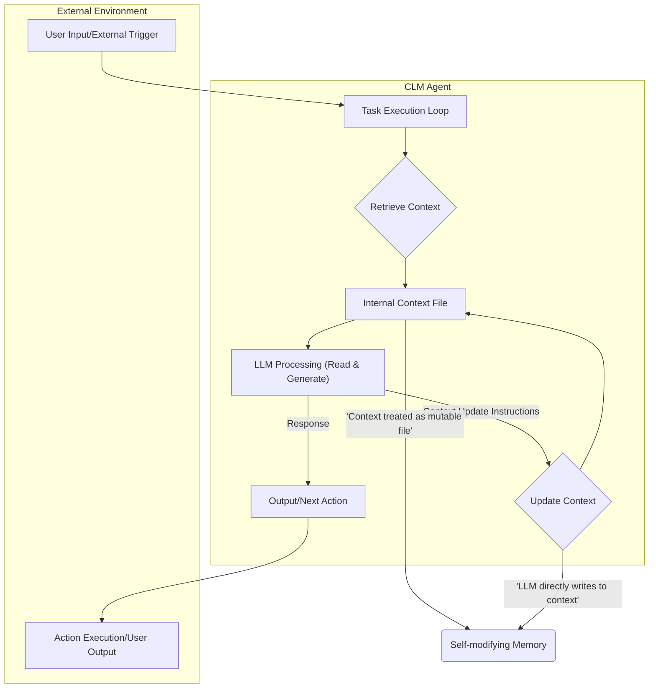

컨텍스트 언어 모델 (CLM)은 기존 LLM의 컨텍스트 관리 방식에 대한 혁신적인 접근 방식을 제시합니다. 전통적인 LLM은 외부 시스템(하네스, RAG 모듈 등)에 의해 컨텍스트가 주입되고 관리되는 수동적인 역할을 수행했습니다. 반면 CLM은 모델이 현재의 컨텍스트를 마치 파일처럼 직접 취급하고 필요에 따라 스스로 읽고, 편집하고, 갱신하는 능동적인 주체로 진화합니다. 이러한 패러다임 변화는 에이전트의 자율성과 효율성을 비약적으로 향상시킬 잠재력을 가집니다. 외부 시스템의 복잡한 관리 전략 대신 에이전트 자체가 필요한 정보를 스스로 유지하고 갱신함으로써, 더욱 유연하고 상황에 적합한 의사결정 및 행동이 가능해집니다. 이는 2026년 기준 LLM 에이전트 연구의 핵심 트렌드 중 하나로 부상하고 있습니다.

## CLM의 핵심 원리 및 작동 방식
CLM의 근간은 LLM이 자신의 '작업 기억(working memory)'이자 '장기 기억(long-term memory)'의 일부를 스스로 제어한다는 개념입니다. 이는 외부에서 제공된 컨텍스트를 단순히 소비하는 것을 넘어, 모델이 자신의 컨텍스트 상태를 내부적으로 관리하는 메커니즘을 내장한다는 의미입니다. 예를 들어, 에이전트가 특정 작업을 수행하는 과정에서 새로운 정보를 습득하거나 기존 정보가 업데이트되어야 할 때, 모델은 자체 판단에 따라 컨텍스트 파일을 직접 수정합니다. 이는 마치 소프트웨어 개발자가 코드 파일을 열어 수정하고 저장하는 과정과 유사합니다.

기존 RAG(Retrieval Augmented Generation) 방식이 외부 지식 저장소에서 관련 정보를 '검색'하여 컨텍스트에 '주입'하는 수동적인 retrieval 과정에 초점을 맞춘다면, CLM은 검색된 정보를 포함하여 에이전트의 전체 컨텍스트를 능동적으로 '편집'하고 '갱신'하는 기능을 제공합니다. 이 과정에서 모델은 단순히 새로운 정보를 추가하는 것을 넘어, 불필요한 정보를 삭제하거나, 정보를 요약, 재구성하는 등 컨텍스트의 '정리' 작업까지 수행할 수 있습니다. 이는 특히 장기적인 대화나 복잡한 프로젝트 관리와 같이 지속적으로 컨텍스트가 변화하고 진화해야 하는 시나리오에서 강력한 이점을 제공합니다.

### 에이전트 자율성 증대와 하네스 의존성 감소
playbook 내의 에이전트들이 CLM 개념을 도입한다면, 이들은 더 이상 외부 `harness`에 의해 일일이 컨텍스트가 주입되고 회수되는 방식에 얽매이지 않게 됩니다. 대신 각 에이전트는 자신만의 컨텍스트 상태를 유지하고, 작업을 수행하는 동안 이 상태를 스스로 수정하며 최신화합니다. 예를 들어, 특정 코드 베이스를 분석하는 에이전트가 새로운 취약점을 발견하면, 그 취약점 정보를 자신의 컨텍스트 파일에 기록하고, 다음 분석 단계에서 이 정보를 활용할 수 있습니다. 이는 에이전트가 더 복잡하고 장기적인 목표를 자율적으로 추구할 수 있도록 하며, 외부 제어 시스템의 부담을 줄여 전체 시스템의 확장성과 효율성을 높입니다.

## 기술 구현 및 아키텍처 패턴
CLM 구현의 핵심은 모델이 접근하고 수정할 수 있는 `mutable`한 컨텍스트 저장소를 정의하는 것입니다. 이는 파일 시스템 기반의 텍스트 파일, 특정 형식의 JSON/YAML 파일, 또는 경량화된 `in-memory` 데이터베이스 등 다양한 형태로 구현될 수 있습니다. 중요한 것은 LLM이 이 저장소에 대한 읽기(read) 및 쓰기(write) 권한을 직접 가지며, 프롬프트 엔지니어링을 통해 이러한 조작을 지시할 수 있어야 한다는 점입니다. 최근에는 `structured output`과 `function calling` 기능을 활용하여 LLM이 특정 API를 호출하듯 컨텍스트를 조작하는 방식이 선호됩니다.

```python
import json
import os

class CLMAgent:
    def __init__(self, agent_id, context_dir="./agent_contexts"):
        self.agent_id = agent_id
        self.context_path = os.path.join(context_dir, f"{agent_id}_context.json")
        os.makedirs(context_dir, exist_ok=True)
        self._initialize_context()

    def _initialize_context(self):
        if not os.path.exists(self.context_path):
            with open(self.context_path, 'w', encoding='utf-8') as f:
                json.dump({"memory": [], "current_task_state": {}}, f, indent=2)
        self.context = self._load_context_file()

    def _load_context_file(self):
        with open(self.context_path, 'r', encoding='utf-8') as f:
            return json.load(f)

    def _save_context_file(self):
        with open(self.context_path, 'w', encoding='utf-8') as f:
            json.dump(self.context, f, indent=2)

    def get_context_for_llm(self):
        # LLM에 제공할 컨텍스트를 직렬화하여 반환
        return json.dumps(self.context)

    def update_context_from_llm(self, llm_output_json):
        # LLM의 출력을 파싱하여 컨텍스트 업데이트
        try:
            update_data = json.loads(llm_output_json)
            # 예: LLM이 memory 리스트에 새 항목을 추가하도록 지시
            if "add_memory" in update_data:
                self.context["memory"].append(update_data["add_memory"])
            # 예: LLM이 current_task_state를 업데이트하도록 지시
            if "update_task_state" in update_data:
                self.context["current_task_state"].update(update_data["update_task_state"])
            # 기타 LLM이 지시하는 컨텍스트 조작 로직 추가
            self._save_context_file()
            return True
        except json.JSONDecodeError as e:
            print(f"Error decoding LLM context update: {e}")
            return False

    def perform_task_step(self, user_query):
        # 1. 현재 컨텍스트를 로드
        current_context_str = self.get_context_for_llm()
        
        # 2. LLM 호출 (가상의 LLM API 호출)
        # 이 부분에서 LLM은 current_context_str과 user_query를 받아
        # 응답과 함께 컨텍스트 업데이트 지시사항을 JSON으로 반환한다고 가정
        llm_response_and_update = self._call_llm_api(current_context_str, user_query)

        # 3. LLM의 컨텍스트 업데이트 지시사항을 반영
        if llm_response_and_update.get("context_update"):
            self.update_context_from_llm(json.dumps(llm_response_and_update["context_update"]))
        
        # 4. LLM의 최종 응답 반환
        return llm_response_and_update.get("final_response", "No response")

    def _call_llm_api(self, context_str, query):
        # 실제 LLM API 호출 로직을 모의합니다.
        # 이 예시에서는 LLM이 응답과 함께 컨텍스트 업데이트를 지시하는 JSON을 반환한다고 가정합니다.
        print(f"LLM input Context: {context_str}")
        print(f"LLM input Query: {query}")
        # 실제 LLM 호출 대신 임시 데이터를 반환합니다.
        return {
            "final_response": f"Processed query: '{query}' with current memory.",
            "context_update": {
                "add_memory": f"User asked about '{query}'.",
                "update_task_state": {"last_action": "query_processed"}
            }
        }

# 사용 예시
agent = CLMAgent("project_agent_001")
print("Initial Context:", agent.get_context_for_llm())
agent.perform_task_step("현재 프로젝트 진행 상황을 요약해줘.")
print("Updated Context:", agent.get_context_for_llm())
agent.perform_task_step("어제 발견된 버그 리포트 3건에 대해 알려줘.")
print("Final Context:", agent.get_context_for_llm())
```

Mermaid를 통한 CLM 에이전트의 컨텍스트 관리 흐름은 다음과 같습니다.



## 트레이드오프

### 1. 자율성 및 적응력 (Autonomy and Adaptability)
*   **좋은 경우**: 에이전트가 복잡하고 장기적인 작업을 수행하며, 예측 불가능한 상황에 직면했을 때 스스로 학습하고 컨텍스트를 조정해야 할 때 매우 효과적입니다. 외부 시스템의 개입 없이도 상황 변화에 유연하게 대응할 수 있습니다.
*   **나쁜 경우**: 컨텍스트의 일관성이나 특정 형식 준수가 매우 중요하며, 모델의 임의적인 컨텍스트 변경이 시스템 전체에 부정적인 영향을 줄 수 있는 엄격한 규제 환경에서는 위험 요소가 될 수 있습니다.

### 2. 구현 복잡성 및 디버깅 (Implementation Complexity and Debugging)
*   **좋은 경우**: 외부 하네스가 담당해야 할 컨텍스트 관리 로직(요약, 필터링, 검색 등)을 모델 내부로 이전함으로써, 외부 시스템의 아키텍처를 단순화할 수 있습니다.
*   **나쁜 경우**: LLM이 스스로 컨텍스트를 수정하는 과정에서 발생하는 오류(예: 환각으로 인한 잘못된 정보 기록, 중요한 정보 삭제)를 추적하고 디버깅하기가 매우 어렵습니다. 모델의 '생각'을 역추적하여 컨텍스트 변경의 근거를 파악해야 합니다.

### 3. 컨텍스트 일관성 및 무결성 (Context Consistency and Integrity)
*   **좋은 경우**: 에이전트의 관점에서 가장 관련성 높고 최신 상태의 컨텍스트를 스스로 유지하므로, 외부에 의존하는 것보다 더 밀접하게 컨텍스트의 일관성을 보장할 수 있습니다.
*   **나쁜 경우**: 모델의 '판단'에 따라 컨텍스트가 변경되므로, 의도치 않은 컨텍스트 오염이나 중요한 정보의 소실이 발생할 수 있습니다. 특히 `multi-agent` 환경에서 각 에이전트의 컨텍스트가 서로 영향을 미칠 때 일관성 유지가 더욱 어려울 수 있습니다.

### 4. 비용 및 성능 (Cost and Performance)
*   **좋은 경우**: 불필요한 컨텍스트 주입 및 검색 오버헤드를 줄이고, 모델이 자체적으로 컨텍스트를 최적화(예: 요약, 불필요한 부분 삭제)함으로써 장기적으로 `token usage` 및 관련 비용을 절감할 수 있습니다.
*   **나쁜 경우**: 컨텍스트를 읽고 쓰는 과정 자체가 추가적인 `LLM inference` 호출을 유발할 수 있으며, 이로 인해 단기적인 작업 처리 `latency`가 증가하거나, 복잡한 컨텍스트 수정 작업에서 오히려 비용이 증가할 수 있습니다.

## 실전 체크리스트

CLM을 실제 프로젝트에 적용할 때 고려해야 할 핵심 검증 항목입니다.

*   [ ] **컨텍스트 저장소의 가변성 및 영속성 설계 검증**: 에이전트가 컨텍스트를 직접 읽고 쓸 수 있는 파일 시스템(JSON, YAML) 또는 경량 데이터베이스(SQLite 등)의 구현이 확립되었는가?
*   [ ] **LLM의 컨텍스트 수정 지시 형식 정의**: LLM이 컨텍스트를 업데이트하기 위한 명확하고 `structured`된 `output format` (예: 특정 JSON 스키마를 따르는 `function call` 형식)이 설계되었는가?
*   [ ] **컨텍스트 변경 로그 및 감사 기능 구현**: 에이전트가 컨텍스트를 수정할 때마다 변경 이력을 기록하고 `timestamp`를 남기는 시스템이 마련되었는가? (디버깅 및 투명성 확보).
*   [ ] **컨텍스트 무결성 검사 로직 통합**: LLM에 의해 컨텍스트가 변경된 후, 데이터의 유효성이나 중요한 정보의 누락 여부를 자동으로 검증하는 `guardrail` 및 `validation` 로직이 있는가?
*   [ ] **에이전트별 컨텍스트 격리 및 공유 전략 수립**: `multi-agent` 시스템에서 각 에이전트의 컨텍스트가 독립적으로 유지되거나, 필요에 따라 안전하게 공유되는 명확한 정책이 정의되었는가?
*   [ ] **컨텍스트 최적화 (Compact/Summarize) 메커니즘 통합**: 모델이 스스로 컨텍스트의 크기를 관리하고, 불필요한 정보를 `compaction` 또는 `summarization`하는 전략을 적용하고 있는가?
*   [ ] **비상 복구 및 롤백 전략 마련**: LLM의 잘못된 판단으로 컨텍스트가 손상되었을 경우, 이전 유효 상태로 컨텍스트를 `rollback`할 수 있는 `snapshot` 또는 `versioning` 시스템이 준비되었는가?