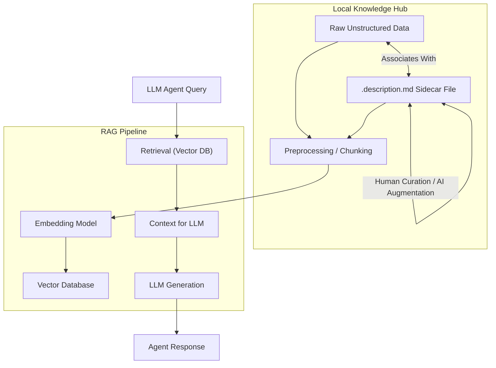

로컬 지식 허브에 저장된 비정형 데이터는 그 자체로 방대한 정보의 보고지만, 검색 불가능성과 컨텍스트 부족으로 인해 인공지능 에이전트(AI agents)가 활용하기 어렵다는 본질적인 한계를 지닌다. 비디오 클립, PDF 문서, 이미지 파일 등은 메타데이터 없이는 단순한 바이너리 blob에 불과하며, 효과적인 검색이나 LLM(Large Language Model) 기반의 질의응답 시스템에 통합하기 위해서는 추가적인 구조화된 정보가 필요하다. 이 문제를 해결하기 위한 강력한 패턴 중 하나는 `.description.md` 사이드카 파일(sidecar file)을 도입하는 것이다.

## .description.md 사이드카 파일의 필요성

원본 기사에서 언급된 바와 같이, MacBook에서 Gemma4-31B를 이용해 1년치 영상을 로컬 색인하는 사례는 비디오 아카이브의 가장 큰 병목이 '검색 불가능성'에 있음을 명확히 보여준다. 라벨 없는 비디오 클립들을 영어로 질의 가능한 인덱스로 변환하는 과정에서, 각 클립 옆에 `.description.md` 파일을 생성하여 rating, 조명, 위치, 전사(transcription), 키워드, 산문 설명 등을 포함시켰다. 이는 비정형 데이터에 의미론적(semantic) 레이어를 추가하여 데이터의 가치를 극대화하는 전략이다.

`.description.md` 사이드카 파일은 다음과 같은 핵심 기능을 제공한다:

*   **풍부한 컨텍스트 제공**: 원본 파일의 핵심 요약, 중요한 키워드, 주석, 전사 내용 등 LLM이 필요로 하는 정보를 Markdown 형태로 제공한다.
*   **인간 친화적 편집**: 일반 텍스트 파일이므로 어떤 에디터로든 쉽게 열고 편집할 수 있어, 인간의 지식을 추가하고 정제하는 데 용이하다.
*   **LLM 친화적 형식**: Markdown은 LLM이 파싱하고 이해하기에 매우 효율적인 형식이며, 구조화된 정보를 비구조화된 텍스트와 함께 효과적으로 전달할 수 있다.
*   **로컬 우선 설계**: 원본 파일과 함께 로컬 파일 시스템에 존재하여, 오프라인 환경에서도 데이터의 검색 및 활용이 가능하다.

## 아키텍처 및 워크플로

`.description.md` 사이드카 파일을 활용하는 워크플로는 `raw-sources/` 내의 비정형 데이터(예: PDF, 이미지, 비디오 링크) 옆에 해당 파일을 생성하고, 핵심 정보, 키워드, 요약 등을 추가하는 방식으로 구성된다. 이 파일들은 이후 RAG(Retrieval Augmented Generation) 파이프라인의 중요한 입력으로 사용되어 LLM이 더 정확하고 풍부한 응답을 생성할 수 있도록 돕는다.



### 구현 세부 사항

1.  **파일 명명 규칙**: `[원본 파일명].[확장자].description.md` 형식을 사용한다. 예를 들어, `report_Q3_2024.pdf`의 사이드카 파일은 `report_Q3_2024.pdf.description.md`가 된다.
2.  **콘텐츠 구조**: Markdown의 유연성을 활용하여 헤딩(`##`, `###`), 목록(`-`), 코드 블록(```) 등을 사용해 정보를 구조화한다. 일반적인 섹션은 다음과 같을 수 있다:
    *   `## Summary`: 파일의 핵심 내용 요약
    *   `## Keywords`: 주요 검색 키워드 목록
    *   `## Transcript Snippets`: 비디오/오디오 파일의 주요 전사 부분
    *   `## Contextual Notes`: 추가적인 배경 정보나 작성자의 주석
    *   `## Rating/Relevance`: 파일의 중요도나 관련성 평가
3.  **자동화 및 수동 큐레이션**: 초기 `.description.md` 파일은 LLM을 사용하여 원본 파일의 내용을 요약하거나 키워드를 추출하여 자동 생성할 수 있다. 이후 인간 전문가가 이를 검토하고 추가적인 통찰력을 더해 정제하는 하이브리드 워크플로를 구축하는 것이 효과적이다.
4.  **에이전트 소비**: AI 에이전트는 특정 파일을 처리할 때, 해당 파일과 `.description.md` 사이드카 파일을 함께 읽어 컨텍스트로 활용한다. 파일 시스템 탐색 시, `.description.md` 파일이 존재하는지 확인하고 있다면 이를 우선적으로 파싱하여 메타데이터를 추출한다.

```python
import os

def get_enriched_context(base_path, filename):
    """
    원본 파일과 .description.md 사이드카 파일에서 컨텍스트를 추출합니다.
    """
    file_path = os.path.join(base_path, filename)
    sidecar_path = file_path + ".description.md"

    content = ""
    description = ""

    if os.path.exists(file_path):
        # 실제 파일 내용을 읽는 로직 (예: 텍스트 파일, 또는 바이너리 메타데이터 추출)
        # 여기서는 단순화를 위해 파일명만 예시로 둡니다.
        content = f"[FILE: {filename}]"
        # 실제 비디오, PDF 등은 별도의 파싱/전처리 필요

    if os.path.exists(sidecar_path):
        with open(sidecar_path, 'r', encoding='utf-8') as f:
            description = f.read()

    # 원본 파일 컨텍스트와 사이드카 컨텍스트를 결합하여 반환
    return f"""
Original File Context:
{content}

Description Sidecar:
{description}
"""

# 예시 사용
base_dir = "./raw-sources"
# 가상 파일 생성 (실제 환경에서는 비디오, PDF 등이 여기에 존재)
os.makedirs(base_dir, exist_ok=True)
with open(os.path.join(base_dir, "meeting_summary.pdf"), "w") as f:
    f.write("%PDF-1.4... (dummy pdf content)")

sidecar_content = """
## Summary
2024년 7월 26일 주간 스크럼 미팅 요약. 주요 아젠다는 프로젝트 X의 진행 상황 업데이트와 다음 스프린트 계획 논의.

## Keywords
스크럼, 미팅, 프로젝트 X, 스프린트, 2024Q3, 주간 보고

## Contextual Notes
참석자: 김철수, 이영희, 박지민. 이영희가 데이터 마이그레이션 이슈 제기.
"""
with open(os.path.join(base_dir, "meeting_summary.pdf.description.md"), "w", encoding='utf-8') as f:
    f.write(sidecar_content)


enriched_output = get_enriched_context(base_dir, "meeting_summary.pdf")
# print(enriched_output) # 실제 에이전트는 이 문자열을 LLM에 컨텍스트로 전달

# 파일 정리 (예시를 위해 생성된 가상 파일 삭제)
os.remove(os.path.join(base_dir, "meeting_summary.pdf"))
os.remove(os.path.join(base_dir, "meeting_summary.pdf.description.md"))
os.rmdir(base_dir)
```

이 접근 방식은 2026년 최신 트렌드인 로컬-퍼스트(local-first) AI, 고도화된 RAG 시스템, 그리고 자율 에이전트(autonomous agents)의 지식 관리 능력 강화에 완벽하게 부합한다. 에이전트가 복잡한 태스크를 수행할 때 필요한 심층적인 컨텍스트를 효율적으로 제공하여, 환각(hallucination)을 줄이고 응답의 정확성과 신뢰도를 높일 수 있다.

## 트레이드오프

### 1. 풍부한 컨텍스트 vs. 관리 오버헤드
*   **언제 좋은가**: 고유한 지식이나 복잡한 내용을 담고 있는 고가치 비정형 데이터(예: 특정 연구 보고서, 핵심 회의록 비디오)에 대해 LLM의 이해도와 RAG 검색 정확도를 비약적으로 향상시킬 수 있다. 인간이 직접 개입하여 최적의 컨텍스트를 제공하는 것이 중요하다.
*   **언제 나쁜가**: 대량의 저가치 또는 정형화된 비정형 데이터(예: 수많은 로그 파일, 간단한 이미지)의 경우, 각 파일에 대해 `.description.md`를 생성하고 관리하는 데 드는 수동 또는 반자동 오버헤드가 컨텍스트 개선 효과보다 클 수 있다.

### 2. 유연한 구조 vs. 일관성 부족
*   **언제 좋은가**: Markdown의 자유로운 형식은 다양한 종류의 비정형 데이터에 맞춰 유연하게 메타데이터를 구조화할 수 있게 한다. 특히 초기 단계나 탐색적인 지식 큐레이션에 적합하다.
*   **언제 나쁜가**: 여러 기여자(contributors)가 명확한 가이드라인 없이 `.description.md` 파일을 작성할 경우, 내용의 일관성이 떨어져 자동화된 파싱이나 LLM의 이해를 방해할 수 있다. 구조화된 메타데이터 스키마가 필요한 대규모 시스템에는 부적합할 수 있다.

### 3. 로컬 우선 vs. 확장성 한계
*   **언제 좋은가**: 민감한 데이터 처리, 오프라인 작업 요구사항, 또는 클라우드 비용 절감이 중요한 경우, 로컬 파일 시스템에 데이터를 유지하고 처리하는 로컬 우선 원칙을 강화한다.
*   **언제 나쁜가**: 페타바이트(PB) 스케일의 데이터나 전 세계적으로 분산된 팀이 협업하는 환경에서는 로컬 파일 시스템의 한계로 인해 데이터 동기화, 버전 관리, 분산 처리 등에서 복잡성이 증대될 수 있다. 중앙 집중식의 확장 가능한 데이터 스토리지 솔루션이 더 적합할 수 있다.

### 4. 인간/AI 협업 vs. 자동화 의존도
*   **언제 좋은가**: LLM이 초안을 작성하고 인간이 이를 검토 및 보강하는 방식으로, AI의 효율성과 인간의 전문성을 결합하여 고품질의 컨텍스트를 빠르게 구축할 수 있다.
*   **언제 나쁜가**: 자동화된 생성 도구의 품질이 낮거나, 인간의 검토 주기가 길어질 경우, `.description.md` 파일 자체가 잘못된 정보나 부실한 컨텍스트를 포함하게 되어 오히려 전체 시스템의 신뢰도를 떨어뜨릴 수 있다. 과도한 수동 작업은 병목을 유발한다.

## 실전 체크리스트

이 지식 엔트리를 프로젝트에 적용할 때 다음 항목들을 검증해야 한다:

- [ ] **명명 규칙 준수 확인**: 모든 `.description.md` 파일이 `[원본_파일명].[확장자].description.md` 명명 규칙을 엄격하게 준수하는지 자동화된 스크립트로 검증한다.
- [ ] **콘텐츠 구조 표준화**: `.description.md` 파일 내부에 `## Summary`, `## Keywords` 등 핵심 섹션이 정의된 표준 템플릿을 마련하고, 파일 생성 시 이를 따르도록 가이드라인을 제공하거나 자동화 도구를 구축한다.
- [ ] **자동 생성/업데이트 워크플로 구축**: LLM 기반의 `.description.md` 초기 생성 및 주기적인 업데이트 스크립트를 개발하고, 기존 데이터 파이프라인에 통합한다.
- [ ] **RAG 파이프라인 통합 및 테스트**: LLM 에이전트가 원본 파일과 `.description.md` 파일을 함께 검색하고 컨텍스트로 활용하도록 RAG 파이프라인을 수정하고, 관련성 및 정확도 지표를 통해 효과를 측정한다.
- [ ] **큐레이션 품질 관리**: 생성된 `.description.md` 파일의 요약 품질, 키워드 정확성 등을 주기적으로 검토하는 프로세스를 확립하고, 인간 전문가의 피드백 루프를 마련한다.
- [ ] **버전 관리 적용**: `.description.md` 파일도 중요한 자산으로 간주하여 Git과 같은 버전 관리 시스템에 포함하고, 변경 이력을 추적하며 필요시 롤백할 수 있도록 한다.
- [ ] **성능 및 비용 영향 분석**: `.description.md` 파일 도입으로 인한 저장 공간, 색인 시간, LLM 추론 비용 변화를 모니터링하고, 기존 시스템의 성능 저하 없이 최적화되었는지 확인한다.