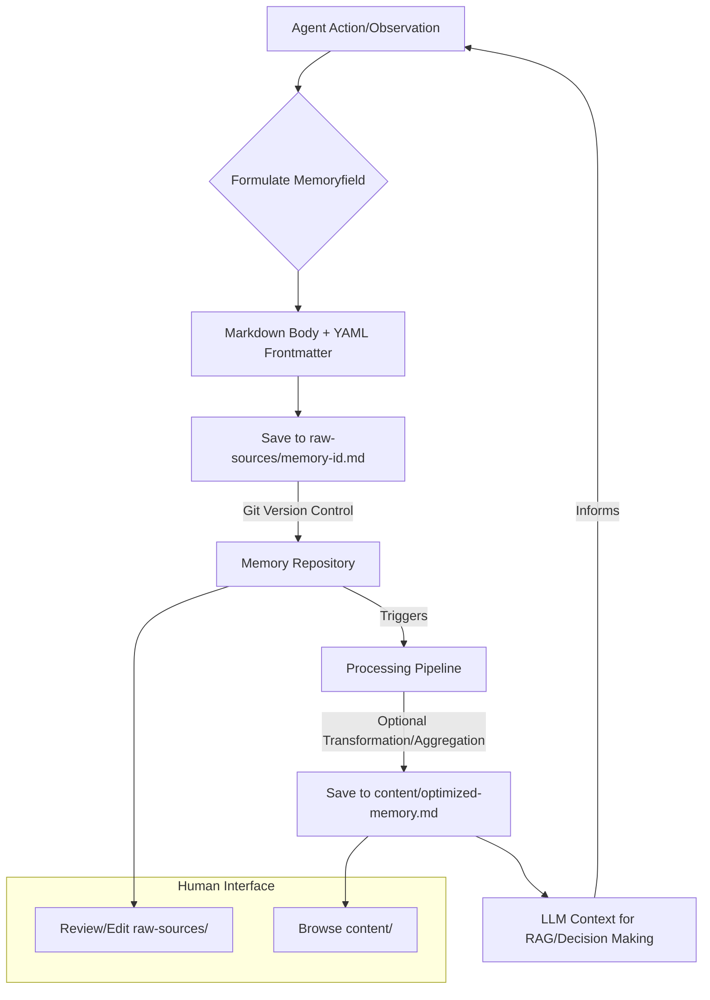

기존의 에이전트 메모리 관리 방식은 특정 하네스(harness)에 종속되거나, LLM과 데이터베이스를 복잡하게 연결한 파이프라인 형태를 띠기 쉬웠습니다. 이러한 구조는 이식성(portability)을 저해하고 시스템의 복잡성을 가중시키는 원인이 됩니다. LLM 에이전트의 진화와 함께, 메모리 관리의 패러다임 또한 단순하고 이식 가능한 데이터 형식으로 전환될 필요성이 대두되었습니다. 특히, 2026년 현재 빠르게 발전하는 에이전트 생태계에서는 유연하고 재사용 가능한 메모리 구조가 핵심 경쟁력으로 작용합니다.

## Memoryfield: 파일 기반 에이전트 메모리 구조

Memoryfield는 에이전트의 장기 및 단기 메모리를 단순한 파일 기반 형식으로 정의하는 개념입니다. 핵심은 메모리를 LLM이 직접 처리하고 이해하기 쉬운 Markdown 문서와 선택적 YAML 메타데이터의 조합으로 다루는 것입니다. 이 방식은 에이전트가 직접 작성하고 수정할 수 있는 짧은 문서 형태의 지식 조각들을 생성하며, 각 지식 조각은 독립적인 파일로 관리됩니다.

### 구조 및 구성 요소

Memoryfield의 기본 구조는 다음과 같습니다:

*   **Markdown 본문**: 에이전트의 경험, 관찰, 의사결정 과정, 학습 결과 등 실제 메모리 내용을 서술합니다. LLM이 이해하고 생성하기 가장 자연스러운 형식입니다.
*   **YAML 메타데이터**: Markdown 본문의 상단에 위치하며, 메모리의 카테고리, 태그, 생성 시각, 관련 태스크 ID, 신뢰도(confidence score) 등 구조화된 정보를 담습니다. 이는 메모리 검색, 필터링, 우선순위 부여에 활용됩니다.

이러한 구조는 LLM 에이전트가 '생각'하는 과정을 사람이 읽고 이해하기 쉽게 만들고, 동시에 LLM이 추가적인 변환 과정 없이 직접 컨텍스트로 활용할 수 있게 합니다. 이는 에이전트의 투명성(transparency)과 디버깅 용이성을 크게 향상시킵니다.

### Karpathy LLM Wiki 패턴과의 통합

Memoryfield를 Karpathy LLM Wiki 패턴에 통합하는 것은 자연스러운 확장입니다. 이 패턴은 `raw-sources/`와 `content/` 디렉토리를 활용하여 지식 베이스를 관리하며, Memoryfield는 이 구조에 직접 매핑될 수 있습니다.

*   `raw-sources/`: 에이전트가 생성한 원본 Memoryfield Markdown + YAML 파일들이 저장됩니다. 이는 에이전트의 '일기' 또는 '관찰 기록'과 같은 역할을 하며, 불변성(immutability)을 유지하거나 버전 관리를 통해 변경 이력을 추적하기 용이합니다.
*   `content/`: `raw-sources/`의 Memoryfield 파일을 기반으로 LLM의 특정 목적(예: RAG 검색, 요약, 의사결정 컨텍스트)에 최적화된 형태로 가공된 컨텐츠를 저장합니다. 예를 들어, 여러 Memoryfield를 조합하여 특정 주제에 대한 요약 문서나 코드 패턴을 생성할 수 있습니다.

이러한 분리 전략은 원본 메모리의 무결성을 유지하면서, 다양한 downstream LLM task에 맞춰 유연하게 데이터를 활용할 수 있도록 합니다. Git과 같은 버전 관리 시스템을 사용하여 Memoryfield 파일을 관리함으로써, 에이전트의 학습 및 진화 과정을 효과적으로 추적하고 롤백할 수 있습니다.

```python
import frontmatter
import os
from datetime import datetime

def create_memory_field(title: str, content: str, tags: list[str], task_id: str) -> str:
    """Memoryfield 포맷으로 Markdown 문자열을 생성합니다."""
    metadata = {
        "title": title,
        "created_at": datetime.now().isoformat(),
        "tags": tags,
        "task_id": task_id,
        "confidence": 0.8 # 예시 값
    }
    post = frontmatter.Post(content, handler=frontmatter.YAMLHandler())
    post.metadata = metadata
    return frontmatter.dumps(post)

def save_memory_field(filepath: str, memory_content: str):
    """Memoryfield 내용을 파일로 저장합니다."""
    os.makedirs(os.path.dirname(filepath), exist_ok=True)
    with open(filepath, "w", encoding="utf-8") as f:
        f.write(memory_content)

def load_memory_field(filepath: str):
    """파일에서 Memoryfield를 로드하고 메타데이터와 본문을 반환합니다."""
    with open(filepath, "r", encoding="utf-8") as f:
        post = frontmatter.load(f)
    return post.metadata, post.content

# 예시 사용법
example_content = (
    "새로운 코드베이스를 분석한 결과, 모듈 간 의존성이 높고 특정 유틸리티 함수가 여러 곳에서 중복 사용되고 있음을 발견했습니다. "
    "이를 개선하기 위해 CommonUtils 모듈을 생성하고 인터페이스를 추상화하는 리팩토링이 필요합니다. "
    "특히 `log_event`와 `fetch_config` 함수에 대한 리팩토링 우선순위가 높습니다."
)

memory_doc = create_memory_field(
    title="코드베이스 분석 및 리팩토링 필요성",
    content=example_content,
    tags=["codebase-analysis", "refactoring", "dependencies"],
    task_id="AGENT-123"
)

save_memory_field("raw-sources/analysis/codebase-refactoring-agent-123.md", memory_doc)

print("--- Saved Memoryfield ---")
print(memory_doc)

# 로드하여 확인
metadata, content = load_memory_field("raw-sources/analysis/codebase-refactoring-agent-123.md")
print("\n--- Loaded Metadata ---")
print(metadata)
print("\n--- Loaded Content ---")
print(content)
```



## 트레이드오프

### 1. 단순성 및 이식성 (Simplicity & Portability)
*   **언제 좋은가**: 에이전트 시스템을 여러 환경에 배포하거나 다른 에이전트/LLM 프레임워크와 메모리를 공유해야 할 때 매우 유리합니다. 파일 시스템만 있으면 되므로 설정 및 의존성 관리가 최소화됩니다. LLM이 직접 이해 가능한 형식이라 추가적인 파싱 계층이 필요 없어 개발 속도가 빠릅니다.
*   **언제 나쁜가**: 초당 수백/수천 건의 매우 짧은 임시 메모리를 저장해야 하는 고성능, 고빈도 시나리오에는 적합하지 않습니다. 파일 I/O 오버헤드와 파일 시스템 동기화 문제가 발생할 수 있습니다.

### 2. 버전 관리 및 감사 (Versioning & Auditing)
*   **언제 좋은가**: 에이전트의 학습 및 의사결정 과정을 추적하고, 특정 시점으로 롤백하거나, 변경 이력을 감사해야 할 때 강력한 이점을 제공합니다. Git과 같은 표준 VCS를 활용할 수 있어 개발팀과의 협업이 용이합니다.
*   **언제 나쁜가**: 바이너리 데이터나 매우 큰 파일을 메모리로 다룰 경우 Git의 효율성이 떨어질 수 있습니다. 또한, 실시간으로 메모리 충돌을 해결해야 하는 복잡한 동시성 환경에서는 Git 기반의 수동 병합이 병목이 될 수 있습니다.

### 3. 검색 및 질의 (Search & Query)
*   **언제 좋은가**: YAML 메타데이터와 Markdown 본문을 조합하여 RAG (Retrieval Augmented Generation) 시스템에서 효율적인 시맨틱 검색이 가능합니다. LLM 임베딩과 키워드 검색을 결합하여 복잡한 컨텍스트를 찾아낼 수 있습니다.
*   **언제 나쁜가**: 전통적인 관계형 데이터베이스나 NoSQL 데이터베이스에서 제공하는 강력한 구조화된 질의(SQL 등) 기능이나 인덱싱 성능을 직접적으로 제공하지 않습니다. 대규모의 정형화된 데이터셋에서 복잡한 join 연산이 필요한 경우 별도의 데이터베이스 계층이 필요할 수 있습니다.

### 4. LLM 친화성 (LLM Native Format)
*   **언제 좋은가**: LLM이 직접 Markdown과 YAML을 생성하고 파싱하도록 설계되었기 때문에, 에이전트가 자체적으로 메모리를 작성하고 수정하는 '메타 학습(meta-learning)' 및 '자기 성찰(self-reflection)' 패턴 구현에 매우 효과적입니다. LLM의 환각(hallucination)을 줄이는 데 도움이 될 수 있습니다.
*   **언제 나쁜가**: LLM이 생성하는 Markdown/YAML 형식이 항상 완벽하게 유효하지 않을 수 있습니다. 파싱 오류나 유효성 검사 문제가 발생할 수 있으며, 이를 처리하기 위한 추가적인 전처리/후처리 로직이 필요할 수 있습니다.

## 실전 체크리스트

이 파일 기반 에이전트 메모리 관리 구조를 프로젝트에 적용할 때 다음 항목들을 검증하십시오.

*   [ ] **메모리 이식성 확인**: Memoryfield 파일들을 다른 환경(예: 개발, 스테이징, 프로덕션)으로 복사했을 때, 추가적인 설정 없이 에이전트가 메모리를 정상적으로 로드하고 활용하는가?
*   [ ] **버전 관리 시스템 통합**: 모든 Memoryfield 파일이 Git과 같은 버전 관리 시스템에 의해 관리되며, 변경 이력이 명확히 추적되고 롤백이 가능한가?
*   [ ] **LLM 메모리 생성 및 파싱 유효성**: 에이전트가 생성한 Memoryfield 파일들이 YAML/Markdown 형식 표준에 부합하며, LLM이 이를 안정적으로 파싱하고 새로운 메모리를 생성할 수 있는가?
*   [ ] **검색 효율성 측정**: RAG 시스템에서 Memoryfield 기반의 검색이 필요한 컨텍스트를 얼마나 빠르고 정확하게 찾아내는가? (예: mAP, Recall@k 지표 측정)
*   [ ] **파일 I/O 성능 최적화**: 에이전트의 메모리 접근 빈도와 파일 I/O 오버헤드를 모니터링하고, 필요 시 캐싱 전략(in-memory cache)이나 비동기 I/O를 적용하여 성능 병목을 해소했는가?
*   [ ] **`raw-sources/` 및 `content/` 분리 정책**: 원본 Memoryfield와 가공된 컨텍스트 간의 명확한 분리 원칙이 정의되어 있으며, 각 디렉토리의 역할과 데이터 동기화 전략이 수립되어 있는가?
*   [ ] **메타데이터 스키마 정의 및 확장성**: YAML 메타데이터의 스키마가 명확히 정의되어 있으며, 향후 새로운 정보(예: 에이전트별 특화 메타데이터)를 유연하게 추가할 수 있도록 설계되었는가?