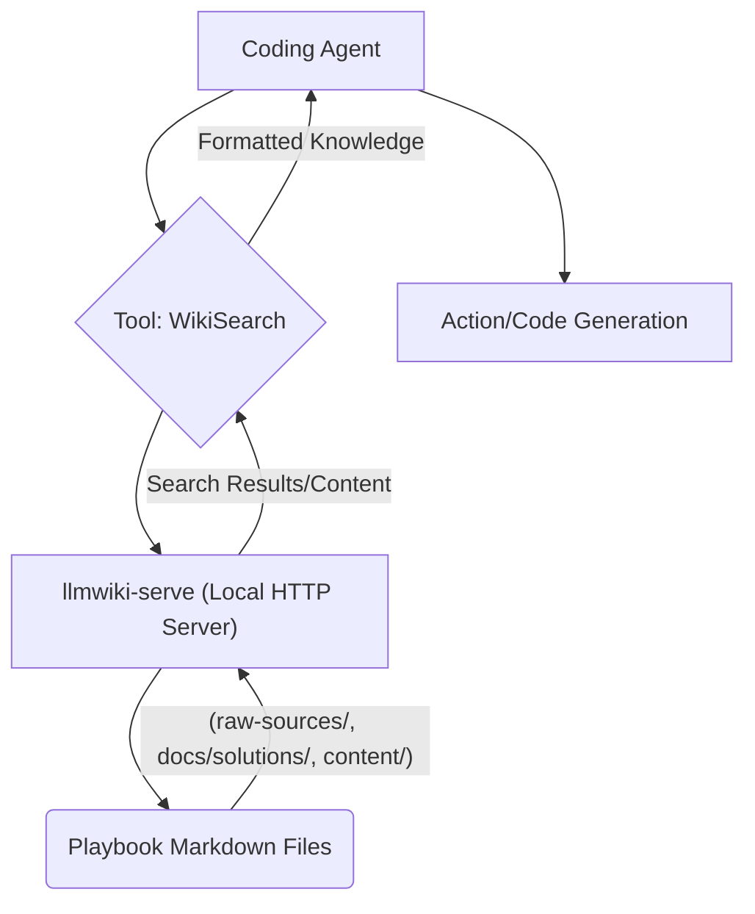

대규모 언어 모델 (LLM) 기반의 에이전트는 복잡한 태스크를 수행하는 데 탁월하지만, 최신 정보, 도메인 특화된 지식, 그리고 지속적으로 업데이트되는 내부 문서에 대한 접근성에는 한계가 있습니다. 이러한 문제는 흔히 LLM의 hallucination(환각) 현상이나 관련성 낮은 응답으로 이어지곤 합니다. Karpathy LLM Wiki 패턴은 이러한 문제를 해결하기 위한 강력한 접근 방식을 제시하며, 에이전트가 정적 마크다운 문서를 동적으로 검색하고 활용할 수 있는 지식 기반으로 전환하는 데 중점을 둡니다.

### Karpathy LLM Wiki 패턴과 llmwiki-serve의 역할
Karpathy LLM Wiki 패턴의 핵심은 LLM이 이해하기 쉬운 형태로 지식을 구조화하고 접근성을 높이는 것입니다. 이는 단순히 정보를 저장하는 것을 넘어, 에이전트가 필요할 때 정확하고 최신 정보를 즉시 찾아낼 수 있도록 합니다. `llmwiki-serve`는 이러한 패턴을 실현하는 실용적인 도구로, 로컬 마크다운 문서 컬렉션을 코딩 에이전트가 API를 통해 검색하고 읽을 수 있는 HTTP 서버로 변환합니다. 이는 에이전트에게 내부 코드베이스, 솔루션 문서, 개발 가이드 등 Playbook 내에 산재된 지식을 활용할 수 있는 강력한 '눈'을 제공합니다.

`llmwiki-serve`를 Playbook의 위키 구조(예: `raw-sources/`, `docs/solutions/`, `content/`)에 통합함으로써, 에이전트는 다음과 같은 이점을 얻습니다:

*   **정확성 향상**: 최신 내부 문서에 기반한 정보를 제공하여 LLM의 환각을 줄입니다.
*   **컨텍스트 확장**: LLM의 컨텍스트 윈도우 한계를 넘어, 필요에 따라 방대한 외부 지식을 검색하여 활용합니다.
*   **자동화된 지식 관리**: 문서를 업데이트하면 에이전트가 자동으로 최신 정보를 학습하여 반영합니다.
*   **개발 생산성 증대**: 에이전트가 직접 문서에서 정보를 찾아 문제를 해결하거나 코드 생성을 지원함으로써 개발자의 수고를 덜어줍니다.

### Playbook 내 `llmwiki-serve` 통합 전략
Playbook 내 `llmwiki-serve`를 통합하는 과정은 다음과 같은 단계를 거칩니다.

1.  **마크다운 위키 구조 분석**: Playbook 내 에이전트가 접근해야 할 핵심 마크다운 문서 디렉토리들을 식별합니다. (`raw-sources/`, `docs/solutions/`, `content/` 등)
2.  **`llmwiki-serve` 배포**: 식별된 디렉토리들을 감시(watch)하도록 `llmwiki-serve` 인스턴스를 로컬 또는 개발 환경에 배포합니다. 이는 Docker 컨테이너 또는 직접 실행 형태로 이루어질 수 있습니다.
3.  **에이전트 툴(Tool) 개발**: 에이전트가 `llmwiki-serve` API를 호출하여 문서를 검색하고 내용을 가져올 수 있는 전용 툴을 개발합니다. 이 툴은 에이전트 프레임워크(예: LangChain, CrewAI, Autogen)의 function calling 메커니즘을 통해 노출됩니다.
4.  **에이전트 워크플로우 설계**: 에이전트의 계획(planning) 단계에서 `llmwiki-serve` 검색 툴을 활용하도록 워크플로우를 설계합니다. 예를 들어, 특정 문제 해결에 필요한 정보가 부족할 때, 에이전트가 자율적으로 위키를 검색하도록 지시할 수 있습니다.
5.  **피드백 루프 구축**: 에이전트가 위키 정보를 활용하여 생성한 결과물의 품질을 평가하고, 필요한 경우 위키 문서 업데이트를 제안하거나 새로운 지식을 추가하는 메커니즘을 구축합니다. 이는 Karpathy 패턴의 핵심인 '지식 진화'를 가능하게 합니다.

#### 아키텍처 다이어그램


### 코드 예제: 에이전트용 Wiki 검색 툴 (Python)
에이전트가 `llmwiki-serve`를 통해 지식 검색을 수행하는 간단한 Python 툴의 예시입니다.

```python
import requests
import json

def search_playbook_wiki(query: str, num_results: int = 3) -> str:
    """
    Playbook의 로컬 llmwiki-serve를 사용하여 관련 Markdown 문서를 검색합니다.
    
    Args:
        query: 검색 질의 문자열입니다.
        num_results: 반환할 검색 결과의 최대 개수입니다.
    
    Returns:
        검색 결과 또는 오류 메시지를 포함하는 JSON 형식의 문자열입니다.
    """
    LLMWIKI_SERVER_URL = "http://localhost:8080" # llmwiki-serve 기본 주소
    search_endpoint = f"{LLMWIKI_SERVER_URL}/search"
    
    try:
        # 'q'와 'limit' 파라미터를 사용하여 검색 요청을 보냅니다.
        response = requests.get(search_endpoint, params={"q": query, "limit": num_results}, timeout=10)
        response.raise_for_status() # HTTP 오류 발생 시 예외 처리
        
        results = response.json()
        if results.get("status") == "success" and results.get("data"):
            formatted_results = []
            for item in results["data"]:
                # 에이전트가 소비하기 쉽도록 제목, 스니펫, 경로를 결합합니다.
                formatted_results.append(
                    f"Title: {item.get('title', 'N/A')}\n" 
                    f"Snippet: {item.get('snippet', 'N/A')}\n" 
                    f"Path: {item.get('path', 'N/A')}"
                )
            return json.dumps({"status": "success", "results": "\n\n".join(formatted_results)}, ensure_ascii=False)
        else:
            return json.dumps({"status": "error", "message": results.get("message", "No data or failed search")}, ensure_ascii=False)
            
    except requests.exceptions.RequestException as e:
        return json.dumps({"status": "error", "message": f"llmwiki-serve 연결 오류: {e}"}, ensure_ascii=False)
    except json.JSONDecodeError:
        return json.dumps({"status": "error", "message": "llmwiki-serve 응답 JSON 파싱 실패."}, ensure_ascii=False)

# # 에이전트 상호작용 예시 (개념적)
# agent_query_example = "Playbook에 새로운 기능 플래그를 통합하는 방법은?"
# print(search_playbook_wiki(agent_query_example))
```

이 툴은 에이전트의 Reasoning Step에서 특정 정보를 필요로 할 때 호출될 수 있습니다. 예를 들어, 에이전트가 특정 API 사용법을 모르거나, 내부 시스템의 아키텍처를 이해해야 할 때 `search_playbook_wiki` 툴을 호출하여 관련 문서를 찾아 컨텍스트로 활용할 수 있습니다. 2026년에는 이와 같은 자동화된 지식 검색이 에이전트 기반 개발 환경의 핵심 구성 요소로 자리매김할 것입니다.

## 트레이드오프

*   **즉각적인 지식 활용 vs. 설정 복잡성**: `llmwiki-serve`를 통해 에이전트가 최신 내부 지식을 즉각적으로 활용할 수 있게 되지만, 초기 `llmwiki-serve`의 배포, 마크다운 디렉토리 설정, 에이전트 툴 통합 과정에서 일정 수준의 설정 및 개발 노력이 필요합니다. 언제 좋은가: 도메인 특화 지식이 자주 업데이트되거나 에이전트의 정확성이 핵심적인 경우. 언제 나쁜가: 간단한 태스크를 수행하는 에이전트이거나, 외부 공개 정보로 충분한 경우.
*   **로컬/내부 정보 보안 vs. 외부 서비스 의존성 감소**: `llmwiki-serve`는 로컬에서 실행되어 민감한 내부 문서를 외부에 노출하지 않고 에이전트에게 제공할 수 있습니다. 이는 외부 RAG 서비스나 클라우드 기반 LLM에 모든 정보를 전송하는 것보다 보안 이점을 가집니다. 언제 좋은가: 기업의 민감한 코드베이스나 기밀 문서에 대한 접근이 필요한 경우. 언제 나쁜가: 이미 클라우드 환경에서 모든 인프라를 운영하며 로컬 서버 유지보수 오버헤드를 줄이고 싶은 경우.
*   **문서 업데이트의 즉각적 반영 vs. 인덱싱 지연**: 마크다운 파일이 업데이트되면 `llmwiki-serve`는 이를 감지하여 인덱스를 갱신합니다. 이는 에이전트가 항상 최신 정보에 접근할 수 있도록 돕습니다. 그러나 대량의 문서가 한꺼번에 업데이트될 경우 인덱싱에 약간의 지연이 발생할 수 있습니다. 언제 좋은가: 문서의 최신성이 에이전트의 성능에 직결되는 경우. 언제 나쁜가: 문서 변경 빈도가 매우 낮거나, 실시간성이 크게 중요하지 않은 경우.
*   **유연한 마크다운 기반 vs. 비정형 데이터 처리의 한계**: `llmwiki-serve`는 마크다운 파일을 지식 소스로 활용하는 데 최적화되어 있습니다. 이는 개발 문서, 기술 블로그 등에 매우 적합합니다. 그러나 코드 파일, 이미지, 비디오, 데이터베이스 등 비정형 또는 구조화된 다른 형태의 지식 소스에 대한 직접적인 지원은 제한적입니다. 언제 좋은가: 주요 지식 소스가 마크다운 형식으로 잘 정리되어 있는 경우. 언제 나쁜가: 다양한 형식의 데이터 소스를 통합적으로 검색해야 하는 복합적인 지식 관리 시스템이 필요한 경우.

## 실전 체크리스트

*   [ ] Playbook 내 에이전트 지식 검색 대상이 될 핵심 마크다운 디렉토리 목록(`raw-sources/`, `docs/solutions/`, `content/` 등)을 식별하고 문서화했는가?
*   [ ] `llmwiki-serve` 인스턴스가 식별된 마크다운 디렉토리를 성공적으로 감시(watch)하고 검색 가능한 인덱스를 생성하도록 설정되었는가? (서비스 상태 및 로그 확인)
*   [ ] 에이전트 프레임워크에 `llmwiki-serve` API를 호출하는 전용 Wiki 검색 툴(function)이 정의되었으며, 에이전트가 이를 필요에 따라 호출할 수 있도록 프롬프트에 명시적으로 포함되었는가?
*   [ ] 에이전트가 Wiki 검색 툴을 사용하여 정보를 검색한 후, 해당 정보를 바탕으로 의미 있는 결정을 내리거나 코드를 생성하는 워크플로우를 최소 1회 이상 성공적으로 검증했는가?
*   [ ] `llmwiki-serve`의 검색 결과가 에이전트의 컨텍스트 윈도우 한계를 초과하지 않도록 `num_results` 또는 스니펫 길이 제한 등의 파라미터를 적절히 조정했는가?
*   [ ] 새로운 마크다운 문서가 추가되거나 기존 문서가 업데이트되었을 때, `llmwiki-serve`의 인덱스가 정상적으로 갱신되며 에이전트가 최신 정보를 활용할 수 있는지 주기적인 테스트를 수행하는가?
*   [ ] 에이전트가 `llmwiki-serve`를 통한 지식 검색 실패 시(예: 서버 오류, 관련 문서 없음) 적절한 Fallback 로직이나 오류 처리 메커니즘이 구현되어 있는가?