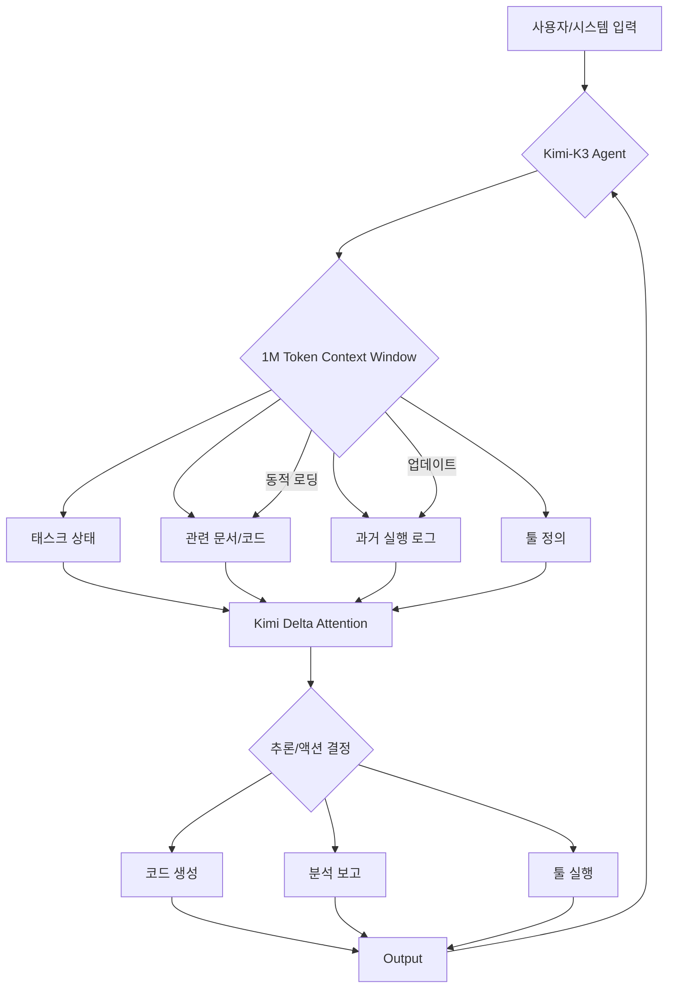

Kimi-K3 모델은 2.8조 개의 매개변수와 104만 8,576 토큰의 방대한 컨텍스트 윈도우를 갖춘 오픈 가중치 네이티브 멀티모달 에이전트 모델입니다. 이 압도적인 컨텍스트 크기는 장시간의 코딩, 복잡한 지식 작업, 다단계 추론(multi-step reasoning)에서 혁신적인 가능성을 제시하며, 기존 LLM의 컨텍스트 한계를 뛰어넘습니다. 특히 "context-engineering" 관점에서 Kimi-K3는 입력 정보의 압축, 요약, 그리고 다양한 소스 간 심층적인 연결을 통해 LLM의 지식 처리 능력을 극대화하는 새로운 패러다임을 제공합니다.

Kimi-K3는 Kimi Delta Attention(KDA), Attention Residuals, Stable LatentMoE 기술을 결합하여 거대한 컨텍스트를 효율적으로 관리합니다. 이는 모델이 수십만 토큰에 달하는 긴 문서, 코드베이스 전체, 또는 여러 개의 복잡한 데이터 스트림을 한 번에 이해할 수 있음을 의미하며, 기존 모델의 정보 손실, 단편적인 추론 문제를 해결합니다.

### Kimi-K3의 고급 지식 처리 능력

Kimi-K3의 1M 토큰 컨텍스트는 다음 영역에서 지식 처리 능력을 향상시킵니다.

*   **장문 요약 및 분석(Long-form Summarization and Analysis)**: 법률 문서, 기술 보고서 등 방대한 텍스트에서 핵심 정보를 추출하고 심층 분석합니다. 여러 청크(chunk) 처리 없이 한 번에 수행하여 컨텍스트 일관성을 유지합니다.
*   **복잡한 지식 구조 이해(Complex Knowledge Structure Understanding)**: 상호 참조가 많거나 계층적인 복잡성을 가진 문서 세트(예: 소프트웨어 아키텍처 문서, 회사 내부 위키)를 온전히 이해하고 숨겨진 관계를 파악합니다.
*   **다중 소스 간 추론(Cross-Source Reasoning)**: 여러 개의 독립적인 문서(예: Git 이슈, PR, Slack 대화, 코드 파일)를 동시에 컨텍스트에 포함하여, 이들 간의 관계를 파악하고 종합적인 결론을 도출합니다. 이는 AI 에이전트의 복잡한 개발 작업 수행에 필수적입니다.

### Context-Engineering 최적화 전략

Kimi-K3와 같은 거대 컨텍스트 모델을 활용할 때는 전략적인 "context-engineering" 접근이 필요합니다. "JIT 의미 검색(JIT Semantic Search)" 패턴과 "Karpathy LLM Wiki 패턴"에 Kimi-K3를 적용하면 다음과 같은 이점을 얻을 수 있습니다.

**1. JIT 의미 검색 효율성 극대화**

JIT 의미 검색은 필요한 시점에 관련성 높은 정보를 동적으로 검색하여 LLM 컨텍스트에 주입합니다. Kimi-K3의 넓은 컨텍스트는 검색된 정보를 더 풍부하게 담아 검색 정확도와 추론 품질을 향상시킵니다.

```python
import os
from typing import List, Dict

class KimiK3Client:
    def __init__(self, api_key: str):
        self.api_key = api_key
    def chat_completion(self, messages: List[Dict], max_tokens: int = 4096) -> str:
        context_size = sum(len(m['content'].split()) for m in messages)
        # print(f"Processing context of ~{context_size} words with Kimi-K3...")
        if context_size > 5000:
            return "Extensive context processed: Comprehensive analysis performed."
        else:
            return "Limited context: Less detailed analysis."

def perform_jit_semantic_search(query: str, documents: List[str], kimi_client: KimiK3Client) -> str:
    system_prompt = "You are an expert AI assistant tasked with synthesizing information from multiple documents."
    combined_context = "\n---\n".join(documents)
    messages = [
        {"role": "system", "content": system_prompt},
        {"role": "user", "content": f"Context:\n\n{combined_context}\n\nQuery: {query}"}
    ]
    response = kimi_client.chat_completion(messages, max_tokens=1_000_000)
    return response

# Example Usage
kimi_api_key = os.getenv("KIMI_API_KEY", "YOUR_KIMI_API_KEY")
kimi_client = KimiK3Client(kimi_api_key)
long_documents = [f"This is document number {i}. Detailed info. " * 80 for i in range(1, 40)] # Reduced docs for brevity
search_query = "Key insights on system integration challenges?"
result = perform_jit_semantic_search(search_query, long_documents, kimi_client)
# print(result)
```

**2. Karpathy LLM Wiki 패턴 적용**

Karpathy LLM Wiki 패턴은 LLM이 자체 지식을 축적, 관리하며 복잡한 작업을 수행합니다. Kimi-K3의 대규모 컨텍스트는 이러한 '자기-지식'을 방대하고 정교하게 유지하도록 지원합니다.

*   **에이전트 메모리(Agent Memory)**: 에이전트의 장기 실행 작업에서 과거 대화, 코드 변경 이력 등을 오랫동안 기억하고 활용하여 "session longevity"를 극대화합니다.
*   **지식 그래프 통합(Knowledge Graph Integration)**: 대규모 텍스트에서 직접 지식 그래프를 생성하거나 기존 그래프를 컨텍스트에 포함하여 추론하는 데 더 효과적입니다.



## 트레이드오프

Kimi-K3의 1M 토큰 컨텍스트는 강력하지만, 신중하게 고려해야 할 트레이드오프가 존재합니다.

*   **비용(Cost) vs. 품질(Quality)**
    *   **좋은 경우**: 높은 정확도와 복잡한 문제 해결이 요구될 때, 컨텍스트 크기가 품질 향상에 결정적이며, 여러 번의 API 호출 대신 한 번에 처리하여 총 비용을 절감 가능.
    *   **나쁜 경우**: 컨텍스트 의존도가 낮은 작업에 불필요하게 1M 컨텍스트를 사용하면 토큰 비용이 높아져 비효율적.
*   **지연 시간(Latency) vs. 정보 완전성(Completeness)**
    *   **좋은 경우**: 장문 요약, 전체 코드베이스 분석처럼 방대한 정보를 한 번에 처리하여 일관성 있고 완전한 결과를 얻는 것이 지연 시간보다 중요할 때.
    *   **나쁜 경우**: 실시간 응답이 필수적인 애플리케이션에서는 1M 토큰 처리 시간이 사용자 경험에 부정적 영향을 줄 수 있습니다.
*   **프롬프트 엔지니어링 복잡성(Prompt Engineering Complexity) vs. 정교한 제어(Fine-grained Control)**
    *   **좋은 경우**: 다양한 형식의 정보를 구조화하고 모델의 특정 부분에 집중 유도하여 고도의 제어를 할 때.
    *   **나쁜 경우**: 컨텍스트가 너무 많으면 "Lost in the Middle" 문제로 중요한 정보가 간과될 위험이 커지며, 효과적인 전략 없이는 성능 저하 초래.
*   **데이터 거버넌스(Data Governance) vs. 포괄적 분석(Comprehensive Analysis)**
    *   **좋은 경우**: 모든 관련 데이터를 컨텍스트에 포함하여 포괄적인 보안 분석, 감사, 규정 준수 검토를 수행할 때.
    *   **나쁜 경우**: 민감 정보(PII)나 기밀 데이터가 컨텍스트에 포함될 경우 유출 위험이 증가하므로, 철저한 마스킹 및 접근 제어 전략 필수.
*   **모델 의존성(Model Dependency) vs. 유연성(Flexibility)**
    *   **좋은 경우**: Kimi-K3와 같은 특정 모델의 독점적인 대규모 컨텍스트 기능이 작업에 필수적이고, 성능이 월등히 뛰어날 때.
    *   **나쁜 경우**: 특정 모델에 대한 의존성이 높아져, API 변경, 비용 인상, 서비스 중단 시 대체하기 어렵고 유연한 전환이 어려움.

## 실전 체크리스트

Kimi-K3의 컨텍스트-엔지니어링 능력을 프로젝트에 성공적으로 적용하기 위한 실전 체크리스트입니다.

*   [ ] **컨텍스트 길이 활용 모니터링**: 실제 워크로드에서 Kimi-K3의 1M 토큰 컨텍스트 윈도우 활용도를 정기적으로 모니터링하여 효율성을 검증한다.
*   [ ] **성능 벤치마킹 (Latency & Throughput)**: 1M 토큰 컨텍스트 처리 시 응답 지연 시간과 처리량을 벤치마킹하여 서비스 레벨 목표(SLO)에 부합하는지 확인한다.
*   [ ] **토큰 비용 최적화 전략 수립**: 필요한 정보만 컨텍스트에 포함하는 'JIT 검색' 또는 '요약' 기법을 적극 적용하여 비용 효율성을 최대화한다.
*   [ ] **지식 추출 및 추론 정확도 평가**: 장문 요약, 다중 소스 추론 등 Kimi-K3의 강점 영역에서 기존 LLM 대비 지식 추출 및 추론 정확도 향상을 정량적으로 평가한다.
*   [ ] **에이전트 장기 실행 태스크 성공률 분석**: Kimi-K3 기반 에이전트가 복잡한 장기 실행 작업에서 컨텍스트 유지 능력을 통해 태스크 성공률을 얼마나 높이는지 측정하고 개선한다.
*   [ ] **멀티모달 입력 통합 유효성 검증**: Kimi-K3의 멀티모달 기능이 비정형 데이터를 얼마나 효과적으로 통합하여 컨텍스트를 풍부하게 하는지 유스케이스별로 검증한다.
*   [ ] **프롬프트 엔지니어링 가이드라인 수립**: 대규모 컨텍스트를 효과적으로 활용하기 위한 프롬프트 구조화, 정보 우선순위 지정, "Lost in the Middle" 회피 전략 등을 포함하는 구체적인 가이드라인을 마련한다.