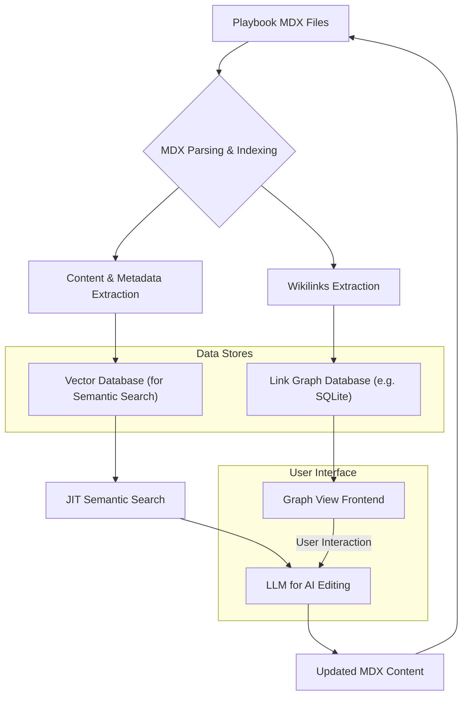

## 로컬 Markdown 지식 허브 강화: Kuku 개념의 Playbook 통합 전략

로컬 파일 시스템 기반의 지식 관리는 데이터 주권과 보안, 오프라인 접근성 측면에서 강력한 이점을 제공합니다. 최근 Kuku와 같은 '로컬 우선 Markdown 지식 작업공간' 앱은 단순한 파일 관리 그 이상을 제시하며, Wikilink, Backlink, Graph View, 그리고 AI Editing과 같은 고급 기능을 평범한 `.md` 파일 위에 구축하는 새로운 패러다임을 선보이고 있습니다. playbook의 Karpathy LLM Wiki 패턴이 이미 로컬 `.mdx` 파일을 핵심 자산으로 활용하고 있는 만큼, Kuku의 핵심 개념들을 통합하여 지식 허브 기능을 비약적으로 강화할 수 있습니다. 이는 개발자 및 연구자들이 자신의 지식을 더욱 효율적으로 탐색하고, 연결하며, AI의 도움을 받아 심화할 수 있는 강력한 환경을 제공할 것입니다.

### 핵심 개념과 Playbook 통합 방안

#### 1. 로컬 우선 Markdown 지식 관리
Kuku의 핵심은 노트의 원본이 앱 내부의 데이터베이스가 아닌, 사용자가 소유한 폴더 내의 평범한 `.md` 파일이라는 점입니다. 이는 Git과 같은 버전 관리 시스템과의 통합을 용이하게 하며, 데이터 이식성을 극대화합니다. playbook에서는 이미 `.mdx` 파일을 사용하고 있으므로, 기존 구조를 유지하면서 메타데이터 처리 방식을 확장하는 방향으로 접근합니다.

#### 2. Wikilink 및 Backlink 자동화
[[브래킷]] 구문을 사용하여 문서 간 연결을 생성하는 Wikilink는 지식 그래프를 형성하는 핵심 요소입니다. Playbook은 MDX 파싱 과정에서 이러한 Wikilink를 감지하고, 해당 링크의 유효성을 검사하여 실제 페이지로 연결되도록 변환해야 합니다. Backlink는 특정 문서로 연결되는 모든 다른 문서를 자동으로 찾아 보여주는 기능으로, 지식의 맥락을 이해하고 관련 정보를 쉽게 발견하는 데 필수적입니다.
```javascript
// Example: MDX Post Processing for Wikilinks in Playbook
import { visit } from 'unist-util-visit';
import { remark } from 'remark';
import { VFile } from 'vfile';

function customWikilinkPlugin() {
  return (tree) => {
    visit(tree, ['text', 'link'], (node) => {
      // Find [[Wikilink]] patterns in text nodes
      if (node.type === 'text') {
        const regex = /\[\[(.*?)\]\]/g;
        let match;
        const parts = [];
        let lastIndex = 0;

        while ((match = regex.exec(node.value)) !== null) {
          const fullMatch = match[0]; // [[Link Target]]
          const linkTarget = match[1]; // Link Target

          // Add preceding text as a regular text node
          if (match.index > lastIndex) {
            parts.push({ type: 'text', value: node.value.substring(lastIndex, match.index) });
          }

          // Convert wikilink to a standard link node
          // In a real implementation, you'd resolve 'linkTarget' to a slug/path
          parts.push({
            type: 'link',
            url: `/knowledge/${encodeURIComponent(linkTarget.toLowerCase().replace(/ /g, '-'))}`, // Example slug generation
            children: [{ type: 'text', value: linkTarget }],
          });
          lastIndex = regex.lastIndex;
        }

        // Add any remaining text
        if (lastIndex < node.value.length) {
          parts.push({ type: 'text', value: node.value.substring(lastIndex) });
        }

        // Replace the original text node with the new parts
        if (parts.length > 1 || (parts.length === 1 && parts[0].type !== 'text')) {
          Object.assign(node, { type: 'parent', children: parts });
        }
      }
    });
  };
}

// Usage in Next.js MDX processing:
// const mdxContent = await serialize(source, {
//   mdxOptions: {
//     remarkPlugins: [customWikilinkPlugin],
//   },
// });
```
백링크는 모든 문서를 파싱하여 현재 문서의 slug를 참조하는 [[링크]]를 찾아 역으로 연결 리스트를 생성하는 방식으로 구현됩니다.

#### 3. Graph View를 통한 지식 시각화
문서 간의 연결성을 시각적으로 표현하는 Graph View는 지식 구조를 한눈에 파악하고 숨겨진 관계를 발견하는 데 매우 유용합니다. D3.js나 Sigma.js와 같은 라이브러리를 활용하여 프론트엔드에서 인터랙티브한 그래프를 렌더링할 수 있습니다. 이는 사용자가 특정 주제와 관련된 모든 노트를 동적으로 탐색하며 새로운 인사이트를 얻도록 돕습니다.


**Figure 1: Kuku 개념이 통합된 Playbook 아키텍처 다이어그램**

#### 4. AI Editing 기능 강화 (2026 트렌드 반영)
2026년에는 AI가 단순한 텍스트 생성 도구를 넘어, 지식 작업의 코파일럿으로 진화할 것입니다. Playbook은 JIT (Just-In-Time) 의미 검색과 결합된 AI 편집 기능을 통해, 사용자가 작성 중인 Markdown 문서의 맥락을 실시간으로 이해하고 다음과 같은 작업을 수행할 수 있도록 지원해야 합니다.
*   **Contextual Expansion**: 현재 문서를 기반으로 관련 정보나 심화 내용을 자동으로 제안하여 확장.
*   **Summarization & Refinement**: 긴 문서를 요약하거나, 문맥에 맞게 표현을 다듬고 명확성을 높임.
*   **Fact-Checking & Augmentation**: 문서 내의 주장이나 데이터에 대한 보강 정보를 찾아주거나, 사실 여부를 검증.
*   **Cross-linking Suggestions**: 현재 문서와 가장 관련성이 높은 다른 문서들을 찾아 Wikilink 생성을 제안.

이러한 AI 편집은 사용자가 별도의 프롬프트를 입력할 필요 없이, 문서 작성 흐름에 자연스럽게 녹아들어 생산성을 극대화합니다. 벡터 데이터베이스에 저장된 문서 임베딩을 활용하여 현재 편집 중인 텍스트와 의미적으로 유사한 기존 지식을 실시간으로 검색하고, 이를 LLM의 컨텍스트로 주입하는 방식으로 구현됩니다.

### ## 트레이드오프

이러한 Kuku 개념 통합은 강력한 이점을 제공하지만, 몇 가지 트레이드오프를 수반합니다.

*   **성능 vs. 기능 풍부도**:
    *   **언제 좋은가**: Wikilink 파싱, 백링크 인덱싱, 그래프 데이터 구축 등은 로컬 환경에서 지식 탐색의 효율성을 극대화합니다. 복잡한 지식 구조를 가진 사용자에게는 필수적인 기능입니다.
    *   **언제 나쁜가**: 모든 MDX 파일을 실시간으로 파싱하고 인덱싱하는 과정은 초기 로딩 시간이나 파일 변경 시 리소스 오버헤드를 유발할 수 있습니다. 특히 대규모 지식 베이스의 경우 최적화되지 않으면 사용자 경험에 부정적인 영향을 미칠 수 있습니다.

*   **개발 복잡성 vs. 사용자 경험 향상**:
    *   **언제 좋은가**: AI Editing, Graph View와 같은 고급 기능은 사용자가 지식을 생성하고 소비하는 방식을 혁신적으로 개선하여, 생산성과 인사이트 도출 능력을 향상시킵니다.
    *   **언제 나쁜가**: Next.js MDX 환경에서 이러한 기능을 통합하고 유지보수하는 것은 상당한 개발 리소스와 전문성을 요구합니다. 특히 LLM 연동, 벡터 DB 관리, 복잡한 UI 컴포넌트 개발 등이 포함됩니다.

*   **데이터 주권 vs. 클라우드 협업의 용이성**:
    *   **언제 좋은가**: 로컬 우선 접근 방식은 사용자가 자신의 데이터에 대한 완전한 통제권을 가지며, 오프라인 환경에서도 작업할 수 있다는 점에서 강력한 이점을 제공합니다. 보안 및 개인 정보 보호가 중요한 환경에 적합합니다.
    *   **언제 나쁜가**: 실시간 다인 협업이나 중앙 집중식 백업 및 동기화 솔루션 통합에 어려움이 있을 수 있습니다. 클라우드 기반 솔루션에 비해 팀 단위의 협업 워크플로우를 구축하는 데 추가적인 노력이 필요할 수 있습니다.

*   **기술 종속성 vs. 확장성**:
    *   **언제 좋은가**: 최신 AI 및 프론트엔드 기술 스택(LLM, Next.js, MDX)을 적극 활용하여 고도로 기능적인 지식 허브를 구축할 수 있습니다.
    *   **언제 나쁜가**: 특정 기술 스택에 대한 의존성이 높아져, 해당 기술의 발전 방향이나 유지보수 문제에 영향을 받을 수 있습니다. 또한, 기술 스택 변경 시 마이그레이션 비용이 발생할 수 있습니다.

### ## 실전 체크리스트

Playbook에 Kuku 개념을 통합할 때 다음 사항들을 검증하고 적용해야 합니다.

- [ ] **MDX Wikilink 파서 구현 및 테스트 완료 여부**: [[링크]] 구문을 정확히 인식하고, 해당 링크를 실제 파일 경로(slug)로 변환하는 파서가 견고하게 작동하는지 검증한다.
- [ ] **백링크 인덱싱 시스템 구축 여부**: 모든 MDX 파일을 스캔하여 각 문서로 연결되는 백링크 목록을 효율적으로 생성하고 업데이트하는 메커니즘이 마련되었는지 확인한다.
- [ ] **Graph View 초기 로딩 성능 최적화**: 대규모 지식 베이스(예: 1,000개 이상의 문서)에서도 Graph View가 빠르게 로드되고 인터랙티브하게 반응하는지 측정 및 개선한다.
- [ ] **AI Editing API 연동 및 컨텍스트 관리 전략 수립**: JIT 의미 검색 결과를 LLM에 효과적으로 주입하고, LLM 응답을 문서에 반영하는 워크플로우가 안정적으로 작동하는지 확인한다.
- [ ] **사용자 경험(UX) 테스트를 통한 AI 편집 기능의 유용성 검증**: 실제 사용자들이 AI 편집 기능을 얼마나 유용하게 느끼고, 워크플로우에 얼마나 자연스럽게 통합되는지 정량적/정성적으로 평가한다.
- [ ] **지식 그래프 데이터의 지속성 및 버전 관리 전략**: 생성된 링크 그래프 데이터와 백링크 인덱스가 파일 변경 시 자동으로 업데이트되며, Git과 같은 버전 관리 시스템과 충돌 없이 작동하는지 확인한다.
- [ ] **보안 및 개인정보 보호 가이드라인 준수 여부**: 로컬 파일 시스템 접근, AI 모델과의 데이터 교환 과정에서 사용자 데이터의 보안과 개인정보 보호를 위한 모든 조치가 이루어졌는지 점검한다.