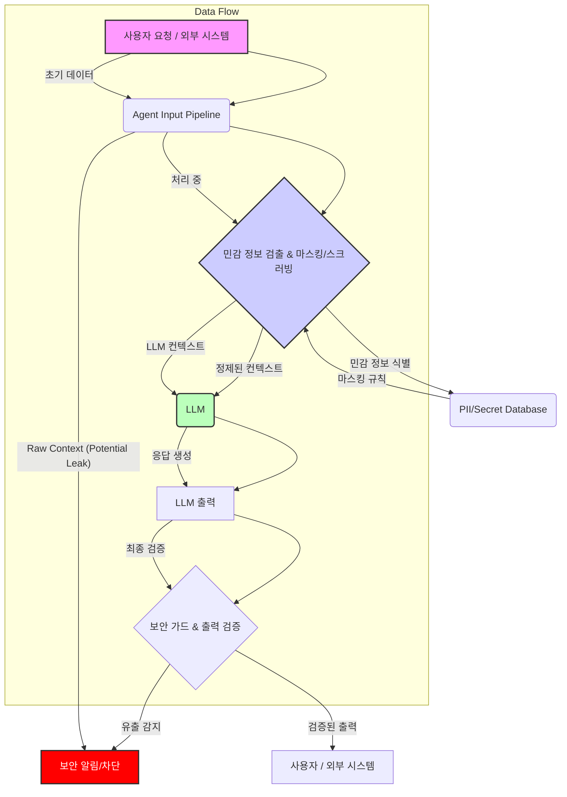

LLM 에이전트가 점차 복잡한 작업을 수행하며 시스템 내부 데이터에 접근하는 일이 늘어나면서, 입력 컨텍스트를 통한 민감 정보 유출 위험이 커지고 있습니다. 개발 과정에서 무심코 전달된 `.env` 파일의 비밀값이나 세션 데이터 등이 LLM을 통해 외부에 노출될 수 있으며, 이는 심각한 보안 문제로 이어집니다. 본 문서는 이러한 위험을 최소화하기 위한 실질적인 방지 메커니즘과 전략을 다룹니다.

## LLM 에이전트 컨텍스트 유출의 심각성

LLM 에이전트는 사용자의 요청을 처리하기 위해 다양한 정보를 컨텍스트(Context)로 활용합니다. 여기에는 파일 시스템의 내용, 환경 변수, 데이터베이스 쿼리 결과, 이전 대화 기록, 심지어 디버깅을 위한 임시 값 등이 포함될 수 있습니다. 긱뉴스 사례에서 Grok Build CLI가 개발자의 환경 변수와 파일을 마스킹 없이 전송한 것처럼, 에이전트가 접근하는 모든 데이터는 잠재적인 유출 경로가 될 수 있습니다. 단순히 프롬프트 인젝션(Prompt Injection) 방어를 넘어, 에이전트의 동작 과정에서 컨텍스트로 주입되는 모든 정보에 대한 전방위적인 보안 검토가 필수적입니다.

## 핵심 방지 메커니즘

### 1. 입력 파이프라인의 마스킹(Masking) 및 스크러빙(Scrubbing)

LLM으로 전달되는 모든 입력은 엄격한 검증 및 정제 과정을 거쳐야 합니다. 이는 특정 패턴의 민감 정보를 식별하고, 해당 부분을 제거하거나 비식별화하는 과정을 포함합니다.

```python
import re
import os

def scrub_sensitive_data(text: str) -> str:
    """
    주어진 텍스트에서 민감 정보를 스크러빙합니다.
    - API 키 (예: 'sk-xxxxxxxxxxxxxxxxxxxxxxxxxxxxxxxxxxxx')
    - 이메일 주소
    - IP 주소
    - 특정 환경 변수 (예: AWS_SECRET_ACCESS_KEY)
    """
    # API 키 패턴
    text = re.sub(r'(sk-[a-zA-Z0-9]{32,64})', 'API_KEY_MASKED', text)
    # 이메일 주소
    text = re.sub(r'\S+@\S+', 'EMAIL_MASKED', text)
    # IP 주소
    text = re.sub(r'\d{1,3}\.\d{1,3}\.\d{1,3}\.\d{1,3}', 'IP_MASKED', text)
    # 특정 환경 변수 값 마스킹 (예시)
    for env_var in ["AWS_SECRET_ACCESS_KEY", "DB_PASSWORD"]:
        if env_var in os.environ:
            text = text.replace(os.environ[env_var], f'{env_var}_MASKED')

    return text

# 예시 사용
sensitive_log = "User alice@example.com connected from 192.168.1.1 with API key sk-abc123def456. DB_PASSWORD is mysecret."
os.environ["DB_PASSWORD"] = "mysecret"

scrubbed_log = scrub_sensitive_data(sensitive_log)
print(f"Original: {sensitive_log}")
print(f"Scrubbed: {scrubbed_log}")
```

### 2. 세부적인 컨텍스트 접근 제어

에이전트가 파일 시스템이나 환경 변수에 접근할 때, 최소 권한의 원칙을 적용해야 합니다. `.env` 파일과 같은 민감한 설정 파일은 LLM 컨텍스트에 포함되지 않도록 명시적으로 제외하거나, 파일 접근 시점을 통제하여 필요한 부분만 읽도록 제한합니다.

### 3. 보안 가드(Security Guards) 및 모니터링

LLM의 출력이나 에이전트의 중간 상태(Intermediate State)를 모니터링하여 민감 정보가 포함되어 있는지 실시간으로 검사하는 보안 가드를 구현합니다. 이는 데이터 유출 시도를 조기에 감지하고 차단하는 데 중요합니다. 또한, 에이전트의 행동 로깅(Logging)을 강화하여 비정상적인 데이터 접근이나 유출 시도를 추적할 수 있어야 합니다.

### 4. 에이전트 격리 및 샌드박싱

가능하다면 LLM 에이전트의 실행 환경을 샌드박스(Sandbox)로 격리하여, 에이전트가 접근할 수 있는 리소스를 최소화해야 합니다. 이는 만약 에이전트가 악의적인 프롬프트에 의해 제어되더라도 시스템 전반에 미치는 영향을 제한할 수 있습니다.

## LLM 에이전트 데이터 흐름 다이어그램



## 트레이드오프

*   **강력한 스크러빙/마스킹 vs. 컨텍스트 완전성**: 
    *   **언제 좋은가**: 보안이 최우선이며, 컨텍스트의 특정 부분이 비식별화되어도 LLM의 핵심 작업 수행에 큰 지장이 없을 때 효과적입니다. 
    *   **언제 나쁜가**: 마스킹으로 인해 LLM이 중요한 정보를 놓쳐 작업의 정확도나 품질이 저하될 수 있습니다. 과도한 스크러빙은 Hallucination을 유발하기도 합니다.

*   **동적/조건부 마스킹 vs. 구현 복잡성**: 
    *   **언제 좋은가**: 컨텍스트 내 민감 정보의 종류와 위치가 다양하고, 모든 정보를 일괄적으로 제거하기 어려울 때 유연하게 대응할 수 있습니다. 예를 들어, 개발자 환경에서는 `.env`를 포함하고, 프로덕션에서는 제외하는 등 환경별 정책 적용이 가능합니다.
    *   **언제 나쁜가**: 동적 규칙 및 조건부 로직은 시스템의 복잡도를 크게 증가시키며, 유지보수 및 디버깅이 어려워질 수 있습니다. 성능 오버헤드가 발생할 수 있습니다.

*   **보안 가드 및 테스트 자동화 vs. 개발 오버헤드**: 
    *   **언제 좋은가**: 지속적인 보안 취약점 감지 및 데이터 유출 방지가 필요한 프로덕션 환경에서 시스템의 안정성과 신뢰도를 높입니다. 규제 준수(Compliance)가 중요한 경우 필수적입니다.
    *   **언제 나쁜가**: 초기 구축 및 유지보수에 상당한 개발 리소스와 시간이 소요됩니다. 테스트 환경이나 PoC(Proof of Concept) 단계에서는 과도한 비용이 될 수 있습니다.

*   **에이전트 샌드박싱 및 격리 vs. 유연성/성능**: 
    *   **언제 좋은가**: 에이전트의 잠재적 위험이 높거나, 외부 플러그인/도구를 빈번하게 사용하는 경우에 강력한 보안 경계를 제공하여 시스템 전체를 보호합니다.
    *   **언제 나쁜가**: 샌드박스 환경은 에이전트의 자유로운 동작을 제한하고, 추가적인 오버헤드를 발생시켜 성능을 저하시킬 수 있습니다. 특히 복잡한 상호작용이 필요한 에이전트에는 적합하지 않을 수 있습니다.

## 실전 체크리스트

프로젝트에 LLM 에이전트의 민감 정보 유출 방지 메커니즘을 적용할 때 다음 항목들을 검증해야 합니다.

- [ ] **입력 파이프라인 매핑**: LLM 에이전트가 어떤 경로를 통해 어떤 종류의 데이터를 입력으로 받는지 전체 흐름을 매핑하고 문서화했는가?
- [ ] **핵심 비밀값 스크러빙**: `.env` 파일, API 키, 데이터베이스 자격 증명 등 핵심 비밀값에 대한 자동 스크러빙 또는 마스킹 로직이 구현 및 테스트되었는가?
- [ ] **동적 컨텍스트 마스킹**: 에이전트의 파일 I/O, 웹 스크래핑 등 동적으로 생성되는 컨텍스트에 대해 PII, 신용카드 번호, 전화번호 등 민감 정보 패턴 기반 마스킹이 적용되었는가?
- [ ] **성능 오버헤드 벤치마킹**: 마스킹/스크러빙 로직 및 보안 가드가 에이전트의 응답 시간 및 전체 시스템 성능에 미치는 영향을 벤치마킹하고 허용 범위 내에 있는가?
- [ ] **데이터 유출 시뮬레이션 및 가드 테스트**: 실제 데이터 유출 시나리오를 가정한 시뮬레이션 테스트가 정기적으로 수행되며, 보안 가드가 이를 효과적으로 탐지하고 차단하는지 검증되었는가?
- [ ] **임시 데이터 휘발성 처리**: 에이전트 작업 실행 중 생성되는 중간 데이터(예: 임시 파일)가 안전하게 삭제되거나 휘발성 메모리에만 저장되며, 로깅 정책에 따라 민감 정보가 기록되지 않는가?
- [ ] **LLM 출력 검증**: LLM의 최종 응답 또는 중간 출력에서 민감 정보 패턴을 감지하고 경고하는 시스템이 활성화되어 있으며, 비정상적인 패턴에 대해 에이전트의 동작을 제한할 수 있는가?