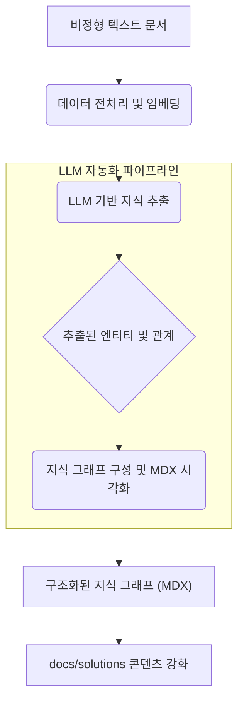

LLMs는 비정형 텍스트 데이터에서 체계적인 지식 구조와 지식 그래프를 자동 생성하는 데 혁명적인 변화를 가져왔습니다. 방대한 양의 문서, 정책, 기술 사양 등에서 핵심 정보를 추출하고, 이를 상호 연결된 지식 그래프 형태로 변환하는 과정은 기존에는 수작업에 의존하여 많은 시간과 노력이 소요되었습니다. 특히, 암묵적 지식(tacit knowledge)이 풍부한 공공행정 분야나 복잡한 기술 도메인에서 LLM 기반 지식 구조화는 전문가의 리터러시를 증진하고, 정보 접근성을 획기적으로 개선할 수 있는 잠재력을 가집니다.

이 문서는 LLM을 활용하여 `raw-sources/`와 같은 비정형 텍스트 문서를 읽고, MDX 기반의 다이어그램 및 관계도 등 체계적인 지식 구조로 변환하는 자동화 파이프라인 구축 전략을 다룹니다. 궁극적으로 `docs/solutions/`의 콘텐츠를 풍부하게 하여, 시스템 전반의 지식 접근성과 활용성을 극대화하는 것을 목표로 합니다.

## LLM 기반 지식 그래프 생성 자동화 파이프라인

지식 그래프 생성 자동화 파이프라인은 크게 세 가지 단계로 구성됩니다: 데이터 전처리 및 임베딩, LLM 기반 지식 추출, 그리고 지식 그래프 구성 및 시각화입니다. 이 파이프라인은 지속적으로 업데이트되는 비정형 데이터를 실시간으로 처리하여 최신 지식 그래프를 유지하는 데 중점을 둡니다.

### 1. 데이터 전처리 및 임베딩

원본 비정형 텍스트 문서는 LLM이 처리하기 적합한 형태로 전처리됩니다. 여기에는 텍스트 클리닝, 문장 분리, 그리고 의미론적 임베딩 생성이 포함됩니다. 임베딩은 문서 간의 의미적 유사성을 파악하여, LLM이 더 넓은 문맥을 이해하고 관련 정보를 효율적으로 검색하는 데 도움을 줍니다.

### 2. LLM 기반 지식 추출 (Entity and Relationship Extraction)

전처리된 텍스트는 LLM에 입력되어 핵심 엔티티(entities)와 그들 간의 관계(relationships)를 추출합니다. 예를 들어, 특정 법률 문서에서는 '제도', '법령', '기관' 등의 엔티티와 '관련이 있다', '수행한다', '영향을 미친다' 등의 관계가 추출될 수 있습니다. 이 과정에서 LLM은 Few-shot learning이나 Prompt Engineering 기법을 통해 특정 도메인에 최적화된 지식 추출 성능을 발휘합니다. 추출된 정보는 구조화된 형태로 (예: JSON) 저장됩니다.

### 3. 지식 그래프 구성 및 시각화 (MDX/Mermaid)

추출된 엔티티와 관계는 지식 그래프 형태로 구성됩니다. 이 지식 그래프는 MDX 문서 내에 Mermaid 다이어그램 형태로 삽입되어 시각적으로 표현될 수 있습니다. Mermaid는 텍스트 기반으로 다이어그램을 쉽게 생성할 수 있어, 지식 그래프의 자동 생성 및 업데이트에 매우 적합합니다. 각 노드와 엣지(edge)는 해당 엔티티나 관계에 대한 상세 정보로 링크될 수 있어, 심층적인 정보 탐색이 가능합니다.

```python
# Python 예제: LLM을 활용한 간단한 엔티티 및 관계 추출
import json
from openai import OpenAI # Hypothetical use, can be Gemini, Claude, etc.

def extract_knowledge(text: str, llm_client: OpenAI):
    """
    LLM을 사용하여 텍스트에서 엔티티와 관계를 추출합니다.
    """
    prompt = f"""
    다음 텍스트에서 핵심 엔티티와 그들 간의 관계를 JSON 형식으로 추출해 주세요.
    엔티티는 'name'과 'type'을 가지고, 관계는 'source', 'target', 'type'을 가집니다.
    예시:
    텍스트: "서울시는 스마트 도시 정책을 추진하며, AI 기술을 활용하여 시민 편의를 증진한다."
    결과: {{"entities": [{{"name": "서울시", "type": "기관"}}, {{"name": "스마트 도시 정책", "type": "정책"}}, {{"name": "AI 기술", "type": "기술"}}], "relationships": [{{"source": "서울시", "target": "스마트 도시 정책", "type": "추진"}}, {{"source": "스마트 도시 정책", "target": "AI 기술", "type": "활용"}}]}}

    텍스트: "{text}"
    결과:
    """
    
    response = llm_client.chat.completions.create(
        model="gpt-4o", # Replace with actual LLM model, e.g., "gemini-1.5-flash"
        messages=[
            {"role": "system", "content": "You are a highly skilled knowledge extraction AI."},
            {"role": "user", "content": prompt}
        ],
        response_format={"type": "json_object"}
    )
    
    try:
        return json.loads(response.choices[0].message.content)
    except json.JSONDecodeError:
        print("LLM 응답 파싱 실패")
        return {"entities": [], "relationships": []}

# 예시 사용
# llm_client = OpenAI(api_key="YOUR_API_KEY") # 실제 API 키로 대체
# text_data = "환경부는 2026년까지 탄소중립 사회로의 전환을 목표로 '그린 뉴딜' 정책을 시행한다. 이 정책은 재생 에너지 확대를 핵심 과제로 삼는다."
# extracted_data = extract_knowledge(text_data, llm_client)
# print(json.dumps(extracted_data, indent=2, ensure_ascii=False))

# Mermaid 다이어그램 생성 함수 (예시)
def generate_mermaid_diagram(extracted_json):
    nodes = set()
    edges = []
    
    for entity in extracted_json["entities"]:
        nodes.add(f'{entity["name"]}[{entity["name"]}]') # Node definition
    
    for rel in extracted_json["relationships"]:
        edges.append(f'{rel["source"]} -->|"{rel["type"]}"| {rel["target"]}')
        
    diagram = "graph TD\n" + "\n".join(sorted(list(nodes))) + "\n" + "\n".join(edges)
    return diagram

# mermaid_diagram_code = generate_mermaid_diagram(extracted_data)
# print(mermaid_diagram_code)
```

위 코드는 LLM을 사용하여 텍스트에서 엔티티와 관계를 추출하는 기본적인 패턴을 보여줍니다. 추출된 데이터를 기반으로 Mermaid 다이어그램을 생성하여 시각적인 지식 그래프를 구성할 수 있습니다.



## 트레이드오프

LLM 기반 지식 구조화 및 지식 그래프 생성 자동화는 강력한 도구이지만, 적용 시 여러 트레이드오프를 고려해야 합니다.

*   **정확도(Accuracy) vs. 확장성(Scalability)**
    *   **언제 좋고:** 소규모, 고품질의 지식 그래프가 필요한 경우, LLM의 정교한 프롬프트 엔지니어링과 후처리(post-processing)를 통해 높은 정확도를 달성할 수 있습니다.
    *   **언제 나쁜지:** 방대한 양의 비정형 데이터를 처리하여 대규모 지식 그래프를 빠르게 구축해야 할 때는, 높은 정확도를 유지하기 위한 비용(LLM 토큰 비용, 검증 비용)이 기하급수적으로 증가하며, 일정 수준의 오류율을 감수해야 할 수 있습니다.

*   **초기 구축 비용(Initial Setup Cost) vs. 장기 유지보수 효율성(Long-term Maintenance Efficiency)**
    *   **언제 좋고:** 도메인 전문가의 암묵지를 명시적 지식으로 전환하고, 지식 관리 시스템의 인력 의존도를 낮추려는 장기적인 관점에서는 초기 파이프라인 구축 비용이 충분히 정당화될 수 있습니다. 한 번 구축되면 지속적인 자동 업데이트를 통해 유지보수 비용을 절감합니다.
    *   **언제 나쁜지:** 단기 프로젝트나 지식의 변화 주기가 매우 빠른 도메인에서는 초기 파이프라인 구축 및 LLM 최적화에 드는 시간과 비용이 지식 그래프의 가치보다 < 3. 큽니다.

*   **자동화 수준(Automation Level) vs. 인간 개입(Human Oversight)**
    *   **언제 좋고:** 표준화된 문서 형식이나 명확한 지식 도메인에서는 LLM의 완전 자동화된 지식 추출이 높은 효율성을 제공합니다.
    *   **언제 나쁜지:** 모호하거나 논쟁의 여지가 있는 정보, 혹은 법률/규제와 같이 높은 신뢰성과 검증이 요구되는 도메인에서는 LLM 추출 결과에 대한 인간 전문가의 검토 및 개입이 필수적입니다. 완전한 자동화는 잘못된 정보의 전파로 이어질 수 있습니다.

*   **범용 LLM 사용(General-purpose LLM) vs. 도메인 특화 LLM(Domain-specific LLM)**
    *   **언제 좋고:** 다양한 도메인의 지식을 다루거나 초기 탐색 단계에서는 범용 LLM이 빠른 시작과 넓은 커버리지를 제공합니다.
    *   **언제 나쁜지:** 특정 도메인(예: 의료, 법률, 특정 기술)의 깊이 있는 전문 지식이나 미묘한 뉘앙스를 정확히 포착해야 할 때는, 해당 도메인 데이터로 파인 튜닝된 도메인 특화 LLM이 훨씬 우수한 성능을 보입니다. 범용 LLM은 때때로 도메인 지식 부족으로 인한 환각(hallucination)을 유발할 수 있습니다.

## 실전 체크리스트

LLM 기반 지식 구조화 및 지식 그래프 생성 자동화 파이프라인을 프로젝트에 적용하기 위한 실전 체크리스트입니다.

*   [ ] **원본 데이터 품질 평가 완료:** 입력될 비정형 텍스트 문서의 노이즈 수준, 일관성, 최신성을 평가하고, 필요한 전처리 전략을 수립했는가?
*   [ ] **LLM 모델 선정 및 최적화:** 도메인 특성, 비용, 성능을 고려하여 최적의 LLM(예: Gemini, Claude)을 선정하고, Few-shot 프롬프트 또는 파인 튜닝을 통해 지식 추출 정확도를 검증했는가?
*   [ ] **엔티티 및 관계 온톨로지 정의:** 프로젝트 목표에 맞는 핵심 엔티티 유형과 그들 간의 관계 유형을 명확히 정의하고, 온톨로지(ontology) 또는 스키마를 수립했는가?
*   [ ] **자동화 파이프라인 구축 및 테스트:** 데이터 수집부터 LLM 호출, 지식 추출, 지식 그래프 구성 및 MDX/Mermaid 시각화까지 전 과정이 자동화된 파이프라인으로 구현되고 엔드-투-엔드 테스트를 완료했는가?
*   [ ] **지식 그래프 업데이트 주기 및 전략 수립:** 원본 데이터의 변경 빈도를 고려하여 지식 그래프를 얼마나 자주 업데이트할지, 그리고 업데이트 과정에서 이전 지식과의 정합성 유지 전략을 수립했는가?
*   [ ] **인간 검토 및 피드백 루프 설계:** LLM 추출 결과의 오류를 탐지하고 수정하기 위한 인간 전문가의 검토 프로세스와, 이를 LLM 개선에 반영하는 피드백 루프를 설계했는가?
*   [ ] **성능 및 비용 모니터링 시스템 구축:** 파이프라인의 처리량, 지식 추출 정확도, LLM API 호출 비용 등을 지속적으로 모니터링하고 이상 징후 발생 시 알림을 받을 수 있는 시스템을 구축했는가?