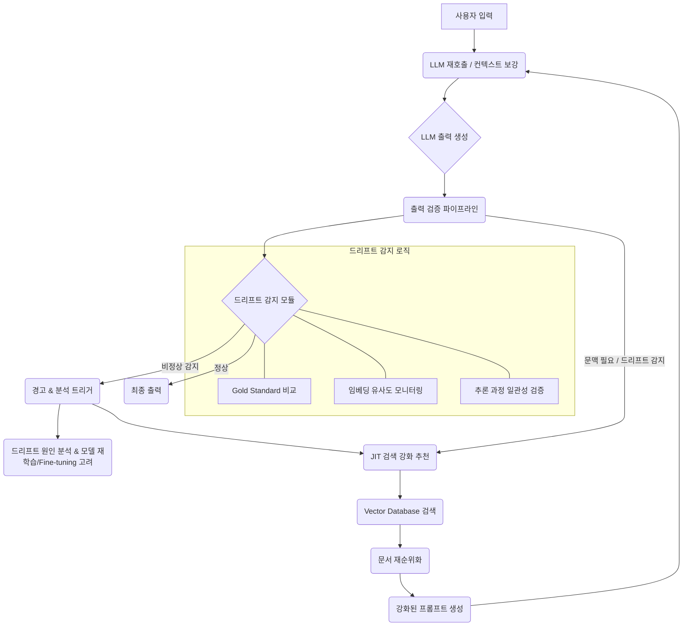

LLM이 사실 지식(factual knowledge)에 대해 "멍청해질" 가능성이 제기되면서, LLM 출력의 정확성과 신뢰성을 보장하기 위한 견고한 검증 파이프라인의 필요성이 더욱 강조되고 있습니다. 특히, 모델 드리프트(drift)를 효과적으로 감지하고, 적시 의미 검색(Just-In-Time Semantic Search)을 통해 외부 문맥을 적극적으로 활용하는 전략은 이러한 문제에 대응하는 핵심적인 접근 방식입니다.

## LLM 출력 검증 파이프라인 강화
LLM의 성능은 학습 데이터의 변화, Fine-tuning, 모델 버전 업데이트 등 다양한 요인으로 인해 시간이 지남에 따라 저하될 수 있습니다. 이러한 모델 드리프트는 특히 사실 정보 회상 능력이나 복잡한 추론 절차에서 나타나기 쉽습니다. 따라서 검증 파이프라인은 이러한 변화를 조기에 감지하고 대응할 수 있도록 설계되어야 합니다.

### 드리프트 감지 민감도 향상
드리프트 감지는 LLM 출력의 품질이 기준선(baseline)에서 벗어나는 시점을 식별하는 것을 목표로 합니다. 이를 강화하기 위한 접근 방식은 다음과 같습니다.

*   **Gold Standard Dataset 활용**: 특정 도메인에 대한 사실 정보 및 추론 절차를 검증할 수 있는 Gold Standard Dataset을 구축하고, 주기적으로 LLM의 출력을 이 데이터셋과 비교하여 정확도 하락을 측정합니다.
*   **임베딩 공간 분석 (Embedding Space Analysis)**: LLM 출력 텍스트의 임베딩을 시간에 따라 모니터링하여 임베딩 공간에서의 변화를 감지합니다. 갑작스러운 클러스터 변화나 분포의 이탈은 모델의 의미론적 일관성(semantic consistency) 저하를 나타낼 수 있습니다.
    *   예시: 기존 정상적인 출력과 새로운 출력 간의 임베딩 유사도(cosine similarity)를 측정하여 임계값 이하로 떨어질 경우 드리프트로 간주합니다.
*   **추론 과정의 투명성 확보**: 모델이 답변을 생성하는 과정(CoT: Chain-of-Thought)을 기록하고, 이 과정에서의 논리적 오류나 비일관성을 감지하는 로직을 추가합니다. 특히, 수학이나 코딩 문제와 같은 추론 중심 작업에서는 중간 단계의 정확성 검증이 중요합니다.

```python
import numpy as np
from sklearn.metrics.pairwise import cosine_similarity
from sentence_transformers import SentenceTransformer

# 사전 학습된 임베딩 모델 로드 (2026년 트렌드: 경량화된 고성능 모델 사용)
# 실제 프로덕션에서는 더 견고한 모델이나 MLOps 파이프라인 사용
model = SentenceTransformer('all-MiniLM-L6-v2') 

def detect_embedding_drift(baseline_outputs, current_outputs, threshold=0.9):
    """
    LLM 출력의 임베딩 드리프트를 감지합니다.
    baseline_outputs: 기준이 되는 LLM 출력 리스트
    current_outputs: 현재 LLM 출력 리스트
    threshold: 드리프트 감지를 위한 코사인 유사도 임계값 (0-1, 낮을수록 드리프트로 판단하기 쉬움)
    """
    if not baseline_outputs or not current_outputs:
        return False, "Insufficient data for drift detection."

    baseline_embeddings = model.encode(baseline_outputs)
    current_embeddings = model.encode(current_outputs)

    # 각 현재 출력에 대해 가장 유사한 기준 출력 찾기
    similarities = cosine_similarity(current_embeddings, baseline_embeddings)
    max_similarities = np.max(similarities, axis=1) # 각 현재 출력과 가장 유사한 기준 출력 간 유사도

    # 평균 유사도가 임계값 이하인 경우 드리프트로 판단
    avg_similarity = np.mean(max_similarities)
    
    if avg_similarity < threshold:
        return True, f"Drift detected! Average similarity: {avg_similarity:.2f} < {threshold}"
    else:
        return False, f"No significant drift. Average similarity: {avg_similarity:.2f} >= {threshold}"

# 사용 예시
# 이전 버전 모델의 출력
baseline_data = [
    "태양계에서 가장 큰 행성은 목성이다.",
    "Python은 객체 지향 프로그래밍 언어이다.",
    "워싱턴 D.C.는 미국의 수도이다."
]

# 현재 버전 모델의 출력 (약간 부정확하거나 다른 표현)
current_data_no_drift = [
    "태양계에서 가장 거대한 행성은 목성입니다.",
    "Python은 강력한 멀티패러다임 언어이다.",
    "미국의 수도는 워싱턴이다."
]

current_data_drift = [
    "태양계에서 가장 큰 행성은 화성이다.", # 사실 오류
    "Python은 함수형 프로그래밍 언어이다.", # 부정확한 설명
    "미국의 수도는 뉴욕이다." # 사실 오류
]

drift_status_no_drift, message_no_drift = detect_embedding_drift(baseline_data, current_data_no_drift, threshold=0.85)
print(f"No Drift Scenario: {message_no_drift}")

drift_status_drift, message_drift = detect_embedding_drift(baseline_data, current_data_drift, threshold=0.85)
print(f"Drift Scenario: {message_drift}")
```

## JIT 의미 검색 활용 극대화
LLM이 사실 지식에 대해 "멍청해질" 수 있다는 점은, 모델 자체의 지식보다는 외부의 신뢰할 수 있는 정보를 실시간으로 활용하는 Retrieval-Augmented Generation (RAG) 패턴의 중요성을 강조합니다. JIT 의미 검색(Just-In-Time Semantic Search)은 LLM이 답변을 생성하는 시점에 가장 관련성이 높은 최신 외부 문맥을 검색하여 프롬프트에 주입함으로써, 모델의 지식 부족이나 노후화로 인한 오류를 최소화합니다.

### 활용 전략
*   **능동적인 문맥 주입**: 사용자 쿼리 또는 LLM의 중간 추론 결과(intermediate reasoning step)를 활용하여 동적으로 관련 문서를 벡터 데이터베이스(Vector Database)에서 검색하고, 이를 LLM의 프롬프트에 포함시킵니다.
*   **프롬프트 엔지니어링 강화**: LLM에게 검색된 문맥을 *반드시 참조하여* 답변을 생성하고, 만약 검색된 문맥에서 답을 찾을 수 없다면 "정보를 찾을 수 없음"과 같이 명확히 응답하도록 지시합니다. 이는 환각(hallucination)을 줄이는 데 도움이 됩니다.
*   **검색 결과의 재순위화(Re-ranking)**: 초기 검색된 문서들의 관련성을 다시 평가하여 가장 유용한 문서들을 LLM에 전달함으로써, 프롬프트의 토큰 예산(token budget)을 효율적으로 사용하고 LLM의 정보 처리 부담을 줄입니다. (2026년 트렌드: Cross-encoder re-ranker의 활성화)

```python
from qdrant_client import QdrantClient, models

# Qdrant 클라이언트 초기화 (실제 환경에서는 서버 주소 설정 필요)
# client = QdrantClient(host="localhost", port=6333)
# 로컬 인메모리 클라이언트 사용 예시
client = QdrantClient(":memory:") 

# 임베딩 모델 (위와 동일)
# model = SentenceTransformer('all-MiniLM-L6-v2') 

collection_name = "knowledge_base"

# 지식 기반 구축 (실제 환경에서는 더 많은 문서)
documents = {
    "doc1": "목성은 태양계에서 가장 큰 행성으로, 주로 수소와 헬륨으로 이루어져 있다.",
    "doc2": "Python은 인터프리터 방식의 객체 지향, 동적 타이핑 프로그래밍 언어이다.",
    "doc3": "미국의 수도는 워싱턴 D.C.이며, 포토맥 강을 따라 위치한다."
}

# 컬렉션 생성 및 문서 임베딩 후 저장
client.recreate_collection(
    collection_name=collection_name,
    vectors_config=models.VectorParams(size=model.get_sentence_embedding_dimension(), distance=models.Distance.COSINE),
)

ids = list(documents.keys())
embeddings = model.encode(list(documents.values())).tolist()
payloads = [{"text": doc} for doc in documents.values()]

client.upsert(
    collection_name=collection_name,
    points=models.Batch(
        ids=ids,
        vectors=embeddings,
        payloads=payloads,
    ),
    wait=True,
)

def jit_semantic_search(query, top_k=3):
    """
    JIT 의미 검색을 수행하여 관련 문서를 반환합니다.
    """
    query_embedding = model.encode(query).tolist()
    
    search_result = client.search(
        collection_name=collection_name,
        query_vector=query_embedding,
        limit=top_k,
    )
    
    retrieved_docs = [hit.payload["text"] for hit in search_result]
    return retrieved_docs

def generate_augmented_prompt(original_prompt, retrieved_docs):
    """
    검색된 문서를 활용하여 LLM 프롬프트를 보강합니다.
    """
    context = "\n".join([f"문서: {doc}" for doc in retrieved_docs])
    augmented_prompt = f"""다음 정보를 참고하여 질문에 답하세요.
    ---
    {context}
    ---
    질문: {original_prompt}
    참고한 문서 내용에 근거하여 답변해 주세요. 만약 참고 문서에 충분한 정보가 없다면 '정보를 찾을 수 없습니다.'라고 답변하세요.
    """
    return augmented_prompt

# 사용 예시
user_query = "태양계에서 가장 큰 행성은 무엇이며, 무엇으로 이루어져 있나요?"
retrieved_context = jit_semantic_search(user_query)
augmented_prompt = generate_augmented_prompt(user_query, retrieved_context)

print(f"Augmented Prompt:\n{augmented_prompt}")
# 이 augmented_prompt를 LLM에 전달하여 답변을 생성합니다.
```

### 드리프트 감지 및 JIT 의미 검색의 통합 파이프라인
드리프트 감지 모듈과 JIT 의미 검색 모듈은 상호 보완적으로 작동합니다. LLM의 출력이 드리프트 감지 기준을 위반할 경우, 이는 JIT 의미 검색을 더욱 적극적으로 활용해야 하거나, 검색된 문맥의 품질/관련성을 재검토해야 한다는 신호가 될 수 있습니다. 2026년에는 이 두 시스템이 긴밀하게 연결되어, 드리프트가 감지되면 자동으로 JIT 검색의 파라미터를 조정하거나, 새로운 지식 소스를 탐색하는 워크플로우 자동화가 중요해지고 있습니다.



## 트레이드오프

*   **정확성 vs. 복잡성**:
    *   **언제 좋음**: 높은 수준의 사실 정확성 및 일관성이 필수적인 도메인 (예: 금융, 의료, 법률). 모델의 '멍청해짐' 리스크가 큰 경우 JIT 검색과 강력한 드리프트 감지는 필수적입니다.
    *   **언제 나쁨**: 프로토타입 개발이나 낮은 정확도 허용 범위의 일반적인 대화형 LLM 애플리케이션에서는 과도한 복잡성을 초래할 수 있습니다.
*   **비용 vs. 신뢰성**:
    *   **언제 좋음**: LLM의 오류로 인한 잠재적 비즈니스 손실이 높은 경우 (예: 고객 서비스 봇의 잘못된 정보 제공, 코드 생성 오류). JIT 검색을 위한 임베딩 생성 및 검색, 드리프트 감지를 위한 주기적인 평가 등 추가 컴퓨팅 리소스가 정당화됩니다.
    *   **언제 나쁨**: 비용 효율성이 최우선이며, LLM 출력의 미세한 부정확성이 큰 영향을 미치지 않는 경우. 추가적인 API 호출 및 인프라 비용이 부담될 수 있습니다.
*   **응답 속도 vs. 정보 최신성**:
    *   **언제 좋음**: 실시간 정보가 중요하며, 약간의 응답 지연을 감수할 수 있는 애플리케이션 (예: 뉴스 요약, 최신 데이터 기반 질의응답). JIT 검색은 최신 외부 데이터를 빠르게 반영할 수 있습니다.
    *   **언제 나쁨**: 매우 낮은 레이턴시(latency)가 요구되는 실시간 상호작용 (예: 고속 챗봇, 게임 내 AI). JIT 검색 단계가 추가적인 지연을 유발할 수 있습니다.
*   **문맥 관리 vs. 토큰 효율성**:
    *   **언제 좋음**: 긴 문맥을 처리할 수 있는 대용량 LLM을 사용하며, 풍부한 정보를 제공하여 LLM의 이해도를 높여야 할 때.
    *   **언제 나쁨**: 토큰 예산(token budget)이 제한적인 소형 모델이나 비용 효율성을 극대화해야 하는 경우. JIT 검색된 문서가 프롬프트 길이를 지나치게 늘려 LLM의 핵심 정보 처리 능력을 저해할 수 있습니다.
*   **자동화 vs. 수동 개입**:
    *   **언제 좋음**: 반복적인 검증 및 검색 작업을 자동화하여 운영 효율성을 높이고 인적 오류를 줄일 수 있을 때. 드리프트 감지 시 자동 알림 및 JIT 검색 파라미터 자동 조정 등에 활용됩니다.
    *   **언제 나쁨**: 초기 시스템 구축 단계나, 드리프트 유형이 매우 다양하고 복잡하여 자동화된 규칙 설정이 어려운 경우. 수동적인 분석과 판단이 더 효과적일 수 있습니다.

## 실전 체크리스트

*   [ ] **드리프트 감지 메트릭 정의**: LLM 출력의 사실 정확도, 추론 일관성, 언어적 일관성 등 핵심적인 드리프트 감지 메트릭을 구체적으로 정의하고 측정 가능한 지표로 설정되었는가?
*   [ ] **Gold Standard Dataset 업데이트 주기**: 드리프트 감지를 위한 Gold Standard Dataset의 업데이트 및 확충 주기가 정의되어 있고, 최신 트렌드 및 도메인 지식을 반영하고 있는가?
*   [ ] **임베딩 드리프트 모니터링 시스템 구축**: LLM 출력의 임베딩 유사도를 주기적으로 측정하고, 통계적 이상치(outlier)나 분포 변화를 감지하는 자동화된 모니터링 시스템이 구축되었는가?
*   [ ] **JIT 검색 파이프라인 구축 및 최적화**: 사용자 쿼리 또는 LLM 중간 출력에 기반한 JIT 의미 검색 파이프라인이 구현되었으며, 검색 지연 시간(latency) 및 문서 관련성(relevance)이 최적화되었는가?
*   [ ] **RAG 프롬프트 전략 최적화**: LLM이 검색된 문맥을 효과적으로 활용하도록 지시하고, 불확실할 경우 "정보 없음"으로 응답하도록 유도하는 프롬프트 엔지니어링 전략이 적용되었는가?
*   [ ] **드리프트-RAG 연동 로직 구현**: 드리프트가 감지되었을 때 JIT 의미 검색의 강도를 높이거나, 검색 소스를 변경하는 등 두 모듈 간의 연동 로직이 자동화되어 있는가?
*   [ ] **외부 지식 기반(Vector DB) 관리 전략**: JIT 의미 검색에 사용되는 Vector Database의 지식 기반이 최신 상태로 유지되는 프로세스 (예: 정기 업데이트, 증분 업데이트)가 마련되어 있는가?