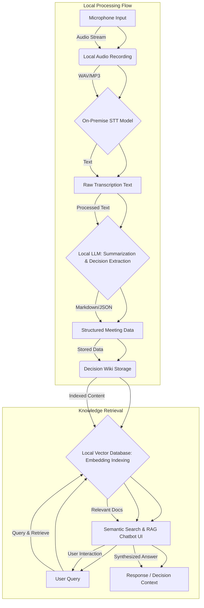

조직 내 의사결정 과정과 회의 내용을 효과적으로 기록하고 관리하는 것은 생산성 향상과 지식 공유에 필수적입니다. 그러나 민감한 정보의 외부 유출 우려 또는 보안 정책으로 인해 클라우드 기반 AI 서비스 사용이 제한되는 경우가 많습니다. 이러한 환경에서 로컬에서 동작하는 회의 녹취 및 Decision Wiki 검색 시스템은 핵심적인 해결책을 제공합니다. 본 시스템은 오디오 녹음부터 전사 (Transcription), 요약 (Summarization), 주요 의사결정 (Decision) 추출, 그리고 지식 기반 검색까지 모든 과정을 로컬에서 처리하여 데이터 주권을 확보하고 보안 위험을 최소화합니다.

## 시스템 아키텍처 개요

로컬 회의 녹취 및 Decision Wiki 검색 시스템은 다음과 같은 주요 구성 요소로 이루어집니다.

### 1. 로컬 오디오 녹음 (Local Audio Recording)

회의실 또는 개인 기기에서 직접 오디오를 녹음합니다. 웹캠/마이크 입력이나 전용 레코더를 활용하며, 녹음된 오디오 파일은 로컬 저장소에 안전하게 저장됩니다. 이는 데이터가 외부 네트워크를 거치지 않고 직접 로컬 시스템으로 유입되도록 보장합니다.

### 2. 음성-텍스트 변환 (Speech-to-Text, STT)

저장된 오디오 파일은 온프레미스에서 실행되는 STT 모델을 통해 텍스트로 변환됩니다. `Whisper`와 같은 오픈소스 모델이나 자체 훈련된 모델이 활용될 수 있습니다. `llama.cpp` 또는 `Ollama`와 같은 도구를 사용하여 로컬 환경에서도 효율적으로 대규모 언어 모델을 실행할 수 있습니다. 한국어 처리 능력과 도메인 특화 용어 처리 정확도가 중요한 고려사항입니다.

### 3. 회의록 전사 및 요약 (Transcription & Summarization)

STT 결과인 원시 텍스트는 다시 로컬 LLM에 의해 전사 내용 정제, 핵심 요약, 그리고 주요 의사결정 추출 과정을 거칩니다. 이 단계에서는 회의의 핵심 아젠다, 논의 내용, 도출된 결정 사항, 그리고 다음 액션 아이템 (Action Items) 등을 구조화된 형태로 추출합니다. 이는 정보의 과부하를 줄이고 필요한 정보에 빠르게 접근할 수 있도록 돕습니다.

### 4. Decision Wiki 통합 (Decision Wiki Integration)

추출된 의사결정 및 요약 정보는 Decision Wiki에 저장됩니다. Markdown 파일, JSON 문서 또는 로컬 데이터베이스 (예: SQLite, PostgreSQL)에 구조화된 형태로 저장될 수 있습니다. 중요한 것은 각 결정에 대한 맥락 (Context), 참여자 (Participants), 결정 날짜 (Date), 그리고 관련 문서 링크 등을 명확히 포함하여 향후 검색 및 추적 가능성을 높이는 것입니다.

### 5. 로컬 검색 및 AI 챗 (Local Search & AI Chat)

Decision Wiki에 저장된 데이터는 벡터 임베딩 (Vector Embedding)을 통해 인덱싱됩니다. `ChromaDB`나 `LanceDB`와 같은 로컬 벡터 데이터베이스를 활용하여 문맥 기반의 Semantic Search를 구현할 수 있습니다. 사용자는 자연어 쿼리 (Natural Language Query)를 통해 과거 회의 내용이나 특정 의사결정을 검색하고, 로컬 LLM 기반의 AI 챗봇을 통해 궁금한 점을 질의하여 답변을 받을 수 있습니다. 이는 RAG (Retrieval Augmented Generation) 패턴을 사용하여 구현됩니다.



## 실제 동작하는 코드 예제: 로컬 STT 및 임베딩

이 예제는 Python을 사용하여 `Whisper` 모델로 오디오 파일을 전사하고, `sentence-transformers`를 이용하여 텍스트를 임베딩한 후, 간단한 유사성 검색을 수행하는 과정을 보여줍니다. 실제 시스템에서는 이를 `ChromaDB`와 같은 벡터 데이터베이스와 연동하게 됩니다.

먼저 필요한 라이브러리를 설치합니다:
```bash
pip install openai-whisper sentence-transformers faiss-cpu pydub
```

**Python 코드:**
```python
import whisper
from sentence_transformers import SentenceTransformer
import faiss
import numpy as np
import os

# 1. 오디오 파일 전사 (Speech-to-Text)
def transcribe_audio(audio_path):
    print(f"[INFO] Loading Whisper model...")
    # Use a smaller model for local execution if resources are limited
    # model = whisper.load_model("base") 
    model = whisper.load_model("small") # 한국어 지원 및 적당한 성능
    print(f"[INFO] Transcribing {audio_path}...")
    result = model.transcribe(audio_path, language="ko")
    return result["text"]

# 2. 텍스트 임베딩 생성
def generate_embeddings(texts):
    print(f"[INFO] Loading SentenceTransformer model...")
    # 한국어에 최적화된 모델 선택 (예: 'snunlp/KR-SBERT-V40K-etri-512')
    # 또는 다국어 모델 ('sentence-transformers/paraphrase-multilingual-MiniLM-L12-v2')
    model = SentenceTransformer('sentence-transformers/paraphrase-multilingual-MiniLM-L12-v2')
    print(f"[INFO] Generating embeddings...")
    embeddings = model.encode(texts, convert_to_tensor=True)
    return embeddings.cpu().numpy()

# 3. FAISS를 이용한 간단한 유사성 검색
def search_embeddings(query_text, documents, document_embeddings, top_k=3):
    query_embedding = generate_embeddings([query_text])
    
    # FAISS 인덱스 생성 및 추가
    dimension = document_embeddings.shape[1]
    index = faiss.IndexFlatL2(dimension) # L2 거리 기반 인덱스
    index.add(document_embeddings)
    
    # 쿼리 검색
    distances, indices = index.search(query_embedding, top_k)
    
    results = []
    for i in range(top_k):
        doc_index = indices[0][i]
        results.append({"document": documents[doc_index], "distance": distances[0][i]})
    return results

if __name__ == "__main__":
    # 예제 오디오 파일 (실제 오디오 파일 경로로 교체 필요)
    # 오디오 파일이 없으면 'pydub'를 이용해 생성하거나 로컬에 저장된 mp3/wav 파일 사용
    # from pydub import AudioSegment
    # AudioSegment.silent(duration=5000).export("dummy_meeting.wav", format="wav")
    # dummy_audio_path = "dummy_meeting.wav"
    
    # 실제 회의록 데이터 (Decision Wiki 내용)
    meeting_data = [
        "2026년 5월 15일 주간 회의: 다음 분기 마케팅 전략 변경 논의. 신규 캠페인 'AI 시대의 인간적 가치' 시작 결정.",
        "2026년 5월 10일 기술 스택 검토 회의: 백엔드 프레임워크를 Node.js에서 Rust로 전환 결정. 3분기까지 마이그레이션 완료 목표.",
        "2026년 5월 8일 제품 디자인 회의: 사용자 피드백 반영, 메인 대시보드 UI/UX 전면 개편 결정. 프로토타입 개발 착수.",
        "22일 임원진 회의: 신규 투자 유치 건 승인. 블록체인 기반의 데이터 보안 솔루션 도입." 
    ]

    # 1. (생략) 실제 오디오 녹음 및 전사 과정 (여기서는 가상의 오디오로 대체)
    # transcribed_text = transcribe_audio(dummy_audio_path)
    # print(f"\n[Transcribed Text]: {transcribed_text}")

    # 2. Decision Wiki 데이터로부터 임베딩 생성
    doc_embeddings = generate_embeddings(meeting_data)
    print(f"[INFO] Generated {len(doc_embeddings)} embeddings.")

    # 3. 유사성 검색 예제
    query = "다음 분기 마케팅 전략 변경과 관련된 결정 사항은?"
    print(f"\n[Query]: {query}")
    search_results = search_embeddings(query, meeting_data, doc_embeddings)
    for res in search_results:
        print(f"  - Document: {res['document']} (Distance: {res['distance']:.4f})")

    query_ai = "AI 기술 도입 관련 의사결정을 찾아줘"
    print(f"\n[Query]: {query_ai}")
    search_results_ai = search_embeddings(query_ai, meeting_data, doc_embeddings)
    for res in search_results_ai:
        print(f"  - Document: {res['document']} (Distance: {res['distance']:.4f})")
```

## 트레이드오프

로컬 회의 녹취 및 Decision Wiki 시스템을 구축할 때는 여러 트레이드오프를 고려해야 합니다.

*   **데이터 주권 및 보안 vs. 운영 편의성**: 로컬 시스템은 모든 데이터를 온프레미스에서 처리하므로 데이터 유출 위험이 현저히 낮고 보안 정책 준수에 유리합니다. 그러나 시스템 설치, 유지보수, 업데이트 등 운영에 필요한 자체적인 인력과 노력이 증가합니다. 외부 클라우드 서비스는 편리한 관리와 스케일링을 제공하지만, 데이터 보안에 대한 통제력이 낮아집니다.
*   **초기 구축 비용 vs. 장기 운영 비용**: 로컬 시스템은 초기 하드웨어 및 소프트웨어 라이선스 구매에 높은 비용이 발생할 수 있습니다. 하지만 일단 구축되면 장기적으로는 외부 API 사용료나 구독료를 절감할 수 있어 총 소유 비용 (TCO) 측면에서 유리할 수 있습니다. 클라우드 서비스는 초기 비용이 낮지만, 사용량에 따른 지속적인 지출이 발생합니다.
*   **성능 최적화 vs. 범용성**: 로컬에서 실행되는 STT 및 LLM 모델은 특정 도메인이나 언어에 맞게 정교하게 최적화하고 파인튜닝 (Fine-tuning)할 수 있습니다. 이를 통해 높은 정확도를 달성할 수 있지만, 다양한 용도에 대응하기 위한 범용성은 떨어질 수 있습니다. 클라우드 LLM은 다양한 태스크에 범용적으로 활용 가능하지만, 특정 도메인에 대한 최적화는 제한적일 수 있습니다.
*   **기술 스택 선택의 자유 vs. 생태계 지원**: 오픈소스 기반의 로컬 시스템은 개발자가 원하는 기술 스택을 자유롭게 선택하고 커스터마이징할 수 있는 유연성을 제공합니다. 반면, 외부 클라우드 서비스는 특정 벤더의 생태계에 종속될 위험이 있으며, 커스터마이징 옵션이 제한적일 수 있습니다. 오픈소스 생태계는 커뮤니티 지원을 받지만, 상용 서비스만큼의 즉각적인 기술 지원을 기대하기는 어렵습니다.

## 실전 체크리스트

로컬 회의 녹취 및 Decision Wiki 시스템을 성공적으로 도입하기 위해 다음 항목들을 검증해야 합니다.

- [ ] **STT 모델의 도메인 특화 정확도 평가**: 실제 회의에서 사용되는 고유명사, 전문 용어, 사내 용어 등이 STT 모델에 의해 얼마나 정확하게 전사되는지 최소 90% 이상의 정확도로 평가되었는가?
- [ ] **로컬 LLM 자원 활용 및 성능 벤치마킹**: 요약 및 의사결정 추출에 사용될 LLM이 지정된 로컬 하드웨어 (CPU/GPU, RAM)에서 실시간 또는 준실시간으로 처리 가능한지, 지연 시간 (Latency)과 처리량 (Throughput) 목표를 달성하는가?
- [ ] **Decision Wiki 데이터 스키마 정의 및 구조화**: 의사결정, 액션 아이템, 관련 맥락, 참여자, 날짜 등을 포함하는 명확하고 일관된 데이터 스키마가 정의되었으며, 이를 바탕으로 데이터가 구조화되어 저장되는가?
- [ ] **증분 색인 (Incremental Indexing) 및 검색 주기 최적화**: 새로운 회의 데이터가 추가될 때마다 벡터 데이터베이스에 효율적으로 색인되며, 검색 시스템이 최신 정보를 반영하는 데 걸리는 시간이 특정 SLA (Service Level Agreement) 이내인가?
- [ ] **데이터 암호화 및 접근 제어 구현**: 녹음된 오디오 파일, 전사 텍스트, Decision Wiki 데이터 등 모든 저장된 데이터가 암호화되어 있으며, 인가된 사용자만 접근할 수 있는 강력한 접근 제어 메커니즘이 구현되었는가?
- [ ] **지식 그래프 또는 연결성 관리**: 추출된 의사결정들이 서로 연결되고 (예: 이전 결정, 후속 결정), 관련 문서나 인물과 연동되어 지식 그래프 형태로 관리되는가?
- [ ] **사용자 인터페이스 (UI) 및 경험 (UX) 테스트**: 일반 사용자가 시스템을 쉽게 사용하고, 자연어 검색 및 AI 챗을 통해 원하는 정보를 효율적으로 얻을 수 있도록 UI/UX가 직관적으로 설계되었으며 사용자 테스트를 완료했는가?