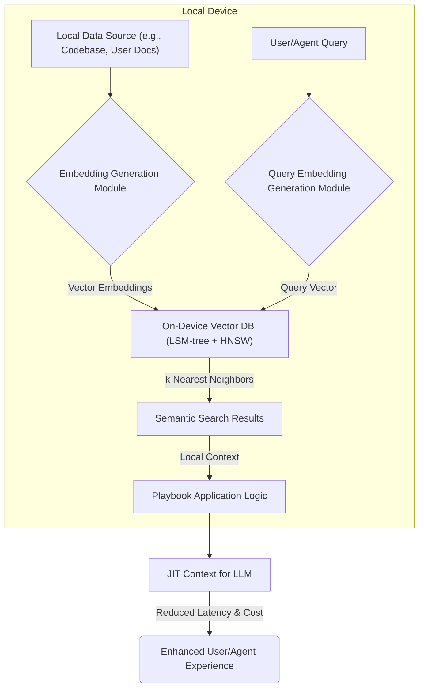

클라우드 기반의 RAG(Retrieval Augmented Generation) 시스템에서 JIT(Just-In-Time) 의미 검색은 사용자 경험을 크게 향상시키지만, 네트워크 지연과 클라우드 비용이라는 한계에 직면한다. 온디바이스 벡터 데이터베이스 도입은 이러한 문제에 대한 강력한 해결책을 제공하며, 특히 에지 컴퓨팅 환경과 프라이버시가 중요한 애플리케이션에서 그 가치를 발한다.

## 온디바이스 벡터 데이터베이스의 필요성

AI 애플리케이션이 개인화되고 실시간 상호작용이 중요해지면서, 데이터를 클라우드로 전송하지 않고 기기 자체에서 처리하는 온디바이스 AI의 중요성이 커지고 있다. 특히 의미 검색(Semantic Search)과 같은 작업에서, 사용자 질의에 대한 즉각적인 응답과 데이터 프라이버시 보호는 핵심 요구사항이다. 기존 클라우드 기반 벡터 데이터베이스는 매 검색마다 네트워크 왕복(Network Roundtrip)을 필요로 하여 지연 시간을 유발하고, 대량 질의 시 비용 부담이 커진다. 온디바이스 벡터 데이터베이스는 이러한 제약을 극복하고, 로컬에서 임베딩을 저장하고 검색함으로써 극심한 성능 최적화를 가능하게 한다. 2026년 현재, 모바일 기기 및 IoT 장치의 컴퓨팅 능력이 향상되면서 이러한 온디바이스 솔루션의 적용 범위가 더욱 확대되고 있다.

### 핵심 기술 스택: LSM-tree와 HNSW

온디바이스 벡터 데이터베이스는 효율적인 데이터 관리와 빠른 벡터 검색을 위해 특정 기술 스택을 활용한다. 최근 C로 구현된 한 온디바이스 벡터 DB 프로젝트는 LSM-tree와 HNSW 인덱스를 결합하여 이 문제를 해결한다.

*   **LSM-tree (Log-Structured Merge-tree)**: LSM-tree는 데이터베이스 엔진에서 쓰기(Write) 성능을 최적화하는 데 주로 사용되는 자료구조이다. 모든 변경 사항을 로그처럼 순차적으로 기록한 후, 주기적으로 백그라운드에서 데이터를 병합(Merge)하여 저장하는 방식이다. 이는 특히 빈번한 쓰기 작업이 발생하는 환경(예: 지속적인 임베딩 업데이트)에서 디스크 I/O를 최소화하고 성능을 유지하는 데 유리하다. 온디바이스 환경에서는 한정된 리소스에서 효율적인 데이터 관리가 필수적이므로, LSM-tree는 뛰어난 선택이다.

*   **HNSW (Hierarchical Navigable Small Worlds)**: HNSW는 근사 최근접 이웃(Approximate Nearest Neighbor, ANN) 검색 알고리즘 중 가장 널리 사용되는 것 중 하나이다. 벡터 공간에서 효율적으로 유사한 벡터를 찾아내는 데 최적화되어 있으며, 쿼리 시간을 대폭 단축시킨다. HNSW는 그래프 구조를 기반으로 하여 여러 계층의 인덱스를 생성하고, 이를 통해 검색 정확도와 속도 간의 균형을 효과적으로 조절할 수 있다. 온디바이스 환경에서 수만, 수십만 개의 벡터를 빠르게 검색하기 위해 HNSW는 필수적인 구성 요소이다.

## JIT 의미 검색 워크플로우 최적화

온디바이스 벡터 DB를 Playbook의 JIT 의미 검색 기능에 적용하는 과정은 다음과 같은 흐름으로 진행된다.



1.  **로컬 임베딩 생성**: Playbook에 필요한 컨텍스트 데이터(예: 코드 스니펫, 문서 내용, 사용자 기록)를 기기 내에서 임베딩 벡터로 변환한다. 이를 위해 경량화된 임베딩 모델(예: `e5-small`, `Gemma 2B`)을 온디바이스에 배포할 수 있다.
2.  **온디바이스 저장**: 생성된 벡터 임베딩은 LSM-tree 기반의 온디바이스 벡터 DB에 HNSW 인덱스와 함께 저장된다. 새로운 데이터가 생성되거나 기존 데이터가 업데이트될 때마다 효율적으로 DB에 반영된다.
3.  **쿼리 임베딩 및 검색**: 사용자나 AI Agent의 질의가 발생하면, 해당 질의를 즉시 온디바이스에서 임베딩 벡터로 변환하고, 이를 온디바이스 벡터 DB의 HNSW 인덱스를 사용하여 가장 유사한 로컬 임베딩을 검색한다.
4.  **JIT 컨텍스트 구성**: 검색된 임베딩에 해당하는 원본 컨텍스트를 로컬에서 즉시 가져와 LLM에 전달할 JIT 컨텍스트를 구성한다. 이 전체 과정은 네트워크 왕복 없이 기기 내부에서 이루어진다.

### 코드 예시: 개념적 온디바이스 벡터 DB 상호작용

다음은 Python을 이용한 임베딩 생성과 C-like pseudocode를 이용한 온디바이스 벡터 DB와의 개념적 상호작용 예시이다.

```python
# Python: Embedding Generation (conceptual)
from sentence_transformers import SentenceTransformer

model = SentenceTransformer('all-MiniLM-L6-v2') # Or an on-device optimized model

def generate_embedding(text: str):
    return model.encode(text).tolist()

# Example usage
document_text = "On-device vector databases enhance JIT semantic search."
query_text = "improve search performance"

doc_embedding = generate_embedding(document_text)
query_embedding = generate_embedding(query_text)

print(f"Document Embedding (first 5 dims): {doc_embedding[:5]}")
print(f"Query Embedding (first 5 dims): {query_embedding[:5]}")
```

```c
// C-like Pseudocode: On-Device Vector DB API
#include <stdio.h>
#include <stdlib.h>
#include <string.h>

// Placeholder for an actual on-device vector DB struct (e.g., based on LSM-tree + HNSW)
typedef struct OnDeviceVectorDB OnDeviceVectorDB;

typedef struct {
    float* vector; // Array of floats for the embedding
    size_t dim;
    char* id;      // Unique identifier for the entry
} VectorEntry;

// Function to initialize the on-device database
OnDeviceVectorDB* init_on_device_db(const char* db_path, size_t vector_dim) {
    printf("Initializing on-device vector DB at %s with dimension %zu\n", db_path, vector_dim);
    // Actual implementation would involve LSM-tree setup, HNSW index configuration
    return (OnDeviceVectorDB*)malloc(sizeof(OnDeviceVectorDB)); // Dummy allocation
}

// Function to insert a vector embedding into the database
int insert_embedding(OnDeviceVectorDB* db, const VectorEntry* entry) {
    if (!db || !entry || !entry->vector || !entry->id) {
        fprintf(stderr, "Error: Invalid input for insert_embedding\n");
        return -1;
    }
    printf("Inserting embedding for ID: %s, Dimension: %zu\n", entry->id, entry->dim);
    // Actual implementation would involve adding to LSM-tree and updating HNSW index
    return 0;
}

// Function to search for k nearest neighbors
// Returns an array of VectorEntry pointers (caller must free)
VectorEntry** search_embedding(OnDeviceVectorDB* db, const float* query_vector, size_t query_dim, size_t k) {
    if (!db || !query_vector || query_dim <= 0 || k <= 0) {
        fprintf(stderr, "Error: Invalid input for search_embedding\n");
        return NULL;
    }
    printf("Searching for %zu nearest neighbors with query vector (dim %zu)\n", k, query_dim);
    // Actual implementation would use HNSW index to find nearest neighbors
    // For demonstration, return a dummy result
    VectorEntry** results = (VectorEntry**)malloc(sizeof(VectorEntry*) * k);
    if (!results) return NULL;

    for (size_t i = 0; i < k; ++i) {
        results[i] = (VectorEntry*)malloc(sizeof(VectorEntry));
        if (results[i]) {
            results[i]->dim = query_dim;
            results[i]->vector = (float*)malloc(sizeof(float) * query_dim);
            if (results[i]->vector) {
                // Dummy vector data
                for (size_t j = 0; j < query_dim; ++j) results[i]->vector[j] = query_vector[j] + (float)i * 0.01f;
            }
            results[i]->id = (char*)malloc(sizeof(char) * 32);
            sprintf(results[i]->id, "result_item_%zu", i);
        }
    }
    return results;
}

// Function to close and free resources
void close_on_device_db(OnDeviceVectorDB* db) {
    printf("Closing on-device vector DB\n");
    if (db) free(db);
}

/* Example usage in C (conceptual)
int main() {
    size_t vector_dim = 384; // Example dimension
    OnDeviceVectorDB* db = init_on_device_db("./my_vector_db", vector_dim);

    float doc1_vec[] = {0.1, 0.2, 0.3, ...}; // Actual embedding generated by model
    VectorEntry entry1 = {doc1_vec, vector_dim, "doc_id_1"};
    insert_embedding(db, &entry1);

    float query_vec[] = {0.11, 0.21, 0.31, ...}; // Actual query embedding
    VectorEntry** results = search_embedding(db, query_vec, vector_dim, 3);

    if (results) {
        for (size_t i = 0; i < 3; ++i) {
            printf("Found result: %s\n", results[i]->id);
            free(results[i]->vector);
            free(results[i]->id);
            free(results[i]);
        }
        free(results);
    }

    close_on_device_db(db);
    return 0;
}
*/
```

## 트레이드오프

온디바이스 벡터 DB 도입은 다양한 이점을 제공하지만, 몇 가지 트레이드오프를 고려해야 한다.

*   **장점: 검색 지연 시간(Latency) 감소**: 클라우드 왕복 없이 로컬에서 검색이 이루어져 밀리초 단위의 응답 속도를 제공한다. 이는 사용자에게 실시간에 가까운 상호작용이 필요한 경우(예: Playbook의 JIT 의미 검색)에 매우 효과적이다.
*   **단점: 기기 리소스 제약(Resource Constraints)**: 온디바이스 환경은 CPU, 메모리, 저장 공간에 제한이 있다. 대규모 벡터 데이터셋이나 복잡한 임베딩 모델을 사용할 경우, 기기의 성능 저하나 저장 공간 부족을 초래할 수 있다. 이는 고사양 기기가 아닌 범용 모바일 기기나 저사양 IoT 장치에 적용할 때 문제가 될 수 있다.
*   **장점: 비용 절감(Cost Reduction)**: 클라우드 API 호출 및 데이터 전송 비용을 줄일 수 있다. 특히 검색 요청이 빈번하게 발생하는 서비스의 경우, 운영 비용을 크게 절감할 수 있다. 이는 대규모 사용자 기반을 가진 서비스에 유리하다.
*   **단점: 데이터 동기화(Data Synchronization) 및 관리 복잡성**: 온디바이스 데이터와 클라우드 서버 간의 데이터 일관성을 유지하기 위한 동기화 메커니즘이 필요하다. 데이터 업데이트 주기가 짧거나 여러 기기에서 동기화가 필요한 경우, 시스템 설계 및 구현의 복잡도가 증가한다. 이는 실시간 데이터 변경이 잦은 환경에서 주의가 필요하다.
*   **장점: 데이터 프라이버시 및 보안 강화(Privacy & Security)**: 민감한 데이터가 기기를 벗어나지 않으므로 데이터 유출 위험을 줄이고 사용자 프라이버시를 보호할 수 있다. 이는 의료, 금융 등 개인 정보 보호가 중요한 도메인에 필수적이다.
*   **단점: 모델 및 데이터 업데이트 배포(Deployment for Updates)**: 임베딩 모델이 업데이트되거나 대규모 데이터셋 변경이 발생하면, 기기에 배포된 DB와 모델도 함께 업데이트해야 한다. 이는 앱 업데이트 또는 별도의 푸시 메커니즘을 통해 이루어져야 하므로 배포 및 관리 부담이 발생할 수 있다. 이는 빠르게 변화하는 데이터 환경에서 불리할 수 있다.

## 실전 체크리스트

온디바이스 벡터 DB를 프로젝트에 적용할 때 검증해야 할 핵심 항목은 다음과 같다.

*   [ ] **기기별 성능 벤치마킹 완료 여부**: 다양한 타겟 기기(저사양, 중사양, 고사양)에서 임베딩 저장 및 검색 지연 시간, CPU/메모리 사용량을 측정하여 허용 가능한 성능 범위 내에 있는지 확인한다.
*   [ ] **데이터 압축 및 가지치기(Pruning) 전략 수립**: 저장 공간 제약을 고려하여 불필요한 데이터를 제거하고, 벡터 임베딩의 정밀도를 유지하면서 데이터 크기를 최소화하는 전략을 문서화하고 적용한다.
*   [ ] **클라우드 데이터와의 동기화 정책 정의**: 온디바이스 데이터와 클라우드 데이터 간의 일관성을 유지하기 위한 동기화 주기, 충돌 해결 방식, 네트워크 상태 변화 시 처리 로직을 명확히 정의한다.
*   [ ] **임베딩 모델 온디바이스 최적화 여부 확인**: 선택한 임베딩 모델이 타겟 기기의 컴퓨팅 자원에 맞게 경량화(예: 양자화)되어 있으며, 효율적으로 추론 가능한지 검증한다.
*   [ ] **장애 복구 및 데이터 무결성 검증 프로세스 마련**: 온디바이스 DB 손상 시 데이터 복구 방안 및 주기적인 데이터 무결성 검증 절차를 수립하여 데이터 손실을 방지한다.
*   [ ] **크로스-플랫폼(Cross-Platform) 호환성 고려**: Android, iOS 등 다양한 플랫폼에서 온디바이스 벡터 DB가 안정적으로 동작하고 통합될 수 있는지 테스트 계획을 수립하고 실행한다.
*   [ ] **보안 및 프라이버시 정책 준수 여부**: 온디바이스 데이터 저장 및 처리 과정이 GDPR, CCPA 등 관련 데이터 보호 규정을 준수하는지 법적, 기술적 관점에서 검토하고 필요한 보안 조치를 적용한다.