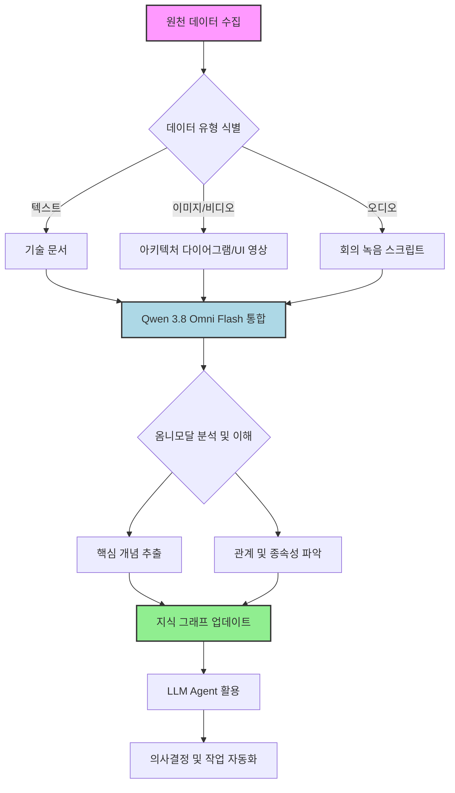

Qwen 3.8 Omni Flash는 텍스트, 이미지, 오디오, 비디오를 아우르는 네이티브 옴니모달(omnimodal) 입력 지원과 최대 100만 토큰의 컨텍스트 윈도우를 제공하는 대규모 언어 모델(LLM)입니다. 이는 기존 Qwen 3.5 Omni-Plus 대비 29개 평가 지표에서 우위를 점하며, 콘텐츠 이해, 작업 계획, 도구 호출, 결과물 제작에 이르는 복합적인 작업을 수행할 수 있도록 설계되었습니다. 이 엔트리는 Qwen 3.8 Omni Flash의 주요 성능 특성을 평가하고, 이를 기존 LLM 출력 검증 파이프라인 및 지식 허브 콘텐츠 처리 단계에 통합하는 방안을 탐색합니다.

## Qwen 3.8 Omni Flash의 핵심 역량

Qwen 3.8 Omni Flash는 단순히 다양한 모달리티를 개별적으로 처리하는 것을 넘어, 이들을 통합적으로 이해하고 상호작용할 수 있는 '네이티브 옴니모달' 아키텍처를 자랑합니다. 이는 복잡한 실제 시나리오에서 인간과 유사한 수준의 상황 인지 및 추론 능력을 가능하게 합니다.

### 1. 100만 토큰 컨텍스트 지원
대규모 컨텍스트 윈도우는 장문의 문서 분석, 복잡한 코드베이스 이해, 장기 대화 이력 유지 등 광범위한 정보가 요구되는 작업에 필수적입니다. Qwen 3.8 Omni Flash의 100만 토큰 컨텍스트는 이러한 시나리오에서 정보 손실 없이 심층적인 분석과 추론을 가능하게 합니다. 특히, `playbook`의 지식 허브 콘텐츠 처리 단계에서 방대한 양의 기술 문서, 코드, 아키텍처 다이어그램 등을 한 번에 처리하여 종합적인 인사이트를 도출하는 데 유리합니다.

### 2. 네이티브 옴니모달 기능
Qwen 3.8 Omni Flash는 텍스트 외에 이미지, 오디오, 비디오를 직접 입력으로 받아들여 통합적인 이해를 수행합니다. 예를 들어, 서비스 장애 발생 시 로그(텍스트), 스크린샷(이미지), 회의 녹음(오디오)을 동시에 분석하여 근본 원인을 파악하거나, 신규 기능의 UI/UX 디자인(이미지/비디오)과 요구사항 문서(텍스트)를 함께 검토하여 구현 계획을 수립하는 등의 고급 에이전트(agent) 역할을 수행할 수 있습니다.

### 3. 작업 계획 및 도구 호출
모델 자체가 복잡한 작업을 작은 단계로 분해하고, 필요한 외부 도구를 식별하며, 이를 효과적으로 호출하여 목표를 달성하는 능력을 내재하고 있습니다. 이는 AI 에이전트의 자율성을 크게 향상시키며, 기존 `agents/llm-agent-tool-use-design-patterns`와 같은 도구 사용 패턴에 새로운 차원의 유연성을 제공합니다.

## 성능 평가 및 기존 시스템 통합 방안

Qwen 3.8 Omni Flash의 실제 적용을 위해서는 그 성능을 정량적, 정성적으로 평가하고, 기존 시스템과의 통합 시너지를 분석해야 합니다.

### LLM 출력 검증 파이프라인에 통합

`evaluation/llm-output-validation-pipeline-enhancement`와 같은 기존 LLM 출력 검증 파이프라인에서 Qwen 3.8 Omni Flash는 특히 복잡한 출력물의 다각적인 검증에 활용될 수 있습니다. 예를 들어, 코드 생성 에이전트의 결과물을 검증할 때, 단순히 코드의 문법적 오류뿐만 아니라, 관련 문서 및 다이어그램(이미지)을 함께 고려하여 코드의 의도와 설계 원칙에 부합하는지 여부를 판단할 수 있습니다.

```python
import qwen_omniflash_sdk as qwen

def validate_multimodal_output(text_output, image_output, project_docs_context):
    """
    Qwen 3.8 Omni Flash를 사용하여 다중 모달리티 출력을 검증합니다.
    """
    prompt = f"""
    주어진 코드 출력과 UI 스크린샷을 프로젝트 문서 컨텍스트와 비교하여
    코드의 기능적 정확성, UI의 디자인 가이드라인 준수 여부, 그리고 전체적인
    프로젝트 요구사항 부합도를 평가하세요. 문제점 발견 시 구체적인 개선안을 제시하세요.

    코드 출력: {text_output}
    UI 스크린샷: {image_output}
    프로젝트 문서 요약: {project_docs_context}
    """

    response = qwen.generate(messages=[
        {"role": "user", "content": prompt},
        {"role": "image", "content": image_output} # 이미지 직접 입력
    ],
    model="qwen3.8-omni-flash",
    max_tokens=2000)

    return response.choices[0].message.content

# 예시 사용법 (실제 API 호출은 환경 설정 필요)
# code_snippet = """def calculate_total(price, quantity): return price * quantity"""
# ui_screenshot_base64 = "data:image/png;base64,..." # 실제 이미지 데이터
# project_context = "Order management system with pricing logic."
# validation_result = validate_multimodal_output(code_snippet, ui_screenshot_base64, project_context)
# print(validation_result)
```

### 지식 허브 콘텐츠 처리 단계에 활용

기존 `context-engineering/llm-knowledge-graph-automation-unstructured-text`와 같은 지식 그래프 구축 및 관리 단계에서, Qwen 3.8 Omni Flash는 정형화되지 않은 다양한 형식의 데이터를 효과적으로 처리할 수 있습니다. 예를 들어, 복잡한 아키텍처 다이어그램(이미지), 시스템 설계 문서(텍스트), 개발자 회의록(오디오 스크립트) 등을 통합적으로 이해하여 지식 그래프의 노드와 엣지를 자동으로 생성하거나 기존 지식을 업데이트하는 데 기여할 수 있습니다.



## 트레이드오프

### 1. 100만 토큰 컨텍스트 활용
*   **언제 좋고**: 매우 긴 문서 요약, 복잡한 시스템의 전체 코드베이스 이해, 장기간의 대화 이력 분석 등 광범위한 정보 맥락이 필수적인 작업에서 탁월한 성능을 발휘합니다. `agents/agentic-long-running-carryover-human-checkpoint-boundary`와 같은 장기 에이전트 작업에 유리합니다.
*   **언제 나쁜지**: 컨텍스트 토큰 수가 많아질수록 추론 비용이 급격히 증가하고, Latency가 길어질 수 있습니다. 짧고 간결한 질문-응답이나 단순한 텍스트 변환 작업에는 비효율적입니다.

### 2. 네이티브 옴니모달 기능
*   **언제 좋고**: 이미지, 오디오, 비디오 등 다양한 모달리티 정보를 동시에 분석하여 더 정확하고 풍부한 추론이 필요한 작업에 적합합니다. 예를 들어, `agents/multimodal-agent-design-patterns`에서 설명하는 복합적인 사용자 요청 처리 시 효과적입니다.
*   **언제 나쁜지**: 옴니모달 입력 처리 자체가 텍스트 단일 모달 모델보다 높은 컴퓨팅 자원을 요구하며, API 비용이 더 높을 수 있습니다. 또한, 모달리티 간의 미묘한 의미 차이 또는 노이즈가 있는 경우 의도하지 않은 결과가 발생할 가능성이 있습니다.

### 3. 통합 및 학습 곡선
*   **언제 좋고**: 기존 `harness-engineering/llm-harness-external-model-dynamic-integration` 패턴을 통해 새로운 모델을 통합할 때, Qwen 3.8 Omni Flash의 강력한 기본 기능 덕분에 특정 도메인에 대한 추가적인 미세 조정(fine-tuning) 필요성이 줄어들 수 있습니다.
*   **언제 나쁜지**: 새로운 모델 아키텍처와 API에 대한 이해가 필요하며, 기존 워크플로우를 옴니모달 입력에 맞게 재설계하는 데 초기 학습 및 개발 비용이 발생할 수 있습니다. Gemini 대비 성능 우위를 검증하는 과정도 필요합니다.

## 실전 체크리스트

Qwen 3.8 Omni Flash를 프로젝트에 성공적으로 통합하고 활용하기 위한 실전 체크리스트는 다음과 같습니다.

- [ ] 현재 LLM 작업 중 100만 토큰 이상의 컨텍스트가 필요한 고비용/고난도 작업 시나리오를 3가지 이상 식별했는가?
- [ ] 이미지, 오디오, 비디오 등 텍스트 외 모달리티 정보를 통합 분석하여 가치를 창출할 수 있는 `agents/multimodal-ai-agent-effective-tool-integration` Use Case를 2가지 이상 정의했는가?
- [ ] Qwen 3.8 Omni Flash API 통합 시, 기존 LLM API (예: Gemini)와의 Latency 및 비용 예측치를 비교 분석했는가?
- [ ] LLM 출력 검증 파이프라인에서 Qwen 3.8 Omni Flash를 활용한 다중 모달리티 기반의 추가 검증 단계를 설계하고 POC를 완료했는가?
- [ ] 지식 허브 콘텐츠 처리 단계에서 Qwen 3.8 Omni Flash를 사용하여 비정형/다중 모달리티 데이터를 자동으로 파싱하고 지식 그래프를 업데이트하는 자동화 워크플로우를 구현했는가?
- [ ] Qwen 3.8 Omni Flash의 특정 작업에 대한 `evaluation/generative-ai-model-evaluation-quantitative-qualitative-meth` 기반의 정량적/정성적 성능 평가 지표를 수립하고 Baseline을 확보했는가?
- [ ] 모델 사용량 및 비용 모니터링(`harness-engineering/llm-performance-cost-benchmarking-harness-design`) 시스템을 구축하여, Qwen 3.8 Omni Flash 도입 후의 ROI를 지속적으로 추적할 계획을 수립했는가?