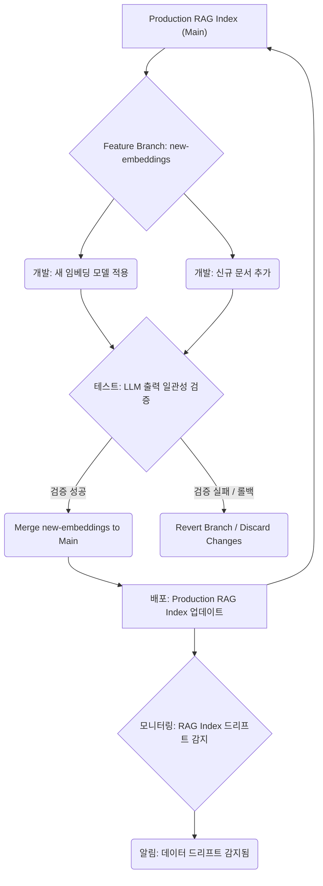

RAG(Retrieval-Augmented Generation) 시스템의 지식 베이스와 AI 에이전트의 메모리는 LLM(Large Language Model)의 출력 품질과 일관성을 결정하는 핵심 요소입니다. 그러나 현재 많은 시스템에서 이 데이터는 '덮어쓰기' 방식으로 관리되어 다음과 같은 문제를 야기합니다. 문서가 변경되거나 임베딩 모델이 업데이트되면 LLM의 답변도 조용히 바뀌지만, 특정 답변이 어떤 데이터 상태에서 나왔는지 추적하기 어렵습니다. 이는 디버깅, 재현성, 규제 준수 측면에서 심각한 도전 과제를 제시합니다. 또한, 새 문서나 임베딩을 반영할 때 운영 인덱스에 직접 쓰는 것 외에는 마땅한 선택지가 없어 안전한 실험 및 배포가 어렵습니다.

## RAG 및 에이전트 메모리 버전 관리의 필요성

지식 베이스와 메모리에 버전 관리를 도입하는 것은 이러한 문제를 해결하고 LLM 기반 시스템의 신뢰성과 안정성을 크게 향상시킬 수 있습니다.

### 1. Silent Drift(조용한 변화) 탐지 및 방지
소스 문서의 변경, 임베딩 모델의 업데이트 또는 청킹 전략의 변화는 RAG 검색 결과에 미묘하지만 중요한 변화를 가져올 수 있습니다. 이러한 `silent drift`는 LLM의 출력에 예기치 않은 영향을 미치며, 버전 관리가 없다면 원인을 파악하기 매우 어렵습니다. 버전 관리를 통해 변경 사항을 명확히 추적하고, 새로운 버전이 배포되기 전에 잠재적인 드리프트를 감지하고 완화할 수 있습니다.

### 2. 재현성(Reproducibility) 및 감사(Auditability)
특정 LLM 답변이 생성된 시점의 RAG 인덱스나 에이전트 메모리 상태를 정확히 재현하는 것은 디버깅, 회귀 테스트, 그리고 규제 산업에서의 감사 요구사항을 충족하는 데 필수적입니다. Git과 유사한 버전 관리 시스템은 각 변경 사항을 커밋(Commit)으로 기록하여, 언제든지 과거의 특정 시점으로 돌아가 데이터 상태를 복원할 수 있게 합니다.

### 3. 안전한 실험 및 A/B 테스트
새로운 지식이나 임베딩 모델을 운영 환경에 바로 적용하는 것은 위험합니다. 버전 관리는 프로덕션 인덱스에 영향을 주지 않고 새로운 브랜치(Branch)에서 실험을 수행하고 검증할 수 있는 환경을 제공합니다. 이를 통해 다양한 RAG 구성이나 에이전트 메모리 전략을 안전하게 A/B 테스트하고 최적의 성능을 검증할 수 있습니다.

### 4. 롤백(Rollback) 및 재해 복구(Disaster Recovery)
예상치 못한 문제나 성능 저하가 발생했을 때, 이전의 안정적인 버전으로 신속하게 롤백하는 기능은 시스템의 가용성과 안정성을 보장합니다. 버전 관리는 이러한 롤백 프로세스를 간소화하고 자동화할 수 있는 기반을 마련합니다.

## LambdaDB를 이용한 버전 관리 개념

LambdaDB와 같은 시스템은 데이터에 대한 Git과 유사한 인터페이스를 제공하여, 데이터 과학자와 엔지니어가 데이터셋을 마치 코드처럼 버전 관리할 수 있게 합니다. 이는 다음과 같은 핵심 개념을 포함합니다.

*   **커밋 (Commits)**: 특정 시점의 RAG 인덱스 또는 에이전트 메모리 상태에 대한 불변(immutable) 스냅샷을 생성합니다. 각 커밋은 고유한 ID를 가집니다.
*   **브랜치 (Branches)**: 주(main) 인덱스에서 분리되어 독립적인 개발 및 실험을 허용합니다. 새로운 문서 추가, 임베딩 재학습 등은 별도의 브랜치에서 진행됩니다.
*   **머지 (Merges)**: 개발 브랜치에서 안정화된 변경 사항을 주 브랜치로 통합합니다. 잠재적인 충돌 해결 메커니즘도 포함될 수 있습니다.
*   **Diffs**: 두 버전 간의 데이터 변경 사항을 비교하여, 무엇이 어떻게 바뀌었는지 명확하게 파악할 수 있습니다.

## RAG 인덱스 및 에이전트 메모리 버전 관리 워크플로우

다음 Mermaid 다이어그램은 RAG 인덱스 업데이트에 버전 관리를 적용한 일반적인 워크플로우를 보여줍니다.



## 코드 예제: LambdaDB 개념을 활용한 RAG 지식 베이스 관리

아래 Python 코드는 LambdaDB 개념을 사용하여 RAG 지식 베이스를 버전 관리하는 방식을 개념적으로 보여줍니다. 실제 LambdaDB 클라이언트는 더 복잡한 API를 제공하지만, 여기서는 핵심적인 브랜칭, 커밋, 체크아웃 및 머지 작업을 시뮬레이션합니다.

```python
import os
import shutil

# 실제 LambdaDB 대신, 간단한 파일 기반 'repo'를 가정하여 버전 관리 동작을 시뮬레이션합니다.
# 각 'branch'는 별도의 디렉토리로, 'commit'은 해당 디렉토리 내의 파일 스냅샷으로 간주합니다.
class ConceptualLambdaDBClient:
    def __init__(self, repo_path):
        self.repo_path = repo_path
        os.makedirs(repo_path, exist_ok=True)
        self.current_branch = "main"
        self._ensure_branch_exists("main")

    def _get_branch_path(self, branch_name):
        return os.path.join(self.repo_path, branch_name)

    def _ensure_branch_exists(self, branch_name):
        branch_path = self._get_branch_path(branch_name)
        os.makedirs(branch_path, exist_ok=True)
        if not os.path.exists(os.path.join(branch_path, "data.json")):
            with open(os.path.join(branch_path, "data.json"), "w") as f:
                f.write("{}") # Empty initial data
            with open(os.path.join(branch_path, "_commits.log"), "a") as f:
                f.write(f"Initial commit on {branch_name}\n")

    def checkout(self, branch_name):
        if not os.path.exists(self._get_branch_path(branch_name)):
            raise ValueError(f"Branch '{branch_name}' does not exist.")
        self.current_branch = branch_name
        print(f"Checked out to branch: {branch_name}")

    def get_current_commit_id(self):
        branch_path = self._get_branch_path(self.current_branch)
        with open(os.path.join(branch_path, "_commits.log"), "r") as f:
            return f.readlines()[-1].strip() # Last line as commit ID

    def read_data(self, branch_name=None):
        target_branch = branch_name if branch_name else self.current_branch
        data_file_path = os.path.join(self._get_branch_path(target_branch), "data.json")
        with open(data_file_path, "r") as f:
            import json
            return json.load(f)

    def write_data(self, branch_name, data, commit_message):
        data_file_path = os.path.join(self._get_branch_path(branch_name), "data.json")
        with open(data_file_path, "w") as f:
            import json
            json.dump(data, f, indent=2, ensure_ascii=False)
        
        commit_log_path = os.path.join(self._get_branch_path(branch_name), "_commits.log")
        with open(commit_log_path, "a") as f:
            f.write(f"{commit_message} @ {len(f.readlines())} [{os.urandom(4).hex()}]\n")
        print(f"Committed to '{branch_name}': {commit_message}")

    def create_branch(self, new_branch_name, from_branch=None):
        source_branch = from_branch if from_branch else self.current_branch
        source_path = self._get_branch_path(source_branch)
        dest_path = self._get_branch_path(new_branch_name)
        
        if os.path.exists(dest_path):
            print(f"Branch '{new_branch_name}' already exists. Skipping creation.")
            return

        shutil.copytree(source_path, dest_path) # Copy state
        commit_log_path = os.path.join(dest_path, "_commits.log")
        with open(commit_log_path, "a") as f:
            f.write(f"Branch created from {source_branch}\n")
        print(f"Branch '{new_branch_name}' created from '{source_branch}'")

    def merge(self, source_branch, target_branch, commit_message):
        source_data = self.read_data(source_branch)
        target_data = self.read_data(target_branch)
        
        # Simple merge: source overrides target for simplicity. Real LambdaDB handles conflicts.
        target_data.update(source_data)
        
        self.write_data(target_branch, target_data, commit_message)
        print(f"Branch '{source_branch}' merged into '{target_branch}'")


class RAGKnowledgeBase:
    def __init__(self, db_path):
        self.db = ConceptualLambdaDBClient(db_path)

    def add_document(self, doc_id, text, embedding):
        data = self.db.read_data() # Read current branch data
        data[doc_id] = {"text": text, "embedding": embedding}
        self.db.write_data(self.db.current_branch, data, f"Added/updated document {doc_id}")

    def retrieve(self, query_embedding, top_k=3):
        data = self.db.read_data() # Read current branch data
        if not data:
            return []
        
        retrieved_docs = []
        for doc_id, doc_content in data.items():
            # Simplified similarity calculation (dot product for conceptual demo)
            similarity = sum(a*b for a,b in zip(query_embedding, doc_content["embedding"])) 
            retrieved_docs.append({"doc_id": doc_id, "text": doc_content["text"], "similarity": similarity})
        
        retrieved_docs.sort(key=lambda x: x["similarity"], reverse=True)
        return retrieved_docs[:top_k]


if __name__ == "__main__":
    db_root_path = "rag_repo_test"
    if os.path.exists(db_root_path):
        shutil.rmtree(db_root_path)

    print("--- Initializing RAG Knowledge Base ---")
    kb = RAGKnowledgeBase(db_root_path)
    
    # Initial state on main branch
    kb.add_document("doc1", "Generative AI is transforming industries.", [0.1, 0.2, 0.3])
    kb.add_document("doc2", "RAG systems enhance LLM with external knowledge.", [0.4, 0.5, 0.6])
    print(f"Current commit on main: {kb.db.get_current_commit_id()}\n")

    print("--- Creating and working on a feature branch ---")
    kb.db.create_branch("feature/new-docs")
    kb.db.checkout("feature/new-docs")
    
    # Add a new document in the feature branch
    kb.add_document("doc3", "LambdaDB provides Git-like versioning for data.", [0.7, 0.8, 0.9])
    print(f"Current commit on feature/new-docs: {kb.db.get_current_commit_id()}\n")

    # Retrieve from the feature branch
    query_emb = [0.65, 0.75, 0.85]
    retrieved_feature = kb.retrieve(query_emb, top_k=1)
    print(f"Retrieved from 'feature/new-docs': {retrieved_feature[0]['text']}" if retrieved_feature else "No docs retrieved")

    print("\n--- Switching back to main branch ---")
    kb.db.checkout("main")
    retrieved_main = kb.retrieve(query_emb, top_k=1)
    print(f"Retrieved from 'main': {retrieved_main[0]['text']}" if retrieved_main else "No docs retrieved")
    print("(Note: 'doc3' is not visible on main yet)\n")
    
    print("--- Merging feature branch into main ---")
    kb.db.merge("feature/new-docs", "main", "Merged feature/new-docs into main")
    kb.db.checkout("main") # Re-checkout main to load merged state
    retrieved_after_merge = kb.retrieve(query_emb, top_k=1)
    print(f"Retrieved from 'main' after merge: {retrieved_after_merge[0]['text']}" if retrieved_after_merge else "No docs retrieved")
    print("(Now 'doc3' is visible on main)")
```

## 트레이드오프

1.  **복잡성 증가 (Increased Complexity)**
    *   **언제 좋고**: 높은 규제 준수 요구사항(금융, 의료), LLM 답변의 재현성이 매우 중요한 디버깅 환경, A/B 테스트가 빈번한 개선 사이클에 유리하다. 여러 팀이 독립적으로 RAG 지식 베이스를 업데이트해야 하는 대규모 프로젝트에서 충돌을 최소화하고 협업을 강화할 수 있다.
    *   **언제 나쁜지**: 초기 프로토타입 개발, 빠른 반복이 우선시되는 소규모 프로젝트, RAG 지식 베이스의 변경 빈도가 낮고 영향이 미미한 경우 불필요한 오버헤드를 초래한다. 추가적인 인프라 관리 및 학습 곡선이 필요하다.
2.  **스토리지 및 비용 오버헤드 (Storage and Cost Overhead)**
    *   **언제 좋고**: 데이터 변경 내역 전체를 보존해야 하는 감사(Audit) 요구사항이 있는 경우, 또는 과거 특정 시점의 데이터 상태로 완벽하게 롤백해야 할 필요가 있는 경우, 장기적인 데이터 거버넌스 전략에서 투자할 가치가 있다.
    *   **언제 나쁜지**: 스토리지 비용이 매우 민감하고 데이터 버전별 차등 관리가 불필요한 경우, 엄격한 스냅샷보다는 증분 백업이나 간단한 버전 스탬핑으로 충분한 경우 비효율적이다. 특히 대규모 임베딩 데이터의 경우 버전별 전체 복제는 상당한 비용을 발생시킬 수 있다.
3.  **성능 영향 (Performance Impact)**
    *   **언제 좋고**: 읽기(Read) 작업이 압도적으로 많고, 쓰기(Write) 작업은 특정 배치 프로세스나 업데이트 주기에 집중되는 워크로드에서, 버전 관리 시스템이 제공하는 데이터 불변성(Immutability)과 최적화된 스냅샷 관리가 안정적인 읽기 성능을 보장할 수 있다.
    *   **언제 나쁜지**: 실시간으로 높은 빈도의 업데이트(Write)가 발생하며, 각 업데이트마다 새로운 버전을 생성하는 방식이 지연 시간(Latency)이나 처리량(Throughput)에 병목을 일으킬 수 있다. 버전 스위칭 오버헤드가 민감한 경우도 고려해야 한다.
4.  **데이터 일관성 및 드리프트 제어 (Data Consistency & Drift Control)**
    *   **언제 좋고**: LLM 응답의 일관성이 비즈니스 크리티컬하고, 데이터 드리프트가 주요 문제로 인식되는 환경에서, 명확한 버전 관리를 통해 데이터 상태를 완벽하게 제어하고 예측 불가능한 답변 변경을 방지할 수 있다. LLM 출력 검증 파이프라인과 결합 시 시너지가 크다.
    *   **언제 나쁜지**: 데이터 드리프트의 영향이 작거나 허용 가능한 범위 내에 있는 경우, 혹은 지식 베이스의 '신선도'가 '일관성'보다 더 중요한 시나리오에서는, 버전 관리의 엄격함이 오히려 정보 업데이트의 민첩성을 저해할 수 있다.
5.  **에이전트 학습 및 디버깅 용이성 (Agent Learning & Debugging Ease)**
    *   **언제 좋고**: 복잡한 에이전트의 행동을 디버깅하거나, 특정 시점의 메모리 상태를 기반으로 에이전트의 의사결정 과정을 분석해야 할 때, 그리고 에이전트 학습 과정에서 메모리 변화의 영향을 정량적으로 평가할 때 강력한 이점을 제공한다.
    *   **언제 나쁜지**: 에이전트 메모리가 단순하고 일회성이며, 상태 추적이 크게 중요하지 않은 경우, 메모리 버전 관리가 에이전트 로직을 불필요하게 복잡하게 만들 수 있다.

## 실전 체크리스트

*   - [ ] 현재 RAG 지식 베이스 및 에이전트 메모리에 대한 변경 이력 추적 요구사항을 명확히 정의했는가? (예: 감사 로그, 특정 답변의 데이터 소스 추적)
*   - [ ] LambdaDB (또는 유사 솔루션) 도입 시 예상되는 스토리지 증가량 및 비용을 산정하고 예산을 확보했는가?
*   - [ ] 기존 RAG 업데이트 파이프라인을 버전 관리 시스템과 연동하도록 재설계하고, 새 문서/임베딩 반영 시 브랜칭 및 머지 전략을 수립했는가?
*   - [ ] LLM 출력 검증 파이프라인에 RAG 인덱스/에이전트 메모리 버전을 명시적으로 포함시켜 데이터 상태에 따른 답변 일관성을 검증하는 자동화된 테스트를 구축했는가?
*   - [ ] 데이터 드리프트 감지 시스템을 구현하고, 특정 버전 간의 의미론적 차이(Semantic Difference)를 정량적으로 측정하는 메트릭을 정의했는가?
*   - [ ] 에이전트가 사용하는 메모리 스냅샷을 특정 커밋 ID로 고정하고, 이를 통해 에이전트의 과거 행동을 재현할 수 있는 메커니즘을 마련했는가?
*   - [ ] 롤백 전략을 수립하고, 비상 시 이전 버전의 RAG 인덱스나 에이전트 메모리로 신속하게 전환하는 절차를 문서화하고 테스트했는가?