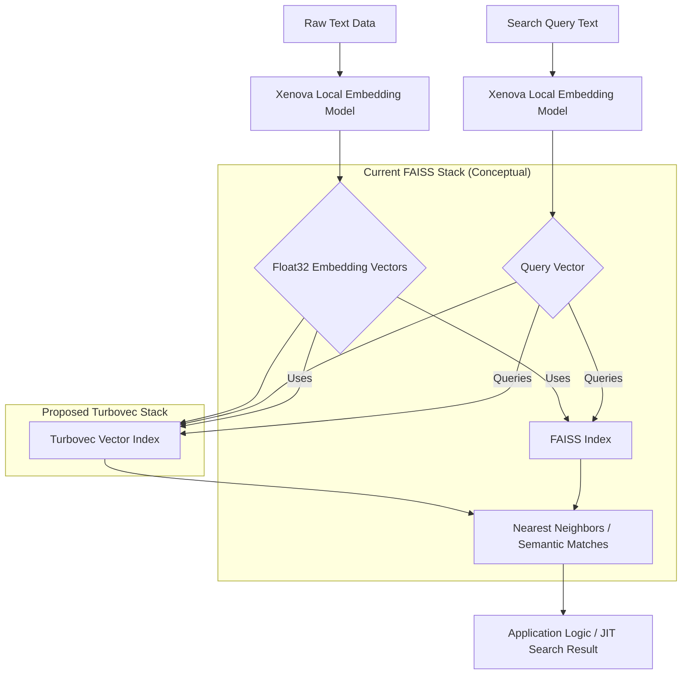

## Rust Turbovec Introduction: High-Performance Vector Search

JIT(Just-In-Time) 의미 검색 및 로컬 임베딩 시스템은 낮은 레이턴시와 높은 메모리 효율성을 요구합니다. 이러한 요구사항은 특히 온디바이스(on-device) 환경이나 대규모 데이터셋 처리 시 더욱 중요해집니다. Google Research의 TurboQuant에 기반을 둔 Rust 벡터 인덱스인 Turbovec은 이러한 과제를 해결하기 위한 강력한 대안으로 부상하고 있습니다.

Turbovec은 1,000만 개의 float32 문서가 차지하는 31GB의 메모리를 4GB로 압축하면서도, 기존의 FAISS보다 빠른 검색 속도를 제공하는 것으로 알려져 있습니다. 이는 별도의 학습이나 복잡한 매개변수 조정 없이 벡터를 즉시 추가할 수 있다는 점에서 개발 및 운영의 복잡성을 크게 줄여줍니다. Xenova 기반 JIT 의미 검색 및 로컬 임베딩 스택을 Turbovec으로 교체하거나 통합함으로써, 기존 FAISS 대비 검색 속도 향상 및 메모리 사용량 감소 효과를 검증하는 것은 현재 시스템의 한계를 극복하는 중요한 기회가 될 것입니다.

## Turbovec Architecture and Performance Drivers

Turbovec의 뛰어난 성능과 효율성은 여러 핵심 기술 요소에 기반합니다.

### Rust 언어의 이점

Rust는 메모리 안전성(memory safety)과 높은 성능을 보장하는 시스템 프로그래밍 언어입니다. 가비지 컬렉터 없이도 데이터 레이스(data race)와 널 포인터 역참조(null pointer dereference)와 같은 일반적인 버그를 컴파일 시점에 방지하여, 안정적이고 빠른 벡터 검색 인덱스를 구축하는 데 이상적입니다.

### SIMD 명령어 활용

Turbovec은 ARM의 NEON과 x86의 AVX-512, AVX2와 같은 Single Instruction, Multiple Data (SIMD) 명령어 세트를 적극적으로 활용합니다. SIMD는 여러 데이터 요소를 단일 CPU 명령어로 동시에 처리함으로써, 벡터 연산이 주를 이루는 임베딩 검색 과정에서 압도적인 속도 향상을 가능하게 합니다.

### TurboQuant 기반 양자화

Google Research의 TurboQuant에서 영감을 받은 양자화 기법은 벡터 데이터를 저장하는 데 필요한 메모리 양을 획기적으로 줄입니다. 이는 벡터의 정밀도를 손실 없이 유지하면서 저장 공간을 최적화하여, 대규모 임베딩 데이터셋을 훨씬 적은 메모리로 관리할 수 있게 합니다.

### 제로 컨피그레이션 및 즉각적인 사용성

Turbovec은 별도의 복잡한 설정이나 사전 학습 과정 없이 벡터를 즉시 추가하고 검색할 수 있도록 설계되었습니다. 이는 개발자가 인덱스 관리에 소요되는 시간을 줄이고, 핵심 로직 개발에 집중할 수 있도록 돕습니다.

## Integrating Turbovec with Local Embedding Stacks

기존 Xenova 기반의 JIT 의미 검색 스택은 로컬에서 임베딩을 생성하는 것에 중점을 둡니다. Turbovec은 이 파이프라인의 핵심인 벡터 저장 및 검색 백엔드를 대체하거나 보완하여 전체 시스템의 효율성을 극대화할 수 있습니다. 일반적인 데이터 흐름은 다음과 같습니다.

1.  **임베딩 생성**: 원본 텍스트 데이터가 Xenova(또는 다른 로컬 임베딩 모델)를 통해 float32 임베딩 벡터로 변환됩니다.
2.  **벡터 인덱싱**: 생성된 임베딩 벡터가 Turbovec 인덱스에 추가됩니다.
3.  **쿼리 임베딩**: 검색 쿼리 텍스트 역시 Xenova를 통해 쿼리 벡터로 변환됩니다.
4.  **벡터 검색**: 쿼리 벡터가 Turbovec 인덱스에 전달되어 가장 유사한 벡터들(Nearest Neighbors)을 찾아냅니다.
5.  **결과 반환**: 검색된 벡터들이 애플리케이션 로직으로 전달되어 JIT 검색 결과로 활용됩니다.

초기 PoC(Proof of Concept)를 통해 실제 프로젝트에 미치는 영향을 측정하고 통합 계획을 수립하는 것이 중요합니다. 특히 검색 속도와 메모리 사용량 측면에서의 유의미한 개선 효과를 검증해야 합니다.

## Practical Implementation: Rust Code Example

다음은 Rust에서 Turbovec을 사용하여 벡터를 추가하고 검색하는 기본적인 코드 예제입니다.

```rust
use turbovec::{Turbovec, Query};
// `nalgebra` 크레이트는 데모를 위한 간단한 벡터 타입 제공. 
// 실제 임베딩은 `Vec<f32>`와 같은 고차원 벡터를 사용하며, `Turbovec::new_with_vec`을 사용합니다.
use nalgebra::Vector3;

fn main() {
    // 3차원 float32 벡터를 저장하는 Turbovec 인덱스 초기화
    let mut db: Turbovec<f32, Vector3<f32>> = Turbovec::new(3);

    // 인덱스에 벡터 추가
    db.add(Vector3::new(0.1, 0.2, 0.3));
    db.add(Vector3::new(0.4, 0.5, 0.6));
    db.add(Vector3::new(0.7, 0.8, 0.9));
    db.add(Vector3::new(0.15, 0.25, 0.35));

    println!("Vectors added to Turbovec: {}", db.len());

    // 쿼리 벡터 생성
    let query_vector = Vector3::new(0.12, 0.22, 0.32);
    let query = Query::new(query_vector, 2); // 가장 가까운 2개의 이웃 검색

    // 검색 수행
    let results = db.search(&query);

    println!("Search results:");
    for (index, distance) in results {
        println!("  Index: {}, Distance: {}", index, distance);
    }

    // 고차원 임베딩을 위한 Turbovec 초기화 예시 (예: 768차원)
    // let mut large_db: Turbovec<f32, Vec<f32>> = Turbovec::new_with_vec(768);
    // let embedding: Vec<f32> = vec![0.1; 768]; // 실제 임베딩 데이터
    // large_db.add(embedding.into());
}
```

## Data Flow Diagram: From Xenova to Turbovec

기존 FAISS 스택과 Turbovec 스택으로의 전환을 시각적으로 비교하는 다이어그램입니다.



## 2026 AI Trend Alignment

Turbovec의 도입은 2026년 AI 트렌드와 밀접하게 연관됩니다.

*   **엣지/로컬 AI (Edge/Local AI)**: 클라우드 의존성을 줄이고 엣지 디바이스에서 직접 AI 추론을 수행하는 추세가 강화되고 있습니다. Turbovec은 낮은 레이턴시와 메모리 효율성을 통해 온디바이스 JIT 검색의 성능을 극대화하여 이 트렌드에 부합합니다.
*   **비용 효율성 (Cost Efficiency)**: 클라우드 자원 사용에 따른 비용 최적화는 모든 기업의 주요 과제입니다. Turbovec의 낮은 메모리 사용량과 빠른 추론 속도는 컴퓨팅 리소스 비용을 절감하는 직접적인 효과를 가져옵니다.
*   **Rust 생태계 성장**: Rust는 안정성, 성능, 동시성을 강점으로 시스템 프로그래밍 분야에서 빠르게 입지를 넓히고 있습니다. Turbovec과 같은 고성능 라이브러리의 등장은 Rust 기반 AI 인프라 구축의 가능성을 확장합니다.

## 트레이드오프

Rust 기반 Turbovec을 활용한 JIT 의미 검색 및 로컬 임베딩 최적화는 여러 장점과 함께 고려해야 할 트레이드오프를 가집니다.

*   **성능 우위 vs. Rust 도입 비용**: 
    *   **언제 좋은가**: 매우 낮은 레이턴시와 메모리 제약을 가진 JIT 검색 또는 온디바이스(on-device) 임베딩 환경에서, FAISS와 같은 기존 솔루션의 한계를 돌파해야 할 때 절대적으로 유리합니다. 대규모 벡터 데이터셋 처리 시 큰 이점을 제공하며, 장기적으로 운영 비용을 절감할 수 있습니다. 
    *   **언제 나쁜가**: 팀에 Rust 전문성이 부족하고, 기존 Python/FAISS 스택으로도 충분한 성능을 내고 있거나, PoC 단계에서 빠른 프로토타이핑이 우선순위일 때는 Rust 학습 및 통합 비용이 더 클 수 있습니다. 초기 개발 속도보다는 장기적인 성능과 안정성이 중요한 경우에 적합합니다.

*   **메모리 효율성 vs. 기존 인프라와의 호환성**: 
    *   **언제 좋은가**: 엣지 디바이스, 제한된 RAM 환경, 또는 클라우드 비용 최적화가 핵심 목표일 때, Turbovec의 압도적인 메모리 절감은 상당한 재정적 이점과 운영 효율성을 제공합니다. 대량의 임베딩을 효율적으로 관리해야 하는 시스템에 필수적입니다. 
    *   **언제 나쁜가**: 기존 인프라가 이미 FAISS나 다른 벡터 데이터베이스에 깊이 통합되어 있고, 변경에 따른 마이그레이션 및 재훈련 비용이 높을 경우, 메모리 효율성 이점에도 불구하고 전환 장벽이 발생할 수 있습니다. 특히 복잡한 데이터 파이프라인이 이미 구축되어 있다면 통합에 추가적인 노력이 필요할 수 있습니다.

*   **즉각적인 사용성 (학습/조정 불필요) vs. 고도화된 튜닝 옵션**: 
    *   **언제 좋은가**: 신속하게 벡터 검색 기능을 도입해야 하거나, 복잡한 하이퍼파라미터 튜닝 없이 바로 최적의 성능을 얻고 싶을 때 Turbovec의 `add` 기능은 개발자의 부담을 크게 줄여줍니다. `out-of-the-box` 성능이 중요한 경우에 탁월합니다. 
    *   **언제 나쁜가**: 특정 도메인에 최적화된 고급 양자화 기법이나 인덱싱 전략(예: 그래프 기반, 트리 기반 인덱스)을 직접 제어하여 미세한 성능 튜닝이 필요한 경우, Turbovec의 단순한 API가 오히려 제약이 될 수 있습니다. 고도로 특화된 검색 시나리오에서는 추가적인 커스터마이징이 필요할 수 있습니다.

## 실전 체크리스트

Rust 기반 Turbovec을 프로젝트에 성공적으로 통합하기 위한 실전 체크리스트입니다.

*   - [ ] **초기 PoC 환경 구축 및 데이터 로드 검증**: 실제 사용될 임베딩 데이터셋(예: 1,000만 개 float32 벡터)을 Turbovec 인덱스에 성공적으로 로드하고, 데이터 무결성을 검증했는가?
*   - [ ] **성능 벤치마킹 (검색 속도)**: FAISS 기반 기존 스택과 Turbovec 기반 PoC의 검색 쿼리 레이턴시를 동일 조건에서 측정하고, 유의미한 속도 향상(예: 최소 20% 이상 개선)을 달성했는가?
*   - [ ] **메모리 사용량 검증**: Turbovec 인덱스가 기존 FAISS 대비 최소 50% 이상의 메모리 사용량 절감 효과(예: 31GB -> 4GB 목표)를 실제로 보여주는가? (특정 데이터셋 기준)
*   - [ ] **통합 용이성 평가**: Xenova 기반 로컬 임베딩 파이프라인과 Turbovec의 연동 시, 추가적인 개발 노력 및 의존성 관리 복잡성이 허용 가능한 수준인가? (예: FFI 바인딩, gRPC 인터페이스 또는 직접적인 Rust 통합)
*   - [ ] **Rust 런타임 환경 구성 및 배포 전략 수립**: 프로덕션 환경에서 Rust 애플리케이션을 효율적으로 빌드, 배포, 모니터링하기 위한 CI/CD 파이프라인 및 런타임 환경 전략이 준비되었는가? (Docker, Kubernetes 통합 등)
*   - [ ] **오류 처리 및 안정성 테스트**: 대규모 동시 쿼리, 인덱스 업데이트 중단 등 예외 상황에서 Turbovec 인덱스의 견고성과 오류 처리 메커니즘이 안정적으로 동작하는가? (예: 스트레스 테스트, 장애 주입 테스트)
*   - [ ] **장기 유지보수 및 확장성 계획**: Turbovec 도입 후 인덱스 재구성, 업데이트 주기, 스케일 아웃(scale-out) 등 장기적인 운영 및 확장 시나리오에 대한 계획이 수립되었는가?