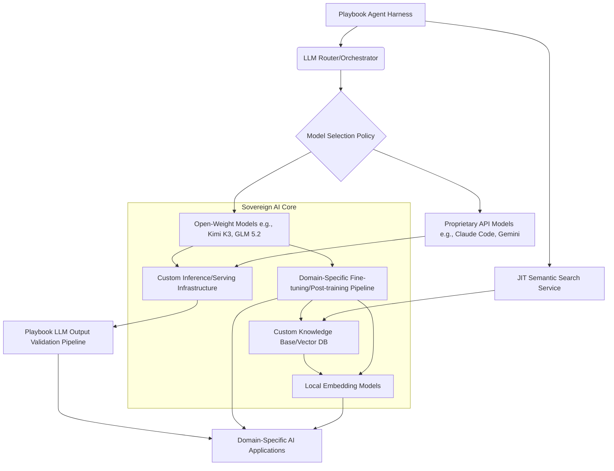

소버린 AI(Sovereign AI)는 AI 애플리케이션의 핵심 지능 계층(intelligence layer)에 대한 소유권을 확보하고, 이를 통해 경쟁 우위를 확보하는 전략적 접근 방식입니다. 이는 단순히 외부 LLM API를 호출하는 것을 넘어, 제품의 학습 방식과 성능을 좌우하는 AI 모델의 커스터마이징, 배포, 그리고 지속적인 개선 프로세스를 내재화하는 것을 의미합니다. 2026년 현재, 오픈 웨이트(Open-Weight) 모델과 독립적인 사후 학습(post-training) 기술의 발전은 이러한 소버린 AI 전략을 현실화하는 중요한 초석이 되고 있습니다.

## 지능 계층 소유권의 중요성
기존 AI 애플리케이션 개발은 대부분 클라우드 기반의 대규모 언어 모델(LLM) API에 의존했습니다. 이는 빠른 개발과 높은 성능을 제공했지만, 다음과 같은 한계를 내포합니다:

*   **벤더 종속성(Vendor Lock-in)**: 특정 클라우드 LLM 제공자에 대한 의존성 심화로 인한 유연성 저하.
*   **비용 예측 불가능성(Unpredictable Costs)**: API 호출량에 따른 비용 변동성이 높아 장기적인 운영 계획 수립에 어려움.
*   **데이터 주권 및 보안(Data Sovereignty & Security)**: 민감한 데이터를 외부 LLM에 전송해야 할 경우 발생하는 보안 및 규제 준수 문제.
*   **커스터마이징 한계(Customization Limitations)**: 일반적인 모델은 특정 도메인이나 기업의 고유한 요구사항에 완벽하게 부합하기 어렵습니다.

소버린 AI 전략은 이러한 한계를 극복하고, 기업의 핵심 AI 역량을 내재화하여 장기적인 경쟁력을 확보하는 데 목표를 둡니다. 이는 `playbook`의 AI 에이전트 하네스(Agent Harness)가 단순 API 호출을 넘어, 자체 지능을 제어하고 발전시키는 로드맵의 핵심입니다.

## 오픈 웨이트 모델과 사후 학습 활용
Kimi K3, GLM 5.2, Llama-3, Mistral, Gemma와 같은 오픈 웨이트 모델들은 특정 도메인에 특화된 사후 학습(Supervised Fine-Tuning, SFT) 또는 온라인 학습(Online Learning)을 적용하여 고유한 지능을 구축할 수 있는 기회를 제공합니다. `playbook`의 컨텍스트에서는 특히 다음 분야에 이식 가능성을 탐색할 수 있습니다:

### 1. 도메인 특화 지식 통합
`playbook`의 AI 에이전트는 Android AI 개발이나 프로젝트 관제와 같은 특정 도메인에서 고도로 전문화된 작업을 수행합니다. 오픈 웨이트 모델에 `playbook`의 고유한 코드베이스, 내부 문서, 프로젝트 히스토리 데이터를 추가 학습(fine-tuning)시켜 특정 도메인에 최적화된 지능을 구축할 수 있습니다. 이는 에이전트의 코드 이해도, 문제 해결 능력, 그리고 컨텍스트 인지 능력을 비약적으로 향상시킵니다.

### 2. LLM 출력 검증 파이프라인 강화
현재 `playbook`은 LLM 출력 검증 파이프라인을 갖추고 있지만, 오픈 웨이트 모델을 활용하면 검증 로직 자체를 더욱 세밀하게 제어할 수 있습니다. 예를 들어, 특정 코드 패턴의 준수 여부, 보안 취약점 패턴 감지, 또는 `playbook`의 고유한 코딩 가이드라인 준수 여부 등을 자체 학습된 모델로 검증하여 외부 LLM의 할루시네이션(Hallucination) 및 드리프트(drift) 문제를 줄일 수 있습니다.

### 3. JIT 의미 검색을 위한 로컬 임베딩 모델 관리
JIT(Just-In-Time) 의미 검색은 `playbook` 에이전트의 효율적인 컨텍스트 관리의 핵심입니다. 로컬 임베딩 모델은 코드베이스와 문서의 의미를 파악하는 데 필수적입니다. 소버린 AI 전략 하에서는 이러한 임베딩 모델 자체를 오픈 웨이트 모델(예: `E5-multilingual`, `MiniLM`)을 기반으로 커스터마이징하고, `playbook`의 데이터 특성에 맞게 지속적으로 업데이트하는 전략을 수립할 수 있습니다. 이는 검색 정확도를 높이고, 새로운 지식의 반영 속도를 가속화합니다.

## 아키텍처 다이어그램


## 코드 예시: 오픈 웨이트 모델 로드 및 미니 파인튜닝
이 예시는 Hugging Face `transformers` 라이브러리를 사용하여 오픈 웨이트 모델을 로드하고, `playbook`의 특정 데이터셋으로 QLoRA(Quantized LoRA) 기반의 미니 파인튜닝을 수행하는 개념적인 파이썬 코드입니다. 실제 프로덕션 환경에서는 더 복잡한 데이터 파이프라인과 MLOps가 필요합니다.

```python
from transformers import AutoTokenizer, AutoModelForCausalLM, BitsAndBytesConfig
from peft import LoraConfig, get_peft_model, prepare_model_for_kbit_training
from datasets import Dataset
import torch

# 1. 모델 및 토크나이저 로드 (예: Kimi K3, GLM 5.2의 유사 모델)
model_name = "mistralai/Mistral-7B-Instruct-v0.2" # 실제 Kimi K3, GLM 5.2 대체
tokenizer = AutoTokenizer.from_pretrained(model_name)
tokenizer.pad_token = tokenizer.eos_token # 패딩 토큰 설정

# 2. 4-bit 양자화 설정 (메모리 최적화)
quant_config = BitsAndBytesConfig(
    load_in_4bit=True,
    bnb_4bit_quant_type="nf4",
    bnb_4bit_compute_dtype=torch.bfloat16,
    bnb_4bit_use_double_quant=True,
)

model = AutoModelForCausalLM.from_pretrained(
    model_name,
    quantization_config=quant_config,
    device_map="auto"
)

# 3. LoRA 설정 (Efficient Fine-tuning)
lora_config = LoraConfig(
    r=16, # LoRA 계층의 랭크
    lora_alpha=32, # LoRA 스케일링 팩터
    target_modules=["q_proj", "v_proj"], # LoRA를 적용할 모듈
    lora_dropout=0.05,
    bias="none",
    task_type="CAUSAL_LM"
)

model = prepare_model_for_kbit_training(model)
model = get_peft_model(model, lora_config)

# 4. playbook 도메인 데이터셋 준비 (예시)
# 실제 데이터는 {code_snippets, android_docs, project_logs} 등
data = {
    "text": [
        "### Playbook Context Engineering Guide\nJIT semantic search is crucial for agent context management.",
        "### Android AI Development\nUsing on-device LLMs like Gemini Nano requires quantization strategies.",
        "### Project Orchestration\nAutomated task decomposition improves agent efficiency."
    ]
}
dataset = Dataset.from_dict(data)

def tokenize_function(examples):
    return tokenizer(examples["text"], truncation=True, max_length=512)

tokenized_dataset = dataset.map(tokenize_function, batched=True)

# 5. 파인튜닝 (훈련 루프는 'Trainer' 또는 커스텀 루프로 구현)
# from transformers import TrainingArguments, Trainer
# training_args = TrainingArguments(
#     output_dir="./playbook-fine-tuned-model",
#     per_device_train_batch_size=4,
#     gradient_accumulation_steps=4,
#     num_train_epochs=3,
#     learning_rate=2e-4,
#     logging_steps=10,
#     optim="paged_adamw_8bit",
#     lr_scheduler_type="cosine",
#     warmup_ratio=0.03,
# )
# trainer = Trainer(
#     model=model,
#     args=training_args,
#     train_dataset=tokenized_dataset,
# )
# trainer.train()

print("Model loaded and LoRA configured for playbook domain-specific fine-tuning.")
```

## 트레이드오프

1.  **초기 구축 비용 vs. 장기 운영 효율성**: 소버린 AI는 초기 모델 선택, 인프라 구축, 데이터 파이프라인 마련에 상당한 투자와 전문 지식이 필요합니다. 그러나 장기적으로는 외부 API 비용 절감, 커스터마이징을 통한 성능 최적화, 데이터 보안 강화로 이어져 운영 효율성이 증대됩니다.
    *   **언제 좋고**: 높은 수준의 데이터 보안, 독점적인 도메인 지식 활용, 예측 가능한 비용 모델이 중요한 경우.
    *   **언제 나쁜지**: 빠른 시장 출시와 최소한의 초기 투자로 AI 기능을 도입해야 하는 경우.

2.  **모델 관리 복잡성 vs. 지능 계층 제어**: 오픈 웨이트 모델을 활용한 소버린 AI는 모델 학습, 배포, 모니터링, 업데이트 등 MLOps 측면에서 높은 복잡성을 요구합니다. 하지만 이러한 복잡성을 수용하면 AI 모델의 동작 방식, 성능, 데이터 처리 방식에 대한 완전한 제어권을 얻을 수 있습니다.
    *   **언제 좋고**: AI 모델의 핵심 로직을 완전히 통제하고, 커스텀 요구사항에 맞춰 모델을 지속적으로 발전시켜야 하는 경우.
    *   **언제 나쁜지**: MLOps 전문 인력이나 인프라가 부족하여 모델 관리 부담이 큰 경우.

3.  **성능 보장 vs. 유연성 및 차별화**: 대규모 클라우드 LLM은 일반적으로 안정적이고 높은 성능을 제공합니다. 반면 오픈 웨이트 모델은 직접 최적화가 필요할 수 있습니다. 하지만 이 과정에서 `playbook`의 고유한 도메인에 특화된 유연한 모델을 구축하여 차별화된 성능을 달성할 수 있습니다.
    *   **언제 좋고**: 범용 AI가 아닌 특정 비즈니스 도메인에서 독보적인 성능이 요구되며, 이를 통해 경쟁 우위를 확보하고자 할 때.
    *   **언제 나쁜지**: 범용적인 태스크에 대한 검증된 성능과 안정성이 최우선이며, 자체 커스터마이징의 이점이 크지 않은 경우.

## 실전 체크리스트

*   [ ] **도메인 특화 데이터셋 구축**: `playbook`의 코드베이스, 기술 문서, 프로젝트 히스토리, Android AI 관련 데이터 등 파인튜닝에 필요한 고품질의 도메인 특화 데이터셋이 충분히 준비되었는지 확인합니다.
*   [ ] **오픈 웨이트 모델 후보 평가**: Kimi K3, GLM 5.2, Llama-3, Mistral, Gemma 등 `playbook`의 요구사항(언어, 컨텍스트 길이, 추론 성능)에 가장 적합한 오픈 웨이트 모델 후보를 선정하고 초기 벤치마킹을 수행했는지 확인합니다.
*   [ ] **파인튜닝 전략 및 인프라 계획**: QLoRA, LoRA와 같은 효율적인 파인튜닝 기법 적용 계획과 필요한 GPU 자원 및 MLOps 파이프라인 구축 계획이 수립되었는지 확인합니다.
*   [ ] **로컬 임베딩 모델 관리 전략**: JIT 의미 검색에 사용될 로컬 임베딩 모델의 업데이트 주기, 버전 관리, 그리고 `playbook` 지식 그래프와의 동기화 전략이 명확하게 정의되었는지 확인합니다.
*   [ ] **LLM 출력 검증 파이프라인 통합**: 자체 학습된 오픈 웨이트 모델이 기존 Claude Code 하네스 및 Gemini를 활용한 LLM 출력 검증 파이프라인에 어떻게 통합되어 검증 정확도를 높일 것인지 설계가 완료되었는지 확인합니다.
*   [ ] **보안 및 규제 준수 검토**: 소버린 AI 도입 시 데이터 처리 방식이 기업의 보안 정책 및 GDPR, CCPA와 같은 데이터 규제 준수 요구사항을 충족하는지 검토하고 필요한 조치를 마련했는지 확인합니다.
*   [ ] **성능 및 비용 모니터링 시스템 구축**: 자체 모델 배포 후 추론 성능(Latency, Throughput)과 GPU 자원 사용량, 운영 비용을 지속적으로 모니터링하고 최적화할 수 있는 시스템이 구축되었는지 확인합니다.
