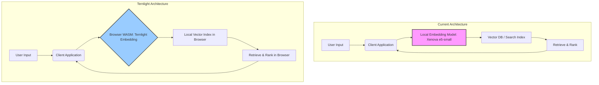

JIT (Just-In-Time) 의미 검색은 사용자 질의에 대한 관련성 높은 정보를 실시간으로 제공하여 검색 경험을 혁신하는 핵심 기술입니다. 현재 시스템에서는 'Xenova multilingual-e5-small'과 같은 로컬 임베딩 모델을 활용하여 의미 검색을 수행하고 있으나, 모델 크기와 리소스 사용량 측면에서 최적화의 여지가 존재합니다. 특히 클라이언트 측에서 직접 임베딩을 처리할 경우 발생하는 지연 시간과 기기 부담은 사용자 경험에 직접적인 영향을 미칩니다. 이러한 맥락에서 브라우저(WASM) 환경에서 실행되는 경량 임베딩 모델인 Ternlight의 도입은 임베딩 처리 속도 및 리소스 효율성 개선을 위한 중요한 기회로 평가됩니다.

## Ternlight의 핵심 가치

Ternlight는 서버 호출 없이 브라우저 내에서 텍스트 임베딩과 유사도 검색을 수행할 수 있도록 설계된 혁신적인 임베딩 모델입니다. 주요 특징은 다음과 같습니다.

*   **경량화된 모델 크라기**: 엔진과 가중치를 합쳐 기본 패키지는 7MB, mini 변형은 5MB에 불과합니다. 이는 'Xenova multilingual-e5-small'과 같은 기존 모델 대비 훨씬 작은 footprint를 제공합니다.
*   **CPU 기반 동작**: GPU 없이 CPU에서 효율적으로 동작하여 다양한 기기 환경에서의 배포 유연성을 높입니다. 특히 저사양 기기나 배터리 소모에 민감한 모바일 환경에서 강점을 가집니다.
*   **WASM 기반 브라우저 실행**: WebAssembly(WASM)를 통해 브라우저에서 직접 실행되므로, 클라이언트 측에서 임베딩을 생성하고 유사도 검색을 수행하여 네트워크 지연을 최소화하고 사용자 데이터를 외부로 전송할 필요가 없어 개인 정보 보호에 유리합니다.

이러한 특성들은 Ternlight가 작은 클라이언트 측 의미 검색을 빠르게 구성하고, 온디바이스 AI 및 엣지 컴퓨팅 트렌드에 부합하는 솔루션이 될 수 있음을 시사합니다.

## Ternlight를 활용한 임베딩 아키텍처

현재 JIT 의미 검색 로컬 임베딩 시스템은 서버 또는 로컬 환경에서 `Xenova multilingual-e5-small`과 같은 비교적 큰 모델을 사용하여 텍스트를 임베딩합니다. Ternlight를 도입하면 이 임베딩 과정이 클라이언트 브라우저로 이동하게 됩니다. 이는 다음과 같은 아키텍처 변화를 가져올 수 있습니다.



## Ternlight 사용 예제 (JavaScript/TypeScript)

Ternlight는 JavaScript 환경에서 쉽게 통합될 수 있습니다. 다음은 주어진 텍스트를 임베딩하는 기본적인 코드 예제입니다.

```typescript
import { Ternlight } from 'ternlight'; // Ternlight 라이브러리 가정

async function embedTextWithTernlight(text: string): Promise<number[] | null> {
  try {
    // Ternlight 모델 로드 (WASM 모듈 및 가중치)
    // 실제 Ternlight 라이브러리 사용법에 따라 다를 수 있음
    const model = await Ternlight.loadModel();

    // 텍스트 임베딩 생성
    const embedding = await model.embed(text);

    console.log(`Text: "${text}"`);
    console.log(`Embedding (first 5 dimensions): ${embedding.slice(0, 5)}...`);
    console.log(`Embedding dimension: ${embedding.length}`);

    return embedding;
  } catch (error) {
    console.error('Error embedding text with Ternlight:', error);
    return null;
  }
}

// 사용 예시
embedTextWithTernlight('안녕하세요, Ternlight 임베딩 테스트입니다.');
embedTextWithTernlight('This is a test sentence for Ternlight embedding.');
```

이 코드 스니펫은 `Ternlight.loadModel()`을 통해 모델을 로드하고, `model.embed(text)`를 호출하여 텍스트 임베딩을 얻는 과정을 보여줍니다. 실제 라이브러리 인터페이스는 Ternlight의 공식 문서에 따라 다를 수 있습니다.

## 트레이드오프

Ternlight 도입을 검토할 때 다음과 같은 트레이드오프를 고려해야 합니다.

*   **정확도 vs. 리소스 효율성**: Ternlight는 경량 모델이므로, `multilingual-e5-small`과 같은 더 큰 모델 대비 임베딩의 의미론적 정확도가 낮을 수 있습니다. 언제 좋으냐면, 클라이언트 측 자원이 제한적이거나, 응답 속도가 최우선이며, 미세한 정확도 저하가 허용될 때 유리합니다. 언제 나쁘냐면, 고도의 의미론적 이해와 높은 검색 정확도가 필수적인 복잡한 도메인에서는 불리할 수 있습니다.
*   **클라이언트 측 처리 vs. 서버 측 처리**: Ternlight는 클라이언트 측에서 임베딩을 처리하여 네트워크 지연을 줄이고 개인 정보 보호를 강화합니다. 언제 좋으냐면, 실시간 상호작용이 중요하고 사용자 데이터가 브라우저를 벗어나지 않아야 하는 시나리오(예: 오프라인 모드 지원, 민감 정보 검색)에 적합합니다. 언제 나쁘냐면, 클라이언트 기기의 컴퓨팅 파워가 매우 낮거나, 중앙 집중식 모델 관리 및 업데이트가 필요한 경우, 또는 서버 측에서 대규모 임베딩 캐싱 및 재사용이 더 효율적인 경우에는 불리합니다.
*   **WASM 생태계 성숙도 vs. 기존 LLM 생태계**: WASM 기반 AI 모델은 아직 발전 초기 단계로, 기존 Python/CUDA 기반 LLM 생태계만큼 성숙하지 않을 수 있습니다. 언제 좋으냐면, 새로운 기술 스택을 도입하여 혁신적인 클라이언트 솔루션을 구축하려는 경우에 기회가 됩니다. 언제 나쁘냐면, 안정성과 광범위한 커뮤니티 지원, 풍부한 도구 모음이 중요한 프로덕션 환경에서는 초기 도입 리스크가 따를 수 있습니다.
*   **다국어 지원 범위**: Ternlight의 다국어 지원 범위와 성능이 `multilingual-e5-small`만큼 광범위하거나 강력하지 않을 수 있습니다. 언제 좋으냐면, 주로 단일 언어 또는 제한된 언어 셋을 지원하는 애플리케이션에 적합하며, 해당 언어에서 충분한 성능을 보장하는 경우입니다. 언제 나쁘냐면, 다양한 언어에 걸쳐 높은 수준의 의미 검색 정확도가 요구되는 글로벌 서비스에는 부적합할 수 있습니다.

## 실전 체크리스트

Ternlight를 프로젝트에 성공적으로 도입하기 위해 다음 항목들을 검증해야 합니다.

- [ ] **임베딩 품질 평가**: Ternlight 모델의 임베딩이 현재 `Xenova multilingual-e5-small` 모델 대비 관련성 및 검색 정확도 지표(예: Recall@k, NDCG)에서 허용 가능한 수준의 성능을 제공하는지 확인합니다.
- [ ] **성능 벤치마킹**: 다양한 브라우저 환경 (데스크톱, 모바일)에서 Ternlight의 실제 임베딩 처리 속도 및 Latency를 측정하고, `Xenova` 모델 또는 서버 측 임베딩 방식과 비교하여 목표 성능 지표를 충족하는지 검증합니다.
- [ ] **리소스 사용량 모니터링**: 클라이언트 기기(CPU, 메모리, 배터리)의 Ternlight 실행 시 리소스 사용량을 정량적으로 모니터링하고, 기존 `Xenova` 모델 대비 최적화 목표치 (예: CPU 사용량 30% 감소, 메모리 50% 감소) 달성 여부를 확인합니다.
- [ ] **언어 커버리지 검토**: 현재 및 미래의 JIT 검색 요구사항에 필요한 언어들이 Ternlight에 의해 충분히 지원되며, 각 언어별 임베딩 품질이 적합한지 상세히 검토합니다.
- [ ] **통합 및 번들 크기 영향 분석**: Ternlight 라이브러리를 애플리케이션에 통합하는 용이성을 평가하고, 최종 빌드/번들 크기에 미치는 영향을 분석하여 배포 효율성에 문제가 없는지 확인합니다.
- [ ] **모델 유지보수 및 업데이트 전략**: Ternlight 모델 업데이트 주기를 파악하고, 업데이트 시 임베딩 품질 변화를 모니터링하며, 이를 프로덕션 환경에 안정적으로 적용할 수 있는 전략을 수립합니다.
- [ ] **온디바이스 배포 보안 검증**: 브라우저 환경에서 임베딩 모델을 실행할 때 발생할 수 있는 잠재적 보안 취약점 (예: 모델 변조, 데이터 유출)을 식별하고, 이에 대한 대응 방안 및 검증 절차를 마련합니다.