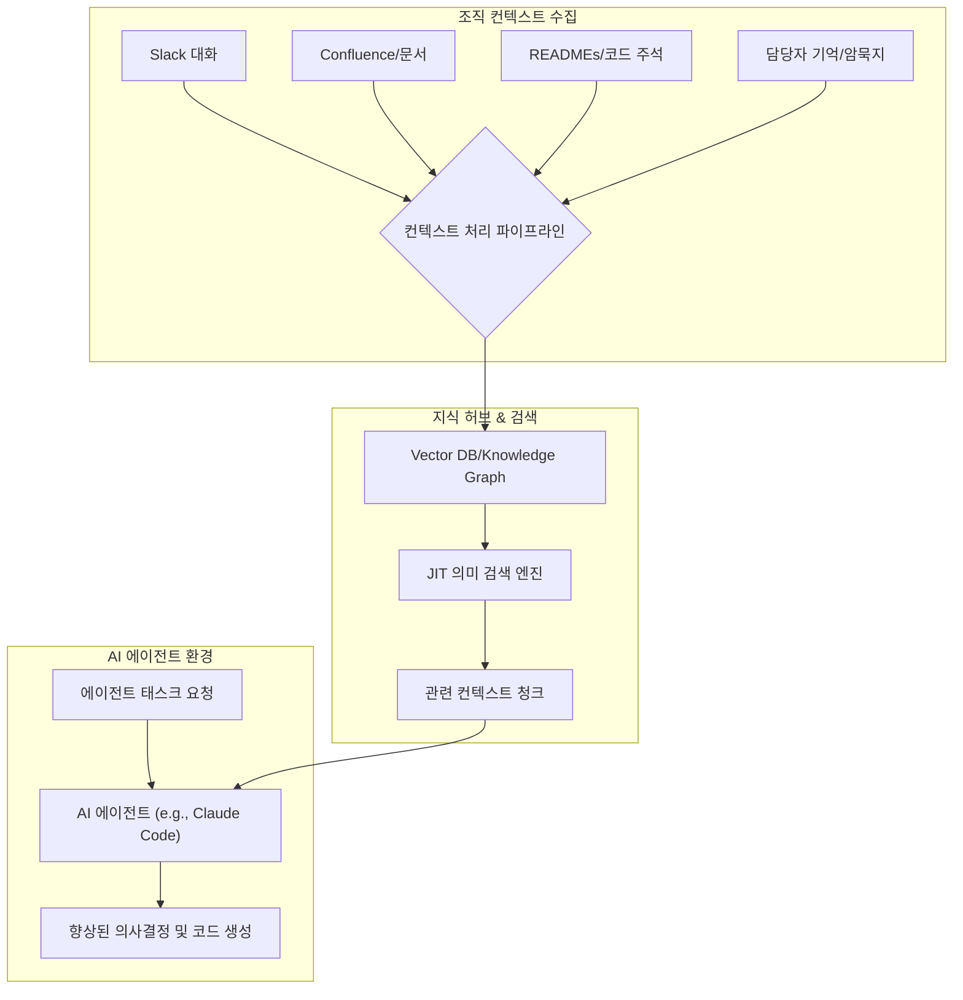

조직의 AI 코딩 환경에서 에이전트가 기술적으로는 정확하지만 운영상 잘못된 결정을 내리는 문제는 흔히 발생합니다. 이는 AI 에이전트가 최신 코드베이스나 문서 외에 팀 내부의 암묵적 지식, 과거 논의, 오래된 결정 배경 등 '조직 컨텍스트(Organizational Context)'를 충분히 이해하지 못하기 때문입니다. Spotify의 Xirp는 이 문제를 해결하기 위해 Slack 대화, 담당자의 기억, 오래된 README, Confluence 등에 흩어진 분산된 조직 컨텍스트를 통합하여 AI 코딩 환경을 강화하는 사례입니다. 이 문서에서는 Xirp의 접근 방식을 분석하고, 'Karpathy LLM Wiki 패턴'과 'JIT 의미 검색(Semantic Search)'을 통해 AI 에이전트와 지식 허브를 효과적으로 강화하는 전략을 제시합니다.

## 조직 컨텍스트의 중요성 및 AI 에이전트의 한계

최신 LLM 기반 AI 에이전트는 코드 생성, 디버깅, 문서화 등 다양한 개발 작업을 가속화합니다. 그러나 이러한 에이전트들은 주로 정형화된 코드와 공식 문서에 기반하여 학습되므로, 비공식적인 지식이나 최신 변경사항의 배경에 대한 이해가 부족할 수 있습니다. 예를 들어, 특정 API가 더 이상 사용되지 않아야 하는 이유가 과거 팀 논의나 특정 장애 경험에 있다는 것을 AI는 알지 못할 수 있습니다. 이는 AI가 `기술적으로는 가능한` 코드를 생성하더라도 `운영상 부적절하거나 심지어 위험한` 결정을 내릴 수 있는 근본적인 원인이 됩니다.

Xirp는 이러한 지식 격차(knowledge gap)가 단순히 문서 부족이 아니라, 파편화된 지식을 `검색(Retrieval)`하고 `통합`하는 문제임을 인식했습니다. 조직 내부에 존재하는 풍부한 지식—Slack 스레드, JIRA 코멘트, 이메일, 개인의 기억, 변경 이력 등—이 AI 에이전트에게 전달되지 못하는 상황을 개선하는 것이 핵심입니다.

## Xirp의 컨텍스트 통합 전략

Xirp는 조직 컨텍스트를 수집하고 AI 에이전트에 제공하기 위해 다음 요소를 통합합니다:

*   **비공식 커뮤니케이션 채널**: Slack, Microsoft Teams 등의 대화 내용을 분석하여 특정 기술 결정, 문제 해결 과정, 트레이드오프 등에 대한 논의를 추출합니다.
*   **내부 문서 및 위키**: Confluence, Notion, README 파일, 코드 주석 등 기존의 모든 문서화된 지식을 수집합니다. 특히 오래된 README나 잘 업데이트되지 않은 Confluence 페이지도 중요한 과거 컨텍스트를 포함할 수 있습니다.
*   **코드 변경 이력 및 PR 논의**: Git 커밋 메시지, Pull Request(PR)의 논의 스레드는 코드 변경의 배경과 의도를 파악하는 데 결정적인 정보를 제공합니다.
*   **인간 전문가의 지식**: 특정 도메인 전문가의 암묵적 지식을 인터뷰나 질의응답을 통해 명시화하고, 이를 지식 허브에 통합합니다.

이렇게 수집된 데이터는 단순한 텍스트 덩어리가 아니라, AI 에이전트가 이해하고 활용할 수 있는 형태로 가공되어야 합니다. 여기서 'Karpathy LLM Wiki 패턴'과 'JIT 의미 검색'이 중요한 역할을 합니다.

## Karpathy LLM Wiki 패턴을 통한 지식 구조화

'Karpathy LLM Wiki 패턴'은 LLM이 활용할 수 있도록 지식을 구조화하고 상호 연결하는 방법론입니다. Xirp의 경우, 분산된 조직 컨텍스트를 이 패턴에 따라 정제하고 통합하여 AI 에이전트의 '장기 기억(Long-Term Memory)' 역할을 하는 지식 허브를 구축할 수 있습니다. 이 허브는 단순히 문서를 저장하는 것을 넘어, 각 지식 조각(knowledge chunk) 간의 관계를 그래프 형태로 연결하여 AI가 추론할 수 있는 기반을 제공합니다.

```python
import hashlib
from datetime import datetime

class KnowledgeChunk:
    def __init__(self, content: str, source: str, timestamp: datetime, metadata: dict = None):
        self.content = content
        self.source = source
        self.timestamp = timestamp
        self.metadata = metadata if metadata is not None else {}
        self.id = self._generate_id()

    def _generate_id(self):
        # Simple hash of content and source for unique ID
        return hashlib.sha256((self.content + self.source).encode()).hexdigest()

    def to_dict(self):
        return {
            "id": self.id,
            "content": self.content,
            "source": self.source,
            "timestamp": self.timestamp.isoformat(),
            "metadata": self.metadata
        }

# Example usage: Processing a Slack conversation snippet
def process_slack_message(message: str, channel: str, user: str, msg_time: datetime):
    chunk = KnowledgeChunk(
        content=message,
        source=f"Slack/{channel}/{user}",
        timestamp=msg_time,
        metadata={
            "type": "conversation",
            "author": user,
            "channel": channel
        }
    )
    return chunk

# This processed chunk would then be embedded and stored in a vector database
# and linked in a knowledge graph for 'Karpathy LLM Wiki' pattern.
```

이러한 지식 조각들은 임베딩되어 벡터 데이터베이스에 저장되고, 지식 그래프 형태로 상호 연결됩니다. 이는 AI 에이전트가 특정 코드 변경의 배경, 특정 기술 스택의 도입 결정 과정, 과거 시스템 장애의 근본 원인 등을 종합적으로 파악할 수 있도록 돕습니다.

## JIT 의미 검색을 통한 동적 컨텍스트 제공

AI 에이전트가 특정 작업을 수행할 때, 모든 조직 컨텍스트를 한꺼번에 제공하는 것은 비효율적이며 토큰 비용 문제로 이어집니다. 'JIT 의미 검색(Just-In-Time Semantic Search)'은 에이전트의 현재 작업(task)과 관련된 가장 적절하고 최신 정보를 동적으로 검색하여 컨텍스트로 주입하는 방식입니다. Xirp는 이 방식을 통해 AI 에이전트(예: Claude Code 하네스)에게 필요한 시점에 정확한 컨텍스트를 제공하여 의사결정의 품질을 높입니다.

이 과정은 다음과 같이 이루어집니다:

1.  **에이전트 태스크 분석**: AI 에이전트가 해결해야 할 문제나 생성해야 할 코드의 목적을 분석합니다.
2.  **질의 생성**: 태스크 분석 결과를 바탕으로 지식 허브에 질의할 '의미 검색 쿼리(Semantic Search Query)'를 생성합니다.
3.  **의미 검색 실행**: 벡터 데이터베이스에서 가장 유사한 의미를 가진 지식 조각들을 검색합니다.
4.  **컨텍스트 구성 및 주입**: 검색된 지식 조각들을 AI 에이전트의 프롬프트 컨텍스트에 포함시켜 에이전트가 상황을 정확히 인지하고 작업을 수행하도록 합니다.



## AI 에이전트 하네스 강화: Claude Code 적용

Xirp의 사례는 'Claude Code 하네스'와 같은 AI 코딩 환경에서 조직 컨텍스트를 통합하는 중요한 청사진을 제공합니다. Claude Code 에이전트는 제공된 컨텍스트 내에서 추론하고 코드를 생성하므로, 풍부하고 정확한 조직 컨텍스트는 다음과 같은 방식으로 에이전트의 성능을 극대화합니다.

*   **오류 감소**: 과거 장애 원인, 특정 컴포넌트의 제약 사항 등 운영 관련 지식을 제공하여 AI가 현실적인 제약 조건 내에서 코드를 생성하게 합니다.
*   **생산성 향상**: 불필요한 반복 작업이나 잘못된 방향으로의 탐색을 줄여 개발 주기를 단축합니다.
*   **일관성 유지**: 조직의 코딩 표준, 아키텍처 원칙, 선호하는 라이브러리 등을 컨텍스트로 제공하여 생성된 코드의 일관성을 높입니다.
*   **인간과의 협업 강화**: AI가 단순히 코드를 생성하는 것을 넘어, 왜 특정 방식으로 코드를 작성했는지에 대한 '이유(rationale)'를 제공할 수 있게 되어 인간 개발자와의 협업 품질을 향상시킵니다.

## 트레이드오프

### 1. 컨텍스트 수집 및 처리 비용 vs. AI 의사결정 품질 향상
*   **언제 좋은가**: AI 에이전트의 의사결정 오류로 인한 잠재적 손실(예: 운영 장애, 재작업)이 크고, 조직 내 지식 파편화가 심할 때 매우 효과적입니다. 초기 투자 비용이 크더라도 장기적인 효율성과 안정성 확보에 기여합니다.
*   **언제 나쁜가**: AI 에이전트의 역할이 단순하거나, 조직 규모가 작아 지식 공유가 활발하며, 의사결정 오류의 파급력이 미미한 경우 과도한 투자일 수 있습니다. 컨텍스트 처리 파이프라인 유지보수 비용이 이득을 상회할 수 있습니다.

### 2. 컨텍스트 최신성 vs. 데이터 보안 및 프라이버시
*   **언제 좋은가**: 최신 논의나 내부 정보가 AI 에이전트의 작업에 필수적이며, 민감한 정보의 노출 위험을 통제할 수 있는 강력한 보안 및 필터링 시스템이 구축되어 있을 때 유용합니다. 적절한 필터링으로 유효한 정보만 제공하여 AI의 실시간 대응 능력을 높일 수 있습니다.
*   **언제 나쁜가**: 민감한 고객 정보, 기밀 프로젝트 데이터 등이 컨텍스트에 포함될 위험이 있으며, 이를 효과적으로 마스킹하거나 접근을 제어할 수 있는 시스템이 미비할 경우 심각한 보안 및 규제 위반 문제를 야기할 수 있습니다.

### 3. 지식 그래프/벡터 DB 복잡성 vs. 검색 정확도 및 추론 능력
*   **언제 좋은가**: AI 에이전트가 복잡한 시스템 간의 관계, 장기적인 기술 부채의 원인 등을 이해하고 추론해야 할 때, 잘 구조화된 지식 그래프와 정교한 벡터 DB는 압도적인 검색 정확도와 심층 추론 능력을 제공합니다. 특히 대규모, 고도화된 시스템에서 AI의 '전문성'을 높이는 데 기여합니다.
*   **언제 나쁜가**: 단순 질의응답이나 코드 스니펫 생성과 같이 컨텍스트의 복잡성이 낮은 작업에는 과도한 인프라 및 관리 비용을 초래할 수 있습니다. 지식 그래프 구축 및 유지는 높은 전문성과 지속적인 노력을 요구합니다.

## 실전 체크리스트

이 지식 엔트리의 개념을 프로젝트에 적용할 때 다음 사항들을 검증해야 합니다.

- [ ] **조직 컨텍스트 소스 식별 완료**: Slack, Confluence, README, 코드 주석 등 AI 에이전트에게 필요한 모든 비정형/반정형 지식 소스를 식별하고 목록화했는가?
- [ ] **컨텍스트 수집 및 정제 파이프라인 구축**: 식별된 소스로부터 데이터를 자동으로 수집하고, 노이즈 제거, 정규화, 청크 분할 등을 수행하는 파이프라인이 구현되었는가?
- [ ] **Karpathy LLM Wiki 패턴 적용 여부**: 수집된 컨텍스트를 LLM이 활용할 수 있는 구조(지식 조각, 메타데이터, 상호 연결 관계)로 변환하여 지식 허브를 구축했는가?
- [ ] **JIT 의미 검색 엔진 통합**: AI 에이전트가 태스크 수행 중 필요한 시점에 관련 컨텍스트를 동적으로 검색하여 프롬프트에 주입하는 JIT 검색 로직이 구현되었는가?
- [ ] **컨텍스트 기반 AI 에이전트 성능 측정 지표 정의**: 조직 컨텍스트 주입 전후의 AI 에이전트의 코드 생성 품질, 오류율, 작업 완료 시간 등을 측정할 구체적인 KPI를 정의했는가?
- [ ] **데이터 보안 및 프라이버시 정책 준수**: 민감 정보가 AI 컨텍스트에 노출되지 않도록 데이터 마스킹, 접근 제어, 감사 로그 등 보안 및 프라이버시 준수 메커니즘이 작동하는가?
- [ ] **지식 허브 유지보수 및 업데이트 전략 수립**: 조직 컨텍스트의 최신성을 유지하기 위한 자동화된 업데이트 주기, stale 컨텍스트 처리 정책, 그리고 인간 전문가의 피드백 루프가 계획되어 있는가?
```