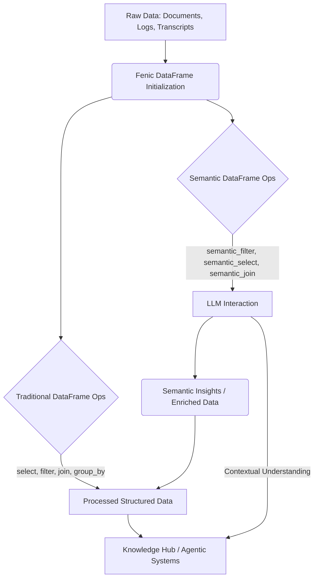

## 시맨틱 데이터프레임(fenic): LLM과 결합된 지능형 데이터 처리
시맨틱 데이터프레임(Semantic DataFrames)은 LLM(Large Language Models)의 강력한 언어 이해 능력을 기존의 정형 데이터 처리 프레임워크에 통합하는 혁신적인 접근 방식입니다. `fenic` 라이브러리는 PySpark/SQL 스타일의 전통적인 데이터 연산 (select, filter, join, group_by, agg)과 언어 모델을 호출하는 시맨틱 연산자를 하나의 쿼리 모델 안에서 함께 다룹니다. 이는 문서, 트랜스크립트, 로그 등 비정형 데이터와 구조화된 메타데이터를 동시에 처리하고, LLM의 지능을 활용하여 데이터에서 새로운 인사이트를 추출하는 데 매우 효과적입니다.

### fenic의 등장 배경 및 필요성
기존 데이터 처리 환경에서는 정형 데이터(데이터베이스, CSV)와 비정형 데이터(텍스트, 이미지)를 별도의 도구와 파이프라인으로 처리해야 했습니다. 특히 LLM 시대에 접어들면서, 방대한 양의 비정형 텍스트 데이터에서 의미를 추출하고, 이를 구조화된 정보와 결합하여 활용하는 것이 중요해졌습니다. `fenic`은 이러한 요구사항에 대한 해답으로, 데이터 엔지니어링 파이프라인 내에서 LLM 호출을 자연스럽게 통합하여 다음을 가능하게 합니다.

*   **통합된 쿼리 모델**: SQL/DataFrame API에 익숙한 사용자도 LLM 기반의 복잡한 텍스트 분석을 쉽게 수행할 수 있습니다.
*   **향상된 JIT 의미 검색**: 실시간으로 필요한 컨텍스트를 LLM의 도움을 받아 의미론적으로 검색하고 필터링함으로써, 에이전트(Agent) 시스템의 의사결정 품질을 높일 수 있습니다.
*   **지식 허브 강화**: 문서, 로그, 트랜스크립트 등의 원시 데이터를 단순히 저장하는 것을 넘어, `fenic`을 통해 의미를 추출하고 연결하여 지식 허브의 구조화된 데이터 처리 능력을 비약적으로 향상시킵니다.
*   **에이전트 데이터 처리 효율화**: AI 에이전트가 외부 도구 호출 없이 데이터프레임 연산을 통해 필요한 정보를 자체적으로 탐색하고 가공할 수 있도록 지원합니다.

### fenic 아키텍처 및 동작 원리
`fenic`은 기존 Pandas DataFrame이나 유사한 구조를 내부적으로 활용하면서, SemanticEngine이라는 추상화 계층을 통해 외부 LLM과 상호작용합니다. 사용자는 `semantic_filter`, `semantic_select`, `semantic_join`과 같은 새로운 연산자를 사용하여 LLM에게 데이터에 대한 질의를 던질 수 있습니다.

#### 핵심 컴포넌트
1.  **DataFrame (fenic.DataFrame)**: Pandas DataFrame과 유사한 API를 제공하지만, 시맨틱 연산자를 추가로 지원합니다.
2.  **SemanticEngine**: LLM과의 통신을 담당하는 인터페이스입니다. 실제 LLM API (OpenAI, Anthropic 등)를 호출하고, LLM의 응답을 파싱하여 DataFrame 연산에 필요한 형태로 변환합니다.
3.  **쿼리 옵티마이저**: 전통적인 연산과 시맨틱 연산을 효율적으로 조합하고, LLM 호출 횟수 및 비용을 최적화하는 전략을 포함할 수 있습니다.

#### 데이터 처리 흐름
`fenic`은 데이터를 로드한 후, 사용자의 쿼리에 따라 전통적인 데이터프레임 연산과 LLM 기반 시맨틱 연산을 유기적으로 수행합니다. 예를 들어, 특정 키워드가 포함된 문서를 먼저 필터링한 후, 남은 문서들에 대해 LLM을 사용하여 핵심 주제를 요약하는 식의 다단계 처리가 가능합니다.



위 다이어그램은 `fenic`이 raw 데이터를 DataFrame으로 초기화한 후, 전통적인 연산과 시맨틱 연산을 통해 데이터를 처리하고, 최종적으로 지식 허브나 에이전트 시스템에 제공하는 과정을 보여줍니다. LLM Interaction 단계에서 SemanticEngine이 LLM API를 호출하여 데이터에 대한 심층적인 이해를 제공합니다.

### 2026년 트렌드와 fenic의 역할
2026년 기술 트렌드는 LLM과 기존 시스템의 더욱 깊은 통합, 그리고 AI 에이전트의 자율성 증대에 초점을 맞추고 있습니다. `fenic`은 이러한 트렌드의 핵심 역할을 수행할 수 있습니다.

*   **RAG (Retrieval Augmented Generation) 시스템 강화**: `fenic`을 통해 LLM이 직접 의미론적으로 가장 적합한 문서를 검색하고, 필요에 따라 특정 필드를 추출하거나 요약하여 RAG의 검색 정확도와 생성 품질을 높일 수 있습니다.
*   **자율 에이전트의 도구 활용**: 에이전트가 데이터 처리 도구(DataFrame)를 LLM의 지능과 결합하여 사용할 수 있게 함으로써, 복잡한 데이터 분석 작업을 더욱 효과적으로 수행하고, 동적으로 실행 계획을 수립할 수 있습니다.
*   **데이터 거버넌스 및 설명 가능성 (Explainability)**: `fenic`은 LLM의 연산 과정을 추적하고 기록할 수 있는 잠재력을 제공하여, LLM 기반 데이터 처리의 설명 가능성을 높이고 데이터 거버넌스 요구사항을 충족하는 데 기여할 수 있습니다.
*   **멀티모달 데이터 처리 확장**: 텍스트 외에 이미지, 음성 등 멀티모달 데이터에 대한 시맨틱 연산으로 확장될 가능성이 있으며, 이는 더욱 풍부한 컨텍스트 이해를 가능하게 할 것입니다.

### 코드 예제: fenic으로 시맨틱 필터링 및 추출
다음 Python 코드는 `fenic`을 사용하여 시맨틱 데이터프레임을 생성하고, LLM을 활용한 필터링 및 개념 추출 연산을 수행하는 방법을 보여줍니다. `SemanticEngine` 부분은 실제 LLM API와 연동되지만, 여기서는 이해를 돕기 위해 Mock 객체를 사용했습니다.

```python
import pandas as pd
from fenic import DataFrame, SemanticEngine # fenic 라이브러리 가정

# 1. 샘플 데이터 준비 (Pandas DataFrame)
data = {
    'id': [1, 2, 3, 4, 5],
    'text': [
        "LLM agent tool use patterns for complex problem solving in software engineering.",
        "Data preprocessing strategies for RAG systems to reduce hallucination.",
        "Kubernetes deployment patterns for microservices with autoscaling.",
        "Prompt engineering techniques for hallucination reduction in generative AI.",
        "Ethical considerations in AI agent design and deployment."
    ],
    'source': ["Blog", "Research Paper", "Documentation", "Article", "Report"]
}
pdf = pd.DataFrame(data)

# 2. Mock SemanticEngine 구현 (실제로는 LLM API와 연동)
class MockSemanticEngine:
    def query(self, text_column_value, semantic_query_prompt):
        text_lower = text_column_value.lower()
        query_lower = semantic_query_prompt.lower()

        # Simulate semantic filtering logic
        if "agent tool use" in query_lower and ("agent" in text_lower or "tool use" in text_lower):
            return True # Relevant
        if "rag data prep" in query_lower and ("rag" in text_lower and "preprocessing" in text_lower):
            return True
        if "ai ethics" in query_lower and ("ethical" in text_lower or "ethics" in text_lower):
            return True
        if "prompt engineering" in query_lower and "prompt engineering" in text_lower:
            return True
        return False # Not relevant

    def extract(self, text_column_value, extraction_prompt):
        # Simulate semantic extraction logic
        if "key concepts" in extraction_prompt.lower():
            if "agent tool use" in text_column_value.lower():
                return "Agent Tool Use, Problem Solving, Software Engineering"
            elif "rag systems" in text_column_value.lower():
                return "RAG, Data Preprocessing, Hallucination Reduction"
            elif "kubernetes" in text_column_value.lower():
                return "Kubernetes, Microservices, Autoscaling"
            elif "prompt engineering" in text_column_value.lower():
                return "Prompt Engineering, Hallucination, Generative AI"
            elif "ethical considerations" in text_column_value.lower():
                return "AI Ethics, Agent Design, Deployment"
        return "No specific concepts extracted."

# 3. fenic DataFrame 생성
semantic_engine_instance = MockSemanticEngine()
df = DataFrame(pdf, semantic_engine=semantic_engine_instance)

# 4. Semantic Filter 연산 (에이전트 도구 사용 패턴 관련 문서 필터링)
print("## Semantic Filter Result (Agent Tool Use)")
relevant_agent_docs = df.semantic_filter(
    col="text",
    semantic_query="documents discussing advanced LLM agent tool use patterns"
).to_pandas()
print(relevant_agent_docs.to_markdown(index=False))

# 5. Semantic Select 연산 (필터링된 문서에서 핵심 개념 추출)
print("\n## Semantic Select Result (Extracted Key Concepts)")
extracted_concepts_df = relevant_agent_docs.copy() # Pandas DataFrame으로 전환 후 예시 (실제 fenic API는 체이닝 가능)
extracted_concepts_df['key_concepts'] = extracted_concepts_df['text'].apply(
    lambda t: semantic_engine_instance.extract(t, "extract key concepts and themes")
)
print(extracted_concepts_df[['id', 'text', 'key_concepts']].to_markdown(index=False))

# 6. 추가 예제: RAG 데이터 전처리 관련 문서 필터링
print("\n## Semantic Filter Result (RAG Data Preprocessing)")
rag_data_prep_docs = df.semantic_filter(
    col="text",
    semantic_query="documents about data preprocessing strategies for RAG systems"
).to_pandas()
print(rag_data_prep_docs.to_markdown(index=False))
```

### 트레이드오프
`fenic`과 같은 시맨틱 데이터프레임의 도입은 강력한 이점을 제공하지만, 몇 가지 중요한 트레이드오프를 수반합니다. 이러한 균형점을 이해하는 것이 성공적인 적용에 필수적입니다.

1.  **성능 및 지연 시간 vs. 통찰력 깊이 (Performance & Latency vs. Depth of Insight)**
    *   **좋은 경우**: 복잡한 비정형 데이터에서 미묘한 의미적 패턴을 식별하거나, LLM의 추론 능력이 필수적인 새로운 유형의 통찰력을 얻어야 할 때 유용합니다. 전통적인 SQL로는 발견하기 어려운 컨텍스트 기반 필터링, 요약, 관계 추출에 탁월합니다.
    *   **나쁜 경우**: 대규모 정형 데이터에 대한 단순한 통계 분석, 고성능 집계, 또는 실시간에 가까운 응답 시간이 요구되는 경우. LLM 호출은 상당한 Latency와 처리 비용을 발생시키므로, 이러한 시나리오에서는 병목 현상이 될 수 있습니다.

2.  **비용 효율성 vs. 지능적 처리 (Cost-Efficiency vs. Intelligent Processing)**
    *   **좋은 경우**: LLM의 지능적 추론이 비즈니스 가치를 크게 향상시키는 경우 (예: 복잡한 고객 문의 분류, 법률 문서에서 핵심 조항 식별, 의료 기록에서 특정 증상 패턴 분석). 이 경우, LLM 호출 비용은 얻는 가치에 비해 합리적입니다.
    *   **나쁜 경우**: 단순 키워드 매칭, 정규 표현식, 또는 Rule-based 시스템으로 충분한 작업에 LLM을 사용하면 불필요한 컴퓨팅 자원과 비용이 발생합니다. LLM 사용을 남용하면 운영 비용이 급증할 수 있습니다.

3.  **복잡성 관리 vs. 통합 유연성 (Complexity Management vs. Integration Flexibility)**
    *   **좋은 경우**: 데이터 엔지니어링 파이프라인 내에서 LLM 호출 로직을 통합하여 코드 복잡성을 줄이고 관리 포인트를 단일화할 수 있습니다. 데이터 과학자와 데이터 엔지니어 간의 협업을 촉진하고, LLM을 데이터 처리의 한 단계로 자연스럽게 포함시킵니다.
    *   **나쁜 경우**: LLM 호출의 세부 제어 (예: 특정 프롬프트 템플릿의 동적 변경, 여러 LLM 모델 간의 A/B 테스트, 정교한 캐싱 전략)가 중요한 경우. `fenic`의 추상화 계층이 너무 강하면, 이러한 미세 조정이 어려워지거나, 라이브러리의 내부 로직을 우회하는 복잡한 커스텀 구현이 필요할 수 있습니다.

4.  **데이터 품질 및 거버넌스 vs. 빠른 탐색 (Data Quality & Governance vs. Rapid Exploration)**
    *   **좋은 경우**: 초기 탐색 단계에서 비정형 데이터의 잠재적 가치를 빠르게 파악하고 새로운 인사이트를 발굴하고자 할 때 유용합니다. 즉각적인 피드백 루프를 통해 데이터 탐색 속도를 높일 수 있습니다.
    *   **나쁜 경우**: 엄격한 데이터 품질 기준, 보안, 규제 준수, 감사 추적이 요구되는 프로덕션 환경에서 LLM의 비결정적이고 확률적 특성이 문제가 될 수 있습니다. LLM이 생성하는 데이터의 일관성, 정확성, 편향성에 대한 검증 및 통제 메커니즘이 필수적입니다.

### 실전 체크리스트
`fenic`과 같은 시맨틱 데이터프레임 라이브러리를 실제 프로젝트에 도입할 때 고려해야 할 핵심 검증 항목들입니다.

*   [ ] **사용 사례 정의 및 가치 측정**: `fenic` 도입을 통해 해결하고자 하는 핵심 비즈니스 문제와 예상되는 LLM 기반 처리의 가치(예: 검색 정확도 향상, 수동 작업 시간 단축)를 명확히 정의하고, 이를 측정할 수 있는 KPI를 설정했는가?
*   [ ] **비용 및 성능 분석**: 예상되는 LLM API 호출 비용 (토큰 사용량, API 요금) 및 시맨틱 연산으로 인한 Latency 증가를 기존 데이터 처리 방식과 비교 분석하고, 서비스 SLA 및 예산 제약 내에서 허용 가능한 수준인지 검토했는가?
*   [ ] **데이터 볼륨 및 복잡성 평가**: 처리할 데이터의 볼륨, 비정형 데이터의 비율, 그리고 LLM이 이해해야 할 의미적 복잡성을 평가하여 `fenic` 기반 접근 방식이 기술적으로 실현 가능한지, 그리고 효율적인지 판단했는가?
*   [ ] **SemanticEngine 구현 전략**: 사용할 LLM 모델(예: GPT-4, Claude 3, custom fine-tuned model)을 선정하고, 이에 맞는 `SemanticEngine` 구현 (API 키 관리, Rate Limiting, Retry 정책 포함) 계획을 수립했으며, 필요시 커스텀 프롬프트 템플릿을 정의했는가?
*   [ ] **결과 검증 및 품질 관리**: Semantic 연산 결과의 정확도, 일관성, 그리고 잠재적 편향성을 평가할 수 있는 지표와 테스트 케이스 (예: Golden Dataset 기반 LLM 평가, A/B 테스트)를 마련했는가? LLM Hallucination 방지 전략을 포함했는가?
*   [ ] **통합 아키텍처 설계**: `fenic`을 활용하여 생성된 Semantic Feature 또는 Enrich된 데이터가 기존 지식 허브, 검색 엔진, AI 에이전트 의사결정 모듈 등 다운스트림 시스템에 어떻게 연동되고 활용될지 엔드-투-엔드 아키텍처를 설계했는가?
*   [ ] **모니터링 및 운영 계획**: `fenic` 기반 데이터 파이프라인에 대한 모니터링 시스템(LLM 호출 횟수, 비용, Latency, 에러율) 및 로깅 전략을 수립하여 운영 중 발생할 수 있는 문제를 조기에 감지하고 대응할 수 있도록 했는가?