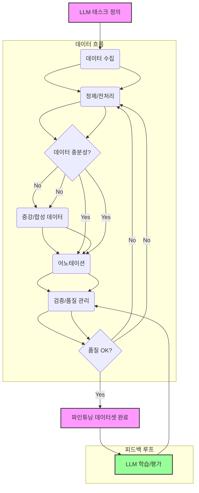

## LLM 데이터셋 구축: 고품질 학습 및 파인튜닝 전략

대규모 언어 모델(LLM) 성능은 데이터셋의 품질과 규모에 크게 좌우됩니다. 특정 도메인에 최적화된 파인튜닝(Fine-tuning)을 위해서는 고품질 데이터셋이 필수적입니다. 데이터셋 구축은 수집, 정제, 어노테이션, 증강, 검증을 포함하는 복합적인 과정입니다. 이 엔트리는 LLM 성능 극대화를 위한 핵심 전략과 최신 방법론을 제시합니다.

### 1. 데이터 수집 (Data Collection)

LLM 목적에 따라 데이터를 수집하며, 다양성, 대표성, 적합성 고려가 중요합니다.
*   **공개 데이터셋**: Common Crawl, Wikipedia, SQuAD 등 사전 학습 및 파인튜닝 활용.
*   **웹 스크래핑**: 특정 도메인 정보 (라이선스, PII, 크롤링 정책 준수 필수).
*   **기업 내부 데이터**: 고객 지원 대화, 제품 문서 등 도메인 특화 LLM 구축 핵심 자원.
*   **데이터 파트너십**: 전문 데이터 확보를 위한 기관 협력.

### 2. 데이터 정제 및 전처리 (Data Cleaning and Preprocessing)

수집된 원시 데이터의 불순물을 제거하고 모델 학습에 적합한 형태로 변환합니다.
*   **중복 제거 (Deduplication)**: 유사 텍스트 제거 (MinHash, LSH).
*   **노이즈 제거 (Noise Reduction)**: HTML 태그, 광고, 비표준 문자 제거, 오탈자/문법 오류 수정.
*   **개인정보 비식별화 (PII Masking/Anonymization)**: PII 마스킹으로 데이터 프라이버시 보호.
*   **텍스트 정규화 (Text Normalization)**: 대소문자 통일, 약어 확장 등으로 일관성 확보.
*   **토큰화 (Tokenization)**: 텍스트를 모델 학습 단위로 분할 (BPE, WordPiece, SentencePiece).

```python
import re

def clean_and_mask(text: str) -> str:
    text = re.sub(r'<[^>]+>', '', text)
    text = re.sub(r'\s+', ' ', text).strip()
    text = re.sub(r'\b[A-Za-z0-9._%+-]+@[A-Za-z0-9.-]+\.[A-Z|a-z]{2,}\b', '[EMAIL_MASKED]', text)
    return text

sample = "<h1>Test</h1> Contact test@email.com for details."
print(f"Cleaned: {clean_and_mask(sample)}")
# Output: "Cleaned: Test Contact [EMAIL_MASKED] for details."
```

### 3. 데이터 어노테이션 (Data Annotation)

파인튜닝 데이터셋의 핵심인 고품질 어노테이션 과정입니다.
*   **전문가 수동 어노테이션**: 정확도 높으나 비용/시간 소모 큼.
*   **크라우드소싱**: 대규모 데이터셋에 유리하나 품질 관리 중요.
*   **LLM 기반 어노테이션**: 2026년 트렌드. LLM을 '어노테이터'로 활용, Few-shot/CoT 프롬프팅으로 데이터 생성/개선.

### 4. 데이터 증강 (Data Augmentation) 및 합성 데이터 (Synthetic Data)

데이터 부족 해소 및 모델 일반화 성능 향상에 기여합니다.
*   **텍스트 변형**: 동의어 대체, 문장 재구조화, 번역 기반 증강(Back-translation).
*   **LLM 기반 합성 데이터 생성**: 시드/프롬프트 기반 LLM 데이터 생성. 희귀 데이터, 프라이버시 문제 해결 효과적. 휴먼 리뷰 필수.

### 5. 데이터 검증 및 품질 관리 (Data Validation and Quality Control)

데이터셋 최종 품질 보장을 위한 지속적인 검증 과정입니다.
*   **일관성/유효성 검증**: 어노테이션 지침 준수, 태스크 관련성, 오류 여부 확인.
*   **편향 분석 (Bias Analysis)**: 데이터셋 내 편향 분석 및 완화 조치.
*   **Human-in-the-Loop (HITL) & 능동 학습 (Active Learning)**: 사람이 오류 검토, 모델 불확실성 기반 어노테이션 우선순위 설정.
데이터셋 구축은 지속적인 개선과 반복이 요구되는 순환적인 과정입니다.



### ## 트레이드오프

데이터셋 구축 시 주요 트레이드오프입니다.
*   **수동 어노테이션 vs. 합성 데이터**: 
    *   **수동**: 고품질/정확도 (장점), 비용/시간 소모, 확장성 낮음 (단점).
    *   **합성**: 대규모/비용 효율성 (장점), LLM 편향/현실 미모방 위험 (단점).
*   **다양한 소스 vs. 단일 소스**: 
    *   **다양한 소스**: 일반화/견고성 증대 (장점), 정제/통합 복잡 (단점).
    *   **단일 소스**: 도메인 전문성 심화 (장점), 일반화 저하 (단점).
*   **엄격한 정제 vs. 신속한 학습**: 
    *   **엄격한 정제**: 프로덕션 성능/안정성 보장 (장점), 개발 주기 연장 (단점).
    *   **신속한 학습**: 프로토타이핑/아이디어 검증 (장점), 낮은 품질 데이터로 인한 학습 오류 위험 (단점).

### ## 실전 체크리스트

LLM 데이터셋 구축 품질과 효율성 검증을 위한 체크리스트입니다.
- [ ] **수집 전략 명확화**: LLM 목표 태스크에 맞는 데이터 소스 정의 및 수집 계획 수립 여부.
- [ ] **PII/민감 정보 안전 처리**: 데이터 내 PII 적절히 마스킹/제거, 법적/윤리적 기준 준수 여부.
- [ ] **중복 제거 파이프라인**: 텍스트 유사도 기반 중복 제거 파이프라인 구축 여부.
- [ ] **어노테이션 가이드라인**: 어노테이터 위한 명확하고 일관된 가이드라인 문서화 및 정기 업데이트 여부.
- [ ] **합성 데이터 품질 검증**: LLM 기반 합성 데이터 사용 시, 품질/다양성/편향 검증 및 휴먼 리뷰 수행 여부.
- [ ] **데이터 품질 지표/모니터링**: 데이터 일관성/유효성/편향에 대한 정량적 지표 정의 및 모니터링 시스템 운영 여부.
- [ ] **능동 학습(Active Learning) 도입**: 불확실성 높은 데이터 우선 어노테이션으로 비용 최소화 및 성능 향상 기여 여부.