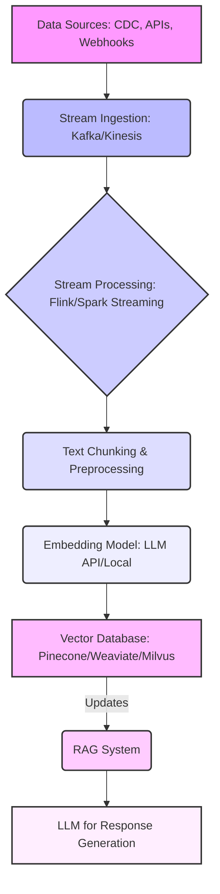

Retrieval-Augmented Generation (RAG) 시스템의 성능은 검색에 활용되는 문서의 최신성에 크게 좌우된다. 기존 배치(batch) 업데이트 방식은 새로운 정보가 반영되기까지 시간 지연(latency)이 발생하여, 특히 빠르게 변화하는 정보를 다루는 환경에서는 LLM의 답변 품질 저하로 이어진다. 실시간 스트리밍 데이터를 활용한 LLM 임베딩 벡터 업데이트 파이프라인은 이러한 갭을 해소하고, LLM이 항상 최신 데이터를 기반으로 추론할 수 있도록 지원하는 핵심 기술이다.

## 핵심 개념

### 실시간 데이터 스트리밍 (Real-time Data Streaming)
데이터가 생성되는 즉시 처리되는 방식을 의미한다. Apache Kafka, Amazon Kinesis 등이 대표적인 실시간 메시지 큐 시스템으로, 대량의 이벤트를 효율적으로 수집하고 분산 처리할 수 있도록 지원한다. 이는 최신 정보가 LLM에 빠르게 반영되는 기반이 된다.

### LLM 임베딩 벡터 (LLM Embedding Vectors)
텍스트 데이터를 고차원 벡터 공간의 수치 형태로 변환하여 의미적 유사성을 표현하는 방식이다. 임베딩 벡터는 텍스트의 맥락과 의미를 압축하여 담고 있으며, RAG 시스템에서 사용자 쿼리와 문서 간의 유사성 검색을 수행하는 핵심 요소로 활용된다. 최신 정보가 반영된 임베딩은 검색 정확도를 높인다.

### 벡터 데이터베이스 (Vector Database)
임베딩 벡터를 효율적으로 저장하고 유사성 검색(similarity search)을 빠르게 수행할 수 있도록 특화된 데이터베이스다. Pinecone, Weaviate, Milvus 등이 대표적이며, 대규모 벡터 데이터를 관리하고 낮은 지연 시간으로 유사성 쿼리를 처리하는 데 필수적이다. 실시간 업데이트는 이러한 벡터 DB의 정보를 항상 최신으로 유지한다.

## 파이프라인 아키텍처

실시간 스트리밍 데이터를 활용한 LLM 임베딩 벡터 업데이트 파이프라인은 여러 단계로 구성된다. 각 단계는 데이터의 흐름과 처리를 담당하며, 2026년 최신 트렌드를 반영하여 분산 처리 및 클라우드 네이티브 기술을 적극적으로 활용한다.

### 1. 데이터 소스 (Data Sources)
다양한 형태의 실시간 데이터가 발생한다. 이는 데이터베이스 변경 로그(Change Data Capture, CDC), 웹 서비스 API 변경 피드, 사용자 상호작용 로그, 웹 크롤링을 통한 뉴스 기사 업데이트 등이 될 수 있다. 이 단계에서는 구조화된/비구조화된 데이터를 모두 포괄한다.

### 2. 스트림 수집 계층 (Stream Ingestion Layer)
데이터 소스에서 발생하는 대량의 실시간 데이터를 안정적으로 수집하고 분산시키는 역할을 한다. Apache Kafka, Amazon Kinesis와 같은 고성능 메시지 큐 시스템이 주로 사용된다. 이 계층은 데이터 손실 없이 높은 처리량을 보장하며, 후속 처리 시스템과의 디커플링을 제공한다.

### 3. 스트림 처리 계층 (Stream Processing Layer)
수집된 원시 데이터를 LLM 임베딩에 적합한 형태로 전처리하고 가공한다. Apache Flink, Apache Spark Streaming, Kafka Streams와 같은 프레임워크가 활용되어 다음 작업을 수행한다:
- **데이터 정규화 및 필터링**: 불필요한 데이터를 제거하고, 일관된 형식으로 변환한다.
- **텍스트 청킹 (Text Chunking)**: 긴 문서를 LLM의 컨텍스트 윈도우 크기에 맞춰 의미 있는 작은 단위(chunk)로 분할한다. 중첩 청킹(overlapping chunking)이나 시맨틱 청킹(semantic chunking) 기법을 사용하여 검색 품질을 높일 수 있다.
- **메타데이터 추가**: 원본 데이터의 출처, 시간, 카테고리 등 RAG 시스템에 유용한 메타데이터를 임베딩 벡터와 함께 저장하기 위해 추가한다.

### 4. 임베딩 생성 (Embedding Generation)
전처리된 텍스트 청크를 LLM 임베딩 모델에 입력하여 벡터를 생성한다. OpenAI Embeddings, Cohere Embed, Sentence-BERT와 같은 모델이 사용될 수 있다. 이 단계는 일반적으로 컴퓨팅 집약적이며, 고성능 GPU/TPU 자원을 활용하여 추론 속도를 최적화한다. 실시간 요구사항을 충족하기 위해 배치 추론이 아닌 스트림 기반의 저지연(low-latency) 추론이 필수적이다.

### 5. 벡터 데이터베이스 업데이트 (Vector Database Update)
생성된 임베딩 벡터와 해당 원본 텍스트 청크, 그리고 관련 메타데이터를 벡터 DB에 저장하거나 업데이트한다. 벡터 DB의 upsert(update or insert) 기능을 활용하여 기존 데이터를 최신 정보로 갱신하고, 중복을 방지하며 데이터의 신선도를 유지한다. 이 과정에서 인덱싱 전략과 파티셔닝(partitioning)을 통해 쓰기(write) 성능과 읽기(read) 성능을 최적화한다.

### 6. RAG 시스템 통합 (RAG System Integration)
최신 임베딩 벡터가 업데이트된 벡터 DB는 RAG 시스템의 핵심 검색 엔진으로 활용된다. 사용자 쿼리가 들어오면, RAG 시스템은 쿼리를 임베딩한 후 벡터 DB에서 가장 관련성이 높은 문서 청크를 실시간으로 검색한다. 검색된 문서는 LLM의 컨텍스트(context)로 주입되어, LLM이 최신 정보를 기반으로 정확하고 관련성 높은 답변을 생성하도록 돕는다.

다음 Mermaid 다이어그램은 실시간 스트리밍 LLM 임베딩 업데이트 파이프라인의 전체 흐름을 시각적으로 보여준다.



## 코드 예제: 파이프라인 구성 요소

다음 Python 코드는 Kafka에서 데이터를 소비하고, Sentence-BERT 모델로 임베딩을 생성한 후, Pinecone 벡터 데이터베이스에 업데이트하는 과정을 간략하게 보여준다. 이 예제는 개념 증명(Proof-of-Concept)을 위한 단순화된 구현이며, 프로덕션 환경에서는 에러 처리, 분산 처리, 확장성 등을 고려한 더 견고한 설계가 필요하다.

```python
import json
from kafka import KafkaConsumer
from sentence_transformers import SentenceTransformer
from pinecone import Pinecone, Index
import os

# 환경 변수 설정 (실제 환경에서는 더 안전한 방식으로 관리)
# os.environ["PINECONE_API_KEY"] = "YOUR_PINECONE_API_KEY"
# os.environ["PINECONE_ENVIRONMENT"] = "YOUR_PINECONE_ENVIRONMENT" # 예: us-west-2
# os.environ["KAFKA_BROKER_URL"] = "localhost:9092"
# os.environ["KAFKA_TOPIC"] = "realtime-documents"
# os.environ["PINECONE_INDEX_NAME"] = "llm-embeddings-index"

def initialize_pinecone():
    api_key = os.getenv("PINECONE_API_KEY")
    environment = os.getenv("PINECONE_ENVIRONMENT")
    if not api_key or not environment:
        raise ValueError("Pinecone API key or environment not set.")
    Pinecone(api_key=api_key, environment=environment)
    return Index(os.getenv("PINECONE_INDEX_NAME", "llm-embeddings-index"))

def get_embedding_model():
    # 로컬 또는 API 기반 임베딩 모델 사용. 여기서는 로컬 Sentence-BERT 예시.
    # 대규모 프로덕션 환경에서는 dedicated Embedding API를 사용하는 것이 일반적.
    return SentenceTransformer('all-MiniLM-L6-v2')

def process_stream_data(message_value: bytes, model: SentenceTransformer, pinecone_index: Index):
    try:
        data = json.loads(message_value.decode('utf-8'))
        doc_id = data.get('id')
        content = data.get('content')
        metadata = data.get('metadata', {})

        if not doc_id or not content:
            print(f"Skipping malformed message: {data}")
            return

        # 텍스트 청킹 (여기서는 단순화하여 전체 content를 사용)
        # 실제 환경에서는 더 복잡한 청킹 전략이 필요
        text_chunk = content
        
        # 임베딩 생성
        embedding = model.encode(text_chunk).tolist()

        # 벡터 DB에 upsert
        pinecone_index.upsert(
            vectors=[
                {
                    "id": doc_id,
                    "values": embedding,
                    "metadata": {"text": text_chunk, **metadata}
                }
            ]
        )
        print(f"Successfully updated embedding for document ID: {doc_id}")

    except json.JSONDecodeError as e:
        print(f"JSON Decode Error: {e} - Message: {message_value}")
    except Exception as e:
        print(f"Error processing message: {e} - Message: {message_value}")

def main():
    consumer = KafkaConsumer(
        os.getenv("KAFKA_TOPIC", "realtime-documents"),
        bootstrap_servers=os.getenv("KAFKA_BROKER_URL", "localhost:9092").split(','),
        auto_offset_reset='latest', # 가장 최신 메시지부터 소비
        enable_auto_commit=True,
        group_id='llm-embedding-processor'
    )

    pinecone_index = initialize_pinecone()
    embedding_model = get_embedding_model()

    print(f"Listening for messages on topic: {os.getenv('KAFKA_TOPIC', 'realtime-documents')}")
    for message in consumer:
        process_stream_data(message.value, embedding_model, pinecone_index)

if __name__ == "__main__":
    main()

```

## 트레이드오프

실시간 스트리밍 LLM 임베딩 업데이트 파이프라인을 구축할 때 고려해야 할 주요 트레이드오프는 다음과 같다:

*   **데이터 신선도(Data Freshness) vs. 비용(Cost) 및 복잡성(Complexity)**
    *   **언제 좋고**: 금융 정보, 뉴스 피드, 사용자 상호작용 등 최신 정보 반영이 비즈니스 가치에 직접적인 영향을 미치는 애플리케이션에 유리하다. RAG 시스템의 환각(hallucination)을 줄이고 답변 품질을 높이는 데 효과적이다.
    *   **언제 나쁜지**: 데이터 변경 빈도가 낮거나, 신선도 요구사항이 엄격하지 않은 경우, 실시간 파이프라인 구축 및 유지보수 비용과 복잡성이 과도할 수 있다. 이러한 경우에는 배치(Batch) 처리로도 충분할 수 있다.

*   **처리 지연(Processing Latency) vs. 처리량(Throughput)**
    *   **언제 좋고**: 밀리초 단위의 낮은 지연 시간으로 데이터를 처리하여 거의 즉각적인 업데이트를 제공해야 할 때 효과적이다. 사용자 경험(UX)이 실시간성에 크게 의존하는 시스템에 적합하다.
    *   **언제 나쁜지**: 대규모 데이터를 높은 처리량으로 처리해야 하지만, 개별 데이터 포인트의 실시간성이 덜 중요한 경우, 실시간 처리 시스템은 오버헤드가 크고 병목 현상이 발생하기 쉽다. 배치 또는 마이크로 배치(micro-batch) 방식이 더 효율적일 수 있다.

*   **데이터 일관성(Data Consistency) vs. 가용성(Availability)**
    *   **언제 좋고**: 강력한 일관성(strong consistency)보다는 최신 데이터의 빠른 가용성(availability)이 더 중요한 RAG 시스템에 적합하다. 최종 일관성(eventual consistency) 모델을 통해 데이터를 빠르게 업데이트하면서도 시스템의 높은 가용성을 유지할 수 있다.
    *   **언제 나쁜지**: 금융 거래, 재고 관리 등 데이터의 엄격한 일관성(ACID 트랜잭션)이 최우선인 애플리케이션에는 실시간 스트리밍의 최종 일관성 모델이 부적합할 수 있다. 이러한 경우 다른 아키텍처를 고려해야 한다.

*   **인프라 규모 확장성(Scalability) vs. 운영 복잡성(Operational Complexity)**
    *   **언제 좋고**: 데이터 볼륨과 처리 요구사항이 변동성이 크고 예측하기 어려운 경우, 스트리밍 플랫폼의 확장성(예: Kafka, Flink의 스케일 아웃)은 매우 유리하다.
    *   **언제 나쁜지**: 소규모 데이터셋이나 안정적인 워크로드의 경우, 분산 스트리밍 인프라의 설정, 모니터링, 유지보수는 상당한 운영 부담을 초래할 수 있다. 전담 운영 인력이 필요할 수 있다.

## 실전 체크리스트

실시간 스트리밍 데이터를 활용한 LLM 임베딩 업데이트 파이프라인을 프로젝트에 적용할 때 다음 항목들을 검증하여 성공적인 구축 및 운영을 보장해야 한다.

- [ ] 데이터 소스의 실시간 변경 감지 메커니즘(CDC, Webhook, API Polling 등)이 안정적으로 구축되었으며, 예상되는 모든 데이터 변경 이벤트를 포착하는가?
- [ ] 스트림 수집 및 처리 계층(Kafka, Flink 등)이 최대 예상 데이터 처리량과 최저 지연 시간 요구사항을 충족하도록 설계되고 실제 환경에서 스케일 아웃 테스트를 완료했는가?
- [ ] 임베딩 모델의 추론 속도와 컴퓨팅 비용이 실시간 처리 볼륨에 맞춰 최적화되었으며, 필요한 GPU/TPU 자원 할당이 적절하게 이루어지고 있는가?
- [ ] 벡터 데이터베이스의 upsert(업데이트/삽입) 성능이 실시간 업데이트 빈도 및 RAG 쿼리 지연 시간(query latency) 요구사항을 모두 만족하는가? 또한, 인덱스 재구축(re-indexing) 전략이 효율적으로 설계되었는가?
- [ ] 텍스트 청킹(Text Chunking) 전략이 LLM의 컨텍스트 윈도우(context window) 크기 제약을 고려하면서 RAG 검색 품질을 최적화하는 방식으로 구현되었는가?
- [ ] 파이프라인의 각 단계(데이터 수집, 처리, 임베딩, 벡터 DB 업데이트)에 대한 포괄적인 모니터링 및 경고(alerting) 시스템이 구축되어 데이터 지연, 처리량 감소, 오류, 자원 사용량 이상을 즉시 감지할 수 있는가?
- [ ] 파이프라인 실패 시 데이터 손실 없이 복구(recovery)할 수 있는 내결함성(fault tolerance) 및 재처리(reprocessing) 전략이 마련되어 있으며, 실제 장애 시나리오에 대한 복구 테스트를 완료했는가?