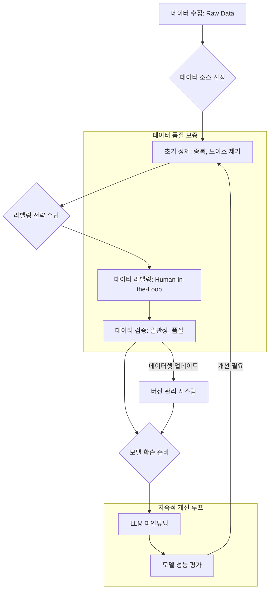

LLM(Large Language Model)의 성능은 파인튜닝(Fine-tuning)에 사용되는 데이터셋의 품질에 의해 결정됩니다. 단순히 많은 양의 데이터를 사용하는 것을 넘어, 모델의 목표에 부합하는 고품질 데이터를 구축하고 관리하는 것이 성공적인 LLM 개발의 핵심입니다. 본 문서에서는 LLM 파인튜닝을 위한 고품질 데이터셋 구축 및 관리 전략을 상세히 설명합니다.

## 고품질 데이터의 중요성

LLM은 방대한 양의 텍스트 데이터를 학습하여 일반적인 언어 패턴을 습득하지만, 특정 도메인이나 태스크에 최적화되기 위해서는 해당 도메인의 특성과 요구사항을 반영하는 파인튜닝 데이터셋이 필수적입니다. 저품질 데이터는 모델에 잘못된 편향(bias)을 주입하거나, 비일관적인 응답을 유발하며, 최악의 경우 모델 성능을 저해할 수 있습니다. 반면, 잘 정제되고 라벨링된 고품질 데이터셋은 모델의 정확성, 일관성, 그리고 특정 태스크 수행 능력을 크게 향상시킵니다.

## 데이터 수집 (Data Acquisition)

고품질 데이터셋 구축의 첫 단계는 전략적인 데이터 수집입니다. 이는 파인튜닝 목표에 따라 다양한 소스에서 데이터를 선별적으로 확보하는 과정을 포함합니다.

### 데이터 소스 선정

*   **내부 데이터**: 기업 내부의 로그, 고객 응대 기록, 사내 문서, 제품 설명서 등은 도메인 특화된 고품질 데이터를 제공할 수 있습니다.
*   **공개 데이터셋**: Hugging Face Datasets, Kaggle 등에서 제공되는 공개 데이터셋은 초기 학습이나 보조 데이터로 활용될 수 있으나, 도메인 적합성과 품질을 반드시 검토해야 합니다.
*   **크롤링/스크래핑**: 특정 웹사이트나 포럼에서 정보를 수집하는 방법입니다. 데이터의 양은 많지만, 정제 및 필터링 과정이 복잡하고 법적/윤리적 문제를 고려해야 합니다.
*   **합성 데이터(Synthetic Data)**: 기존 데이터나 특정 규칙을 기반으로 LLM이 직접 데이터를 생성하는 방법입니다. 데이터 희소성 문제를 해결하고 편향을 줄이는 데 유용하며, 2026년에는 더욱 고도화된 합성 데이터 생성 기법이 활성화될 것으로 예상됩니다.

### 수집 전략

*   **명확한 목적 설정**: 어떤 종류의 데이터가 LLM의 어떤 기능을 향상시킬 것인지 구체적으로 정의합니다.
*   **다양성 확보**: 특정 상황이나 관점에 편향되지 않도록 다양한 시나리오와 유형의 데이터를 수집합니다.
*   **최신성 유지**: 특히 빠르게 변화하는 도메인의 경우, 최신 정보가 반영된 데이터를 주기적으로 수집하고 업데이트해야 합니다.

## 데이터 정제 및 전처리 (Data Cleaning & Preprocessing)

수집된 원시 데이터는 노이즈, 중복, 비일관성 등을 포함하고 있어 반드시 정제 과정을 거쳐야 합니다. 이 과정은 LLM이 데이터를 정확하게 해석하고 학습할 수 있도록 돕습니다.

### 주요 정제 기법

*   **노이즈 제거**: HTML 태그, 특수 문자, 이모티콘, 비정상적인 구두점 등 불필요한 요소를 제거합니다.
*   **중복 제거**: 동일하거나 유사한 데이터를 제거하여 모델이 중복된 정보에 과적합(overfit)되는 것을 방지합니다.
*   **정규화**: 텍스트를 일관된 형식으로 변환합니다 (예: 소문자 변환, 오탈자 교정, 동의어 처리).
*   **토큰화(Tokenization)**: 텍스트를 모델이 처리할 수 있는 작은 단위(토큰)로 분리합니다.
*   **불용어(Stopwords) 처리**: 분석 목적에 따라 '은/는', '이/가', 'and', 'the'와 같은 불용어를 제거할 수 있습니다. LLM 파인튜닝에서는 문맥 유지를 위해 제거하지 않는 경우가 많지만, 특정 태스크에서는 유용할 수 있습니다.

```python
import re
from typing import List, Dict

def clean_text_for_llm(text: str) -> str:
    """
    LLM 파인튜닝을 위한 텍스트 정제 함수.
    - HTML 태그 제거
    - 이메일 주소, URL 제거
    - 특수 문자 처리 (한글, 영문, 숫자, 일부 구두점 유지)
    - 연속된 공백을 단일 공백으로 치환
    """
    if not isinstance(text, str):
        return ""

    # 1. HTML 태그 제거
    text = re.sub(r'<.*?>', '', text)
    # 2. 이메일 주소 제거
    text = re.sub(r'\S*@\S*\s?', '', text)
    # 3. URL 제거
    text = re.sub(r'http\S+|www.\S+', '', text)
    # 4. 특수 문자 및 숫자 제거 (옵션: 도메인에 따라 숫자는 유지할 수 있음)
    # 한글, 영문, 숫자, 일부 구두점 (.,?!')만 유지하도록 조정
    text = re.sub(r'[^가-힣a-zA-Z0-9\s.,?!]', '', text)
    # 5. 연속된 공백을 단일 공백으로 치환하고 양쪽 공백 제거
    text = re.sub(r'\s+', ' ', text).strip()
    return text

def preprocess_dataset(data: List[Dict], text_field: str = "text") -> List[Dict]:
    """
    데이터셋 내 특정 필드의 텍스트를 정제하는 함수.
    """
    cleaned_data = []
    for item in data:
        if text_field in item:
            item[text_field] = clean_text_for_llm(item[text_field])
            cleaned_data.append(item)
    return cleaned_data

# 예시 데이터
sample_data = [
    {"id": 1, "text": "안녕하세요! <p>이것은 <b>테스트</b> 텍스트입니다.</p> 제 이메일은 test@example.com 입니다. 더 많은 정보는 https://example.com 에서!"},
    {"id": 2, "text": "  불필요한 공백이    많고,     !@#$특수문자도 있습니다.  "}
]

# 데이터셋 정제 및 출력
cleaned_sample_data = preprocess_dataset(sample_data, text_field="text")
# for item in cleaned_sample_data:
#     print(item)
```

## 데이터 라벨링 및 어노테이션 (Data Labeling & Annotation)

정제된 데이터는 LLM의 특정 태스크 수행 능력을 학습시키기 위해 적절한 라벨로 어노테이션되어야 합니다. 라벨링 품질은 모델의 학습 방향과 직접적으로 연결됩니다.

### 고품질 라벨링 기법

*   **명확한 가이드라인**: 라벨링 작업자(annotator)가 일관된 기준으로 작업할 수 있도록 매우 구체적이고 명확한 라벨링 가이드라인을 제공해야 합니다.
*   **크라우드소싱(Crowdsourcing) 및 전문가 활용**: 대량의 데이터 라벨링에는 크라우드소싱 플랫폼을 활용하고, 높은 전문성이 요구되는 분야는 도메인 전문가를 참여시킵니다.
*   **합의 측정(Inter-annotator Agreement, IAA)**: 여러 작업자가 동일한 데이터를 라벨링한 후, 그 일치도를 측정하여 라벨링 가이드라인의 명확성과 작업자 숙련도를 평가합니다.
*   **능동 학습(Active Learning)**: 모델이 불확실하다고 판단하는 데이터 포인트에 대해 우선적으로 라벨링을 요청하여, 적은 비용으로 더 큰 학습 효과를 얻는 방법입니다. 2026년에는 LLM 자체를 활용하여 능동 학습 프로세스를 자동화하는 기술이 더욱 발전할 것입니다.
*   **LLM 기반 라벨링**: LLM을 활용하여 초기 라벨링을 자동화하고, Human-in-the-Loop 방식으로 전문가가 검토하고 수정하는 방식이 효율성을 높입니다.

## 데이터셋 검증 및 평가 (Dataset Validation & Evaluation)

라벨링이 완료된 데이터셋은 학습에 사용하기 전에 품질을 검증해야 합니다. 이 과정은 데이터의 일관성, 정확성, 그리고 잠재적인 편향을 확인하는 데 중점을 둡니다.

*   **데이터 일관성 검사**: 라벨링 가이드라인을 준수했는지, 데이터 형식이 일관적인지 확인합니다.
*   **라벨 정확성 검증**: 무작위 샘플링을 통해 라벨의 정확성을 수동으로 검토하거나, 교차 검증(Cross-validation) 기법을 사용하여 확인합니다.
*   **편향성 분석**: 특정 계층, 성별, 지역 등에 대한 편향이 데이터셋에 내재되어 있는지 분석하고, 필요한 경우 편향 완화(debiasing) 전략을 적용합니다.
*   **데이터 분포 분석**: 라벨 분포, 텍스트 길이 분포 등 데이터의 전반적인 통계적 특성을 파악하여 데이터셋의 대표성을 검토합니다.

## 데이터셋 관리 및 거버넌스 (Dataset Management & Governance)

고품질 데이터셋은 일회성 구축으로 끝나는 것이 아니라, 지속적인 관리와 거버넌스를 통해 가치를 유지하고 향상시켜야 합니다.

*   **버전 관리 (Version Control)**: 데이터셋에 대한 모든 변경 사항(정제, 라벨링, 업데이트)을 추적하고 관리하여 재현 가능한 학습 환경을 보장합니다. DVC(Data Version Control)와 같은 도구가 활용될 수 있습니다.
*   **메타데이터 관리 (Metadata Management)**: 데이터 소스, 수집 일자, 라벨링 방법, 사용된 정제 스크립트 등 데이터셋에 대한 상세한 정보를 기록하여 투명성을 확보합니다.
*   **접근 제어 및 보안**: 민감한 정보가 포함된 데이터셋에 대한 접근 권한을 엄격하게 관리하고, 데이터 암호화 등 보안 조치를 적용합니다.
*   **지속적인 업데이트**: 실제 운영 환경에서 모델의 성능을 모니터링하고, 새로운 데이터나 변화하는 요구사항에 맞춰 데이터셋을 주기적으로 업데이트합니다.

## 2026년 최신 트렌드

2026년에는 LLM 파인튜닝을 위한 데이터셋 구축 및 관리 방식에서 다음과 같은 트렌드가 더욱 가속화될 것입니다.

*   **생성형 AI 기반 데이터 증강 및 합성**: 단순히 기존 데이터를 변형하는 것을 넘어, LLM이 직접 다양한 시나리오와 복잡성을 가진 고품질 합성 데이터를 생성하여 파인튜닝에 활용하는 기술이 보편화될 것입니다.
*   **강화 학습 기반 데이터 선별 (RLHF for Data Selection)**: 모델의 피드백이나 사용자 반응을 통해 가장 효과적인 학습 데이터를 선별하는 강화 학습 기법이 도입되어, 데이터셋의 효율성과 품질을 극대화할 것입니다.
*   **데이터 센트릭 AI (Data-centric AI) 플랫폼 강화**: 모델 중심의 개발에서 데이터 중심 개발로의 전환이 가속화됨에 따라, 데이터 수집, 정제, 라벨링, 관리의 전 과정을 통합하고 자동화하는 데이터 센트릭 AI 플랫폼의 역할이 더욱 중요해질 것입니다.
*   **멀티모달 데이터셋 통합**: 텍스트 외에도 이미지, 오디오, 비디오 등 다양한 형태의 데이터를 효과적으로 결합하고 라벨링하여 멀티모달 LLM을 파인튜닝하는 기술이 발전할 것입니다.

## 데이터셋 구축 및 관리 워크플로우



## 트레이드오프

LLM 파인튜닝을 위한 고품질 데이터셋 구축에는 다양한 트레이드오프가 존재하며, 프로젝트의 목표와 제약 사항에 따라 최적의 균형점을 찾아야 합니다.

*   **수동 라벨링 vs 자동화 라벨링**
    *   **언제 좋음**: 초기 소규모 데이터셋, 높은 정확성과 전문성이 요구되는 태스크, 미묘한 뉘앙스 구분이 필요한 경우. (예: 의료 분야 진단).
    *   **언제 나쁨**: 대규모 데이터셋 구축 시 엄청난 비용과 시간이 소요되어 확장성 부족.
*   **데이터 양 vs 데이터 품질**
    *   **언제 좋음**: 소량의 고품질 데이터로도 특정 태스크에서 좋은 성능을 보이는 경우, 비용 효율성을 중시할 때.
    *   **언제 나쁨**: 데이터 양 부족으로 인해 모델의 일반화 능력(generalization)이 저해될 수 있으며, 복잡한 패턴 학습에 한계가 있음.
*   **범용 데이터셋 vs 도메인 특화 데이터셋**
    *   **언제 좋음**: 범용적인 언어 이해 능력이 중요하거나 다양한 도메인에 걸쳐 활용될 경우, 초기 모델 개발 시. (예: 챗봇의 일반 대화 능력).
    *   **언제 나쁨**: 특정 산업이나 전문 분야에서 요구되는 정밀한 이해와 응답이 필요한 경우, 도메인 특화 용어 및 문맥 이해가 부족하여 성능 한계 발생.
*   **단일 소스 데이터 vs 다중 소스 데이터 통합**
    *   **언제 좋음**: 데이터 일관성 유지가 중요하고, 단일 소스만으로 충분한 양과 품질을 확보할 수 있을 때.
    *   **언제 나쁨**: 다양한 시나리오와 관점을 모델에 학습시키기 어려워 특정 편향이 강화될 수 있음.
*   **데이터셋 고정 vs 지속적 업데이트**
    *   **언제 좋음**: 환경 변화가 적거나 모델 개발 초기에 안정적인 학습 환경이 필요할 때.
    *   **언제 나쁨**: 실시간으로 변화하는 정보나 사용자 요구사항을 반영하기 어려워 모델의 최신성 및 적응성이 저하됨.

## 실전 체크리스트

프로젝트에 LLM 파인튜닝을 위한 고품질 데이터셋 구축 및 관리 전략을 적용할 때 다음 항목들을 검증하십시오.

*   [ ] **데이터 소스 신뢰성 및 적합성**: 모든 데이터 소스가 LLM 파인튜닝 목표에 부합하고, 출처의 신뢰성이 검증되었는가?
*   [ ] **자동화된 데이터 정제 파이프라인**: 수집된 원시 데이터를 정제하고 전처리하는 파이프라인이 자동화되어 일관성과 효율성을 보장하는가?
*   [ ] **명확하고 일관된 라벨링 가이드라인**: 라벨링 작업자가 따를 수 있는 구체적인 가이드라인이 문서화되어 있으며, IAA(Inter-annotator Agreement) 측정 결과가 목표치를 상회하는가?
*   [ ] **데이터셋 편향성 분석 및 완화 계획**: 데이터셋 내 잠재적인 편향을 주기적으로 분석하고, 이를 완화하기 위한 전략(예: 샘플링 조정, 합성 데이터 사용)이 수립되어 있는가?
*   [ ] **데이터셋 버전 관리 시스템 도입**: 데이터셋의 모든 변경 사항(수집, 정제, 라벨링, 업데이트)이 추적 가능하며, 특정 버전으로 재현 학습이 가능한가?
*   [ ] **데이터 보안 및 접근 제어**: 민감한 정보가 포함된 데이터셋에 대한 접근 권한이 엄격하게 관리되고, 적절한 보안 조치(암호화 등)가 적용되었는가?
*   [ ] **지속적인 데이터셋 모니터링 및 업데이트 계획**: 파인튜닝된 LLM의 운영 성능을 모니터링하고, 이에 기반하여 데이터셋을 주기적으로 업데이트 및 개선하는 프로세스가 구축되어 있는가?
*   [ ] **메타데이터 관리 체계**: 데이터셋의 출처, 수집 일자, 정제 스크립트, 라벨링 방법 등 주요 메타데이터가 체계적으로 관리되고 검색 가능한가?
*   [ ] **데이터 품질 지표 정의**: 데이터의 정확성, 완전성, 일관성 등을 측정할 수 있는 구체적인 데이터 품질 지표가 정의되어 있으며, 주기적으로 측정되는가?