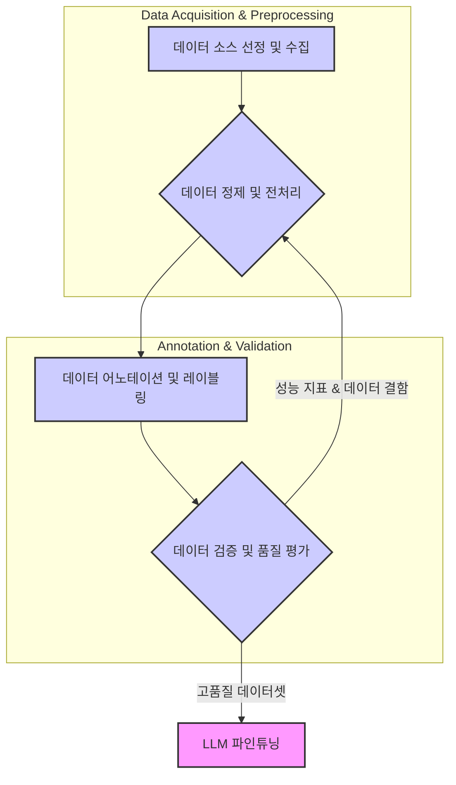

LLM(Large Language Model)의 성능은 모델 아키텍처나 학습 파라미터만큼이나 학습 데이터셋의 품질에 크게 좌우됩니다. 특히 특정 도메인이나 태스크에 최적화된 LLM을 구축하기 위한 파인튜닝(fine-tuning) 과정에서, 고품질 데이터셋 확보는 모델의 정확성, 일관성, 그리고 일반화 능력을 결정짓는 핵심 요소입니다. 2026년 이후 데이터 중심 AI(Data-centric AI) 패러다임이 더욱 강화되면서, 데이터 품질은 모델 성능 갭 분석의 최우선 과제로 부상했습니다.

## 데이터 품질의 핵심 요소
고품질 데이터셋은 단순히 많은 양의 데이터를 의미하는 것이 아닙니다. 다음 요소들이 충족되어야 합니다.

### 1. 정확성 (Accuracy)
데이터 내의 정보가 사실과 일치하며, 오류나 모순이 없어야 합니다. 오타, 잘못된 사실, 부정확한 레이블 등은 모델 학습을 방해하고 잘못된 추론을 유도합니다.

### 2. 일관성 (Consistency)
데이터 형식, 명명 규칙, 레이블 체계 등이 데이터셋 전체에 걸쳐 일관되게 유지되어야 합니다. 비일관성은 모델이 패턴을 학습하는 데 혼란을 초래합니다.

### 3. 관련성 (Relevance)
파인튜닝하고자 하는 LLM의 목표 태스크 및 도메인과 직접적으로 관련된 데이터여야 합니다. 불필요하거나 관련 없는 데이터는 학습 효율을 저해하고, 오히려 잡음으로 작용할 수 있습니다.

### 4. 다양성 (Diversity) 및 대표성 (Representativeness)
다양한 시나리오, 표현 방식, 잠재적 사용자 그룹을 포괄하는 데이터를 포함하여 모델이 광범위한 입력에 대해 견고하게 작동하도록 해야 합니다. 또한, 실제 배포 환경의 데이터 분포를 대표해야 합니다.

### 5. 적시성 (Timeliness)
특히 빠르게 변화하는 도메인에서는 데이터가 최신 정보를 반영해야 합니다. 오래된 데이터는 모델이 현실과 동떨어진 정보를 제공하게 만들 수 있습니다.

## 고품질 데이터셋 구축 프로세스

### 1. 데이터 소스 선정 및 수집
*   **내부 데이터 (Internal Data)**: 기업 내부의 서비스 로그, 문서, 고객 대화 기록 등은 가장 관련성 높은 소스가 될 수 있습니다. 강력한 데이터 거버넌스와 개인정보보호 (PII, Personally Identifiable Information) 조치가 필수적입니다.
*   **외부 데이터 (External Data)**: 공개 데이터셋, 웹 크롤링 데이터, 구매 가능한 상용 데이터 등이 있습니다. 라이선스 및 사용 조건을 철저히 검토해야 합니다.
*   **합성 데이터 (Synthetic Data)**: 실제 데이터의 부족을 보완하거나 특정 시나리오를 강화하기 위해 LLM이나 규칙 기반 시스템으로 생성하는 데이터입니다. 특히 프라이버시가 중요한 금융, 의료 분야에서 2026년 이후 더욱 중요해지고 있습니다. 초기 모델 학습 및 데이터 증강에 효과적이지만, 실제 데이터와의 분포 차이를 면밀히 분석해야 합니다.

### 2. 데이터 정제 및 전처리
수집된 원시 데이터는 모델 학습에 적합하도록 정제 및 전처리 과정을 거쳐야 합니다.
*   **오류 제거 (Error Correction)**: 오타, 문법 오류, 잘못된 특수 문자 등을 수정합니다.
*   **중복 제거 (Deduplication)**: 동일하거나 매우 유사한 데이터를 제거하여 모델이 반복 학습하는 것을 방지하고, 데이터 다양성을 확보합니다.
*   **형식 통일 및 정규화 (Standardization & Normalization)**: 날짜, 숫자, 주소 등 데이터의 형식을 통일하고, 텍스트의 경우 소문자 변환, 불용어(stop words) 제거, 표제어 추출(lemmatization) 등을 수행합니다.
*   **이상치 처리 (Outlier Handling)**: 통계적으로 비정상적이거나 맥락상 부적절한 데이터를 식별하고 처리합니다. 이는 잘못된 일반화를 방지하는 데 중요합니다.

```python
import pandas as pd
import re

def clean_text(text):
    text = str(text).lower() # 소문자 변환
    text = re.sub(r'[^a-z0-9\s]', '', text) # 특수 문자 제거
    text = re.sub(r'\s+', ' ', text).strip() # 다중 공백 제거
    return text

def preprocess_dataset(df):
    # 결측치 처리: 'text' 컬럼의 결측치는 빈 문자열로 대체
    df['text'] = df['text'].fillna('')
    df['label'] = df['label'].fillna('unknown')

    # 중복 제거: 'text' 컬럼을 기준으로 중복 제거
    initial_rows = len(df)
    df.drop_duplicates(subset=['text'], inplace=True)
    print(f"중복 제거 전: {initial_rows} rows, 중복 제거 후: {len(df)} rows")

    # 텍스트 정제 적용
    df['cleaned_text'] = df['text'].apply(clean_text)
    
    # 길이가 짧거나 의미 없는 텍스트 제거 (예: 5자 미만)
    df = df[df['cleaned_text'].apply(lambda x: len(x.split())) >= 3] # 최소 3개 단어
    print(f"의미 없는 짧은 텍스트 제거 후: {len(df)} rows")

    return df

# 예시 데이터
data = {
    'text': [
        "안녕하세요, 반갑습니다. LLM 파인튜닝은 정말 중요해요!",
        "LLM 파인튜닝은 중요해요. 데이터 품질이 핵심입니다.",
        "이것은 스팸 메일입니다!!!!!!",
        "", # 결측치
        "hello world",
        "안녕하세요, 반갑습니다. LLM 파인튜닝은 정말 중요해요!"
    ],
    'label': ['positive', 'positive', 'spam', None, 'neutral', 'positive']
}
df = pd.DataFrame(data)

print("원본 데이터셋:")
print(df)

cleaned_df = preprocess_dataset(df)
print("\n전처리된 데이터셋:")
print(cleaned_df)
```

### 3. 데이터 어노테이션 및 레이블링
지도 학습 기반 파인튜닝을 위해서는 데이터에 대한 정확한 레이블이 필요합니다.
*   **Human-in-the-Loop (HITL)**: 전문가 또는 크라우드 소싱 플랫폼을 통해 수동으로 어노테이션을 수행합니다. 초기 데이터셋 구축에 필수적이며, 가장 높은 품질을 기대할 수 있지만 비용과 시간이 많이 소요됩니다.
*   **LLM을 활용한 자동 어노테이션 (LLM-as-a-labeler)**: 이미 학습된 대형 LLM을 활용하여 레이블을 예측하고, 이를 전문가가 검수하는 방식입니다. 대규모 데이터셋 구축 속도를 비약적으로 향상시킬 수 있으며, 2026년에는 이 방식이 보편화되고 있습니다. 하지만 LLM의 환각(hallucination)이나 편향(bias)을 주의 깊게 관리해야 합니다.
*   **약한 감독 (Weak Supervision)**: 휴리스틱 규칙, 지식 그래프, 외부 사전 등을 활용하여 프로그램적으로 레이블을 생성하고, 이를 보정하는 방식입니다.

### 4. 데이터 검증 및 품질 평가
구축된 데이터셋의 품질을 지속적으로 검증하고 평가하는 과정입니다.
*   **통계적 분석**: 레이블 분포, 텍스트 길이 분포, 고유 단어 수 등 통계 지표를 분석하여 데이터셋의 편향이나 불균형을 확인합니다.
*   **전문가 검토**: 특정 샘플에 대해 전문가가 직접 검토하여 어노테이션의 정확성 및 일관성을 평가합니다.
*   **모델 기반 피드백 루프 (Model-based Feedback Loop)**: 구축된 데이터셋으로 학습된 모델의 성능을 평가하고, 성능 저하의 원인이 되는 데이터 포인트를 식별하여 데이터셋 개선에 반영합니다. 이는 고품질 데이터셋 구축의 핵심적인 반복 과정입니다.



## 트레이드오프
고품질 데이터셋 구축에는 다양한 선택과 그에 따른 트레이드오프가 존재합니다.

*   **수동 어노테이션 vs. 자동/LLM 어노테이션**: 수동 어노테이션은 높은 정확성과 미묘한 의미 포착이 가능하여 초기 부트스트랩 데이터셋이나 고정밀 태스크에 좋습니다. 하지만 비용과 시간이 막대하게 소요되어 대규모 데이터셋 구축에는 부적합합니다. 반면, 자동/LLM 어노테이션은 속도와 확장성이 뛰어나 대규모 데이터셋에 유리하지만, LLM의 편향이나 환각으로 인한 품질 저하 위험이 있어, 전문가 검수 및 후처리 과정이 중요합니다.
*   **데이터 다양성 vs. 특정 도메인 깊이**: 매우 다양한 데이터를 확보하면 모델의 일반화 능력이 향상되어 광범위한 태스크에 유연하게 대응할 수 있습니다. 하지만 특정 도메인의 깊이 있는 전문 지식 학습이 어려워질 수 있습니다. 반대로 특정 도메인에 깊게 집중된 데이터는 해당 도메인에서의 높은 성능을 보장하지만, 일반화 능력이 떨어져 다른 도메인으로의 확장이 어렵습니다. 사용 목적에 따라 적절한 균형을 찾아야 합니다.
*   **합성 데이터 활용 vs. 실제 데이터 의존**: 합성 데이터는 프라이버시 문제 해결, 데이터 희소성 극복, 특정 시나리오 증강에 탁월합니다. 하지만 실제 데이터와의 분포 차이가 존재할 수 있어 모델이 현실과 동떨어진 성능을 보일 위험이 있습니다. 실제 데이터는 가장 현실적인 학습을 제공하지만, 수집 비용, 개인정보보호, 희소성 등의 제약이 있습니다. 초기 모델 개발 및 데이터 증강에는 합성 데이터가 좋고, 최종 파인튜닝에는 실제 데이터 비중을 높이는 하이브리드 접근이 효과적입니다.
*   **데이터 거버넌스 강화 vs. 데이터 접근성**: 엄격한 데이터 거버넌스(GDPR, CCPA 등 규제 준수 포함)는 데이터의 보안성, 신뢰성, 개인정보보호를 보장합니다. 이는 특히 민감 정보를 다루는 기업 환경에서 필수적입니다. 그러나 과도한 규제는 데이터 접근성을 떨어뜨려 데이터 과학자나 엔지니어의 작업 효율성을 저해하고, 혁신 속도를 늦출 수 있습니다. 조직의 위험 허용 수준과 규제 환경에 맞춰 균형 잡힌 정책이 필요합니다.

## 실전 체크리스트
LLM 파인튜닝을 위한 고품질 데이터셋 구축 프로젝트 진행 시 다음 항목들을 검토해야 합니다.

- [ ] 데이터 소스의 신뢰성 및 Representativeness (대표성) 검증 완료 여부
- [ ] 중복, 결측치, 이상치 처리 정책 문서화 및 시스템에 적용 완료 여부
- [ ] 어노테이션 가이드라인의 명확성, 일관성 확보 및 어노테이터 교육 완료 여부
- [ ] LLM을 활용한 어노테이션 시, LLM의 바이어스(Bias) 및 환각(Hallucination) 검토 및 완화 전략 수립 여부
- [ ] 데이터셋의 버전 관리 시스템(DVC, Git LFS 등) 도입 및 활용을 통한 변경 이력 추적 가능 여부
- [ ] 정기적인 데이터 품질 모니터링 파이프라인 구축 및 데이터 드리프트(Data Drift) 감지 시스템 유효성 여부
- [ ] 개인정보보호 (PII) 및 규제 준수 (Compliance, 예: GDPR, CCPA) 관련 데이터 비식별화, 동의 처리 프로세스 검토 완료 여부