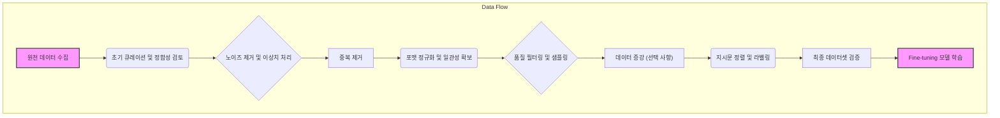

LLM(Large Language Model)의 성능은 모델 아키텍처나 학습 규모만큼이나 Fine-tuning에 사용되는 데이터셋의 품질에 크게 좌우됩니다. 고품질의 Fine-tuning 데이터셋은 모델이 특정 태스크를 더 정확하고 효과적으로 수행하도록 돕고, 환각(hallucination)을 줄이며, 도메인 특화된 지식을 내재화하는 데 결정적인 역할을 합니다. 본 문서는 LLM Fine-tuning을 위한 고품질 데이터셋을 구축하기 위한 전반적인 전처리 및 정제 전략과 실전 기법을 다룹니다.

## 데이터 전처리 및 정제 파이프라인 개요

LLM Fine-tuning 데이터셋 구축은 단순한 데이터 수집을 넘어, 복잡하고 다단계적인 정제 과정을 필요로 합니다. 효과적인 데이터 파이프라인은 아래와 같은 주요 단계로 구성됩니다.



## 핵심 전처리 및 정제 기법

### 1. 데이터 수집 및 초기 큐레이션 (Data Collection & Initial Curation)

데이터 수집 단계에서는 다양한 소스(웹 크롤링, 내부 데이터베이스, API, 공개 데이터셋 등)에서 Fine-tuning 목적에 부합하는 데이터를 확보합니다. 초기 큐레이션은 수집된 데이터의 형식, 관련성, 잠재적 편향(bias)을 검토하는 과정입니다. 데이터 소스의 투명성을 확보하고 라이선스 요건을 준수하는 것이 중요합니다.

### 2. 노이즈 제거 및 이상치 처리 (Noise Reduction & Anomaly Handling)

수집된 데이터에는 오류, 불완전한 정보, 비표준 형식, 개인 식별 정보(PII) 등 다양한 노이즈가 포함될 수 있습니다. 이러한 노이즈는 모델 학습을 방해하고 원치 않는 편향을 주입할 수 있습니다.

*   **불완전하거나 손상된 데이터 제거**: JSON 파싱 오류, 빈 텍스트, 의미 없는 문자열 등을 식별하고 제거합니다.
*   **개인 식별 정보(PII) 마스킹/제거**: 이름, 전화번호, 이메일, 주소, 신용카드 번호 등 민감 정보를 식별하여 `[MASKED_PII]`와 같은 토큰으로 대체하거나 완전히 제거합니다. 이는 데이터 보안 및 규제 준수(예: GDPR, CCPA)를 위해 필수적입니다.

```python
import re

def scrub_pii(text: str) -> str:
    """텍스트에서 개인 식별 정보를 마스킹하거나 제거합니다."""
    # 이메일 주소 제거
    text = re.sub(r"\b[A-Za-z0-9._%+-]+@[A-Za-z0-9.-]+\.[A-Z|a-z]{2,}\b", "[EMAIL]", text)
    # 전화번호 제거 (예: 010-1234-5678)
    text = re.sub(r"\b\d{2,3}[- ]?\d{3,4}[- ]?\d{4}\b", "[PHONE]", text)
    # 신용카드 번호 (간단한 예시, 실제로는 더 복잡)
    text = re.sub(r"\b(?:\d[ -]*?){13,16}\b", "[CREDIT_CARD]", text)
    # IP 주소 제거
    text = re.sub(r"\b(?:\d{1,3}\.){3}\d{1,3}\b", "[IP_ADDRESS]", text)
    return text

# 예시 사용
sample_text = "내 이메일은 user@example.com이고, 전화번호는 010-1234-5678입니다. IP 주소는 192.168.1.1입니다."
scrubbed_text = scrub_pii(sample_text)
print(f"Original: {sample_text}")
print(f"Scrubbed: {scrubbed_text}")
# 출력: Scrubbed: 내 이메일은 [EMAIL]이고, 전화번호는 [PHONE]입니다. IP 주소는 [IP_ADDRESS]입니다.
```

### 3. 중복 제거 (Deduplication)

데이터셋 내 중복된 샘플은 모델이 특정 패턴을 과도하게 학습하게 만들어 일반화 성능을 저해하고, 학습 시간을 불필요하게 늘립니다. 해싱(hashing) 기법이나 유사도(similarity) 기반 알고리즘(예: MinHash, SimHash)을 활용하여 정확하거나 의미론적으로 유사한 중복을 제거해야 합니다. 특히 대규모 데이터셋에서는 임베딩 기반의 유사도 검색이 효과적일 수 있습니다.

### 4. 포맷 정규화 및 일관성 확보 (Format Normalization & Consistency)

Fine-tuning 데이터는 모델이 학습할 특정 형식(예: 질문-답변, 지시문-응답)을 따라야 합니다. 대소문자 통일, 구두점 처리, 특수 문자 제거, 인코딩 통일, 그리고 LLM이 잘 이해할 수 있는 일관된 JSON 또는 텍스트 형식으로 변환하는 과정이 필요합니다. 예를 들어, instruction-tuning 데이터셋은 다음과 같은 구조를 가질 수 있습니다:

`{`"instruction": "사용자의 질문에 대해 자세한 답변을 제공하세요.", "input": "[질문]", "output": "[답변]"`}`

### 5. 품질 필터링 및 샘플링 (Quality Filtering & Sampling)

모든 데이터가 LLM Fine-tuning에 동등하게 유용한 것은 아닙니다. 저품질 데이터는 모델 성능을 저하시키는 주요 원인이 될 수 있습니다. 품질 필터링은 다음을 포함합니다.

*   **내용 길이 필터링**: 너무 짧거나 긴 텍스트 샘플을 제거하거나 조절합니다.
*   **언어 모델 기반 품질 스코어링**: 2026년 트렌드로 LLM 자체를 활용하여 데이터 샘플의 유용성, 정확성, 안전성 등을 평가하는 기법이 부상하고 있습니다. 특정 프롬프트에 대한 LLM의 응답 품질을 측정하여 낮은 점수의 데이터를 필터링할 수 있습니다.
*   **지시문 준수 여부**: 지시문에 맞춰 생성된 응답이 그 지시를 정확히 따르는지 검증합니다.
*   **다양성 확보를 위한 샘플링**: 너무 유사하거나 특정 주제에 편중된 데이터를 걸러내고, 데이터셋의 다양성을 높이는 샘플링 전략을 적용합니다.

### 6. 데이터 증강 (Data Augmentation)

데이터 부족 문제를 해결하고 모델의 일반화 능력을 향상시키기 위해 데이터 증강 기법을 활용할 수 있습니다. LLM을 사용하여 기존 데이터를 패러프레이징(paraphrasing)하거나, 문맥에 맞는 새로운 샘플을 생성하는 방식이 효과적입니다. 하지만 증강된 데이터의 품질과 원본 데이터와의 일관성을 철저히 검증해야 합니다. 최근에는 LLM 기반의 합성 데이터(synthetic data) 생성 기술이 발전하면서, 실제 데이터를 보완하거나 프라이버시 이슈가 있는 경우 대안으로 활용됩니다.

### 7. 지시문 정렬 (Instruction Alignment)

특히 `instruction-tuning`의 경우, 모델이 특정 지시를 정확히 이해하고 따르도록 데이터셋을 구성해야 합니다. 이는 주로 `(instruction, input, output)` 형태의 쌍으로 구성되며, 다양한 지시문과 그에 대한 고품질 응답을 포함합니다. 일관된 지시문 스타일과 응답 형식을 유지하는 것이 모델이 새로운 지시에도 잘 반응하도록 돕습니다.

## 2026년 최신 트렌드 반영

*   **능동 학습 기반 데이터 큐레이션 (Active Learning for Data Curation)**: 모델의 현재 성능을 기반으로 가장 학습 효과가 클 것으로 예상되는 샘플을 식별하여 우선적으로 라벨링/정제하는 방식입니다. 이는 제한된 자원으로 최대의 데이터 효율을 이끌어냅니다.
*   **합성 데이터와 검증 프레임워크 (Synthetic Data with Validation Frameworks)**: LLM이 생성한 합성 데이터를 실제 데이터와 동등한 수준으로 활용하기 위해, 정교한 품질 검증 및 필터링 프레임워크가 필수적입니다. 이는 합성 데이터의 편향과 환각을 최소화하는 데 중점을 둡니다.
*   **자율 에이전트를 활용한 데이터 정제 (Agent-based Data Refinement)**: 데이터 전처리 및 정제 파이프라인의 여러 단계를 자율적으로 수행하고 최적화하는 AI 에이전트의 도입이 활발해지고 있습니다. 이는 휴먼-인-더-루프(Human-in-the-Loop, HITL) 프로세스를 자동화하고 확장하는 데 기여합니다.

## 트레이드오프

LLM Fine-tuning을 위한 데이터 전처리 및 정제 과정에는 여러 트레이드오프가 존재하며, 프로젝트의 목표와 리소스에 따라 최적의 선택이 달라집니다.

*   **수동 큐레이션 vs. 자동화된 파이프라인**: 수동 큐레이션은 매우 높은 품질과 정밀도를 보장하지만, 비용과 시간이 많이 소요됩니다. 반면 자동화된 파이프라인은 대규모 데이터 처리에 효율적이지만, 미묘한 오류나 편향을 놓칠 위험이 있습니다. 소규모/고가치 데이터셋에는 수동 검수가, 대규모/일반 도메인 데이터셋에는 자동화가 좋습니다.
*   **데이터 양 vs. 데이터 품질**: 더 많은 데이터를 사용하는 것이 일반적으로 모델 성능 향상에 도움이 되지만, 저품질 데이터가 포함되면 오히려 성능을 저하시킬 수 있습니다. 데이터 품질에 대한 엄격한 기준을 적용하면 데이터 양이 줄어들 수 있으나, 더 효율적인 학습을 가능하게 합니다. 초기 단계에서는 품질에 집중하고, 모델이 수렴한 후에는 양을 늘리는 전략이 유효합니다.
*   **복잡한 전처리 vs. 단순성**: 복잡한 전처리 로직은 데이터의 특정 문제를 해결하는 데 효과적일 수 있지만, 개발 및 유지보수 비용이 증가하며, 의도치 않은 부작용을 일으킬 수 있습니다. 단순한 전처리는 구현 및 디버깅이 용이하나, 데이터의 잠재력을 완전히 끌어내지 못할 수 있습니다. 프로젝트의 규모와 데이터 특성에 따라 점진적으로 복잡도를 높이는 것이 좋습니다.
*   **합성 데이터 vs. 실제 데이터**: 합성 데이터는 데이터 부족 문제를 해결하고 특정 시나리오를 보강하는 데 유용하지만, 실제 데이터의 복잡성과 미묘함을 완전히 반영하지 못할 수 있으며, 새로운 편향을 도입할 위험이 있습니다. 실제 데이터는 가장 신뢰할 수 있는 소스이지만, 수집이 어렵고 프라이버시 문제가 발생할 수 있습니다. 초기 프로토타입이나 특정 부족 시나리오에는 합성 데이터가, 안정적인 프로덕션 모델에는 실제 데이터가 선호됩니다.

## 실전 체크리스트

LLM Fine-tuning 데이터셋 구축 프로젝트에 이 지식을 적용할 때 다음 항목들을 검증하십시오.

*   - [ ] 데이터 소스의 투명성을 확보하고, 각 소스의 신뢰성 및 라이선스 준수 여부를 명확히 문서화 완료
*   - [ ] PII 및 기타 민감 정보 식별 및 마스킹/제거 로직을 구현하고, 최소 2인의 보안 전문가가 검토 완료
*   - [ ] 중복 데이터 제거(Exact deduplication) 파이프라인을 구축하고, 겹치는 데이터가 5% 미만임을 확인 완료
*   - [ ] 데이터 포맷 정규화 및 일관성 확보를 위한 스키마 유효성 검사(schema validation)를 자동화하고, 모든 데이터가 정의된 스키마를 준수함을 확인 완료
*   - [ ] 데이터 품질 지표(예: 지시문 준수율, 출력 길이 분포, 어휘 다양성)를 정의하고, 최소 주 1회 모니터링 대시보드를 통해 추적 가능하도록 설정 완료
*   - [ ] Fine-tuning 학습 전후 모델 성능 평가를 위한 기준 지표(예: ROUGE, BLEU, human evaluation score)를 설정하고, Baseline 모델 대비 벤치마크 테스트를 완료
*   - [ ] 데이터셋 버전 관리 시스템(예: DVC)을 도입하여 데이터셋 변경 이력을 추적하고, 재현 가능한 실험 환경을 구축 완료
```
