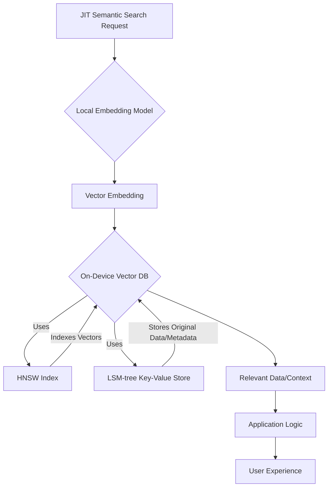

## 온디바이스 벡터 데이터베이스의 필요성
현대 AI 애플리케이션에서 'JIT (Just-In-Time) 의미 검색'은 사용자 질의나 실시간 컨텍스트 변화에 맞춰 즉각적으로 가장 관련성 높은 정보를 찾아내는 핵심 기능입니다. 특히 클라이언트 디바이스(온디바이스)에서 로컬 임베딩 모델(예: Xenova multilingual-e5-small)을 사용하여 벡터를 생성할 때, 이 벡터들을 효율적으로 저장하고 검색하는 시스템은 애플리케이션의 반응성, 개인 정보 보호, 그리고 오프라인 기능 구현에 필수적입니다. 서버 측 벡터 데이터베이스에 의존하지 않고 온디바이스에서 모든 과정을 처리함으로써, 네트워크 지연을 제거하고 클라우드 비용을 절감하며 민감한 데이터를 로컬에서 관리할 수 있습니다.

## 핵심 기술: LSM-tree와 HNSW
제시된 온디바이스 벡터 데이터베이스는 두 가지 핵심 기술인 LSM-tree와 HNSW를 C 언어로 구현하여 성능과 효율성을 극대화합니다.

### LSM-tree (Log-Structured Merge-tree): 데이터 영속성과 쓰기 최적화
LSM-tree는 쓰기(Write) 성능에 최적화된 키-값(Key-Value) 스토리지 엔진 구조입니다. 데이터는 메모리 내(in-memory)의 MemTable에 먼저 기록되고, 특정 크기에 도달하면 디스크의 SSTable(Sorted String Table)로 플러시(flush)됩니다. 여러 SSTable은 백그라운드에서 주기적으로 병합(compaction)되어 읽기(Read) 성능을 향상시키고 디스크 공간을 최적화합니다. 이는 벡터 데이터를 포함한 다양한 메타데이터를 안정적으로 저장하고 관리하는 데 적합합니다.

### HNSW (Hierarchical Navigable Small World): 고차원 벡터 검색 인덱스
HNSW는 Approximate Nearest Neighbor (ANN) 검색 알고리즘 중 하나로, 고차원 벡터 공간에서 가장 가까운 벡터(Nearest Neighbor)를 효율적으로 찾아내는 데 사용됩니다. 이 알고리즘은 다층 그래프 구조를 사용하여 검색 속도를 비약적으로 향상시킵니다. 쿼리 벡터가 주어지면, 가장 상위(sparse) 레이어에서 시작하여 인접 노드를 탐색하며 점차 하위(dense) 레이어로 내려가면서 최종적으로 근사 최접이웃(approximate nearest neighbor)을 찾습니다. 온디바이스 환경에서 수많은 벡터 중 빠르게 의미론적 유사성을 판단해야 하는 JIT 의미 검색에 필수적인 기술입니다.

## 온디바이스 아키텍처 및 Node.js 연동 전략
본 온디바이스 벡터 데이터베이스는 C 언어로 작성되어 외부 의존성을 최소화하고 높은 성능을 보장합니다. Node.js 환경에서 Xenova multilingual-e5-small과 같은 로컬 임베딩 모델의 결과를 활용하기 위해 다음과 같은 연동 전략을 고려할 수 있습니다.

### Native Addon (N-API)
Node.js Native Addon은 C/C++ 코드를 Node.js 애플리케이션에서 직접 호출할 수 있도록 해주는 메커니즘입니다. N-API(Node-API)를 사용하면 Node.js 버전 업그레이드에 따른 호환성 문제를 최소화하면서 C로 작성된 벡터 데이터베이스의 모든 기능을 Node.js에서 직접 활용할 수 있습니다. 이는 가장 낮은 수준의 오버헤드로 최고 성능을 기대할 수 있는 방법입니다.

### WebAssembly (WASM)
C 코드를 WebAssembly로 컴파일하여 Node.js 환경에서 실행하는 방법도 있습니다. WASM은 브라우저뿐만 아니라 Node.js에서도 실행 가능하며, 샌드박스 환경에서 안전하게 고성능 코드를 실행할 수 있다는 장점이 있습니다. Native Addon보다 약간의 성능 오버헤드가 있을 수 있으나, 플랫폼 독립성과 보안 측면에서 이점을 제공합니다.

다음은 Node.js에서 Native Addon을 통해 온디바이스 벡터 DB를 사용하는 개념적인 코드 예시입니다.

```javascript
// Assuming 'ondevice_vector_db' is a native addon module
const OnDeviceVectorDB = require('./build/Release/ondevice_vector_db');

// Initialize the database
const db = new OnDeviceVectorDB.DB('./my_vector_data.db');

// Example: Insert a vector and its associated data
const vectorId1 = 'doc123';
const vector1 = [0.1, 0.2, 0.3, /* ... 384 dimensions */]; // Example e5-small vector
const metadata1 = { title: 'AI Agent Context', content: 'Optimizing context windows' };
db.insertVector(vectorId1, vector1, JSON.stringify(metadata1));

const vectorId2 = 'doc456';
const vector2 = [0.15, 0.25, 0.35, /* ... */];
const metadata2 = { title: 'Vector DB Performance', content: 'LSM-tree and HNSW' };
db.insertVector(vectorId2, vector2, JSON.stringify(metadata2));

// Example: Perform a semantic search
const queryVector = [0.11, 0.21, 0.31, /* ... */];
const k = 5; // Retrieve top 5 nearest neighbors
const results = db.search(queryVector, k);

console.log('Search Results:');
results.forEach(result => {
  console.log(`  ID: ${result.id}, Distance: ${result.distance}, Data: ${JSON.parse(result.data).title}`);
});

// Close the database
db.close();
```

## JIT 의미 검색 워크플로우
아래 Mermaid 다이어그램은 JIT 의미 검색을 위한 온디바이스 벡터 데이터베이스의 전반적인 작동 흐름을 보여줍니다.



사용자 요청이 발생하면, 로컬 임베딩 모델이 해당 요청을 벡터로 변환합니다. 이 벡터는 온디바이스 벡터 DB로 전달되어 HNSW 인덱스를 통해 가장 유사한 벡터들을 빠르게 검색합니다. 검색된 벡터 ID를 바탕으로 LSM-tree에 저장된 원본 데이터나 메타데이터를 조회하여 최종적으로 관련성 높은 컨텍스트를 애플리케이션 로직에 제공합니다.

## 성능 및 리소스 최적화 효과
C 기반 온디바이스 벡터 DB의 통합은 기존 검색 로직 대비 상당한 성능 향상과 리소스 사용량 감소 효과를 가져올 수 있습니다.

*   **속도**: C 언어의 직접적인 메모리 접근과 시스템 자원 제어를 통해 Python 또는 JavaScript 기반의 순수 소프트웨어 구현보다 훨씬 빠른 벡터 연산 및 검색이 가능합니다. HNSW의 효율적인 근사 검색은 대규모 벡터 데이터셋에서도 실시간에 가까운 응답 시간을 제공합니다.
*   **메모리 및 CPU 사용량**: 외부 의존성 없이 C로 구현된 컴팩트한 엔진은 최소한의 메모리 footprint와 최적화된 CPU 사이클을 사용합니다. 이는 특히 리소스가 제한적인 온디바이스 환경(모바일, 엣지 디바이스)에서 중요한 이점입니다.
*   **오프라인 기능**: 네트워크 연결 없이도 JIT 의미 검색이 가능하므로, 사용자는 언제 어디서든 일관된 검색 경험을 기대할 수 있습니다.

## 트레이드오프

*   **개발 복잡성**: C 언어 기반의 데이터베이스 엔진을 개발하고 Node.js Native Addon 또는 WASM으로 연동하는 것은 높은 수준의 시스템 프로그래밍 지식과 노력을 요구합니다. 언제 좋은가: 극단적인 성능 최적화와 리소스 제어가 필수적일 때. 언제 나쁜가: 개발 속도와 유지보수의 용이성이 최우선이며, 성능 요구사항이 중간 정도일 때.
*   **이식성 및 배포**: C 코드는 특정 운영체제나 아키텍처에 종속될 수 있어, 다양한 플랫폼(Windows, macOS, Linux, ARM 등)에 맞춰 빌드하고 배포하는 과정이 복잡합니다. 언제 좋은가: 특정 플랫폼(예: 특정 임베디드 리눅스 또는 모바일 OS)에 대한 최적화가 명확할 때. 언제 나쁜가: 광범위한 플랫폼 지원이 요구되며, CI/CD 파이프라인이 이러한 복잡성을 다루기 어렵거나 불필요할 때.
*   **데이터 규모와 관리**: 온디바이스 환경은 저장 공간과 메모리 제약이 명확하므로, 방대한 벡터 데이터셋을 관리하는 데 한계가 있습니다. 주기적인 데이터 정리, 압축, 또는 원격 서버와의 동기화 전략이 필요할 수 있습니다. 언제 좋은가: 데이터셋의 크기가 온디바이스 제약 내에 있으며, 데이터 수명이 비교적 짧거나 주기적인 업데이트가 용이할 때. 언제 나쁜가: 수 테라바이트 이상의 대규모 데이터셋을 온디바이스에서 완전히 관리해야 하거나, 데이터 동기화 복잡성을 감당하기 어려울 때.
*   **유지보수 및 디버깅**: C 기반 코드의 디버깅은 고수준 언어보다 복잡하며, 메모리 누수나 세그멘테이션 폴트와 같은 문제에 직면할 가능성이 높습니다. 언제 좋은가: 숙련된 C/C++ 개발자가 팀 내에 존재하며, 장기적인 성능 안정성이 최우선 과제일 때. 언제 나쁜가: 빠른 기능 개발과 반복이 중요하고, 개발팀이 주로 고수준 언어에 익숙할 때.

## 실전 체크리스트

프로젝트에 온디바이스 벡터 DB를 적용할 때 검증해야 할 실전 체크리스트입니다.

*   [ ] **로컬 임베딩 모델의 성능 벤치마킹 완료**: Xenova multilingual-e5-small과 같은 로컬 모델이 실제 디바이스에서 의미 검색 벡터를 생성하는 데 걸리는 시간을 측정하고, 이 시간이 전체 JIT 검색 파이프라인의 병목이 아닌지 확인.
*   [ ] **온디바이스 벡터 DB의 CRUD 및 검색 성능 측정**: 실제 데이터셋 크기(예: 10만 개 벡터)에 대한 벡터 삽입(Create), 조회(Read), 업데이트(Update), 삭제(Delete) 및 HNSW 검색 속도(Latency)와 처리량(Throughput)을 측정하여 목표 성능 지표 충족 여부 확인.
*   [ ] **리소스 사용량 프로파일링**: 벡터 DB 동작 시 CPU 사용률, 메모리 점유율, 디스크 I/O를 측정하여 온디바이스 환경의 제약 조건을 초과하지 않는지 검증.
*   [ ] **Node.js 연동 방식 결정 및 POC 구현**: Native Addon (N-API)과 WebAssembly (WASM) 중 프로젝트의 요구사항(성능, 이식성, 개발 복잡도)에 가장 적합한 방식을 선정하여 최소 기능 동작 확인(Proof of Concept) 완료.
*   [ ] **데이터 영속성 및 견고성 테스트**: 비정상적인 종료 상황(앱 강제 종료, 디바이스 재부팅) 발생 시 온디바이스 DB에 저장된 벡터 데이터의 유실 여부와 복구 메커니즘의 정상 작동 여부 확인.
*   [ ] **데이터 동기화 전략 수립**: 온디바이스 DB의 데이터가 원격 서버의 데이터와 어떻게 동기화될지(초기 로딩, 주기적 업데이트, 충돌 해결)에 대한 명확한 전략을 정의하고, 이를 통해 데이터 일관성을 유지할 방안 마련.
*   [ ] **CI/CD 파이프라인 통합 계획 수립**: C 기반 엔진 빌드, Node.js Native Addon/WASM 컴파일 및 배포 과정을 자동화하는 CI/CD 파이프라인 구축 계획을 수립하여 개발 및 운영 효율성 확보.