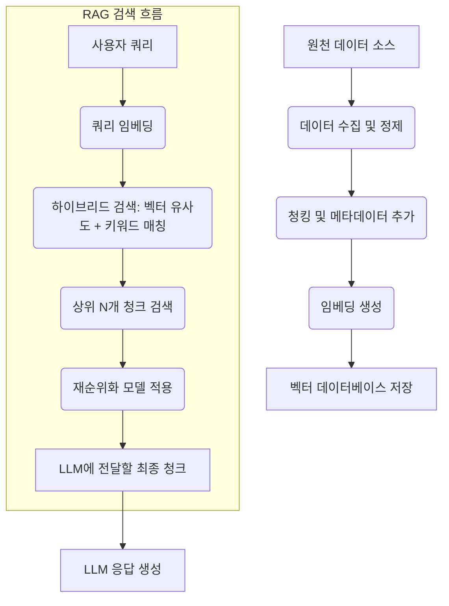

RAG(Retrieval Augmented Generation) 시스템의 성능은 검색 단계에서 얼마나 관련성 높은 정보를 정확하고 효율적으로 찾아내느냐에 따라 크게 좌우됩니다. 이 과정에서 데이터 전처리와 임베딩 최적화는 AI 모델의 검색 정확도와 응답 속도를 향상시키는 데 결정적인 역할을 합니다. 본 문서는 2026년 최신 트렌드를 반영하여 RAG 시스템을 위한 데이터 준비 및 임베딩 기법의 고급 전략을 탐구합니다.

## RAG 시스템의 검색 품질 향상을 위한 전처리 전략 (Data Preprocessing for RAG)

RAG 시스템에서 검색 엔진의 효율성을 극대화하려면 원본 데이터를 검색에 적합한 형태로 가공하는 전처리 과정이 필수적입니다. 이는 비정형 데이터를 구조화하고, 관련성 높은 청크(chunk)를 생성하며, 검색 관련 메타데이터를 풍부하게 하는 것을 포함합니다.

### 데이터 수집 및 정제 (Data Ingestion & Cleaning)

다양한 소스(웹 페이지, PDF, 데이터베이스 등)에서 데이터를 수집한 후, 노이즈 제거, 중복 제거, 형식 통일 등의 정제 작업이 선행되어야 합니다. 특수 문자, HTML 태그, 불필요한 공백 등을 제거하여 임베딩 모델이 의미 있는 정보를 학습하도록 돕습니다. 2026년에는 AI 기반의 자동 데이터 정제 및 이상 탐지 도구가 더욱 정교해져 초기 데이터 품질 확보에 기여합니다.

### 청킹 기법 (Chunking Strategies)

원본 문서를 작은 단위인 청크로 나누는 것은 RAG의 핵심입니다. 청크 크기와 오버랩 전략은 검색 성능에 직접적인 영향을 미칩니다. 너무 큰 청크는 불필요한 정보를 포함하여 노이즈를 증가시키고, 너무 작은 청크는 문맥 손실을 야기할 수 있습니다.

*   **고정 크기 청킹 (Fixed-size Chunking)**: 가장 기본적인 방법으로, 일정한 토큰 또는 문자 수로 문서를 나눕니다.
*   **의미 기반 청킹 (Semantic Chunking)**: 문장의 의미적 경계를 기반으로 청크를 나눕니다. 문장 임베딩 유사도나 구두점, 헤딩 등을 활용하여 자연스러운 문맥을 유지합니다. LangChain과 같은 프레임워크에서 지원하는 RecursiveCharacterTextSplitter는 이러한 계층적 분할을 지원합니다.

### 메타데이터 활용 (Leveraging Metadata)

각 청크에 원본 문서의 출처, 생성일, 저자, 주제, 문서 유형 등 풍부한 메타데이터를 추가하면 검색 정교성을 높일 수 있습니다. 예를 들어, 특정 날짜 이후의 문서만 검색하거나 특정 주제의 문서에 가중치를 부여하는 등 필터링 및 랭킹에 활용됩니다.

```python
from langchain.text_splitter import RecursiveCharacterTextSplitter

def preprocess_document(doc_content: str, metadata: dict):
    text_splitter = RecursiveCharacterTextSplitter(
        chunk_size=1000,
        chunk_overlap=200,
        length_function=len,
        separators=["\n\n", "\n", " ", ""]
    )
    chunks = text_splitter.create_documents([doc_content])
    
    # 각 청크에 메타데이터 추가
    for chunk in chunks:
        chunk.metadata.update(metadata)
        # 추가적인 청크별 메타데이터 생성 (예: 청크 인덱스)
        chunk.metadata["chunk_id"] = f"{metadata.get('doc_id', 'unknown')}-{hash(chunk.page_content)[:8]}"
    return chunks

# 예시 사용
document_text = """RAG 시스템은 LLM의 한계를 보완하기 위해 외부 지식 베이스를 활용합니다. 이를 통해 모델은 최신 정보에 접근하고, 환각(hallucination)을 줄이며, 출처를 제공할 수 있게 됩니다. 데이터 전처리는 이 과정의 핵심입니다. 2026년에는 이 기술이 더욱 발전할 것입니다.

이 문서는 RAG의 데이터 처리 전략에 대해 설명합니다. 효과적인 청킹과 메타데이터 활용은 검색 정확도에 매우 중요합니다. 특히, 의미 기반 청킹은 문맥을 보존하는 데 유리합니다."""

doc_metadata = {
    "doc_id": "rag-guide-2026",
    "source": "internal_wiki",
    "author": "AI Team",
    "year": 2026
}

processed_chunks = preprocess_document(document_text, doc_metadata)
for i, chunk in enumerate(processed_chunks):
    print(f"Chunk {i+1}: {chunk.page_content[:50]}...\nMetadata: {chunk.metadata}\n")
```

### 재귀적 청킹 및 계층적 구조 (Recursive Chunking & Hierarchical Structures) 

2026년에는 단일 청킹 전략을 넘어, 다양한 granularity의 청크를 생성하고 이를 계층적으로 연결하는 방식이 주목받고 있습니다. 예를 들어, 작은 청크들의 요약을 담은 중간 청크, 그리고 전체 문서의 요약을 담은 상위 청크를 만들어, 검색 시 먼저 넓은 범위에서 관련성을 파악한 후 세부 청크로 드릴다운하는 방식입니다.

## 임베딩 모델 최적화 및 검색 기법 (Embedding Model Optimization & Retrieval Techniques)

데이터가 잘 전처리되었다면, 다음 단계는 이 데이터를 벡터 공간에 효율적으로 매핑하고 검색하는 것입니다.

### 임베딩 모델 선택 (Embedding Model Selection)

어떤 임베딩 모델을 사용할지는 RAG 시스템의 성능에 지대한 영향을 미칩니다. Sentence-BERT 계열 모델 (예: `all-MiniLM-L6-v2`, `BAAI/bge-small-en-v1.5`)은 범용적으로 사용되지만, 특정 도메인에서는 성능이 떨어질 수 있습니다. 2026년에는 특정 산업 도메인에 특화된 경량 임베딩 모델과 Multilingual 임베딩 모델의 발전이 두드러집니다.

### 임베딩 모델 미세 조정 (Fine-tuning Embedding Models)

도메인 특화 데이터로 임베딩 모델을 미세 조정(fine-tuning)하면 검색 관련성을 크게 향상시킬 수 있습니다. Contrasting Learning (대조 학습) 기반의 기법 (예: SimCSE, E5)이 주로 사용되며, 관련 문서 쌍을 긍정(positive) 샘플로, 비관련 문서 쌍을 부정(negative) 샘플로 학습시켜 벡터 공간에서 관련 문서들을 가깝게, 비관련 문서들을 멀게 만듭니다.

### 검색 전략 (Retrieval Strategies)

*   **Dense Retrieval**: 벡터 데이터베이스(Vector Database)에서 유사도 검색을 통해 가장 유사한 벡터를 가진 청크를 찾아냅니다.
*   **Sparse Retrieval**: BM25와 같은 키워드 기반 검색으로, 단어 매칭에 강점이 있습니다. 고유명사나 특정 키워드 검색에 유리합니다.

### 하이브리드 검색 및 재순위화 (Hybrid Search & Reranking)

2026년의 RAG 시스템은 Dense Retrieval과 Sparse Retrieval의 장점을 결합한 **하이브리드 검색(Hybrid Search)**을 기본으로 채택하는 추세입니다. 초기 검색 결과에 대해 `Cohere Rerank`, `bge-reranker-base`와 같은 경량 언어 모델을 사용하여 최종적으로 관련성 높은 문서를 재순위화(Reranking)하여 LLM에 전달하는 방식이 일반화되고 있습니다. 이는 검색 정확도를 크게 향상시키면서도 LLM의 연산 부담을 줄입니다.



## 트레이드오프 (Trade-offs)

RAG 시스템의 데이터 전처리 및 임베딩 최적화 과정에는 여러 트레이드오프가 존재하며, 프로젝트의 특성과 요구사항에 따라 적절한 균형점을 찾아야 합니다.

*   **청크 크기 및 오버랩**: 너무 작은 청크는 문맥 손실을 야기하지만, 검색 시 불필요한 정보 감소로 속도 향상 가능성이 있습니다. 반대로, 큰 청크는 문맥 보존에 유리하지만, 검색 정확도 저하 및 LLM의 Context Window 부담을 증가시킬 수 있습니다. 의미 기반 청킹은 구현 복잡도가 높지만 문맥 보존에 유리합니다. **언제 좋은가**: 작은 청크는 단답형 질문이나 특정 키워드 검색에 유리하며, 큰 청크는 복합적인 질문이나 요약 생성에 적합합니다. **언제 나쁜가**: 지나치게 작은 청크는 답변에 필요한 정보가 여러 청크에 분산되어 검색 실패로 이어질 수 있으며, 지나치게 큰 청크는 관련성 없는 정보가 LLM에 주입되어 'hallucination'이나 'confabulation'을 유발할 수 있습니다.
*   **임베딩 모델 선택**: 경량 모델은 임베딩 생성 및 검색 속도가 빠르고 비용이 저렴하지만, 복잡하거나 도메인 특화된 쿼리에서 성능이 떨어질 수 있습니다. 대형 모델은 성능이 좋지만, 연산 비용과 지연 시간이 증가합니다. **언제 좋은가**: 경량 모델은 실시간 처리나 비용 민감도가 높은 서비스에, 대형 모델은 높은 정확도가 요구되는 핵심 서비스에 좋습니다. **언제 나쁜가**: 경량 모델을 복잡한 도메인에 적용하면 검색 품질이 저하되고, 대형 모델을 단순 검색에 사용하면 자원 낭비가 심합니다.
*   **임베딩 모델 미세 조정**: 미세 조정은 검색 정확도를 크게 향상시키지만, 고품질의 도메인 특화 학습 데이터셋 구축과 학습 과정에 시간과 리소스가 많이 소요됩니다. **언제 좋은가**: 특정 도메인에서 범용 모델의 성능이 만족스럽지 않거나, 특정 용어 및 개념에 대한 이해가 중요한 경우 좋습니다. **언제 나쁜가**: 데이터셋 구축이 어렵거나, 범용 모델로도 충분한 성능이 나오는 경우, 또는 리소스 제약이 심한 경우 불필요한 오버헤드가 될 수 있습니다.
*   **하이브리드 검색 및 재순위화**: 검색 정확도를 높이는 효과적인 방법이지만, 시스템 복잡도를 증가시키고 전체 검색 지연 시간을 늘릴 수 있습니다. 여러 모델을 사용하므로 관리 오버헤드도 발생합니다. **언제 좋은가**: 높은 검색 정확도가 필수적인 서비스 (예: 법률, 의료, 기술 문서 검색)에 효과적입니다. **언제 나쁜가**: 낮은 지연 시간이 중요하고, 검색 품질 요구사항이 아주 높지 않은 경우 (예: 일반적인 Q&A 챗봇)에는 과도한 복잡성을 초래할 수 있습니다.

## 실전 체크리스트 (Practical Checklist)

RAG 시스템을 위한 데이터 전처리 및 임베딩 최적화 전략을 실제 프로젝트에 적용할 때 다음 항목들을 검증하여 성공적인 배포를 보장해야 합니다.

- [ ]  **데이터 정제 파이프라인 구축 여부**: 원천 데이터의 노이즈, 중복, 포맷 불일치 등을 자동으로 처리하는 견고한 데이터 정제 파이프라인이 구축되어 있는가?
- [ ]  **청킹 전략의 도메인 적합성 평가**: 도메인 특성과 쿼리 패턴에 맞춰 고정 크기, 의미 기반, 재귀적 청킹 등 다양한 전략을 실험하고 최적의 청크 크기 및 오버랩을 결정했는가? (예: `TextSplitter` 매개변수 최적화)
- [ ]  **메타데이터 활용 계획 수립**: 각 청크에 포함될 메타데이터 유형(출처, 날짜, 주제 등)을 정의하고, 이를 검색 필터링 및 랭킹에 활용하기 위한 명확한 계획이 있는가?
- [ ]  **임베딩 모델 성능 벤치마킹**: 다양한 임베딩 모델(오픈소스, 상용)을 도메인 데이터셋으로 벤치마킹하여 성능(Recall, Precision, MRR 등)을 비교하고, 시스템 요구사항(속도, 비용, 정확도)에 부합하는 최적의 모델을 선택했는가?
- [ ]  **도메인 특화 임베딩 미세 조정 전략**: 현재 임베딩 모델의 도메인 적합성이 낮다고 판단될 경우, 미세 조정을 위한 고품질 학습 데이터셋(쿼리-문서 쌍) 구축 계획 및 실행 방안이 마련되어 있는가?
- [ ]  **하이브리드 검색 및 재순위화 적용 여부**: Dense retrieval과 Sparse retrieval의 조합, 그리고 재순위화(Reranking) 모델 도입을 통해 검색 정확도를 추가적으로 향상시킬 계획이 있는가? 또한, 이로 인한 지연 시간 증가를 허용할 수 있는가?
- [ ]  **종합적인 RAG 시스템 평가 지표 정의**: 데이터 전처리 및 임베딩 최적화가 전체 RAG 시스템의 검색 품질(Retrieval-focused metrics) 및 응답 품질(Generation-focused metrics)에 미치는 영향을 측정하기 위한 명확한 평가 지표(예: `Context Recall`, `Context Precision`, `Faithfulness`, `Answer Relevancy`)가 정의되어 있는가?
