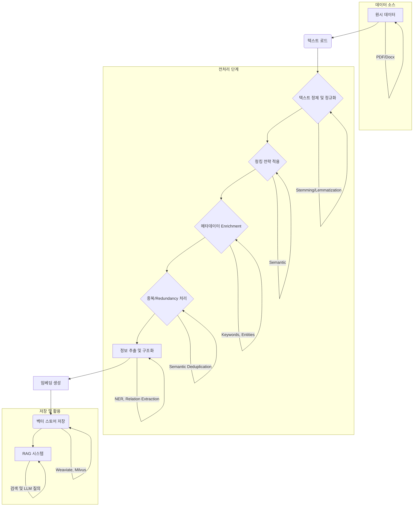

## RAG 시스템을 위한 데이터 전처리의 중요성

Retrieval-Augmented Generation (RAG) 시스템의 성능은 Large Language Model (LLM) 자체의 능력뿐만 아니라, LLM에 제공되는 '검색된(retrieved)' 정보의 품질에 크게 좌우됩니다. 비정형 데이터를 효과적으로 처리하고 저장하는 과정은 RAG 시스템이 사용자의 쿼리에 대해 정확하고 관련성 높은 답변을 생성하는 데 필수적인 요소입니다. 부적절하게 처리된 데이터는 검색 정확도를 떨어뜨리고, 결과적으로 환각(hallucination)을 유발하거나 관련 없는 정보를 제공하게 만들 수 있습니다.

데이터 전처리는 원시 데이터를 LLM이 효과적으로 활용할 수 있는 형태로 변환하는 과정입니다. 이는 텍스트 정제, 구조화, 청킹(chunking), 메타데이터 추가 등 다양한 기법을 포함하며, 2026년 현재 RAG 시스템의 효율성과 정확도를 결정하는 핵심 기술로 인식되고 있습니다.

## 핵심 데이터 전처리 기법

### 텍스트 정제 및 정규화 (Text Cleaning and Normalization)

입력 데이터에서 노이즈를 제거하고 일관된 형식으로 만드는 과정입니다. 이는 검색 품질에 직접적인 영향을 미칩니다.

*   **불필요한 문자 제거**: 특수문자, HTML 태그, 스크립트 코드 등을 제거합니다.
*   **대소문자 통일**: 모든 텍스트를 소문자로 변환하여 'Apple'과 'apple'을 동일하게 처리합니다.
*   **오탈자 및 구두점 처리**: 오탈자를 교정하거나 구두점을 일관되게 처리합니다.
*   **Stopword 제거**: 'a', 'the', 'is'와 같이 의미 없는 단어들을 제거하여 임베딩의 초점을 중요 단어에 맞춥니다.
*   **Stemming/Lemmatization**: 단어를 어간 또는 기본형으로 통일하여 관련성 높은 문서가 검색될 확률을 높입니다.

### 효과적인 청킹 전략 (Effective Chunking Strategies)

문서를 작은 단위(청크)로 분할하는 것은 RAG 시스템에서 검색의 정밀도와 속도를 결정하는 매우 중요한 요소입니다. 청크 크기는 임베딩 모델의 Context Window, 검색 효율성, 그리고 LLM의 처리 능력에 영향을 줍니다.

*   **고정 크기 청킹 (Fixed-size Chunking)**: 가장 간단한 방법으로, 문서가 고정된 문자 수 또는 토큰 수로 분할됩니다. 오버랩(overlap)을 통해 청크 간의 문맥 유실을 최소화할 수 있습니다.
*   **의미 기반 청킹 (Semantic Chunking)**: 문맥의 흐름이 변경되는 지점을 기준으로 분할합니다. LangChain과 같은 라이브러리는 LLM을 활용하여 의미적으로 응집된 부분을 찾아 청크를 생성하는 기능을 제공합니다.
*   **재귀적 청킹 (Recursive Chunking)**: 다양한 분리 문자(단락, 문장, 단어 등)를 사용하여 계층적으로 문서를 분할합니다. 큰 문서에서 점차 작은 단위로 쪼개며 최적의 청크 크기를 찾아갑니다.
*   **메타데이터 인식 청킹 (Metadata-aware Chunking)**: 문서의 구조(제목, 부제목, 리스트 등)를 활용하여 청크를 생성합니다. 예를 들어, 각 청크에 해당 섹션의 제목을 메타데이터로 첨부할 수 있습니다.

### 메타데이터 Enrichment (Metadata Enrichment)

청크에 관련 메타데이터를 추가하면 검색 단계에서 더욱 정교한 필터링 및 랭킹이 가능해집니다.

*   **문서 출처 (Source)**: 문서의 원본 URL, 파일 경로 등을 포함합니다.
*   **생성/수정 일자 (Timestamp)**: 정보의 최신성 여부를 판단하는 데 활용됩니다.
*   **작성자/카테고리 (Author/Category)**: 특정 주제나 작성자의 문서를 선별하는 데 사용됩니다.
*   **키워드/엔티티 (Keywords/Entities)**: 문서의 주요 키워드나 명명된 엔티티를 추출하여 추가합니다.
*   **요약 정보 (Summary)**: 청크의 요약본을 메타데이터로 저장하여 검색 시 활용할 수 있습니다.

### 중복 및 Redundancy 처리 (Redundancy and Duplication Handling)

데이터셋 내 중복되거나 유사한 콘텐츠는 검색 효율성을 저해하고, 비싼 임베딩 및 저장 비용을 발생시킵니다. 의미론적 중복 제거(Semantic Deduplication)는 임베딩 벡터 간 유사도를 비교하여 수행됩니다.

### 정보 추출 및 구조화 (Information Extraction and Structuring)

비정형 텍스트에서 Named Entity Recognition (NER), 관계 추출(Relation Extraction) 등을 통해 구조화된 정보를 추출하고 이를 메타데이터로 활용하거나 별도의 지식 그래프(Knowledge Graph)로 구축하여 RAG 시스템에 통합할 수 있습니다. 이는 복잡한 쿼리에 대한 답변 품질을 높이는 데 기여합니다.

## RAG 데이터 전처리 파이프라인 예시

다음은 Python에서 LangChain을 활용한 기본적인 데이터 전처리 과정을 보여줍니다.

```python
from langchain_community.document_loaders import TextLoader
from langchain.text_splitter import RecursiveCharacterTextSplitter
from langchain_community.vectorstores import FAISS
from langchain_openai import OpenAIEmbeddings

def preprocess_document_for_rag(file_path: str):
    """문서를 로드하고 전처리하여 벡터 스토어에 저장합니다."""

    # 1. 문서 로드 (Document Loading)
    loader = TextLoader(file_path, encoding="utf-8")
    documents = loader.load()
    print(f"로드된 문서 수: {len(documents)}")

    # 2. 텍스트 청킹 (Text Chunking) 및 메타데이터 처리
    # 재귀적 문자 분할기를 사용하여 텍스트를 청크로 나눕니다.
    # chunk_size는 텍스트 길이, chunk_overlap은 청크 간 중복되는 부분의 길이입니다.
    text_splitter = RecursiveCharacterTextTextSplitter(
        chunk_size=1000,
        chunk_overlap=200,
        separators=["\n\n", "\n", " ", ""]
    )
    chunks = text_splitter.split_documents(documents)
    print(f"생성된 청크 수: {len(chunks)}")

    # 각 청크에 메타데이터 추가 (예: 페이지 번호, 소스 파일명)
    for i, chunk in enumerate(chunks):
        chunk.metadata["chunk_id"] = f"chunk_{i}"
        if "source" not in chunk.metadata:
            chunk.metadata["source"] = file_path # 기본 소스 추가
        print(f"청크 (i): {chunk.page_content[:50]}... (메타데이터: {chunk.metadata})")

    # 3. 임베딩 생성 및 벡터 스토어 저장
    # OpenAIEmbeddings를 사용하여 각 청크를 벡터로 변환합니다.
    # 실제 사용 시 API 키 설정 필요
    embeddings_model = OpenAIEmbeddings(model="text-embedding-3-small")
    vectorstore = FAISS.from_documents(chunks, embeddings_model)
    print("벡터 스토어 생성 완료.")

    return vectorstore

# 예시 사용법
# with open("example_document.txt", "w", encoding="utf-8") as f:
#     f.write("이것은 RAG 시스템 전처리 예제 문서입니다. 여러 문장으로 구성되어 있습니다.\n\n두 번째 단락은 RAG 성능 향상을 위한 데이터 정제의 중요성을 설명합니다. 데이터 품질은 검색 정확도에 직접적인 영향을 미칩니다.")
#
# vectorstore = preprocess_document_for_rag("example_document.txt")
# query = "RAG 시스템의 성능을 향상시키는 방법은?"
# docs = vectorstore.similarity_search(query)
# print(f"\n쿼리: '{query}'에 대한 검색 결과:")
# for doc in docs:
#     print(f"- {doc.page_content[:100]}... (Source: {doc.metadata.get('source', 'Unknown')})")

```

## RAG 데이터 전처리 아키텍처



## 2026년 최신 트렌드

1.  **멀티모달 RAG 전처리 (Multimodal RAG Preprocessing)**: 텍스트뿐만 아니라 이미지, 오디오, 비디오 등 다양한 형태의 데이터를 처리하여 통합된 임베딩을 생성하고 검색하는 기술이 발전하고 있습니다. 이는 멀티모달 LLM의 등장과 함께 더욱 중요해지고 있습니다.
2.  **LLM 기반 지능형 청킹 (LLM-driven Adaptive Chunking)**: 단순히 규칙 기반이 아닌, LLM을 활용하여 문서의 내용을 이해하고 가장 효과적인 청크 경계를 동적으로 결정하는 방식이 연구되고 있습니다. 이는 문맥을 최대한 보존하면서도 검색 효율을 높입니다.
3.  **지식 그래프 통합 (Knowledge Graph Integration)**: 비정형 데이터에서 추출된 엔티티와 관계를 지식 그래프로 구축하고, 이를 벡터 스토어와 결합하여 더욱 풍부하고 구조화된 정보 검색을 가능하게 합니다. 이는 복잡한 추론 및 사실 확인에 강점을 가집니다.
4.  **실시간 데이터 스트리밍 처리 (Real-time Data Streaming Processing)**: 센서 데이터, 로그, 소셜 미디어 피드 등 실시간으로 발생하는 데이터를 즉시 전처리하고 벡터 스토어에 반영하는 스트리밍 파이프라인의 중요성이 커지고 있습니다.

## 트레이드오프

*   **청크 크기 및 오버랩**: 작은 청크는 검색 정밀도를 높이지만, 문맥 유실의 위험과 더 많은 저장 공간 및 임베딩 비용을 유발합니다. 큰 청크는 문맥 보존에 유리하지만, 관련성 없는 정보가 포함될 가능성이 높고 임베딩 비용이 증가합니다.
    *   **언제 좋고**: 높은 정밀도가 필요한 경우, 특정 사실(fact) 검색 시 작은 청크가 유리합니다. 넓은 문맥 이해가 필요한 경우, 요약이나 개념 파악 시 큰 청크가 유리합니다.
    *   **언제 나쁜지**: 작은 청크는 복잡한 문맥 이해에 필요한 정보를 분리시킬 수 있습니다. 큰 청크는 불필요한 노이즈를 포함하여 검색 정확도를 떨어뜨릴 수 있습니다.
*   **메타데이터 Enrichment 수준**: 풍부한 메타데이터는 검색 필터링 및 랭킹을 정교하게 만들지만, 추출 및 관리 비용이 증가하고 데이터 복잡도를 높입니다.
    *   **언제 좋고**: 복잡한 질의 처리, 특정 속성 기반 필터링, 정교한 랭킹 로직 구현 시 좋습니다.
    *   **언제 나쁜지**: 데이터 소스가 단순하거나, 리소스가 제한적일 때, 또는 메타데이터 추출 자동화가 어려울 때는 과도한 메타데이터가 오히려 부담이 됩니다.
*   **전처리 복잡도**: 정제, 정규화, 정보 추출 등 전처리 파이프라인이 복잡해질수록 데이터 품질은 향상되지만, 개발 및 유지보수 비용과 처리 시간이 증가합니다.
    *   **언제 좋고**: 매우 높은 정확도와 안정성이 요구되는 핵심 RAG 시스템에 적합합니다.
    *   **언제 나쁜지**: PoC(Proof of Concept) 단계, 빠르게 프로토타입을 구축해야 할 때, 또는 데이터의 중요성이 상대적으로 낮을 때는 과도한 복잡성이 비효율적입니다.
*   **실시간 vs. 배치 처리**: 실시간 전처리는 최신 정보를 즉시 반영할 수 있지만, 복잡한 아키텍처와 높은 운영 비용이 발생합니다. 배치 처리는 비용 효율적이지만, 데이터 반영 지연 시간이 발생합니다.
    *   **언제 좋고**: 뉴스, 소셜 미디어, 주식 정보 등 최신성이 중요한 데이터에 실시간 처리가 좋습니다.
    *   **언제 나쁜지**: 문서 아카이브, 정적 지식 베이스 등 업데이트 빈도가 낮은 데이터에는 배치 처리가 더 효율적입니다.

## 실전 체크리스트

RAG 시스템 성능 향상을 위한 데이터 전처리 전략을 프로젝트에 적용할 때 다음 항목들을 검토해야 합니다.

*   [ ] **데이터 소스 분석 완료 여부**: 처리할 데이터의 유형, 형식, 오염도, 업데이트 주기 등을 종합적으로 분석했는가?
*   [ ] **텍스트 정제 파이프라인 정의 및 구현 여부**: 불필요한 문자 제거, 대소문자 통일, Stopword 처리 등의 기본 정제 규칙을 확립하고 자동화했는가?
*   [ ] **청킹 전략 최적화 여부**: RAG 애플리케이션의 목표(정확도 vs. 포괄성)에 맞춰 최적의 청크 크기, 오버랩, 그리고 청킹 방법을 결정하고 실험을 통해 검증했는가?
*   [ ] **핵심 메타데이터 정의 및 추출 자동화 여부**: 검색 및 랭킹에 필수적인 메타데이터(예: 소스, 날짜, 카테고리)를 정의하고, 이를 자동으로 추출하여 청크에 연결하는 파이프라인을 구축했는가?
*   [ ] **중복 제거 전략 적용 여부**: 데이터셋 내 중복되거나 의미적으로 유사한 청크를 식별하고 제거하는 메커니즘을 구현하여 검색 효율성을 높였는가?
*   [ ] **임베딩 모델 및 차원 선택의 적절성 검토 여부**: 데이터의 특성과 RAG 시스템의 요구사항에 가장 적합한 임베딩 모델(예: `text-embedding-3-small`, E5)과 임베딩 차원을 선택하고 성능을 평가했는가?
*   [ ] **전처리 파이프라인 모니터링 및 재학습 계획 수립 여부**: 전처리된 데이터의 품질을 지속적으로 모니터링하고, 데이터 변화에 따라 전처리 로직이나 임베딩 모델을 주기적으로 업데이트(재학습)할 계획이 있는가?
