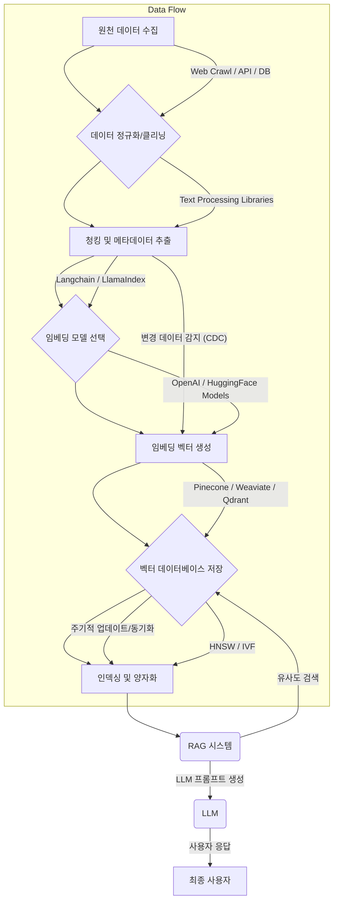

RAG (Retrieval-Augmented Generation) 시스템의 핵심은 검색 품질이며, 이는 임베딩 데이터의 품질과 효율적인 관리에 직접적으로 의존합니다. 임베딩 데이터 최적화는 LLM의 환각(hallucination)을 줄이고 답변의 정확도와 관련성을 높이는 데 필수적입니다. 2026년 현재, 대규모 데이터를 효율적으로 처리하고 최신 정보를 반영하는 동적 임베딩 관리 패턴이 중요하게 부각되고 있습니다. 이 엔트리에서는 RAG 시스템의 임베딩 데이터 최적화 및 관리 패턴에 대해 다룹니다.

## 임베딩 데이터 최적화의 중요성

정확하고 최적화된 임베딩 데이터는 RAG 시스템이 사용자의 쿼리에 가장 관련성 높은 문서를 검색하도록 돕습니다. 비효율적인 임베딩은 검색 결과를 오염시키고 LLM이 부정확하거나 관련 없는 정보를 기반으로 답변을 생성하게 만들 수 있습니다. 특히 실시간으로 변화하는 정보 환경에서는 임베딩 데이터의 신선도와 일관성을 유지하는 것이 중요합니다.

### 데이터 전처리 및 청킹 전략

임베딩 생성 전 데이터 전처리는 RAG 성능에 결정적인 영향을 미칩니다. 주요 전략은 다음과 같습니다.

*   **청킹 (Chunking)**: 문서를 적절한 크기의 '청크'로 분할하는 과정입니다. 너무 작으면 컨텍스트 손실, 너무 크면 비관련 정보 포함 및 토큰 비용 증가 문제가 발생합니다. 문맥 보존을 위해 문단 단위, 문장 단위, 또는 토큰 제한을 고려한 고정/가변 크기 청킹을 적용합니다. 2026년에는 Semantic Chunking, Recursive Chunking과 같은 고급 방법론이 더욱 중요해지고 있습니다.
*   **메타데이터 추가 (Metadata Enrichment)**: 각 청크에 출처, 생성일, 주제, 저자 등 유용한 메타데이터를 포함하여 검색 시 필터링이나 랭킹에 활용합니다. 이는 검색 정확도를 크게 향상시킬 수 있습니다.
*   **노이즈 제거 및 정규화 (Noise Reduction & Normalization)**: 불필요한 특수문자, HTML 태그, 중복 내용 등을 제거하고 텍스트를 정규화하여 임베딩 품질을 높입니다.

```python
import tiktoken

def recursive_chunking(text: str, max_tokens: int = 500, overlap: int = 50) -> list[str]:
    tokenizer = tiktoken.encoding_for_model("gpt-4") # For token estimation
    tokens = tokenizer.encode(text)
    chunks = []
    for i in range(0, len(tokens), max_tokens - overlap):
        chunk_tokens = tokens[i : i + max_tokens]
        chunks.append(tokenizer.decode(chunk_tokens))
    return chunks

def add_metadata(chunk: str, source: str, created_date: str) -> dict:
    return {
        "content": chunk,
        "metadata": {
            "source": source,
            "created_date": created_date
        }
    }

# Example Usage
document = """RAG 시스템은 LLM의 한계를 보완하기 위해 외부 지식 베이스를 활용합니다. 임베딩은 이 외부 지식 베이스의 검색 효율성을 결정하는 핵심 요소입니다. 따라서 임베딩 데이터의 최적화는 RAG 시스템 성능 향상에 필수적입니다. 최신 트렌드에 따르면, 동적 청킹 전략과 메타데이터 기반 필터링이 검색 정확도를 높이는 데 기여합니다."""
chunks = recursive_chunking(document, max_tokens=100, overlap=20)
processed_data = [add_metadata(c, "Technical Blog", "2026-07-20") for c in chunks]

for item in processed_data:
    print(f"Content: {item['content'][:50]}...\nMetadata: {item['metadata']}\n---")
```

### 임베딩 모델 선택 및 관리

적절한 임베딩 모델 선택은 RAG 시스템의 성능에 직접적인 영향을 미칩니다. 텍스트의 특성(도메인 특화 여부), 언어, 그리고 계산 비용을 고려하여 모델을 선택해야 합니다. 최신 트렌드로는 Multi-lingual Embedding 모델이나 특정 도메인에 Fine-tuning된 모델의 사용이 증가하고 있습니다. 임베딩 모델의 주기적인 업데이트나 벤치마킹을 통해 최적의 성능을 유지합니다.

### 벡터 데이터베이스 최적화

선택된 임베딩은 벡터 데이터베이스(Vector Database)에 저장됩니다. 벡터 데이터베이스는 유사도 검색을 효율적으로 수행하도록 설계되었으며, 그 성능 최적화는 RAG 시스템의 Latency와 Throughput에 중요합니다.

*   **인덱싱 전략 (Indexing Strategy)**: HNSW(Hierarchical Navigable Small World), IVF(Inverted File Index) 등 효율적인 인덱싱 알고리즘을 사용합니다. 데이터의 특성과 쿼리 패턴에 맞춰 적절한 인덱스를 선택하고 튜닝합니다.
*   **양자화 (Quantization)**: 임베딩 벡터의 크기를 줄여 저장 공간과 검색 속도를 최적화하는 기법입니다. Product Quantization (PQ), Scalar Quantization (SQ) 등을 활용할 수 있습니다. 2026년에는 On-device LLM 및 Edge AI 환경에서 경량화된 임베딩과 벡터 DB가 중요해지고 있습니다.
*   **동적 업데이트 (Dynamic Updates)**: 새로운 문서가 추가되거나 기존 문서가 변경될 경우, 임베딩 데이터를 효율적으로 업데이트하고 인덱스를 재구성하는 파이프라인을 구축합니다. `CDC (Change Data Capture)` 패턴을 활용하여 변경된 데이터만 식별하고 처리하는 것이 일반적입니다.



### 임베딩 데이터 관리 및 모니터링

임베딩 데이터의 생애 주기(lifecycle) 관리는 안정적인 RAG 시스템 운영에 필수적입니다.

*   **버전 관리 (Versioning)**: 임베딩 모델, 청킹 전략, 전처리 로직 등 변경사항이 있을 때 임베딩 데이터도 버전 관리를 해야 합니다. 이를 통해 과거 버전으로 롤백하거나 성능 비교를 용이하게 합니다.
*   **신선도 유지 (Freshness)**: 데이터의 변경 주기에 맞춰 임베딩을 업데이트합니다. 배치 업데이트와 스트리밍 업데이트를 조합하여 사용하며, 특히 실시간 정보가 중요한 경우 스트리밍 업데이트 파이프라인을 구축합니다.
*   **성능 모니터링 (Performance Monitoring)**: 검색 정확도 (Recall, Precision), Latency, Cost 등의 지표를 지속적으로 모니터링하여 임베딩 시스템의 건강 상태를 확인합니다. 임베딩의 품질 저하 (embedding drift)를 감지하는 메커니즘을 구축하는 것이 중요합니다.

## 트레이드오프

임베딩 데이터 최적화 및 관리 패턴은 다양한 트레이드오프를 수반합니다.

*   **임베딩 품질 vs. 계산/저장 비용**: 더 정교한 임베딩 모델(예: 더 큰 모델, 도메인 특화 Fine-tuning)은 검색 품질을 높이지만, 임베딩 생성 시간, 저장 공간, 벡터 검색 Latency 및 비용을 증가시킵니다. 언제 좋은가: 검색 정확도가 핵심 KPI이며, Latency 요구사항이 여유 있는 경우. 언제 나쁜가: 실시간 응답이 중요하고, 예산 제약이 엄격한 경우.
*   **데이터 신선도 vs. 업데이트 복잡성**: 임베딩 데이터를 자주 업데이트하여 신선도를 높이면 최신 정보를 반영할 수 있지만, 업데이트 파이프라인의 복잡성, 리소스 소모, 인덱스 재구성 비용이 증가합니다. 언제 좋은가: 금융, 뉴스 등 실시간 정보가 중요한 도메인. 언제 나쁜가: 법률 문서, 역사 데이터 등 정보 변화가 적은 정적 데이터.
*   **청크 크기 vs. 컨텍스트 보존/정확도**: 청크 크기가 작으면 특정 정보 검색 정확도는 높아질 수 있으나, 전체 문맥이 단절될 위험이 있고 검색해야 할 청크 수가 늘어납니다. 크기가 크면 문맥 보존은 용이하나, 관련 없는 정보가 포함될 가능성이 커집니다. 언제 좋은가: 문장 단위 의미 파악이 중요한 경우 (작은 청크). 언제 나쁜가: 문단 전체의 흐름이 중요한 경우 (작은 청크).
*   **메타데이터 활용 vs. 관리 오버헤드**: 메타데이터를 풍부하게 활용하면 필터링 및 검색 품질을 크게 향상시킬 수 있지만, 메타데이터를 추출, 관리, 동기화하는 데 추가적인 노력이 필요합니다. 언제 좋은가: 복잡한 필터링 조건이나 다양한 속성 기반의 검색이 필요한 경우. 언제 나쁜가: 단순 키워드 검색이 주를 이루고, 관리 리소스가 제한적인 경우.

## 실전 체크리스트

프로젝트에 RAG 임베딩 데이터 최적화 및 관리 패턴을 적용할 때 다음 항목들을 검증합니다.

*   [ ] **문서 청킹 전략 정의 및 검증**: 도메인 특성과 LLM 컨텍스트 윈도우를 고려한 최적의 청크 크기 및 오버랩(overlap) 전략을 정의하고, 다양한 문서 유형에 대해 실제 검색 정확도를 측정하여 검증했는가?
*   [ ] **메타데이터 추출 및 활용 계획 수립**: 각 청크에 포함될 핵심 메타데이터(예: `source`, `publication_date`, `author`)를 정의하고, 검색 쿼리 시 메타데이터 필터링 또는 랭킹에 활용하는 방안을 설계했는가?
*   [ ] **임베딩 모델 벤치마킹 및 선택**: 최소 2개 이상의 최신 임베딩 모델(예: `OpenAI ADA v3`, `Cohere Embed v3`, `E5-Large v2` 등)을 실제 데이터셋에 대해 벤치마킹하여 검색 품질, Latency, 비용 측면에서 최적의 모델을 선정했는가?
*   [ ] **벡터 데이터베이스 인덱싱 및 양자화 설정**: 사용 중인 벡터 데이터베이스(예: `Pinecone`, `Weaviate`, `Qdrant`)의 인덱싱 파라미터(예: `HNSW M, efConstruction`)를 튜닝하고, 필요한 경우 양자화(quantization)를 적용하여 저장 공간과 검색 속도를 최적화했는가?
*   [ ] **임베딩 데이터 업데이트 파이프라인 구축**: 신규 데이터 유입 및 기존 데이터 변경에 대응하기 위해 `CDC` 기반의 임베딩 업데이트 파이프라인을 구축하고, 업데이트 주기 및 일관성 검증 메커니즘을 마련했는가?
*   [ ] **임베딩 시스템 성능 모니터링 대시보드 구축**: 검색 정확도(`Recall`, `Precision`), `Latency`, `Throughput`, `비용` 등의 핵심 지표를 실시간으로 모니터링할 수 있는 대시보드를 구축하고, 이상 감지(`embedding drift detection`) 알림 시스템을 설정했는가?
*   [ ] **임베딩 데이터 버전 관리 및 롤백 전략**: 임베딩 모델 또는 전처리 로직 변경 시 임베딩 데이터의 버전을 관리하고, 필요한 경우 이전 버전으로 안전하게 롤백할 수 있는 절차와 도구를 마련했는가?