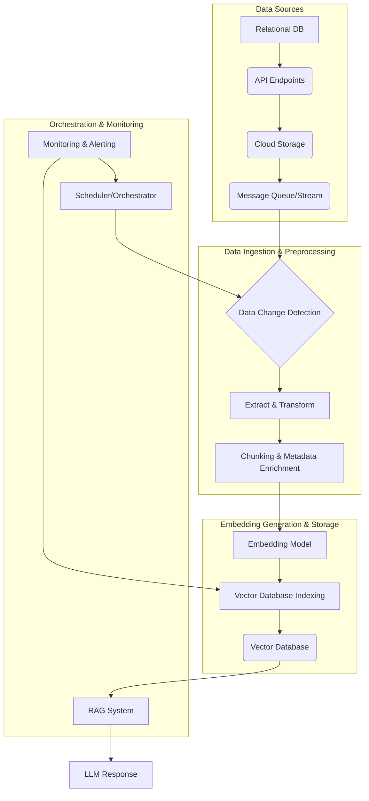

RAG (Retrieval Augmented Generation) 시스템의 성능은 검색 증강에 사용되는 임베딩 데이터의 신선도(freshness)와 품질에 직접적으로 좌우됩니다. 정보가 빠르게 변화하는 현대 환경에서 임베딩 데이터가 최신 상태로 유지되지 않으면, LLM(Large Language Model)은 오래된 정보를 기반으로 환각(hallucination)을 생성하거나 관련성 낮은 답변을 제공할 위험이 커집니다. 이러한 문제점을 해결하고 RAG 시스템의 신뢰성과 효율성을 극대화하기 위해서는, 임베딩 데이터를 주기적이고 효율적으로 업데이트하는 파이프라인 구축이 필수적입니다.

## RAG 시스템과 임베딩 데이터의 중요성

RAG는 LLM이 외부 지식 소스에서 관련 정보를 검색하여 답변을 생성하도록 돕는 아키텍처입니다. 이 과정에서 쿼리와 문서를 임베딩 공간으로 매핑하고, 쿼리 임베딩과 가장 유사한 문서 임베딩을 찾아 관련 문서를 검색합니다. 여기서 임베딩은 텍스트의 의미적 유사성을 수치화한 벡터 표현으로, 이 임베딩이 시대에 뒤떨어지거나 부정확하면 RAG 시스템 전체의 성능 저하로 이어집니다.

### 임베딩 데이터 업데이트의 필요성

*   **정보의 동적 변화 (Dynamic Information Changes)**: 웹 문서, 뉴스 기사, 제품 설명, 사내 문서 등 대부분의 정보는 지속적으로 업데이트되거나 새로 생성됩니다. RAG 시스템이 항상 최신 정보를 활용하려면 이 변화를 임베딩에 반영해야 합니다.
*   **개념 드리프트 (Concept Drift)**: 시간이 지남에 따라 특정 용어나 개념의 의미론적 맥락이 변화할 수 있습니다. 예를 들어, 특정 기술 용어가 새로운 표준이나 구현으로 대체되면, 과거의 임베딩은 최신 컨텍스트를 정확하게 반영하지 못할 수 있습니다.
*   **성능 유지 (Performance Maintenance)**: 오래된 임베딩은 검색 관련성을 떨어뜨리고, 결과적으로 LLM의 답변 품질을 저하시킵니다. 정기적인 업데이트는 이러한 성능 저하를 방지하고 최적의 RAG 시스템을 유지하는 데 기여합니다.

## 임베딩 데이터 업데이트 파이프라인 아키텍처

효율적인 임베딩 데이터 업데이트 파이프라인은 여러 단계로 구성됩니다. 각 단계는 데이터의 신선도와 품질을 보장하며, 시스템의 안정적인 운영을 지원합니다.

### 1. 데이터 소스 (Data Sources)

업데이트 대상이 되는 원본 데이터는 다양한 형태와 위치에 존재할 수 있습니다.
*   **관계형/NoSQL 데이터베이스**: 실시간 비즈니스 데이터, 사용자 생성 콘텐츠.
*   **API 엔드포인트**: 외부 서비스의 최신 정보.
*   **클라우드 스토리지**: S3, GCS 등에 저장된 문서 파일.
*   **메시지 큐/이벤트 스트림**: Kafka, Kinesis 등에서 발생하는 실시간 이벤트 데이터.
*   **웹 크롤링/RSS 피드**: 주기적으로 웹 콘텐츠를 수집.

### 2. 데이터 추출 및 전처리 (Data Extraction & Preprocessing)

원본 데이터 소스에서 변경되거나 새로 생성된 데이터를 추출합니다. 이때, 데이터 중복 제거, 정규화, 불용어 제거, 토큰화, 청킹(chunking) 등의 전처리 과정을 거쳐 임베딩 모델이 처리하기에 적합한 형태로 만듭니다. 특히, 대용량 텍스트는 RAG 시스템의 컨텍스트 윈도우(context window) 제약과 효율적인 검색을 위해 적절한 크기의 청크로 분할해야 합니다.

### 3. 임베딩 생성 (Embedding Generation)

전처리된 각 청크(chunk)에 대해 임베딩 모델(예: OpenAI Ada, Sentence Transformers, E5-Mistral)을 사용하여 고차원 벡터 임베딩을 생성합니다. 이때, **분산 처리 프레임워크(예: Apache Spark, Ray)**를 활용하여 대규모 임베딩 작업을 병렬로 처리하면 효율성을 크게 높일 수 있습니다.

### 4. 벡터 데이터베이스 업데이트 (Vector Database Update)

생성된 임베딩 벡터와 해당 원본 메타데이터를 벡터 데이터베이스(예: Pinecone, Weaviate, Milvus, Qdrant, Faiss)에 저장합니다. 업데이트 전략은 크게 **전체 재구축(Full Rebuild)**, **증분 업데이트(Incremental Update)**, 그리고 **실시간 스트리밍 업데이트(Real-time Streaming Update)**로 나뉩니다.

*   **전체 재구축**: 주기적으로 전체 임베딩 데이터를 다시 생성하고 벡터 DB를 교체합니다. 구현은 간단하지만, 대규모 데이터셋에서는 비용과 시간이 많이 소요됩니다.
*   **증분 업데이트**: 변경된 데이터만 식별하여 해당 임베딩을 업데이트하거나 새로 추가합니다. 데이터 소스의 변경 추적(CDC: Change Data Capture) 메커니즘이 필요하며, 효율적이지만 복잡도가 높습니다.
*   **실시간 스트리밍 업데이트**: 이벤트 기반으로 데이터 변경 사항을 즉시 반영합니다. 가장 빠른 업데이트를 제공하지만, 파이프라인 구축의 복잡도가 가장 높습니다.

### 5. 오케스트레이션 및 스케줄링 (Orchestration & Scheduling)

Apache Airflow, Prefect, Dagster와 같은 워크플로우 오케스트레이터는 위에서 설명한 모든 단계를 자동화하고 관리합니다. 데이터 추출, 전처리, 임베딩 생성, 벡터 DB 업데이트 등의 작업을 DAG(Directed Acyclic Graph) 형태로 정의하고 스케줄에 따라 실행합니다.

### 6. 모니터링 및 경고 (Monitoring & Alerting)

파이프라인의 각 단계에서 발생하는 오류, 처리량, 지연 시간 등을 모니터링하고, 문제가 발생하면 적절한 경고를 발생시켜 신속한 대응을 가능하게 합니다. 데이터 품질 지표(예: 임베딩 품질 스코어, 중복률)도 모니터링하여 임베딩 데이터의 무결성을 유지해야 합니다.

## 파이프라인 구현 예시 (Python & Pseudo-code)

다음은 데이터 소스의 변경 사항을 감지하고 증분 업데이트를 수행하는 간단한 파이프라인의 의사 코드입니다.

```python
import hashlib
from typing import List, Dict
from datetime import datetime

# 가상의 임베딩 모델과 벡터 DB 클라이언트
class EmbeddingModel:
    def embed_text(self, text: str) -> List[float]:
        # 실제 임베딩 API 호출 또는 모델 추론 로직
        print(f"Embedding text: {text[:30]}...")
        return [0.1] * 768 # 예시 벡터

class VectorDBClient:
    def upsert_vectors(self, vectors_with_metadata: List[Dict]):
        print(f"Upserting {len(vectors_with_metadata)} vectors to Vector DB.")
        # 실제 벡터 DB upsert 로직 (Pinecone, Weaviate 등)
        pass

    def delete_vectors(self, ids: List[str]):
        print(f"Deleting {len(ids)} vectors from Vector DB.")
        # 실제 벡터 DB delete 로직
        pass

    def get_document_hash(self, doc_id: str) -> str:
        # 벡터 DB에 저장된 특정 document의 해시값 조회
        # 실제 구현에서는 메타데이터에 해시값을 저장하고 조회
        return "old_hash_value" if doc_id == "doc123" else ""

def generate_hash(content: str) -> str:
    return hashlib.sha256(content.encode('utf-8')).hexdigest()

def get_latest_data_from_source() -> List[Dict]:
    """
    최신 데이터 소스에서 문서 데이터를 가져오는 함수.
    실제로는 DB 쿼리, API 호출 등을 통해 변경된 데이터를 로드합니다.
    """
    print("Fetching latest data from source...")
    # 예시 데이터
    return [
        {"id": "doc123", "content": "RAG 시스템은 LLM의 한계를 보완합니다. 최신 정보가 중요합니다.", "last_modified": datetime(2023, 1, 1)},
        {"id": "doc456", "content": "임베딩 업데이트 파이프라인 구축은 복잡하지만 필수적입니다.", "last_modified": datetime(2024, 5, 15)},
        {"id": "doc789", "content": "새로운 문서입니다. 2026년 트렌드를 반영합니다.", "last_modified": datetime(2024, 6, 1)}
    ]

def preprocess_document(doc: Dict) -> List[Dict]:
    """문서를 청킹하고 메타데이터를 추가하는 함수."""
    # 간단한 청킹 예시. 실제로는 더 정교한 로직 필요.
    chunks = [doc["content"]] # 여기서는 간단히 전체 문서를 하나의 청크로
    processed_chunks = []
    for i, chunk in enumerate(chunks):
        processed_chunks.append({
            "id": f"{doc['id']}-chunk{i}",
            "text": chunk,
            "metadata": {
                "original_doc_id": doc["id"],
                "last_modified": doc["last_modified"].isoformat(),
                "content_hash": generate_hash(chunk) # 청크별 해시 저장
            }
        })
    return processed_chunks

def run_embedding_update_pipeline():
    embedding_model = EmbeddingModel()
    vector_db = VectorDBClient()

    latest_data = get_latest_data_from_source()
    documents_to_upsert = []
    documents_to_delete_ids = []

    for doc in latest_data:
        processed_chunks = preprocess_document(doc)
        for chunk in processed_chunks:
            chunk_id = chunk["id"]
            current_hash = chunk["metadata"]["content_hash"]

            # 기존 벡터 DB의 해시값과 비교 (실제로는 청크ID로 조회)
            # 이 부분은 벡터 DB가 문서의 해시값을 메타데이터로 저장하고 조회 가능해야 함.
            # 혹은 별도의 메타데이터 DB에서 관리.
            existing_hash = vector_db.get_document_hash(chunk_id) # 가상의 조회 함수
            
            if existing_hash != current_hash:
                # 내용이 변경되었거나 새로운 문서인 경우
                embedding = embedding_model.embed_text(chunk["text"])
                documents_to_upsert.append({
                    "id": chunk_id,
                    "values": embedding,
                    "metadata": chunk["metadata"]
                })
            else:
                print(f"Document chunk {chunk_id} content unchanged, skipping.")
    
    # 더 이상 존재하지 않는 문서를 삭제하는 로직 (별도 CDC 로직 필요)
    # 예를 들어, 데이터 소스에서 삭제된 문서를 추적하여 `documents_to_delete_ids`에 추가
    
    if documents_to_upsert:
        vector_db.upsert_vectors(documents_to_upsert)
    if documents_to_delete_ids:
        vector_db.delete_vectors(documents_to_delete_ids)

    print("Embedding update pipeline finished.")

if __name__ == "__main__":
    run_embedding_update_pipeline()

```

## 임베딩 업데이트 파이프라인 워크플로우

다음 Mermaid 다이어그램은 임베딩 업데이트 파이프라인의 일반적인 흐름을 시각화합니다.



## 2026년 최신 트렌드 반영

RAG 시스템과 임베딩 데이터 관리 분야는 빠르게 진화하고 있으며, 2026년에는 다음과 같은 트렌드가 더욱 중요해질 것입니다.

*   **적응형 임베딩 모델 (Adaptive Embedding Models)**: 특정 도메인이나 기업 데이터에 특화된 경량화된 임베딩 모델을 온프레미스 또는 엣지 환경에서 실시간으로 업데이트 및 배포하여, 일반적인 모델 대비 높은 관련성과 성능을 제공합니다. 이는 `harness-engineering/drift-detection-methodology`와 연관되어 임베딩 모델의 성능 저하를 감지하고 자동으로 재학습하는 파이프라인을 포함할 수 있습니다.
*   **멀티모달 임베딩 (Multi-modal Embeddings)**: 텍스트뿐만 아니라 이미지, 오디오, 비디오 등 다양한 형태의 데이터를 통합하여 임베딩 공간을 구축하고 검색하는 기술이 보편화될 것입니다. 이를 통해 더욱 풍부하고 맥락적인 정보 검색이 가능해집니다.
*   **하이브리드 검색 및 앙상블 RAG (Hybrid Retrieval & Ensemble RAG)**: 키워드 기반 검색(BM25)과 벡터 기반 검색을 결합한 하이브리드 검색이 더욱 정교해지고, 여러 RAG 파이프라인의 결과를 앙상블하여 최종 답변의 품질을 높이는 아키텍처가 확산됩니다.
*   **Serverless & Event-Driven Update Architectures**: AWS Lambda, Azure Functions, Google Cloud Functions와 같은 서버리스 컴퓨팅과 메시지 큐(Kafka, Kinesis)를 활용한 이벤트 기반 아키텍처를 통해 데이터 변경 사항이 감지되는 즉시 임베딩이 업데이트되는 실시간 파이프라인 구축이 더욱 용이해집니다. 이는 비용 효율성과 확장성을 동시에 제공합니다.
*   **Contextual Chunking 및 Graph RAG**: 단순한 텍스트 분할을 넘어, 문서의 논리적 구조와 의미적 관계를 파악하여 더 의미 있는 청크를 생성하고, 지식 그래프(Knowledge Graph)와 임베딩을 결합한 Graph RAG를 통해 복잡한 질문에 대한 추론 능력을 강화합니다.

## 트레이드오프

임베딩 데이터 업데이트 파이프라인 구축에는 여러 설계 결정과 그에 따른 트레이드오프가 존재합니다.

*   **전체 재구축 (Full Rebuild) vs. 증분 업데이트 (Incremental Update)**
    *   **전체 재구축이 좋은 경우**: 데이터셋의 크기가 상대적으로 작고, 업데이트 주기가 길어도 되는 경우, 또는 임베딩 모델 자체를 자주 업데이트하여 전체 데이터에 새로운 임베딩을 적용해야 할 때. 구현 복잡도가 낮고 데이터 일관성을 쉽게 보장합니다.
    *   **증분 업데이트가 좋은 경우**: 데이터셋의 크기가 매우 크고, 데이터 변경이 빈번하여 실시간에 가까운 신선도가 요구될 때. 비용 효율적이며 RAG 시스템의 서비스 중단 시간을 최소화할 수 있습니다. 하지만 변경 추적 시스템과 삭제/업데이트 로직 구현의 복잡도가 증가합니다.

*   **배치 처리 (Batch Processing) vs. 실시간 스트리밍 (Real-time Streaming)**
    *   **배치 처리가 좋은 경우**: 데이터 변경 주기가 예측 가능하고, 일정 시간 동안의 데이터 지연이 허용되는 시나리오. 리소스 활용 효율성이 높고, 대규모 데이터 처리에 적합합니다. Airflow와 같은 배치 스케줄러와 잘 통합됩니다.
    *   **실시간 스트리밍이 좋은 경우**: 즉각적인 정보 반영이 비즈니스 크리티컬한 경우(예: 주식 시장 뉴스, 긴급 공지). 사용자 경험을 극대화하고 최신 정보에 기반한 답변을 제공합니다. 그러나 인프라 구축 및 유지보수 비용이 높고, 데이터 일관성 및 순서 처리의 복잡성이 커집니다.

*   **임베딩 품질 (Embedding Quality) vs. 임베딩 생성 비용 (Generation Cost)**
    *   **고품질 임베딩이 좋은 경우**: RAG 시스템의 정확성과 관련성이 가장 중요하며, 답변의 신뢰성이 비즈니스에 직접적인 영향을 미칠 때. 더 크고 복잡한 임베딩 모델을 사용하거나 도메인 특화 파인튜닝을 고려할 수 있습니다.
    *   **저비용 임베딩이 좋은 경우**: 대규모 데이터셋을 처리해야 하거나, 실시간 업데이트가 매우 빈번하여 임베딩 생성 비용이 서비스 운영에 큰 영향을 줄 때. 작은 모델이나 오픈소스 모델을 활용하여 비용을 절감할 수 있으나, RAG 성능에 영향을 미칠 수 있습니다.

*   **파이프라인 복잡도 (Pipeline Complexity) vs. 견고성 (Robustness)**
    *   **단순한 파이프라인이 좋은 경우**: 초기 개발 단계이거나, 리소스가 제한적일 때. 개발 속도가 빠르고 유지보수가 용이합니다.
    *   **견고한 파이프라인이 좋은 경우**: 프로덕션 환경에서 24/7 서비스가 요구될 때. 재시도 메커니즘, 오류 처리, 데이터 유효성 검사, 모니터링 및 경고 시스템 등을 통합하여 시스템의 안정성과 신뢰성을 높입니다. 이는 초기 구축 비용과 시간이 더 많이 소요됩니다.

## 실전 체크리스트

RAG 시스템을 위한 임베딩 데이터 업데이트 파이프라인을 구축할 때 다음 항목들을 점검하여 성공적인 구현을 보장합니다.

*   [ ] **데이터 소스 변경 추적 메커니즘 확인**: 원본 데이터베이스의 CDC (Change Data Capture) 기능 활용 여부, API의 `last_modified` 타임스탬프 지원 여부, 혹은 이벤트 스트림 연동 여부를 확인합니다.
*   [ ] **데이터 전처리 및 청킹 전략 최적화**: RAG 검색 성능을 극대화하기 위한 최적의 청크 크기, 오버랩(overlap) 전략, 메타데이터 포함 여부를 결정하고 테스트합니다.
*   [ ] **임베딩 모델 선택 및 버전 관리**: RAG 도메인에 가장 적합한 임베딩 모델을 선정하고, 모델의 버전이 변경될 경우 전체 임베딩을 안전하게 마이그레이션하거나 A/B 테스트할 수 있는 전략을 수립합니다.
*   [ ] **벡터 데이터베이스의 Upsert/Delete 성능 테스트**: 대규모 증분 업데이트 시 벡터 DB의 인덱싱 및 쓰기 성능이 서비스 SLA를 충족하는지 스트레스 테스트를 수행합니다.
*   [ ] **종단 간 (End-to-End) 파이프라인 지연 시간 (Latency) 측정**: 데이터 소스 변경 감지부터 벡터 DB 반영까지의 전체 지연 시간을 측정하고, 목표 지연 시간(target latency)을 설정하여 모니터링합니다.
*   [ ] **자동화된 데이터 품질 검증 (Data Quality Validation) 구현**: 업데이트된 임베딩 데이터의 무결성(Integrity), 일관성(Consistency), 유효성(Validity)을 검증하는 자동화된 테스트를 파이프라인에 포함합니다.
*   [ ] **롤백 및 복구 전략 수립**: 업데이트 과정에서 치명적인 오류가 발생했을 경우, 이전 버전의 임베딩 데이터로 안전하게 롤백하거나 빠르게 복구할 수 있는 비상 계획을 마련합니다.