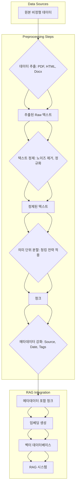

검색 증강 생성(RAG, Retrieval Augmented Generation) 시스템은 대규모 언어 모델(LLM)의 환각(hallucination) 문제를 줄이고 최신 정보에 접근할 수 있도록 돕는 강력한 아키텍처입니다. RAG 시스템의 성능은 검색 단계에서 얼마나 관련성 높은 문서를 찾아내는가에 크게 의존하며, 이는 비정형 데이터의 전처리 품질에 의해 결정됩니다. 비정형 데이터는 그 형식과 내용이 매우 다양하여 AI 모델이 직접적으로 이해하고 활용하기 어렵기 때문에, 효과적인 전처리는 RAG 시스템 구축의 핵심 성공 요인입니다.

## RAG 시스템을 위한 비정형 데이터 전처리 개요

비정형 데이터 전처리의 목표는 원본 데이터를 LLM이 쉽게 소비할 수 있는 표준화된 '청크(Chunk)' 형태로 변환하고, 검색 관련성을 높이는 데 필요한 메타데이터를 추가하는 것입니다. 이 과정은 다음과 같은 주요 단계로 구성됩니다.

### 1. 데이터 추출 (Data Extraction)

다양한 형태의 비정형 데이터(PDF 문서, 웹 페이지 HTML, Word 파일, 마크다운 등)에서 텍스트 콘텐츠를 추출하는 초기 단계입니다. 각 데이터 소스별로 적절한 도구와 전략을 사용하여 핵심 정보를 손실 없이 추출해야 합니다.

*   **PDF**: `PyPDF`, `pypdfium2`, `PDFMiner` 같은 라이브러리를 사용하여 텍스트와 레이아웃 정보를 추출합니다. 특히 스캔된 PDF는 OCR(Optical Character Recognition) 기술이 필요합니다.
*   **HTML**: `BeautifulSoup`나 `LXML` 같은 파서로 웹 페이지에서 본문 텍스트, 제목, 링크 등 필요한 요소를 선택적으로 추출합니다.
*   **Docx/Excel**: `python-docx`나 `openpyxl` 등을 활용하여 문서 내 텍스트, 표 데이터를 추출합니다.
*   **Markdown**: 일반적으로 텍스트 기반이므로 파싱이 비교적 용이하지만, 구조를 보존하면서 필요한 섹션을 추출하는 것이 중요합니다.

2026년에는 `unstructured.io`와 같은 라이브러리가 더욱 발전하여 다양한 포맷의 문서를 통합된 방식으로 처리하고, 이미지 내 텍스트(OCR) 및 표 데이터까지 정확하게 추출하는 기능이 강화되고 있습니다.

### 2. 텍스트 정제 (Text Cleaning)

추출된 텍스트에는 검색 및 임베딩 품질을 저해하는 노이즈가 포함되어 있을 수 있습니다. 이를 제거하고 표준화하는 과정입니다.

*   **노이즈 제거**: 불필요한 특수 문자, HTML 태그 잔여물, 과도한 공백, URL 등을 제거합니다.
*   **정규화**: 모든 텍스트를 소문자로 변환하거나, 숫자를 일반화하는 등의 작업을 통해 동일한 의미의 단어가 다르게 인식되는 것을 방지합니다.
*   **중복 제거**: 동일하거나 거의 유사한 콘텐츠 청크는 검색 결과의 편향을 유발하고 임베딩 비용을 증가시킬 수 있으므로 제거하는 것이 좋습니다.
*   **오탈자 교정 (Optional)**: 텍스트 품질이 매우 낮은 경우, 오탈자 교정기를 사용하여 텍스트의 정확도를 높일 수 있으나, 처리 비용과 시간이 증가합니다.

### 3. 의미 단위 분할 (Chunking)

전처리 과정에서 가장 중요하고 난이도 높은 단계 중 하나입니다. 추출 및 정제된 대규모 텍스트를 LLM의 컨텍스트 윈도우(context window) 크기에 맞춰, 그리고 의미론적으로 온전한 작은 단위인 '청크'로 분할합니다. 청크의 품질은 검색 결과의 관련성과 LLM의 응답 품질에 직접적인 영향을 미칩니다.

*   **고정 크기 청크 (Fixed-size Chunking)**: 단순히 n개의 토큰 또는 글자 단위로 자르는 방식입니다. 구현이 쉽지만, 의미 경계가 잘리는 문제가 발생할 수 있습니다.
*   **재귀적 청크 (Recursive Character Text Splitter)**: 특정 구분자(예: `\n\n`, `\n`, `.`, ` `)를 계층적으로 적용하여 청크를 생성합니다. 의미 경계를 비교적 잘 보존하며, `LangChain` 등의 프레임워크에서 널리 사용됩니다.
*   **의미 기반 청크 (Semantic Chunking)**: 2026년 트렌드로, 각 문장이나 문단을 임베딩한 후, 유사도 점수를 기반으로 의미적으로 응집된 부분을 하나의 청크로 묶는 방식입니다. 이 방식은 컨텍스트 손실을 최소화하면서 검색 관련성을 크게 높일 수 있습니다.
*   **청크 오버랩 (Chunk Overlap)**: 각 청크가 이전 청크의 일부 내용을 포함하도록 하여, 의미 경계가 잘리더라도 후속 청크에서 추가적인 컨텍스트를 제공하도록 합니다.

### 4. 메타데이터 강화 (Metadata Enrichment)

추출된 텍스트 청크에 원본 데이터의 추가 정보를 연결하는 과정입니다. 메타데이터는 RAG 시스템에서 필터링, 검색 가중치 부여, 소스 검증 등 다양한 방식으로 활용될 수 있습니다.

*   **원본 소스(Source)**: 문서의 URL, 파일 경로 등
*   **작성일(Date)**: 문서의 생성 또는 수정 일자
*   **저자/소유자(Author/Owner)**: 문서 작성자 정보
*   **카테고리/태그(Category/Tags)**: 문서의 주제나 키워드
*   **접근 권한(Access Control)**: 사용자별 접근 가능한 문서 필터링에 활용

이러한 메타데이터는 벡터 검색 이전에 필터링을 적용하거나, 검색 후 재랭킹(re-ranking) 과정에서 중요한 판단 기준으로 사용됩니다.

## 코드 예제: Python을 활용한 비정형 데이터 전처리

다음은 `unstructured.io`와 `langchain` 라이브러리를 활용하여 PDF에서 텍스트를 추출하고, 정제 및 청킹하는 간단한 예제입니다.

```python
import os
from unstructured.partition.pdf import partition_pdf
from langchain.text_splitter import RecursiveCharacterTextSplitter

def preprocess_pdf_document(pdf_path: str, chunk_size: int = 1000, chunk_overlap: int = 200):
    elements = partition_pdf(filename=pdf_path, extract_images_as_text=False, include_page_breaks=False)
    raw_text = "\n".join([str(el) for el in elements])

    # 텍스트 정제 (간단한 예시: 불필요한 공백 제거)
    cleaned_text = ' '.join(raw_text.split())

    # 청킹 설정
    text_splitter = RecursiveCharacterTextSplitter(
        chunk_size=chunk_size,
        chunk_overlap=chunk_overlap,
        length_function=len,
        is_separator_regex=False,
    )

    chunks = text_splitter.create_documents([cleaned_text])

    processed_data = []
    for i, chunk in enumerate(chunks):
        metadata = {
            "source": os.path.basename(pdf_path),
            "page": chunk.metadata.get('page_number', 'N/A'),
            "chunk_id": f"chunk_{i}"
        }
        processed_data.append({"content": chunk.page_content, "metadata": metadata})

    return processed_data

# 예시 사용
# sample_pdf_path = "path/to/your/document.pdf"
# if os.path.exists(sample_pdf_path):
#     processed_chunks = preprocess_pdf_document(sample_pdf_path)
#     for chunk in processed_chunks:
#         print(f"Content: {chunk['content'][:200]}...") # 첫 200자만 출력
#         print(f"Metadata: {chunk['metadata']}")
#         print("---")
# else:
#     print(f"Error: PDF file not found at {sample_pdf_path}")

```

## 비정형 데이터 전처리 파이프라인



## 트레이드오프

### 1. 청크 크기 및 분할 전략
*   **언제 좋은가 (When Good)**: 청크 크기가 작으면 특정 정보에 대한 정밀한 검색이 가능하고, LLM 컨텍스트 윈도우 활용률이 높아져 비용 효율적일 수 있습니다. 의미 기반 청킹은 컨텍스트 손실을 최소화합니다.
*   **언제 나쁜가 (When Bad)**: 너무 작은 청크는 충분한 컨텍스트를 제공하지 못해 LLM이 불완전한 정보를 기반으로 응답할 수 있습니다. 고정 크기 청킹은 의미 경계를 무시하여 문맥이 단절될 위험이 있습니다.

### 2. 전처리 깊이 및 복잡성
*   **언제 좋은가 (When Good)**: 광범위한 정제 및 고도화된 메타데이터 강화는 검색 정확도를 크게 향상시키고 LLM의 응답 품질을 높입니다. 특히 노이즈가 많은 데이터나 복잡한 구조의 데이터에서 효과적입니다.
*   **언제 나쁜가 (When Bad)**: 전처리 파이프라인이 너무 복잡하면 개발 및 유지보수 비용이 증가하고, 데이터 처리 지연 시간이 길어질 수 있습니다. 또한 과도한 정제는 때때로 원본 데이터의 미묘한 의미를 손상시킬 수 있습니다.

### 3. 메타데이터 활용 범위
*   **언제 좋은가 (When Good)**: 풍부한 메타데이터는 검색 필터링을 세분화하고, 특정 조건에 맞는 문서를 정확히 찾아내는 데 결정적인 역할을 합니다. LLM이 더 풍부한 컨텍스트를 얻을 수 있습니다.
*   **언제 나쁜가 (When Bad)**: 불필요하거나 부정확한 메타데이터는 검색 시스템에 혼란을 주거나, 메타데이터 관리 및 저장 비용을 증가시킬 수 있습니다. 메타데이터 추출 자체가 오류의 원인이 될 수도 있습니다.

### 4. 오픈소스 라이브러리 vs. 상용 솔루션
*   **언제 좋은가 (When Good)**: 오픈소스 라이브러리는 유연성이 높고 커스터마이징이 용이하며 비용 부담이 적습니다. 특정 요구사항에 맞춰 최적화하기에 유리합니다.
*   **언제 나쁜가 (When Bad)**: 상용 솔루션에 비해 기능의 안정성이나 지원이 부족할 수 있고, 복잡한 비정형 데이터 처리 시 개발 공수가 많이 들 수 있습니다. 대규모 시스템에서는 성능 최적화에 더 많은 노력이 필요합니다.

## 실전 체크리스트

RAG 시스템을 위한 비정형 데이터 전처리 파이프라인을 구축할 때 다음 항목들을 검증하십시오.

- [ ] **데이터 소스 정의 및 특성 분석**: 처리해야 할 비정형 데이터의 모든 소스(PDF, HTML, Docx 등)와 그 특성(평균 문서 길이, 노이즈 수준, 구조 복잡도)을 명확히 정의했는가?
- [ ] **텍스트 추출 정확도 검증**: 각 데이터 소스에서 텍스트가 95% 이상 정확하게 추출되는지, 특히 표, 이미지 텍스트 등 복잡한 요소들이 잘 처리되는지 평가했는가?
- [ ] **청킹 전략 적합성 평가**: 선택한 청킹 전략(고정, 재귀적, 의미 기반)이 특정 Use Case의 검색 및 LLM 응답 품질에 최적화되었는지 정량적/정성적으로 검증했는가?
- [ ] **메타데이터 스키마 설계 및 추출 자동화**: RAG 시스템에서 활용할 메타데이터(원본 소스, 작성일, 카테고리 등)의 스키마를 정의하고, 추출 과정이 자동화되어 일관성을 유지하는가?
- [ ] **임베딩 품질 일관성 모니터링**: 전처리된 청크의 임베딩 품질이 시간 경과에 따라 일관되게 유지되는지, 주기적인 샘플링 및 임베딩 유사도 분석을 통해 모니터링하는가?
- [ ] **데이터 업데이트 주기 및 파이프라인 효율성**: 새로운 데이터가 유입될 때 전처리 파이프라인이 적절한 주기(예: 실시간, 일일 배치) 내에 효율적으로 처리되어 RAG 시스템에 반영되는가?
- [ ] **전처리 A/B 테스트 프레임워크 구축**: 다양한 전처리 파라미터(청크 크기, 오버랩, 정제 규칙) 변경이 RAG 시스템의 최종 성능(검색 관련성, LLM 응답 품질)에 미치는 영향을 측정할 수 있는 A/B 테스트 환경을 구축했는가?
