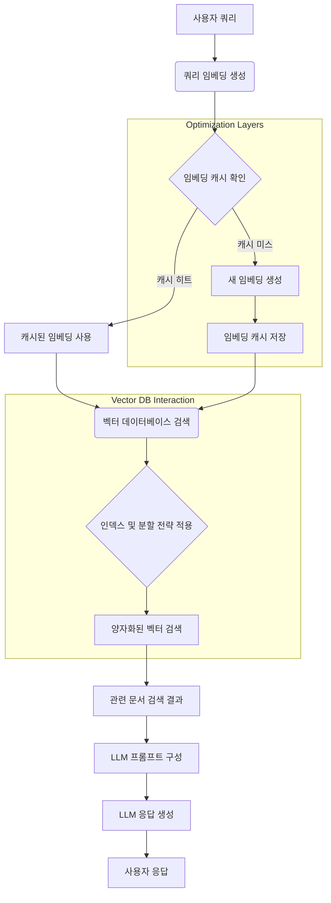

## LLM 학습 및 추론을 위한 벡터 데이터베이스 최적화 기법

RAG(Retrieval-Augmented Generation) 시스템의 확산과 함께 LLM(Large Language Model)의 효율적인 운영을 위해 벡터 데이터베이스(Vector Database)의 성능 최적화는 필수적인 요소가 되었습니다. 벡터 데이터베이스는 LLM이 방대한 외부 지식에 접근하고 정확한 응답을 생성할 수 있도록 임베딩(Embedding)된 데이터를 저장하고 효율적으로 검색하는 핵심 컴포넌트입니다. 본 문서에서는 LLM 시스템의 성능을 극대화하기 위한 벡터 데이터베이스 최적화 기법들을 심층적으로 다룹니다.

### 1. 벡터 인덱싱 전략 최적화 (Vector Indexing Strategy Optimization)

벡터 검색 성능은 사용되는 인덱싱 알고리즘에 크게 좌우됩니다. 데이터의 특성과 요구사항에 맞춰 적절한 인덱스를 선택하는 것이 중요합니다.

#### HNSW (Hierarchical Navigable Small World)
HNSW는 그래프 기반의 인덱스로, 높은 검색 속도와 우수한 재현율(recall)을 제공합니다. 특히 대규모 데이터셋에서 뛰어난 성능을 발휘합니다. `m` (number of neighbors)과 `efConstruction` (build time accuracy/speed tradeoff) 파라미터 튜닝이 중요합니다. `efSearch`는 쿼리 시 검색 정확도를 조절합니다.

#### IVF_FLAT (Inverted File Index)
IVF_FLAT은 데이터를 클러스터(cluster)로 나누어 검색 범위를 좁히는 방식입니다. `nlist` (number of clusters)와 `nprobe` (number of clusters to search) 파라미터를 통해 성능을 조절합니다. HNSW보다 빌드 시간이 짧고 메모리 효율이 좋지만, 재현율이 다소 낮을 수 있습니다.

```python
# 예시: Faiss를 사용한 HNSW 인덱스 생성 및 검색
import faiss
import numpy as np

# 128차원 벡터 100만 개 생성
dimension = 128
nb = 1_000_000
nq = 10
np.random.seed(1234)
xb = np.random.random((nb, dimension)).astype("float32")
xb[:, 0] += np.arange(nb) / 1000.
xq = np.random.random((nq, dimension)).astype("float32")
xq[:, 0] += np.arange(nq) / 1000.

# HNSW 인덱스 생성
index = faiss.IndexHNSWFlat(dimension, 32) # M=32
index.hnsw.efConstruction = 100 # 빌드 시 정확도 조절
index.add(xb)

# 검색
k = 4
D, I = index.search(xq, k)
print("HNSW Search Results (Distances):\n", D)
print("HNSW Search Results (Indices):\n", I)

# 예시: Faiss를 사용한 IVF_FLAT 인덱스 생성 및 검색
nlist = 100 # 클러스터 수
quantizer = faiss.IndexFlatL2(dimension)
index_ivf = faiss.IndexIVFFlat(quantizer, dimension, nlist, faiss.METRIC_L2)
index_ivf.train(xb)
index_ivf.add(xb)

# 검색
index_ivf.nprobe = 10 # 쿼리 시 검색할 클러스터 수
D_ivf, I_ivf = index_ivf.search(xq, k)
print("IVF_FLAT Search Results (Distances):\n", D_ivf)
print("IVF_FLAT Search Results (Indices):\n", I_ivf)
```

### 2. 양자화 및 압축 기법 (Quantization and Compression Techniques)

벡터 데이터의 저장 공간과 검색 속도를 개선하기 위해 양자화(Quantization) 기법을 활용할 수 있습니다. 특히 2026년에는 온디바이스(on-device) LLM과 엣지(edge) 환경에서의 RAG가 중요해지면서, 경량화된 벡터 저장 방식의 중요성이 더욱 부각됩니다.

#### Product Quantization (PQ)
PQ는 고차원 벡터를 여러 개의 서브벡터(sub-vector)로 분할하고, 각 서브벡터를 별도로 양자화하는 방식입니다. 이를 통해 저장 공간을 크게 줄이고 검색 속도를 향상시킬 수 있지만, 정확도가 다소 저하될 수 있습니다.

#### Scalar Quantization (SQ)
SQ는 각 벡터 차원의 값을 저정밀도(예: 8-bit)로 변환하여 저장 공간을 줄입니다. 구현이 간단하고 PQ보다 정확도 손실이 적지만, 압축률은 PQ보다 낮습니다.

### 3. 데이터 분할 및 분산 처리 (Data Partitioning and Distributed Processing)

매우 큰 규모의 벡터 데이터셋은 단일 서버에서 관리하기 어렵습니다. 샤딩(Sharding) 및 분산 처리를 통해 확장성과 성능을 확보할 수 있습니다.

#### 수평적 분할 (Horizontal Partitioning/Sharding)
데이터를 여러 노드에 분산하여 저장하고, 쿼리 시 여러 노드에서 병렬로 검색하여 결과를 병합합니다. 이를 통해 검색 지연 시간을 단축하고 처리량을 늘릴 수 있습니다.

#### 멀티 테넌시 최적화 (Multi-Tenancy Optimization)
다수의 애플리케이션이나 사용자 그룹이 동일한 벡터 데이터베이스를 공유하는 경우, 논리적/물리적 분할을 통해 격리된 성능과 보안을 제공하면서 리소스 활용 효율을 높일 수 있습니다. 2026년에는 SaaS 형태의 LLM 서비스가 많아지면서 이러한 멀티 테넌시 최적화가 더욱 중요해지고 있습니다.

### 4. 캐싱 전략 및 메모리 관리 (Caching Strategies and Memory Management)

자주 쿼리되는 벡터나 검색 결과는 캐싱하여 디스크 I/O를 줄이고 응답 속도를 향상시킬 수 있습니다.

#### 임베딩 캐싱 (Embedding Caching)
사용자 쿼리로부터 생성된 임베딩을 캐싱하여 동일한 쿼리가 다시 발생했을 때 임베딩 모델을 다시 호출하는 비용을 절감합니다. Redis와 같은 인메모리(in-memory) 데이터 저장소를 활용할 수 있습니다.

#### K-Nearest Neighbor (KNN) 결과 캐싱
특정 쿼리에 대한 KNN 검색 결과를 캐싱하여 반복적인 검색 요청에 빠르게 응답합니다. 하지만 데이터 업데이트 시 캐시 무효화(invalidation) 전략이 중요합니다.

### 5. 임베딩 모델 최적화 및 차원 축소 (Embedding Model Optimization and Dimensionality Reduction)

벡터 데이터베이스에 저장되는 임베딩 자체의 품질과 효율성도 중요합니다.

#### 경량 임베딩 모델 (Lightweight Embedding Models)
더 작은 규모의 임베딩 모델을 사용하여 임베딩 생성 시간을 단축하고, 생성된 벡터의 차원을 줄여 벡터 데이터베이스의 부하를 감소시킬 수 있습니다. Mistral-7B, E5-base 같은 모델들이 좋은 대안이 될 수 있습니다.

#### PCA/UMAP을 이용한 차원 축소 (Dimensionality Reduction with PCA/UMAP)
원래의 고차원 임베딩을 저장하기 전에 PCA(Principal Component Analysis)나 UMAP(Uniform Manifold Approximation and Projection)과 같은 기법으로 차원을 축소하여 저장 공간과 검색 시간을 절약할 수 있습니다. 단, 정보 손실에 대한 트레이드오프를 고려해야 합니다.

### RAG 시스템에서의 벡터 데이터베이스 최적화 흐름



## 트레이드오프 (Trade-offs)

벡터 데이터베이스 최적화는 여러 요소 간의 균형점을 찾는 과정입니다. 아래는 주요 트레이드오프입니다.

*   **인덱싱 복잡도 vs. 쿼리 속도**:
    *   **언제 좋고**: HNSW와 같이 복잡한 인덱스는 대규모 데이터셋에서 높은 재현율과 빠른 쿼리 속도를 제공합니다. 실시간 검색이 중요하고 데이터 변경이 잦지 않은 경우에 유리합니다.
    *   **언제 나쁜지**: 인덱스 빌드 및 업데이트 비용이 높으며, 메모리 사용량이 많습니다. 데이터가 자주 변경되거나 자원 제약이 있는 환경에서는 비효율적일 수 있습니다.
*   **메모리 사용량 vs. 재현율(Recall)**:
    *   **언제 좋고**: 인메모리 인덱스(HNSW Flat)는 가장 빠른 검색 속도와 최고의 재현율을 제공하지만, 전체 데이터셋이 메모리에 로드되어야 합니다. 매우 높은 정확도와 낮은 지연 시간이 요구되는 경우에 적합합니다.
    *   **언제 나쁜지**: 데이터셋 규모가 커지면 메모리 비용이 기하급수적으로 증가합니다. 비용 효율성을 중시하거나 대규모 데이터를 처리해야 할 때는 적합하지 않습니다.
*   **양자화(Quantization) vs. 정확도 손실**:
    *   **언제 좋고**: PQ, SQ와 같은 양자화 기법은 저장 공간을 크게 줄이고 I/O를 감소시켜 검색 속도를 향상시킵니다. 비용 효율적인 스토리지와 전송 대역폭이 중요한 경우에 유리합니다.
    *   **언제 나쁜지**: 벡터 정보를 압축하는 과정에서 필연적으로 정확도 손실이 발생합니다. 민감한 애플리케이션에서 미세한 정확도 저하도 허용되지 않는 경우에는 주의해야 합니다.
*   **실시간 데이터 업데이트 vs. 인덱스 일관성**:
    *   **언제 좋고**: 실시간 업데이트 기능을 제공하는 벡터 데이터베이스는 최신 정보에 대한 검색을 보장합니다. 뉴스 피드나 동적 콘텐츠 기반 RAG 시스템에 필수적입니다.
    *   **언제 나쁜지**: 업데이트가 빈번할수록 인덱스 재구성 비용이 증가하고, 인덱스 파편화(fragmentation)로 인해 검색 성능이 저하될 수 있습니다. 배치 업데이트나 스냅샷 방식을 고려하여 트레이드오프를 관리해야 합니다.

## 실전 체크리스트 (Practical Checklist)

LLM 시스템에 벡터 데이터베이스 최적화 기법을 적용할 때 다음 사항들을 검증하십시오.

*   - [x] **쿼리 지연 시간 (Query Latency) 측정 및 목표 설정**: 프로덕션 환경에서 end-to-end 쿼리 지연 시간을 측정하고, 특정 임계값(예: < 100ms)을 목표로 설정했는가?
*   - [x] **재현율(Recall) 및 정확도(Precision) 평가**: 다양한 인덱싱 전략 및 양자화 기법 적용 후, 실제 데이터셋에 대한 재현율과 정확도를 주기적으로 평가하고, 비즈니스 요구사항을 충족하는가?
*   - [x] **데이터 업데이트 정책 정의**: 벡터 데이터의 변경 주기와 중요도를 고려하여, 실시간 업데이트, 배치 업데이트, 또는 스냅샷 기반의 데이터 동기화 정책을 명확히 정의하고 구현했는가?
*   - [x] **임베딩 모델 성능 및 차원 최적화**: 사용 중인 임베딩 모델이 생성하는 벡터의 차원과 품질이 벡터 데이터베이스의 성능에 미치는 영향을 분석하고, 경량 모델 또는 차원 축소 기법을 적용하여 균형을 찾았는가?
*   - [x] **자원 사용량 모니터링 및 스케일링 계획**: 벡터 데이터베이스의 CPU, 메모리, 디스크 I/O 사용량을 지속적으로 모니터링하고, 트래픽 증가에 대비한 수평적/수직적 스케일링 계획을 수립했는가?
*   - [x] **캐싱 전략 구현 및 효과 분석**: 자주 접근되는 임베딩 또는 검색 결과에 대한 캐싱(Redis 등 활용)을 구현하고, 캐시 히트율(Hit Rate) 및 전반적인 성능 개선 효과를 측정했는가?
*   - [x] **장애 복구 및 고가용성 전략**: 벡터 데이터베이스의 장애 발생 시 데이터 손실을 최소화하고 서비스를 지속하기 위한 백업, 복제, 다중화 등의 고가용성(High Availability) 및 재해 복구(Disaster Recovery) 전략을 수립하고 테스트했는가?