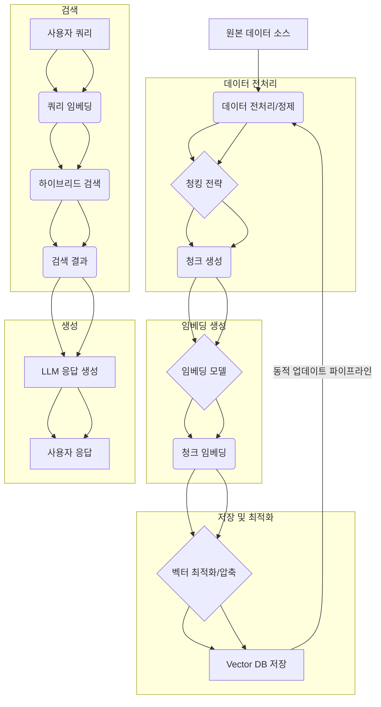

RAG (Retrieval Augmented Generation) 시스템의 성능과 효율성은 Vector DB에 저장된 임베딩 데이터의 품질에 크게 좌우된다. 2026년에는 단순한 임베딩을 넘어, 데이터의 의미론적 맥락 보존, 검색 효율성 극대화, 운영 비용 절감을 위한 다양한 최적화 패턴이 필수적이다. 이 문서는 Vector DB용 임베딩 데이터의 품질과 효율성을 극대화하는 패턴들을 탐색한다.

### 1. 데이터 전처리 및 정제 (Data Preprocessing and Cleansing)
고품질 임베딩의 기반은 깨끗하고 잘 정제된 원본 데이터로부터 나온다. 노이즈 제거, 중복 제거, 비정형 데이터 정규화는 임베딩의 의미론적 정확도를 높인다.

*   **노이즈 제거**: 불필요한 HTML 태그, 특수 문자 등을 제거한다.
*   **정규화**: 날짜, 숫자, 단위 등을 일관된 형식으로 통일한다.
*   **중복 제거**: 유사하거나 동일한 문서를 제거하여 검색 효율성을 높이고 저장 공간을 절약한다.

```python
import re
from bs4 import BeautifulSoup

def clean_text(text: str) -> str:
    soup = BeautifulSoup(text, 'html.parser')
    text = soup.get_text(separator=' ')
    text = re.sub(r'[^가-힣a-zA-Z0-9\s.,?!]', '', text)
    return re.sub(r'\s+', ' ', text).strip()
```

### 2. 효율적인 청킹 전략 (Effective Chunking Strategies)
문서를 Vector DB에 저장하기 전 의미 있는 단위로 분할하는 청킹은 RAG 성능에 지대한 영향을 미친다. 2026년에는 고정 길이 청킹을 넘어 다양한 지능형 청킹 기법이 활용된다.

*   **고정 길이 청킹 (Fixed-Size Chunking)**: 정해진 길이로 분할하고 오버랩(Overlap)을 추가하여 맥락 손실을 최소화한다.
*   **의미론적 청킹 (Semantic Chunking)**: 문서의 구조나 의미 경계를 기반으로 분할하며, LLM을 활용한 의미 경계 탐지도 사용된다.
*   **재귀적 청킹 (Recursive Chunking)**: 큰 청크에서 작은 청크로 재귀적으로 분할하여 다양한 granularity의 청크를 생성한다.
*   **계층적 청킹 (Hierarchical Chunking)**: 문서 요약, 섹션 요약, 상세 내용을 각각 청킹하여 다양한 레벨의 정보 검색을 가능하게 한다.

```python
import re

def simple_recursive_chunking(text: str, max_chunk_size: int, overlap: int) -> list[str]:
    chunks = []
    current_pos = 0
    while current_pos < len(text):
        end_pos = min(current_pos + max_chunk_size, len(text))
        chunk = text[current_pos:end_pos]
        chunks.append(chunk)
        current_pos += max_chunk_size - overlap
        if current_pos <= 0: # Handle cases where overlap is too large or chunk size too small
            current_pos = max_chunk_size - overlap # Ensure progress
    return chunks
```

### 3. 임베딩 모델 선택 및 미세 조정 (Embedding Model Selection and Fine-tuning)
특정 도메인이나 태스크에 최적화된 임베딩 모델 선택이 중요하다. 도메인 특화 모델 사용이나 소규모 데이터셋으로 미세 조정하여 품질을 향상시킨다.

*   **LLM 기반 임베딩 모델**: OpenAI `text-embedding-3-large`, Google `gemini-pro-text-embedding` 등 고성능 모델은 복잡한 의미론적 관계를 잘 포착한다.
*   **경량 모델**: Edge 환경이나 비용 제약 시 Sentence-BERT 계열 또는 양자화된 모델이 선호된다.
*   **도메인 특화 Fine-tuning**: 특정 산업 데이터로 모델을 미세 조정하여 해당 도메인의 고유 용어와 맥락을 더 잘 이해하도록 한다. 이는 `data-engineering/llm-fine-tuning-high-quality-data-preprocessing-refinement` 전략과 시너지를 낸다.

### 4. 벡터 양자화 및 압축 (Vector Quantization and Compression)
대규모 Vector DB에서 임베딩 벡터의 저장 공간과 검색 속도를 최적화하기 위해 양자화 및 압축 기법이 필수적이다.

*   **Product Quantization (PQ)**: 고차원 벡터를 저차원 서브 벡터로 분할 후 코드를 학습하여 압축.
*   **Scalar Quantization (SQ)**: 각 벡터 차원의 값을 스칼라 값으로 양자화하여 저장 공간 절약.
*   **이진화 (Binarization)**: 벡터 차원을 이진 값으로 변환, 해밍 거리로 검색.

### 5. 동적 임베딩 업데이트 파이프라인 (Dynamic Embedding Update Pipelines)
실시간에 가까운 최신 정보를 RAG 시스템에 반영하려면 임베딩 데이터를 주기적 또는 이벤트 기반으로 업데이트하는 파이프라인이 필요하다. `data-engineering/rag-embedding-update-pipeline-realtime-strategies`는 이 패턴의 중요성을 강조한다.

*   **CDC (Change Data Capture)**: 원본 DB의 변경 사항을 실시간 감지하여 해당 부분만 임베딩 재생성 및 Vector DB 업데이트.
*   **增分更新 (Incremental Updates)**: 특정 시간 간격으로 신규/변경 데이터만 식별하여 임베딩 추가/수정.
*   **Soft Delete / Hard Delete**: 유효하지 않은 임베딩 처리 전략으로 검색 관련성 유지.

### 6. 하이브리드 검색 (Hybrid Search)
벡터 유사도 검색(Semantic Search)과 키워드 기반 검색(Keyword Search)을 결합하는 하이브리드 검색은 각 방법의 단점을 보완하고 RAG의 검색 정확도를 크게 향상시킨다.

*   **RM3 (Relevance Model 3)**: 초기 검색 결과의 피드백으로 쿼리 확장.
*   **RRF (Reciprocal Rank Fusion)**: 여러 검색 엔진의 랭킹 결과를 융합하여 최종 랭킹 도출.

#### Mermaid Diagram: RAG 임베딩 최적화 파이프라인


## 트레이드오프

1.  **데이터 전처리/정제의 깊이 vs. 개발/운영 복잡성**:
    *   **언제 좋고**: 노이즈가 심하거나 도메인 특화 정보가 많은 데이터에서 RAG 검색 정확도와 LLM 응답 품질을 크게 향상시킨다. 불필요한 데이터 필터링으로 임베딩 비용 절감.
    *   **언제 나쁜지**: 데이터가 깨끗하고 정형화된 경우 과도한 전처리는 불필요한 리소스 낭비 및 유지보수 복잡성을 증가시킨다.

2.  **지능형 청킹 전략 (예: Semantic Chunking) vs. 계산 비용 및 구현 복잡성**:
    *   **언제 좋고**: 문서의 의미론적 구조가 복잡하거나 고품질 맥락 보존이 중요할 때 검색 관련성을 높여 RAG 성능을 극대화한다. 긴 문서에서 특정 정보 검색에 유리.
    *   **언제 나쁜지**: 구현이 복잡하고, 추가적인 LLM 호출 등으로 계산 비용과 지연 시간이 증가할 수 있다. 간단한 문서 구조나 낮은 비용이 우선시되는 경우 비효율적이다.

3.  **고성능 임베딩 모델 vs. 비용 및 추론 지연 시간**:
    *   **언제 좋고**: 복잡한 질의나 미묘한 의미 차이 구분이 필요한 고정밀 RAG 시스템에서 탁월한 성능을 제공한다. 최신 고차원 모델은 의미론적 유사도를 더 정확하게 포착한다.
    *   **언제 나쁜지**: 모델 크기가 커 임베딩 생성 및 저장 비용이 높고, 추론 시간이 길어져 실시간 처리 요구사항 충족이 어렵다. 비용 효율성이나 Latency에 민감한 애플리케이션에서는 경량 모델이 더 적합하다.

4.  **벡터 양자화/압축 vs. 검색 정확도 손실**:
    *   **언제 좋고**: 대규모 Vector DB의 저장 공간을 절약하고 검색 속도를 향상시켜 운영 비용을 크게 줄일 수 있다. 메모리나 네트워크 대역폭 제한 환경에서 특히 효율적이다.
    *   **언제 나쁜지**: 압축률이 높을수록 벡터 정보 손실로 검색 정확도가 저하될 수 있다. 엄격한 정확도가 요구되는 시스템에서는 신중한 테스트와 평가가 필수적이다.

5.  **동적 임베딩 업데이트 파이프라인 vs. 시스템 복잡성 및 일관성 관리**:
    *   **언제 좋고**: 실시간으로 변화하는 데이터를 RAG 시스템에 즉시 반영하여 최신 정보를 제공해야 할 때 필수적이다. 빠르게 변하는 도메인에서 사용자 경험을 크게 향상시킨다.
    *   **언제 나쁜지**: 데이터 일관성, 동시성 제어, 에러 복구 등 복잡한 파이프라인 설계 및 운영이 필요하다. 업데이트 과정에서 데이터 불일치나 지연 문제가 발생할 수 있다.

## 실전 체크리스트

프로젝트에 Vector DB 임베딩 데이터 최적화 패턴을 적용하기 위한 체크리스트입니다.

*   [ ] **원본 데이터 품질 분석**: 현재 데이터 소스의 노이즈 수준, 정형화 정도, 중복률을 분석하여 전처리 필요성을 명확히 정의했는가?
*   [ ] **청킹 전략 평가 및 선택**: 다양한 청킹 전략을 테스트하고, RAG 시스템의 사용 사례와 문서 특성에 가장 적합한 전략을 결정했는가? (`data-engineering/llm-fine-tuning-dataset-preparation-strategies`와 연계).
*   [ ] **임베딩 모델 성능 벤치마킹**: 최소 3개 이상의 임베딩 모델을 대상으로 검색 정확도(Recall), Latency, 비용을 벤치마킹하고 최적의 모델을 선정했는가?
*   [ ] **양자화/압축 전략 검토**: 대규모 Vector DB 운영 시 저장 공간 및 검색 속도 향상을 위해 양자화 또는 압축 기법 도입 타당성을 검토하고 정확도 손실 허용 범위를 설정했는가?
*   [ ] **동적 업데이트 파이프라인 설계**: 데이터 변경 주기가 짧거나 실시간 정보 반영이 필요한 경우, CDC 또는 증분 업데이트를 고려한 파이프라인을 설계했는가? (`data-engineering/rag-embedding-update-pipeline-realtime-strategies` 참조).
*   [ ] **하이브리드 검색 구현 및 평가**: 벡터 유사도 검색만으로 불충분할 때 키워드 검색과 결합한 하이브리드 검색을 구현하고, A/B 테스트로 RAG 성능 향상을 검증했는가?
*   [ ] **정기적인 임베딩 모델 및 데이터 재평가**: 임베딩 모델의 성능 저하(Drift)나 데이터 변화에 대응하기 위해 주기적으로 임베딩 품질 및 RAG 시스템 성능을 재평가하는 프로세스를 구축했는가? (`harness-engineering/drift-detection-methodology`와 연계).

#### Conclusion
Vector DB용 임베딩 데이터 최적화는 RAG 시스템의 성능과 효율성을 결정짓는 핵심 요소이다. 데이터 전처리, 청킹, 모델 선택, 압축, 동적 업데이트 및 하이브리드 검색에 이르는 다각적인 접근 방식은 2026년 RAG 시스템 구축 및 운영에 필수적인 전략으로 자리매김하고 있다. 효과적인 패턴 적용으로 더욱 강력하고 정확한 AI 애플리케이션을 구현할 수 있다.