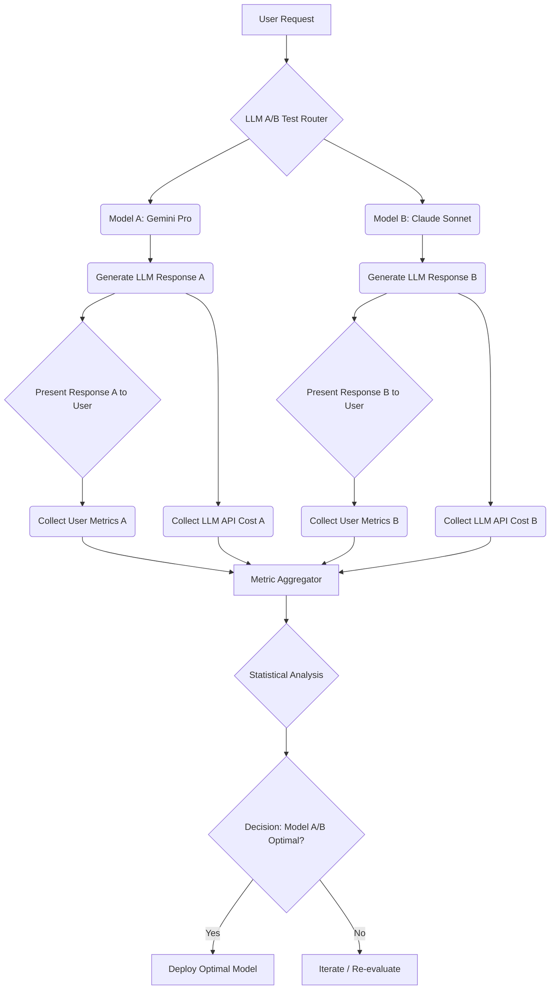

기존 LLM 모델 평가 방식은 주로 오프라인 벤치마크, 프롬프트 테스트, 혹은 휴먼 평가에 의존합니다. 이러한 방식은 모델의 잠재력을 측정할 수 있지만, 실제 서비스 환경에서 사용자 경험(UX)과 비즈니스 목표(예: 전환율)에 미치는 영향, 그리고 운영 비용(inference cost) 측면에서의 실제 성능을 정확히 반영하기 어렵습니다. ABTO(A/B Test Optimization)는 이러한 한계를 극복하기 위해 LLM 모델 A/B 테스트를 실제 사용자 트래픽에 적용하여 출력 품질과 비용 효율성을 동시에 최적화하는 접근 방식입니다. 이는 더 값싼 모델로의 전환을 주저하게 만드는 '사용자 이탈'에 대한 우려를 해소하고, 데이터 기반의 합리적인 의사결정을 가능하게 합니다.

## ABTO 방법론: 실제 유저와 비용 중심의 LLM 평가
ABTO의 핵심은 두 가지입니다. 첫째, LLM 모델의 성능을 실제 사용자 전환율(conversion rate), 참여도(engagement), 그리고 만족도(satisfaction)와 같은 비즈니스 지표로 직접 측정합니다. 둘째, 각 모델의 API 호출 비용, 인프라 비용 등 운영 비용을 함께 고려하여 최적의 가치(value for money)를 제공하는 모델을 식별합니다.

### LLM A/B 테스트 파이프라인 구성
1.  **트래픽 분할 (Traffic Splitting)**: 사용자 요청을 균등하게(또는 가중치를 두어) 여러 LLM 모델 그룹(A, B, C 등)으로 라우팅합니다. 예를 들어, Gemini-1.5-Pro와 Claude-3-Opus를 비교하거나, 더 저렴한 모델인 Gemini-1.5-Flash 또는 Claude-3-Sonnet을 기존 모델과 비교할 수 있습니다.
2.  **메트릭 추적 (Metric Tracking)**: 각 모델 그룹에 노출된 사용자들의 상호작용 데이터를 수집합니다. 여기에는 LLM 응답 후 사용자의 다음 행동(클릭, 구매, 세션 유지 시간 등), 응답 지연 시간(latency), 에러율, 그리고 해당 LLM API 호출에 발생한 실제 비용 데이터가 포함됩니다.
3.  **결과 분석 (Results Analysis)**: 수집된 데이터를 바탕으로 통계적 유의미성(statistical significance)을 검증하여 어떤 모델이 특정 비즈니스 지표에서 더 나은지, 또는 비용 효율적인지를 판단합니다.
4.  **모델 배포 및 롤백 (Deployment and Rollback)**: A/B 테스트 결과에 따라 최적의 모델을 전체 트래픽에 배포하고, 문제가 발생할 경우를 대비한 신속한 롤백(rollback) 전략을 수립합니다.

## 아키텍처 및 구현 예시
ABTO 방식의 LLM A/B 테스트를 도입하려면, 요청을 다양한 LLM으로 라우팅하고, 각 모델의 응답과 사용자 피드백, 그리고 비용을 모니터링하는 인프라가 필요합니다. 이는 주로 LLM Gateway 또는 Inference Router 형태로 구현될 수 있습니다.

```python
import random
import time
from datetime import datetime

# Simulate different LLM APIs and their costs/performance
class GeminiPro:
    def generate(self, prompt):
        time.sleep(0.5) # Simulate latency
        cost = 0.002 * len(prompt) # Simulate cost
        return "[GeminiPro]" + prompt + " response", cost

class ClaudeSonnet:
    def generate(self, prompt):
        time.sleep(0.3) # Simulate latency
        cost = 0.0015 * len(prompt) # Simulate cost
        return "[ClaudeSonnet]" + prompt + " response", cost

class LLMModelRouter:
    def __init__(self, models):
        self.models = models # Dictionary: {'gemini_pro': GeminiPro(), 'claude_sonnet': ClaudeSonnet()}
        self.traffic_weights = {'gemini_pro': 0.5, 'claude_sonnet': 0.5}
        self.metrics = []

    def route_request(self, user_id, prompt):
        # Simulate A/B test group assignment based on user_id (or random)
        model_name = random.choices(list(self.traffic_weights.keys()),
                                    weights=list(self.traffic_weights.values()), k=1)[0]
        
        model_instance = self.models[model_name]
        
        start_time = time.perf_counter()
        response, cost = model_instance.generate(prompt)
        end_time = time.perf_counter()
        latency = (end_time - start_time) * 1000 # milliseconds
        
        # Simulate user conversion (e.g., higher quality response -> higher conversion chance)
        conversion_rate = 0.7 if model_name == 'gemini_pro' else 0.6 # Placeholder
        user_converted = random.random() < conversion_rate
        
        self.metrics.append({
            'timestamp': datetime.now().isoformat(),
            'user_id': user_id,
            'model_used': model_name,
            'prompt_length': len(prompt),
            'latency_ms': latency,
            'cost': cost,
            'user_converted': user_converted
        })
        
        return response, model_name

    def get_ab_test_results(self):
        # A simplistic aggregation for demonstration
        model_stats = {}
        for m in self.metrics:
            model = m['model_used']
            if model not in model_stats:
                model_stats[model] = {'total_cost': 0, 'total_latency': 0, 'total_requests': 0, 'total_conversions': 0}
            model_stats[model]['total_cost'] += m['cost']
            model_stats[model]['total_latency'] += m['latency_ms']
            model_stats[model]['total_requests'] += 1
            if m['user_converted']:
                model_stats[model]['total_conversions'] += 1
        
        results = {}
        for model, stats in model_stats.items():
            avg_latency = stats['total_latency'] / stats['total_requests']
            avg_cost_per_request = stats['total_cost'] / stats['total_requests']
            conversion_rate = stats['total_conversions'] / stats['total_requests']
            results[model] = {
                'avg_latency_ms': avg_latency,
                'avg_cost_per_request': avg_cost_per_request,
                'conversion_rate': conversion_rate
            }
        return results

# Example Usage:
# router = LLMModelRouter({'gemini_pro': GeminiPro(), 'claude_sonnet': ClaudeSonnet()})
# for i in range(100):
#     response, model = router.route_request(f'user_{i}', 'What is the capital of France?')
#     # print(f"User {i} got response from {model}: {response[:30]}...")
#
# print("\n--- A/B Test Results ---")
# print(router.get_ab_test_results())
```

### 2026년 LLM A/B 테스트 트렌드 반영
2026년에는 LLM A/B 테스트가 더욱 정교해지고 자동화될 것입니다. 실시간(real-time) 모니터링과 피드백 루프를 통해 모델 성능 저하를 즉시 감지하고, MLOps 파이프라인에 통합되어 모델 배포부터 평가, 롤백까지의 전 과정이 효율적으로 관리됩니다. 또한, 단순한 출력 비교를 넘어 사용자 세션 전체의 가치(lifetime value)와 연동하여 LLM이 비즈니스에 미치는 장기적인 영향을 분석하는 데 중점을 둘 것입니다. 설명 가능성(explainability)을 높이기 위해 어떤 응답 특성이 사용자 행동에 긍정적/부정적 영향을 미쳤는지 분석하는 도구도 발전하고 있습니다.



## 트레이드오프

*   **정확한 실제 데이터 vs. 시스템 복잡도 증가**: ABTO는 실제 사용자 데이터와 비용을 통해 가장 현실적인 모델 성능을 제공합니다. 이는 벤치마크만으로는 알 수 없는 심층적인 인사이트를 얻게 하지만, 트래픽 라우팅, 메트릭 수집, 분석 파이프라인 구축 등 시스템 복잡도를 증가시킵니다. 초기에 안정적인 인프라 구축에 많은 시간과 리소스가 필요합니다.
*   **초기 설정 시간 및 리소스 vs. 장기적인 비용 절감 및 품질 최적화**: A/B 테스트 환경을 처음 구축하고 운영하는 데는 상당한 시간과 인적, 컴퓨팅 리소스가 소요됩니다. 그러나 일단 시스템이 가동되면, 지속적인 최적화를 통해 LLM 운영 비용을 크게 절감하고 사용자 만족도를 극대화하여 장기적으로 훨씬 큰 ROI를 가져올 수 있습니다. 단기적인 효율성을 중시하는 경우 초기 비용이 부담될 수 있습니다.
*   **테스트 중 사용자 경험 저하 가능성 vs. 검증된 모델 선택**: 실험 그룹 중 하나가 기존 모델보다 성능이 떨어지는 LLM을 사용하여 사용자 경험에 일시적인 부정적인 영향을 미 미칠 수 있습니다. 반면, 충분한 A/B 테스트를 거치면 서비스에 가장 적합하고 검증된 LLM을 선택하여 장기적으로 사용자 만족도를 높일 수 있습니다. 사용자 경험이 Critical한 서비스에서는 엄격한 테스트 기간과 최소한의 영향 범위 설정이 필수적입니다.
*   **데이터 개인 정보 보호 및 규정 준수 vs. 상세한 사용자 행동 추적**: 사용자 전환율과 행동 메트릭을 추적하는 과정에서 개인 정보 보호(Privacy)와 데이터 규정 준수(Compliance)에 대한 엄격한 관리가 요구됩니다. 상세한 사용자 행동 데이터를 얻기 위해서는 이러한 법적, 윤리적 문제를 해결해야 합니다. 개인 정보 보호에 대한 우려가 높은 경우, 추적 가능한 메트릭의 범위가 제한될 수 있습니다.

## 실전 체크리스트

*   [ ] **명확한 핵심 성과 지표(KPI) 정의**: LLM 출력 품질 및 비용 효율성을 측정할 핵심 지표(예: 전환율, 클릭률, 세션당 비용, 응답 시간, 사용자 만족도 점수)를 명확히 정의했는가?
*   [ ] **견고한 트래픽 라우팅 메커니즘 구축**: 사용자 ID, 지역, 디바이스 유형 등 기준으로 요청을 안정적으로 여러 LLM 모델로 분할하는 라우팅 시스템(LLM Gateway 또는 Inference Router)을 구현했는가?
*   [ ] **종합적인 LLM 상호작용 로깅 시스템 확보**: 각 모델의 모든 요청, 응답, 지연 시간, API 비용, 그리고 사용자 행동(전환 여부 등)을 기록하는 로깅 및 메트릭 수집 파이프라인을 구축했는가?
*   [ ] **자동화된 통계 분석 및 의사결정 도구 도입**: A/B 테스트 결과를 자동으로 분석하고 통계적 유의미성(p-value)을 계산하여 모델 선택에 대한 데이터 기반 의사결정을 지원하는 도구를 마련했는가?
*   [ ] **신속한 모델 롤백 전략 수립**: 새로운 LLM 모델 도입 후 예기치 않은 성능 저하나 문제 발생 시, 기존 모델로 빠르게 전환할 수 있는 자동화된 롤백(rollback) 시스템을 준비했는가?
*   [ ] **비용 및 리소스 사용량 실시간 모니터링**: 각 LLM 모델의 CPU, GPU 사용량, 메모리, API 호출 비용 등을 실시간으로 모니터링하여 예상치 못한 비용 발생을 방지하고 최적의 리소스 활용을 보장하는가?
*   [ ] **데이터 개인 정보 보호 및 규정 준수 확인**: A/B 테스트 과정에서 수집되는 사용자 데이터가 관련 개인 정보 보호 규정(GDPR, CCPA 등) 및 내부 정책을 준수하며 안전하게 처리되고 있는가?