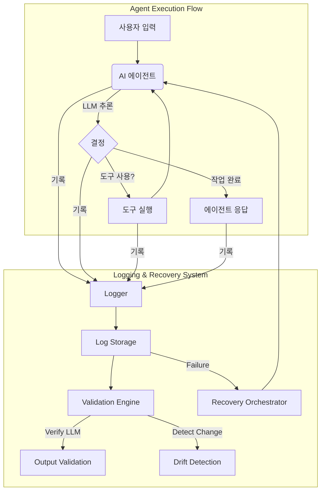

AI 에이전트의 복잡성 증가에 따라, `Apache Maka`에서 영감을 받은 `AI 에이전트 실행 과정 기록 및 복구 시스템`은 `moneyballscore`, `blog-autopilot` 에이전트의 모든 활동(대화, 도구 호출, 결과, 권한 승인, 종료 상태)을 체계적으로 기록한다. 이는 `디버깅`, `평가`, `LLM 출력 검증`, `드리프트 감지`, 그리고 `비정상 종료 후 복구`를 위한 필수 인프라이다.

## 핵심 기능 및 아키텍처

### 1. 투명한 실행 기록
에이전트의 의사결정, 도구 사용, 결과 등을 `시계열 기록`으로 남긴다.
*   **기록 항목**: 사용자/에이전트 대화, 도구 호출(이름, 파라미터), 도구 실행 결과, 권한 승인, 작업 종료 상태, 타임스탬프, 세션 ID.
*   **스토리지**: `영구 스토리지 (Persistent Storage)`(예: NoSQL DB, 시계열 DB)에 저장하여 효율적인 검색 및 분석을 지원한다.

### 2. LLM 출력 검증 및 드리프트 감지
LLM의 `비결정적` 특성 및 `드리프트`에 대응한다.
*   **검증**: LLM 중간 추론 및 최종 출력의 `정확성`, `신뢰성`을 `데이터 기반`으로 검증한다.
*   **감지**: 과거 `기준선` 대비 `이상 징후`를 조기에 감지하여 `모델 안정성`을 유지한다.

### 3. 견고한 복구 및 회귀 테스트
예기치 않은 중단 시 `서비스 연속성`을 보장한다.
*   **복구**: 마지막 유효한 기록(`checkpoint`) 기반으로 에이전트 상태를 복원하고 작업을 재개한다. 각 단계는 `멱등성 (idempotency)`을 가져야 한다.
*   **회귀 테스트**: 과거 실행 기록으로 시스템 변경 후 안정성 검증.



## 코드 예제: 실행 로거 (Python)

```python
import uuid, datetime
from typing import List, Dict, Any, Optional

class AgentExecutionLogger:
    def __init__(self, session_id: str):
        self.session_id = session_id
        self.logs: List[Dict[str, Any]] = []

    def _create_log_entry(self, event_type: str, details: Dict[str, Any]) -> Dict[str, Any]:
        return {
            