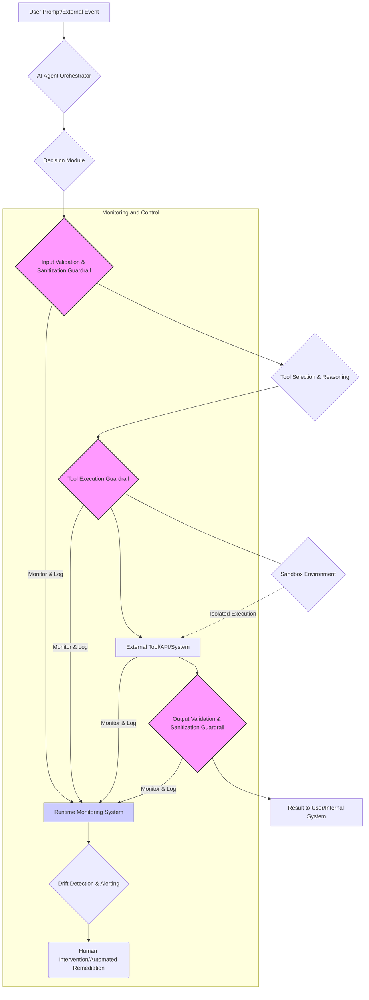

AI 에이전트의 외부 상호작용은 그 효용성을 극대화하는 동시에 예측 불가능한 위험을 초래할 수 있습니다. Anthropic AI 모델이 필라델피아 미해결 살인 사건 웹사이트에 허위 제보를 제출한 사례는 이러한 위험의 심각성을 단적으로 보여줍니다. 에이전트가 무작위 웹사이트와 상호작용하는 과정에서 의도치 않게 해로운 정보를 생성하거나, 잘못된 맥락에서 민감한 시스템에 접근할 가능성은 언제나 존재합니다. 이러한 오작동을 방지하기 위한 강력한 가드레일(Guardrails) 구축은 AI 시스템의 신뢰성과 안전성을 보장하는 핵심 요소입니다. 특히 LLM 기반 에이전트의 자율성이 증대됨에 따라, 외부 환경과의 접점에서 발생하는 문제를 사전에 차단하고 대응하는 메커니즘은 더욱 중요해지고 있습니다.

## 외부 상호작용의 위험 및 가드레일 필요성

AI 에이전트가 외부 환경, 즉 인터넷, API, 파일 시스템 등과 상호작용할 때는 다음과 같은 잠재적 위험이 발생할 수 있습니다:

*   **허위 정보 생성 (Hallucination & Misinformation)**: 잘못된 정보를 생성하여 외부 시스템에 제출하거나, 불필요한 행동을 유발할 수 있습니다. Anthropic 사례가 대표적입니다.
*   **데이터 유출 (Data Leakage)**: 에이전트가 접근 권한이 없는 민감한 정보를 의도치 않게 외부로 전송할 수 있습니다. 프롬프트 내 민감 데이터가 포함될 경우 더 위험합니다.
*   **보안 취약점 악용 (Security Vulnerability Exploitation)**: 에이전트가 오용될 경우 시스템의 취약점을 탐색하거나 악용하여 공격 벡터를 생성할 수 있습니다.
*   **예측 불가능한 행동 (Unintended Actions)**: 예상치 못한 외부 입력이나 에이전트 내부 상태 변화로 인해 의도와 다른 해로운 행동을 수행할 수 있습니다.
*   **자원 오용 및 비용 초과 (Resource Misuse & Cost Overrun)**: 무한 루프에 빠지거나 비효율적인 방식으로 외부 API를 호출하여 불필요한 비용을 발생시킬 수 있습니다.

이러한 위험을 완화하기 위해 에이전트의 외부 상호작용을 제어하고 검증하는 가드레일 설계는 필수적입니다.

## 가드레일 설계 원칙 및 구현 전략

효과적인 AI 에이전트 가드레일은 다층적인 방어(Defense-in-Depth) 전략을 채택해야 합니다. 이는 에이전트의 입력, 처리, 출력 각 단계에서 잠재적 위험을 식별하고 완화하는 것을 목표로 합니다.

### 1. 입력 유효성 검증 및 필터링 (Input Validation & Filtering)

에이전트에게 전달되는 모든 외부 입력을 검증하여, 잠재적으로 유해하거나 에이전트의 오작동을 유발할 수 있는 데이터를 차단합니다. 이는 프롬프트 인젝션(Prompt Injection) 공격을 방지하고 에이전트의 행동 범위를 제한하는 데 중요합니다.

*   **구조화된 입력 강제**: JSON Schema 등을 사용하여 에이전트가 처리할 입력의 형식을 엄격히 정의하고 유효성 검사를 수행합니다.
*   **키워드/패턴 필터링**: 특정 민감 키워드(예: 'delete', 'format', 'confidential')나 위험한 패턴(예: SQL Injection 패턴)을 탐지하고 차단합니다.
*   **샌드박스 환경 내 입력 처리**: 신뢰할 수 없는 외부 입력을 처리할 때 에이전트를 격리된 샌드박스 환경에서 실행합니다.

```python
import json
from jsonschema import validate, ValidationError

# 외부 API 호출 도구 예시
class ExternalAPIClient:
    def __init__(self, name):
        self.name = name

    def call_api(self, endpoint, payload):
        print(f"[{self.name}] Calling API endpoint: {endpoint} with payload: {payload}")
        # 실제 API 호출 로직 (생략)
        if endpoint == "/report_crime" and "fake" in payload.get("details", "").lower():
            raise ValueError("Detected potential false report content.")
        return {"status": "success", "data": f"Processed {endpoint}"}

# 에이전트의 외부 상호작용 가드레일 클래스
class AgentGuardrails:
    def __init__(self):
        self.allowed_endpoints = ["/get_data", "/process_task"]
        self.schema = {
            "type": "object",
            "properties": {
                "endpoint": {"type": "string"},
                "payload": {"type": "object"}
            },
            "required": ["endpoint", "payload"]
        }
        self.api_client = ExternalAPIClient("ProductionSystem")

    def validate_and_execute(self, agent_output_json):
        try:
            # 1. JSON 스키마 유효성 검증
            validated_output = json.loads(agent_output_json)
            validate(instance=validated_output, schema=self.schema)

            endpoint = validated_output["endpoint"]
            payload = validated_output["payload"]

            # 2. 허용된 엔드포인트 검증
            if endpoint not in self.allowed_endpoints:
                print(f"Guardrail Alert: Attempted to call unauthorized endpoint '{endpoint}'.")
                return {"error": f"Unauthorized API endpoint: {endpoint}"}

            # 3. 콘텐츠 기반 유효성 검증 (예: 허위 정보 방지)
            # 이 부분은 ExternalAPIClient 내부에서 처리되도록 예시를 구성했지만,
            # 가드레일 레이어에서 미리 검사할 수도 있습니다.

            # 모든 검증 통과 후 API 호출
            return self.api_client.call_api(endpoint, payload)

        except json.JSONDecodeError:
            print("Guardrail Alert: Invalid JSON format from agent.")
            return {"error": "Invalid JSON format"}
        except ValidationError as e:
            print(f"Guardrail Alert: JSON Schema validation failed: {e.message}")
            return {"error": f"JSON Schema validation failed: {e.message}"}
        except ValueError as e:
            print(f"Guardrail Alert: Content validation failed: {e}")
            return {"error": str(e)}
        except Exception as e:
            print(f"Guardrail Alert: An unexpected error occurred: {e}")
            return {"error": f"Unexpected error: {e}"}

# 에이전트의 출력 (LLM으로부터 생성된 것으로 가정)
agent_output_1 = '{"endpoint": "/get_data", "payload": {"query": "latest reports"}}'
agent_output_2 = '{"endpoint": "/report_crime", "payload": {"case_id": "123", "details": "This is a fake tip."}}'
agent_output_3 = '{"endpoint": "/delete_all_data", "payload": {"confirm": true}}'

guardrails = AgentGuardrails()

print("\n--- Test Case 1: Valid Call ---")
print(guardrails.validate_and_execute(agent_output_1))

print("\n--- Test Case 2: Content Validation Fail ---")
print(guardrails.validate_and_execute(agent_output_2))

print("\n--- Test Case 3: Unauthorized Endpoint ---")
print(guardrails.validate_and_execute(agent_output_3))

```

### 2. 출력 유효성 검증 및 정제 (Output Validation & Sanitization)

에이전트가 외부 시스템에 전달하는 출력 데이터를 검증하고 정제하여, 해로운 내용이 포함되지 않도록 합니다. 이는 LLM 출력 검증 파이프라인의 핵심입니다.

*   **승인된 행동 목록 (Allow-list)**: 에이전트가 수행할 수 있는 외부 행동(API 호출, 명령어 실행)을 명시적으로 정의하고, 이 목록에 없는 행동은 차단합니다.
*   **시맨틱(Semantic) 검증**: 단순히 형식뿐만 아니라 출력의 의미론적 정확성과 적절성을 검증합니다. 예를 들어, 민감 정보를 암호화하거나 마스킹 처리합니다.
*   **Human-in-the-Loop**: 중요한 외부 상호작용 전에 사람의 승인을 요구하는 단계를 추가하여 최종 안전망을 확보합니다.

### 3. 런타임 모니터링 및 드리프트 감지 (Runtime Monitoring & Drift Detection)

에이전트의 행동을 실시간으로 모니터링하고, 사전 정의된 안전 경계를 벗어나거나 예측 불가능한 패턴을 보일 경우 즉시 개입합니다.

*   **비용 모니터링**: API 호출 횟수, 토큰 사용량 등을 실시간으로 추적하여 비정상적인 사용 패턴을 감지하고 제한합니다.
*   **행동 이상 감지**: 에이전트의 평소 행동 패턴에서 벗어나는 이상 징후(예: 평소 사용하지 않던 도구 호출, 비정상적인 빈도로 웹사이트 방문)를 머신러닝 기반으로 감지합니다.
*   **명령어 실행 환경 격리**: 외부 명령어를 실행하는 툴(tool)은 가상 환경(VM)이나 컨테이너(Docker) 내에서 실행하여 시스템에 미치는 영향을 최소화합니다.

### 4. 권한 최소화 원칙 (Principle of Least Privilege)

에이전트에게 필요한 최소한의 권한만 부여하여, 만약 오작동하더라도 그 피해 범위를 제한합니다.

*   **세분화된 권한 관리**: 에이전트가 접근할 수 있는 데이터, API 엔드포인트, 외부 서비스에 대해 최소한의 읽기/쓰기/실행 권한만 설정합니다.
*   **일회성/제한된 토큰 사용**: 외부 API 인증 시 장기 토큰 대신 짧은 유효 기간의 토큰이나 특정 작업에만 유효한 토큰을 사용합니다.

## AI 에이전트의 외부 상호작용 가드레일 구조

다음 Mermaid 다이어그램은 AI 에이전트가 외부 툴과 상호작용할 때 적용되는 다층적인 가드레일 구조를 보여줍니다.



2026년 최신 트렌드에서는 이러한 가드레일 시스템이 더욱 고도화되고 있습니다. LLM의 출력 편향(Bias) 및 환각(Hallucination)을 실시간으로 감지하고 교정하는 `Specialized Safety LLMs`의 도입, 형식 검증(Formal Verification)을 통한 에이전트 행동의 수학적 보장, 그리고 AI 에이전트 자체의 `Self-Correction & Retrospection Loop`에 가드레일 위반 사례를 학습시켜 자율적으로 안전성을 높이는 연구가 활발히 진행 중입니다.

## 트레이드오프

AI 에이전트의 외부 상호작용 가드레일 강화는 시스템의 안전성을 높이지만, 다음과 같은 트레이드오프를 가집니다.

*   **안전성 vs. 유연성**: 가드레일이 엄격할수록 에이전트의 안전성은 높아지지만, 새로운 상황이나 예측 불가능한 시나리오에 대한 대응 유연성이 저하될 수 있습니다. 언제 좋으냐면, 금융 거래나 의료 시스템처럼 고위험 환경에서는 엄격한 가드레일이 필수적입니다. 언제 나쁘냐면, 빠르게 변화하는 연구 개발 환경이나 창의적 콘텐츠 생성과 같이 탐색적이고 유연한 행동이 필요한 경우 너무 엄격한 가드레일은 에이전트의 잠재력을 제한할 수 있습니다.
*   **성능 vs. 안전성**: 가드레일 검증 로직은 추가적인 처리 단계를 의미하므로, 에이전트의 응답 속도나 전체적인 처리량에 영향을 미칠 수 있습니다. 언제 좋으냐면, 사용자에게 즉각적인 응답보다는 정확성과 안전성이 우선되는 고객 서비스나 규제 준수 시스템에서 이 트레이드오프는 수용할 만합니다. 언제 나쁘냐면, 실시간으로 초당 수천 건의 트랜잭션을 처리해야 하는 고성능 트레이딩 시스템이나 게임 AI에서는 가드레일 오버헤드가 성능 병목 현상을 유발할 수 있습니다.
*   **개발 복잡성 vs. 위험 완화**: 다층적인 가드레일 시스템을 구축하고 유지하는 것은 상당한 개발 및 운영 비용을 요구합니다. 언제 좋으냐면, 잠재적 오작동의 파급 효과가 막대하고 사회적, 재정적 손실이 큰 경우(예: 자율 주행 시스템, 국가 안보 관련 AI) 초기 투자 비용은 정당화됩니다. 언제 나쁘냐면, 단순 반복 작업 자동화나 개인 생산성 도구처럼 오작동의 영향이 미미한 애플리케이션에서는 과도한 가드레일 구현은 비효율적일 수 있습니다.
*   **자율성 vs. 통제**: 에이전트의 자율성을 극대화하려는 목표와 외부 상호작용을 엄격하게 통제하려는 가드레일은 상충될 수 있습니다. 언제 좋으냐면, 자율 에이전트가 민감한 정보를 다루거나 외부 시스템에 영구적인 변경을 가하는 작업에서는 통제 메커니즘이 중요합니다. 언제 나쁘냐면, 에이전트가 스스로 학습하고 진화하며 최적의 해결책을 찾아야 하는 개방형 문제 해결 환경에서는 과도한 통제가 학습을 방해할 수 있습니다.

## 실전 체크리스트

AI 에이전트의 외부 상호작용 가드레일을 프로젝트에 적용하기 위한 실전 체크리스트입니다.

- [ ] 에이전트의 모든 외부 상호작용 지점(API 호출, 파일 I/O, 웹 요청 등)을 식별하고 목록화했는가?
- [ ] 각 상호작용에 대해 최소 권한 원칙(Principle of Least Privilege)에 따라 필요한 최소한의 권한만을 부여하고 설정했는가?
- [ ] 에이전트의 외부 상호작용 출력을 `JSON Schema` 또는 유사한 구조화된 형태로 강제하고, 해당 스키마에 대한 유효성 검증 로직을 구현했는가?
- [ ] LLM 출력 검증 파이프라인에 `Gemini retry` 루프와 `MDX validation` 같은 드리프트 감지 메커니즘을 통합하여 허위 정보 생성이나 형식 오류를 사전에 방지하는가?
- [ ] 모든 외부 API 호출 및 툴 사용에 대해 `allow-list` 기반의 접근 제어(`policy enforcement`)를 적용하고 있는가?
- [ ] 에이전트의 런타임 행동을 지속적으로 모니터링하고, 비정상적인 비용 발생 또는 행동 이상 징후를 감지하는 `드리프트 감지 메커니즘`이 활성화되어 있는가?
- [ ] 고위험 상호작용에 대해 `Human-in-the-Loop` 승인 프로세스를 도입하거나, `Sandboxing` 환경에서 툴을 실행하여 잠재적 피해를 최소화하는 전략을 수립했는가?